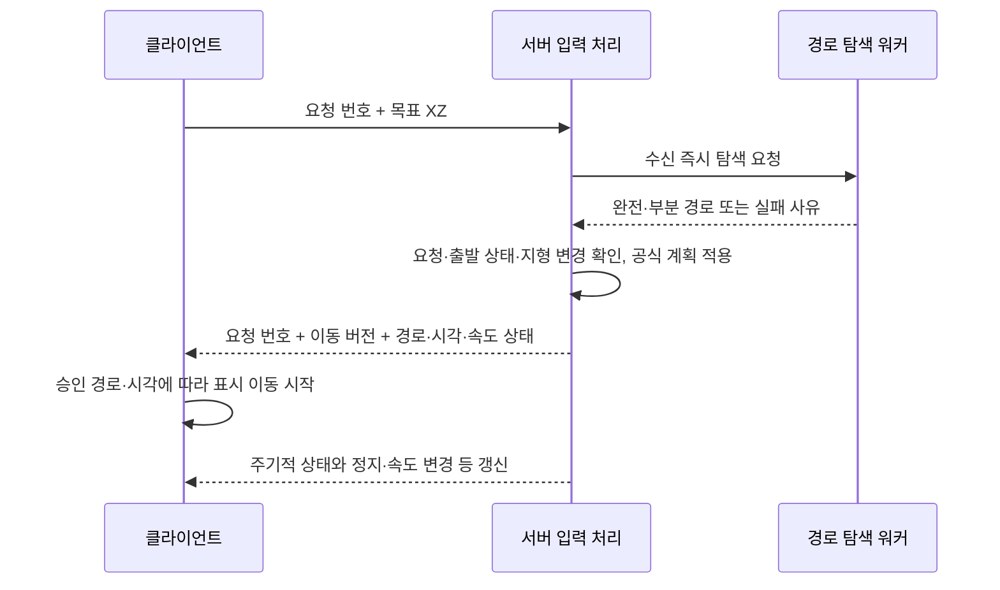

# 서버 주도 플레이어 이동: 설계와 검증 기록

2026-09-25 구현 갱신. **서버 승인 후 이동하는 1단계로 전체 플레이어 이동을 통합했다.**
브라우저와 agent-client는 목표·방향·정지를 요청하고 서버가 위치·높이·층·충돌을 결정한다.
예측 출발은 구현하지 않았다. 아래 설계 논의와 기존 A* 벤치마크는 비교 근거로 보존한다.
기존 경로 탐색 벤치마크의 기준 소스는 `17ba6488`이다.

## 구현 상태

- 클릭, 집 입구 정지, 상호작용 접근, 전투 추적, 자동 여행, 키보드, 말·배 이동을 서버 흐름으로 전환했다.
- 프로토콜 **99**: `PlayerMoveGoal(request_id, x, z, sprinting, stop_at_entrance)`,
  `PlayerMoveDirection(request_id, rotation, forward, turn, sprinting)`, `PlayerMoveStop(request_id)`를 사용한다.
  제자리 시선 변경은 `PlayerFace`다. 위치·Y·층을 보내는 일반 이동 요청은 없다.
- 서버는 `PlayerMovePath`와 `PlayerMoveProgress`로 공식 위치·층·속도·요청 번호·서버 시각을 보낸다.
  키보드·탑승 경로는 회전과 구간 시간을 포함한다. 탑승 클릭도 회전 시간을 실제 진행에 반영한다.
- 목표 탐색은 작업 풀 실행 4개·대기 128개·대기 기한 100ms, 플레이어별 후속 탐색 100ms 제한을 유지한다.
  실행 중 탐색 하나와 최신 대기 목표 하나만 보관하며 정지는 즉시 처리한다.
- 키보드는 첫 입력·입력 변경을 즉시 보내고 100ms마다 갱신한다. 서버는 500ms 동안 갱신이 없으면
  정지하며, 가속·후진 속도·회전·충돌을 계산해 최대 400ms 앞의 승인 구간을 보낸다.
- 승인 후 실제 경과 시간으로 진행한다. 새 요청과 전투·상호작용 메시지를 처리하기 전에 해당 플레이어의
  위치를 정산한다. 허기·AOI·환경 효과도 이 공식 진행에 연결한다.
- 서버가 집·던전 계단의 높이와 층 전환, 다리 위·아래 이동면을 판정한다. 클라 층 보고와
  dungeonManager의 로컬 층 판정은 제거했다. 화면상의 층 연출은 공식 층과 별도로 유지한다.
- 집 내부 표시는 서버 경로의 절대 높이로 판정한다. 예전 지형 높이·층 오프셋 누적 보정을
  제거해 계단 랜딩에서 정지해도 층 표시가 유지된다. 상호작용 높이도 목적지의 이동면을 조회한다.
- 의자·침대 진입과 이탈 위치도 서버가 계산한다. `InteractObject`의 가구 ID로 실제 배치를 조회하고
  거리·층·생존·탑승·점유·장애물을 검사한 뒤 공식 위치와 회전을 적용한다.
  `PlayerInteractionChanged`는 위치·회전·층을 포함하며 브라우저와 agent-client가 함께 적용한다.
  브라우저는 승인 전 가구 위치로 이동하지 않는다. 일어서는 애니메이션이 끝나면 이탈을 요청하며,
  서버가 주변의 안전한 위치와 높이를 고른다. 모두 막혔으면 현재 위치에서 자세만 해제한다.
  클라이언트의 진입·이탈 좌표 계산과 직접 위치 변경은 제거했다. 가구 애니메이션의 시각적 높이 오프셋은 유지한다.
- 문을 닫기 전에 주변 이동을 정산하며, 정산·문 상태 갱신과 이동 틱을 직렬화한다.
  몸 반경 0.31m가 문에 걸리면 닫지 않는다. 던전 잠금문의 자동 닫기는 250ms 후 재확인한다.
- 지형 높이 버전이 바뀌면 현재 공식 높이와 남은 경로를 다시 계산한다. 이동 구간은 최신 통행 정보로
  검사하며 차단된 목표 경로는 종료한다. 클라 표시도 차단 후 새 공식 갱신까지 멈춘다.
- 잘못된 정적 클릭 목표는 클라에서 먼저 거르고, 서버는 유한 좌표·거리·생존 상태·요청 순서를 검사한다.
  잘못된 입력 진단은 플레이어별 10초 간격으로 제한한다.
- agent-client는 승인·진행 응답으로만 이동 위치를 갱신한다. 작업 종료 시 자신의 요청만 정지시킨다.
  여러 층 목적지의 계단 선택과 문 열기 같은 상위 행동은 유지한다.
  NPC 일정의 강제 배치는 서버가 공식 NPC임을 확인하는 별도 `NpcRelocate` 요청을 사용한다.
- 삭제: `PlayerMove`, `PlayerKeyboardMove`, 위치 샘플·층 보고, mount recovery 요청,
  `PositionCorrected`, `MovementResync` 및 ACK, 서버 이동 큐·속도 재검증·재연결·divergence 감사,
  브라우저 로컬 이동 적분·A* 실행·키보드 위치 전송, agent-client의 예측 위치와 이동 타이머.
  원격 캐릭터 표시 보간과 공용 기하 계산은 계속 사용한다.

## 이번 검증

- 서버: 요청 교체·정지·오래된 탐색 폐기·부분 경로·문 통과/몸 겹침·던전/집 계단·지형 편집·
  월드 경계·키보드 가속/입력 만료·탑승 후진/회전·집 입구 정지 회귀 테스트.
- 가구 위치 통합: 승인 좌표·안전한 이탈·다음 이동의 출발점·잘못된 가구 요청·벽과 다른 가구 차단·
  위층 높이 유지·이동 취소·이모트와 악기 전환을 검증했다. 기존 침대 휴식·식탁 이용·청진도 확인했다.
- 클라: 전체 테스트 1,286개 통과. 200/500/1,000ms 프레임 정지, 응답 단절, 늦은 응답,
  20/150/250ms 모의 RTT, 입력 갱신 빈도, 승인된 회전 시간 표시, 계단 랜딩 정지를 포함한다.
  삭제한 로컬 가구 좌표·높이 계산의 테스트도 함께 제거했으며, 원격 캐릭터의 승인 이탈 좌표 표시를 추가 검증했다.
- `cargo fmt`, `cargo check --workspace --all-targets`, `npm run check`, `npm run lint` 확인.
- 가구 위치 통합 후 서버 debug 전체 테스트 998개 통과(7개 기본 제외),
  agent-client 294개·공유 Rust 라이브러리 424개 통과. 프로토콜 99용 WASM 빌드도 확인했다.
  아래 이동 부하 시험은 추가 통합 전 release 빌드의 기존 측정이다.

### 5,000명 이동 처리 측정

명령: `cargo test --release -p onlinerpg-server movement_load_5000 -- --ignored --nocapture`

2026-09-24 로컬 release 빌드에서 5,000명의 평지 12m 목표를 최대 64개 동시 요청으로 처리했다.
높이 타일은 테스트용 평지 데이터이며, 각 이동 틱의 경과 시간을 200ms로 설정해 10회 측정했다.
실제 경로 탐색·높이 샘플링·충돌 검사·위치 저장·진행 메시지 직렬화·연결 채널 전달을 실행했다.

| 항목 | 결과 |
|---|---:|
| 승인 성공 | 5,000 / 5,000 |
| 전체 요청 승인 시간 | 208.02ms |
| 이동 틱 중앙값 | 12.19ms |
| 이동 틱 최댓값 | 14.33ms |
| 10틱 진행 패킷 | 50,000개 / 3,300,000바이트 |

이 시험에는 WebSocket/TLS 송신, 브라우저 렌더링, 주변 구독자에게 보내는 실제 AOI 팬아웃,
전투·몬스터 AI·자연 스폰이 포함되지 않는다. 5,000명 실제 동접 용량을 증명한 결과는 아니다.

남은 현장 검증은 **실제 브라우저 조작감과 한국·미국 회선에서의 왕복 지연**이다.
현재 작업 환경에는 브라우저 조작 도구가 없어 실제 로그인·게임 조작을 실행하지 못했다.
모의 RTT 시험은 승인 이전에 움직이지 않고 늦은 응답을 무시하는 동작을 검증한다.
실제 조작 결과를 본 뒤에만 예측 출발 2단계 도입 여부를 판단한다.

## 결정한 방향

- 클라는 요청 번호와 목표 `(x, z)`를 서버에 보내고, 승인 경로를 받은 뒤 출발한다.
  1단계에서는 새 목표를 향한 로컬 A*·예측 출발을 구현하지 않는다.
  Y와 목표 층은 보내지 않는다. 서버가 현재 층·이동면과 연결된 계단을
  기준으로 목표를 해석하고 높이를 계산한다. 일반 보행의 층 변경은 계단을 실제로
  진행해 전환 임계값을 통과할 때만 허용한다.
- 서버는 빈도·부하 제한 안에서 입력 수신 즉시 작업 풀에 A* 탐색을 요청한다.
  **200ms 이동 틱을 기다리지 않으며**, 계산 결과를 검증·적용한 뒤 승인 경로와
  시작 시각을 즉시 보낸다. 연타는 최신 목표 하나로 합치고, 새 목표는 기존 계획을 대체한다.
- 서버가 이동 속도·충돌·정지·도착과 전투·상호작용에 쓰는 공식 위치를 결정한다.
  클라가 보고한 위치를 공식 위치로 채택하지 않는다.
- 경로 전체 또는 충분한 앞부분을 미리 보낸다. 1m 이동이나 웨이포인트 도착마다 다음
  지점을 요청·응답하는 구조로 만들지 않는다.
- 목표까지 도달할 수 없으면 문 앞이나 목표에 가까운 도달 가능한 안전 지점까지 이동해
  멈춘다. 부분 도달·동적 장애물·탐색 한도·잘못된 입력을 구분하며, 입력 오류는 진단 기록을 남긴다.
- 승인 뒤에도 서버가 실제로 전진할 구간을 최신 통행 상태로 검사한다. 문 닫힘마다
  모든 남은 경로를 검색하지 않으며, 클라의 차단 신고 없이도 서버가 문 앞에서 멈춘다.
- 클라는 서버가 승인한 경로·시각·상태를 표시한다. 예측과 실제 경로의 비교·보정은
  2단계에서만 검토한다.
- 키보드는 방향·정지 입력을 전달하고 서버가 승인한 이동 상태를 표시한다. A*를
  매 프레임 호출하지 않으며, 입력 예측도 2단계에서 필요성을 판단한다.

**핵심 설계 목적은 이동 코드를 단순화해 각종 이동 버그와 누적된 예외 처리·보정 패치를
줄이는 것이다.** 이동의 기준을 서버 한곳에 두고, 기존 큐·속도 재검증·경로 재연결·
재동기화에 중복된 상태와 처리 분기를 정리한다. 입력부터 이동·정지까지의 흐름을 쉽게
이해하고 검증할 수 있어야 한다.

입력 순서, 승인 경로의 표시와 상태 갱신, 동적 충돌에 필요한 처리는 명확한 역할로 유지한다.
새 흐름을 검증한 뒤 대체된 기존 코드와 더 이상 필요 없는 보정 패치를 제거한다.
성능·반응성뿐 아니라 상태·분기·특수 사례가 실제로 줄었는지도 설계의 성공 기준으로 삼는다.

## 단계별 범위

**1단계: 예측 없는 서버 주도 이동.** 목표 전송 → 서버 탐색 → 승인 경로 수신 → 표시
이동을 구현한다. 목표 교체·연타 제한·도달 불가 처리·계단·정지·속도 변경과 필요한 서버 상태 갱신을
포함한다. 승인된 경로를 부드럽게 표시하는 처리는 이 단계에 필요하다. 아직 승인되지
않은 새 목표로 먼저 이동하거나, 예상 경로와 실제 경로를 비교하는 처리는 추가하지 않는다.

**2단계: 조작 반응이 부족할 때만 예측 출발.** 한국·미국 수준의 지연과 서버 부하에서
1단계를 직접 조작해 출발·방향 전환·정지 반응을 판단한다. 충분하면 2단계는 구현하지
않는다. 부족한 경우에만 로컬 예상 경로, 예측 출발과 불일치 보정을 추가한다. 1단계에
사용하지 않는 예측 상태나 보정 분기를 미리 넣지 않는다.

## 배경과 비교한 방식

전환 전에는 클라가 경로와 이동을 진행하면서 서버도 별도의 이동 큐를 시뮬레이션했다.
프레임 시간 손실, 큐 전환에 따른 키보드 가속 초기화, 충돌 판단 차이가 서로 다른 진행
상태를 만들 수 있고, 이를 복구하는 분기가 늘어난 것이 구조를 재검토한 계기다.

기존 [운영 로그 감사 노트](../../notes/openmmo-2026-09-23-log-audit.md)는
`divergence_started` 1,320건을 재분류했다. 이 결과는 원인 후보를 찾는 근거로 사용한다.
코드에서 프레임 시간 상한과 키보드 가속의 큐 의존성은 확인했지만, 서버 수신 시각의
간격만으로 개별 클라 프레임 멈춤을 확정하거나 `queue_resync` 0건을 보정 성공의 증거로
삼지는 않는다. 기존 현상은 200/500/1,000ms 프레임 정지와 입력 전환을 넣어 재현한다.

| 방식 | 장점 | 남는 비용과 선택 이유 |
|---|---|---|
| 클라 A*·웨이포인트 전송, 서버 검증 | 즉시 반응, 서버 탐색 비용 감소 | 경로와 실제 진행 거리·시간의 검증, 양측 상태를 맞추는 규칙이 필요 |
| 클라 이동, 1m 셀 경계마다 보고·거절 시 교정 | 서버는 통과 구간을 검사, 클라 구현 자유도 높음 | 셀 통과 가능 여부 외에 속도·시간·정지 좌표·전투 시점 위치를 검증해야 함 |
| **서버 A*, 응답 후 클라 출발** | 공식 경로와 진행 상태를 서버가 관리, 예측 불일치 처리 생략 | 왕복 지연이 있지만 단순화를 우선해 1단계로 구현 |
| 서버 A* + 클라 예측 출발 | 서버 권한과 즉시 조작 반응을 함께 확보 | 클라 탐색·예측 상태·불일치 보정이 필요. 필요할 때만 선택하는 2단계 |

1m 셀 보고 방식도 구현 가능한 대안이다. 다만 인접한 유효 셀만 보고해도 이를 너무 빨리
통과하면 속도 위반이므로 시간 검증을 생략할 수 없다. 셀 안에서 멈추는 경우도 있어
정확한 좌표·정지 보고와 일정 시간마다의 갱신이 필요하다. 충돌의 기본 그리드는 1m지만
캐릭터 반경, 높이·층·계단·다리와 이동 구간의 통과 여부도 고려해야 한다.
서버가 본인에게 매번 승인 응답을 보내지 않더라도 주변 플레이어에게는 이동을 전파해야 한다.

가령 5,000명이 모두 축 방향으로 초당 3m를 이동하면 약 15,000회/s의 셀 전환 보고가
발생한다. 감당 불가능하다는 뜻은 아니지만, 이 방식도 별도의 검증·전파 부하 시험이 필요하다.
서버 A* 비용을 실제로 측정한 결과 짧은 경로는 충분히 검토할 만했으므로, 서버의 이동·전투·AI가
같은 공식 상태를 쓰는 구조를 우선한다. 이것이 전체 동접 5,000명 용량을 증명하지는 않는다.

## 1단계: 입력부터 승인 후 이동까지



### 목표 좌표와 층 해석

클릭 이동 요청은 `request_id, x, z`를 기본으로 한다. 목표는 **서버가 알고 있는 현재
층·이동면을 기준으로 해석**한다. 같은 층의 바닥을 클릭하면 해당 층의 XZ로 이동하고,
현재 층에 연결된 계단을 클릭하면 그 계단을 향해 이동한다. Y와 목표 층을 요청에 넣지
않아도 서버의 상태와 맵 연결 정보로 이 두 동작을 결정할 수 있다.

이 규칙의 일반 클릭은 현재 층의 바닥과 연결된 계단을 선택한다. 다른 층의 임의 바닥을
한 번에 지정하는 기능은 포함하지 않는다. 같은 XZ의 다른 층이 보이더라도 현재 층의
목표로 해석한다. 여러 층을 가로지르는 추적·자동 이동이 필요하면 서버가 해당 대상의
위치·층을 이용해 별도로 경로를 결정한다.

1. **평지:** 공식 현재 층에서 목표 XZ의 유효성과 경로를 확인하고, 지형·바닥의 Y를
   서버가 계산한다. 다른 층으로 우회해 같은 XZ에 도착한 것을 같은 목표로 취급하지 않는다.
2. **계단 진입:** 현재 층에 연결된 계단 중 목표 XZ가 속한 것을 찾는다. 연결된 양끝과
   서버의 출발 상태로 접근 방향을 결정하고, 계단 입구를 통한 합법적인 경로를 만든다.
3. **계단 진행:** 공식 위치의 XZ로 계단 축을 따라 진행한 정도를 구하고, 그 계단의
   높이 함수로 Y를 계산한다. 올라가기·내려가기 방향의 전환 임계값을 실제로 통과했을
   때만 서버가 층을 바꾼다. 목표 좌표가 임계값 너머라는 이유로 수신 즉시 바꾸지 않는다.
4. **경계 유지:** 계단 중간에서는 어떤 계단을 진행 중인지 유지해 정지·반전을 처리한다.
   전환 경계의 작은 오차로 층이 반복해서 바뀌지 않도록 방향별 여유 구간을 둔다.
5. **판정:** 클라의 층 변경 보고로 공식 층이나 AOI를 바꾸지 않는다. 계단의 옆벽·
   막힌 문을 통과하거나 연결되지 않은 층으로 바뀌는 것은 허용하지 않는다. 텔레포트는
   별도의 서버 승인으로 처리한다.

전환 전 클라의 `dungeonManager.updateFromPlayerPosition(x, z)`는 현재 깊이와 계단 축의
진행 위치, 전환 임계값·여유 구간으로 층을 바꿨다. 이 로컬 판정은 제거했다. 공유 Rust의 `shaft_run_pos`와
`floor_height_at`은 계단 진행 위치와 높이를 계산한다. 서버가 이 규칙으로 판정하고
클라는 승인된 계단 경로와 상태를 표시한다. 논리적인 층 전환과 연속적인 계단 높이를
구분하며, 임계값을 넘을 때 Y가 다른 층의 평평한 높이로 갑자기 바뀌지 않아야 한다.

층은 서버 내부의 탐색·충돌·AOI 및 승인 상태에 계속 필요하다. 내부 A*의 목표 층 키는
서버가 해석한 바닥·계단으로부터 만든다. 하우징 계단과 다리의 위아래도 현재 이동면과
연결 정보로 구별할 수 있는지 검증한다.

1단계에서도 통신 지연으로 클라에 표시된 층과 서버의 공식 층이 다를 수 있다. 이때
같은 XZ의 해석이 달라질 수 있으므로 전환 직후 연속 클릭·계단 반전·지연된 응답을
검증한다. 층 전환 전후 입력을 어떤 승인 상태·이동 진행에 연결할지는 통합 구현에서
정한다. 2단계를 도입하면 예측으로 클라가 먼저 다음 층에 도착한 경우도 추가로 검증한다.

계단 중간에서 멈출지, 계단 클릭을 반대편 층까지 통과하라는 뜻으로 해석할지는 별도의
조작 규칙이다. 자동 통과를 선택하면 서버가 해당 계단의 안전한 도착 지점을 목표로
정한다. 어느 경우에도 높이와 실제 층 전환은 서버가 결정한다.

### 서버 권한과 처리 시각

서버는 자신의 공식 위치에서 탐색한다. 네트워크 입력 처리나 플레이어 쓰기 잠금을 잡은
채 A*를 실행하지 않는다. 전송·탐색 빈도 제한에 걸리지 않은 입력은 바로 작업 풀에
전달하되, 작업자가 모두 바쁘면 대기는 발생할 수 있다. 대기열과 처리 기한을 제한하고
여러 층을 관통하는 긴 탐색은 일반 클릭을 막지 않도록 분할 또는 별도 예산을 적용한다.

탐색 중에도 새 목표, 정지, 텔레포트, 문 상태 변경이 일어날 수 있다. 결과 적용 시
요청의 유효성과 출발 상태·지형 버전을 다시 확인한다. 출발점이 달라진 결과를 그대로
적용하지 않으며 연결 검증·재탐색 정책은 구현 단계에서 정한다. 오래된 결과가 새 목표나
정지를 되돌리지 않도록 요청 번호와 서버 이동 버전을 사용한다.

경로 결정과 이동 상태의 주기적 갱신은 분리한다. 현재 200ms 틱을 유지하더라도 입력
처리와 경로 응답은 즉시 수행하며, 첫 상태 갱신은 **확정한 시작 시각부터 실제로 경과한
시간만** 반영한다. 틱 사이의 전투·상호작용도 해당 판정 시각의 공식 진행 상태를 사용해야
한다. 전체 이동 틱의 주기를 유지할지는 통합 시험에서 결정한다.

승인 응답에는 요청 번호, 이동 버전, 출발 상태·층, 경로, 서버 기준 시작 시각과
속도 상태가 필요하다. 경로 없음·거절·부분 경로를 목적지 도착과 구분한다.
문 닫힘·이동 불가·속도 변경은 서버에서 처리해 갱신한다. 클라가 화면상 먼저 도착했다고
공격·줍기·거리 제한 상호작용이 먼저 성립하지 않는다.

### 도달할 수 없는 목표와 이동 중 차단

**가능하면 막힌 문 앞이나 목표에 가까운 도달 가능한 지점에서 멈춘다.** 원래 요청한
목표와 서버가 결정한 실제 정지 지점을 구분한다. 클라는 승인된 부분 경로를 표시하고,
그 끝에 도착한 것을 원래 목표 도착으로 처리하지 않는다.

| 상황 | 서버 처리 |
|---|---|
| 탐색할 때 이미 문이 닫혀 있음 | 현재 통행 상태로 탐색한다. 다른 합법적인 경로가 있으면 사용하고, 목표에 닿을 수 없으면 접근 가능한 문 앞 등 안전한 부분 경로를 반환한다. |
| 승인 후 이동 중 문이 닫히거나 장애물이 생김 | 실제로 전진할 구간을 검사하다 차단을 발견하면 그 직전의 안전 지점까지 이동하고 남은 경로를 취소한다. 문 닫힘 이벤트에서 전체 경로를 미리 검색하지 않는다. |
| 문과 관계없이 유효한 목표까지 길이 없음 | 현재 이동면과 허용된 연결 안에서, 도달을 확인한 후보 중 목표에 가까운 안전 지점을 선택한다. 유용한 부분 경로가 없으면 현재 위치에서 멈춘다. |
| 좌표 형식·허용 범위·목표 표면 등 입력 규칙 위반 | 잘못된 요청으로 거절하고 진단 기록을 남긴다. 명백한 입력 오류는 탐색을 시작하거나 기존 정상 계획을 교체하기 전에 걸러낸다. |
| 탐색 노드·시간 예산 소진 | 도달 불가를 확정하지 않고 계산 한도 사유를 반환한다. 확인된 안전한 부분 경로가 있으면 그 끝까지만 이동하고, 없으면 제자리에서 멈춘다. 클라 오류로 기록하거나 자동 재탐색을 반복하지 않는다. |

문이 남은 승인 경로를 막았다면 그 문 앞의 안전 지점을 우선한다. 벽 건너편이나 다른
층처럼 XZ 거리만 가까운 위치를 정지 지점으로 고르지 않는다. 부분 경로와 끝점은
캐릭터 반경, 벽·문과의 간격, 층·계단의 연결 규칙을 만족해야 한다. 목표에 가까운
끝점도 현재 탐색으로 확인한 후보 안에서 고르며, 전체 맵에서 가장 가까운 지점이라는
보장은 하지 않는다.

동적 차단은 실제 이동 구간의 충돌 검사로 막고, 차단을 발견한 때 남은 승인 경로도 잘라
새 이동 버전과 정지 지점·사유를 즉시 전송한다. 클라가 이미 이전 경로를 표시했으면 서버 상태에 맞춘다.
현재 위치부터 막혀 있으면 제자리에서 멈춘다. 부분 경로 종료나 차단으로 해당 요청을
끝내며, 문이 다시 열렸다는 이유로 자동 재출발하지 않는다. 사용자가 다시 클릭하면 새
요청으로 탐색한다. 자동 문 열기·문 파괴·반복 우회 재탐색은 이 처리에 포함하지 않는다.

응답은 요청 번호·이동 버전과 함께 원래 목표, 실제 끝점·경로, 완전/부분/실패 상태와
사유를 전달한다. 사유에는 문·장애물 차단, 경로 없음, 입력 오류, 계산 한도를 구분한다.
부분 도달로 공격·줍기·상호작용의 도착 조건을 충족한 것으로 간주하지 않으며, 별도의
서버 거리·상태 판정을 유지한다. 클라에는 필요한 경우 문이 막혔거나 더 갈 수 없음을 표시한다.

공유 A*는 목표에 가까운 발견 노드까지의 부분 경로를 반환한다. 구현 첫 변경에서
`PathResult.termination`을 추가해 도달·경로 없음·노드 한도 초과를 구분했다.
`found`는 기존 호출자 호환을 위해 유지한다. 통합 시 종료 사유와 부분 경로의 충돌·끝점을
함께 확인하며, `found == false`만으로 도달 불가를 확정하거나 클라 이상으로 분류하지 않는다.

### 승인 후 문이 닫히는 경우의 처리 주체

**경로는 이동 계획이며, 앞으로 문을 계속 통과할 수 있다는 보장은 아니다.** 1단계는
서버의 구간별 충돌 검사를 기본으로 한다. 문마다 그 문을 지나는 플레이어·경로 목록을
관리하거나, 클라의 차단 통지를 기다리는 구조를 추가하지 않는다.

1. **문 상태 변경:** 서버가 통행 상태를 갱신하고 주변 클라에 문 상태를 전파한다.
   통행 캐시와 문 상태의 적용 순서를 일치시켜, 닫힘을 확정한 뒤 낡은 열린 상태로
   검사한 이동이 적용되지 않게 한다. 전체 플레이어의 남은 경로를 순회하지 않는다.
2. **공식 이동 진행:** 이동 틱이나 전투·상호작용을 위해 위치를 현재 시각까지 확정할 때,
   마지막으로 검증한 위치부터 이번에 도달할 위치까지 경로를 따라 검사한다. 기본 단위는
   **1m 셀과 그 경계의 통과 여부**다. 경계를 넘기 전에 확인하며, 한 번의 갱신에서 여러
   셀을 지나면 중간 경계를 모두 확인한다. 시각과 경로로 계산한 미검증 위치를 전투·거리
   판정에 그대로 사용하지 않는다.
3. **차단 발견:** 해당 구간에서 최초 장애물 직전의 안전 지점까지 진행하고 멈춘다.
   남은 경로를 취소하고 새 이동 버전·공식 위치·정지 사유를 본인과 주변에 보낸다.
   클릭 승인 경로에서 벗어나 옆으로 미끄러지거나 자동 A* 재탐색을 반복하지 않는다.
4. **클라 표시:** 승인 경로를 표시하되, 이미 받은 문 상태에서 닫힌 문을 만나면 화면의
   이동도 안전 지점에서 일시 정지하고 서버 갱신에 맞춘다. 이 정지는 표시상의 제한이며
   서버 위치를 결정하지 않는다. 클라 A*나 필수 차단 신고 패킷을 추가하지 않는다.
   문이 열렸다는 이벤트만으로 정지한 표시를 재출발시키지 않고 공식 이동 상태를 따른다.

“약 1m마다 검사”는 누적 이동 거리 1m마다 끝점만 표본 검사한다는 뜻이 아니다.
대각선 이동은 짧은 거리에도 여러 셀 경계를 넘을 수 있고, 캐릭터의 몸은 중심점보다
먼저 벽·문에 닿는다. 통과 구간의 셀·경계 검사와 기존 캐릭터 반경 판정을 함께 유지한다.
셀 안의 이동도 반경이 장애물과 겹칠 수 있으므로 중심점의 셀이 같다는 이유만으로
무조건 생략하지 않는다. 계단의 높이·층 판정도 유지한다. 문 상태가 바뀌면 이전에
가능했던 통과 판정은 그대로 재사용하지 않는다. 검사 단위는 네트워크 전송 단위와
무관하며, 셀마다 승인 패킷을 주고받거나 A*를 다시 실행하지 않는다.

예를 들어 20m 앞의 문이 닫혀도 당장 현재 위치에서 멈추지 않는다. 접근 가능한 구간을
계속 이동하다 문 앞에서 멈춘다. 도달 전에 문이 다시 열려 서버가 차단을 만나지 않았다면
그대로 통과할 수 있다. 이미 차단으로 종료한 요청은 문이 열려도 다시 실행하지 않는다.

문 닫힘과 통과의 선후는 **서버의 적용 시각**으로 정한다. 틱 사이의 닫힘을 처리할 때는
문 주변의 영향을 받을 수 있는 이동을 그 시각까지 먼저 확정한 뒤 닫힘을 적용하는 방식을
기본으로 한다. 이때 필요한 주변 조회는 모든 미래 경로를 검색하는 것과 다르다.
이미 통과한 플레이어를 되돌리지 않으며, 캐릭터가 문 닫힘 영역에 걸쳐 있으면 닫힘을
보류하는 정책을 우선 검토한다. 수동 닫힘과 자동 잠금에 같은 규칙을 적용하고,
구체적인 잠금·처리 순서와 겹침 정책은 통합 구현에서 검증한다.

서버의 공식 위치가 문을 통과하지 않는 것과 클라에서 관통이 전혀 보이지 않는 것은
구분한다. 닫힘 통지가 늦으면 클라는 잠시 이전 경로를 표시할 수 있으므로 최신 서버
상태로 맞춰야 한다. 이는 예측 출발이 없는 1단계에도 필요하다. 문을 가로지르는 보간으로
교정하지 않으며, 표시 지연을 얼마나 둘지는 실제 지연 시험으로 판단한다.

현재 `tick_player_movement`도 통행 캐시로 이동 구간을 검사한다. 새 구조에서는 공유
충돌 판정의 재사용 범위를 확인하되 기존의 슬라이딩·재동기화 예외 처리를 그대로
옮기지 않는다. 구간 검사 비용은 앞선 A* 벤치마크에 포함되지 않았으므로 전체 이동
부하에서 별도로 측정한다. 경로와 문의 역방향 색인은 측정으로 필요성이 확인될 때만 검토한다.

### 클라의 목표 필터와 비정상 요청 기록

1단계 클라는 좌표의 유효성, 클릭한 이동 표면, 로컬에서 명백히 알 수 있는 고정 장애물
등을 확인해 잘못된 목표를 보내지 않는다. 계단 클릭·상호작용 접근점처럼 목표를 정상적인
이동 지점으로 변환하는 규칙도 포함한다. 다만 **도달 가능성을 증명하려고 클라 A*를 다시
추가하지 않는다.** 연결된 길이 있는지는 서버가 확인한다.

정상 클라에서도 문·가구 상태 변경, 맵 정보 차이, 입력 시점과 서버 처리 시점의 층 차이
등으로 목표를 거절당할 수 있다. 문이 아닌 장애물이나 유효한 바닥 사이의 연결 단절도
가능하다. 따라서 도달 불가 자체를 비정상 클라의 증거로 삼지 않는다.

명백한 형식 위반이나 클라의 입력 필터가 걸러야 할 목표는 **클라 입력 이상 진단 대상**으로
기록한다. 요청 번호, 목표 XZ, 서버 위치·층, 거절 사유와 클라 빌드, 확인 가능한 맵·문
상태 버전을 남겨 클라 버그·상태 불일치·변조 가능성을 조사할 수 있게 한다. 서버가 관측한
입력 오류와 원인 추정을 구분하며, 단일 요청만으로 변조 클라라고 확정하지 않는다.
상세 기록은 플레이어·사유별 빈도 제한을 두고 반복 횟수는 집계한다. 일반적인 문 차단과
탐색 예산 소진은 별도 운영 지표로 분류한다.

### 이동 중 목표 변경과 연타 제한

새 클릭은 기존 목표의 대체 요청이다. 클릭할 때마다 웨이포인트를 뒤에 붙이지 않는다.
서버는 플레이어별로 현재 이동 계획 하나, 실행 중인 탐색 최대 하나, 아직 실행하지 않은
최신 목표 하나를 관리하는 것을 기준으로 한다. 연타 횟수에 비례해 큐가 늘어나지 않아야 한다.

1. **새 목표 채택:** 서버가 기존 이동을 현재 시각까지 반영해 공식 위치를 확정하고,
   남은 경로를 폐기한다. 새 탐색은 그 위치·층·속도 상태를 기준으로 한다. 경로 교체만으로
   가속 상태를 임의로 초기화하지 않는다.
2. **탐색 교체:** 아직 시작하지 않은 이전 목표는 최신 것으로 덮어쓴다. 실행 중인 이전
   탐색은 취소할 수 있으면 취소하고, 이미 끝까지 실행되더라도 그 결과는 적용하지 않는다.
   새 요청마다 별도 작업을 계속 생성하지 않는다.
3. **결과 적용:** 완료 결과의 요청 번호가 여전히 최신이고 이동 버전·상태가 유효할 때만
   적용·전송한다. 예를 들어 A 탐색 중 B, C가 왔다면 A 결과는 폐기하고 다음에는 C만 탐색한다.
4. **정지:** 이동 목표의 전송 간격이나 탐색 대기열을 기다리지 않고 처리한다. 대기 목표와
   탐색 결과를 무효화해, 늦은 응답으로 캐릭터가 다시 출발하지 않게 한다.

새 목표를 채택해 기존 계획을 폐기한 뒤에는 서버가 확정한 위치에서 새 경로를 기다리는
것을 단순한 기준안으로 삼는다. 1단계의 클라는 새 승인 경로를 받아야 새 목표로 움직인다.
수신 전에는 마지막 승인 계획과 서버 상태 갱신을 따르며, 새 목표로 미리 방향을 바꾸지
않는다. 서버 대기와 잦은 목표 교체가 실제 출발·방향 전환 반응에 미치는 영향을 검증한다.
대기 중 서버가 이전 경로를 계속 걷도록 바꾸려면 탐색 출발점이 달라지는 처리도
설계해야 하므로, 실제 조작 시험에서 필요성을 판단한다.

연타 제한은 전송과 서버 실행을 나눠 적용한다.

| 위치 | 처리 원칙 |
|---|---|
| 클라 전송 | 전송 가능한 첫 클릭은 즉시 보낸다. 제한 구간 안에서는 최신 목표 하나만 남기고, 다음 전송 시점에 보낸다. 클릭마다 타이머를 뒤로 미루지 않으며 연타가 끝난 뒤 마지막 목표도 반드시 보낸다. |
| 서버 실행 | 클라 제한과 독립적으로 플레이어별 탐색 시작 빈도를 제한한다. 초과한 유효 요청은 최신 대기 목표를 교체하고, 실행 가능 시각에 새 패킷 없이도 처리한다. |
| 전체 작업 풀 | 플레이어별 대기 항목이 중복되지 않게 하고, 전체 작업 수·대기열·탐색 노드·처리 기한을 제한한다. 특정 플레이어의 연타가 다른 플레이어를 밀어내지 않게 한다. |

서버에서 이미 접수한 더 최신의 유효 목표는 기존 탐색 결과를 무효화한다. 제한으로
아직 채택하지 않은 목표가 대기 중일 때는 현재 승인 경로를 유지할 수 있으며, 실제
새 탐색을 시작할 때 위 절차로 위치를 확정하고 교체한다. 마지막 목표를 단순히 버리는
방식은 사용하지 않는다. 기한 초과·수용 불가 때는 요청 번호와 사유를 응답해 클라가
해당 요청의 대기를 끝내고 공식 상태를 반영하게 한다. 동일 목표 반복은 재탐색·재출발
없이 처리할 수 있는지 확인한다.

전송 간격은 예를 들어 100ms(초당 최대 약 10회)를 프로토타입 후보로 시험할 수 있지만,
아직 확정값은 아니다. 5,000명이 모두 초당 10회씩 목표를 바꾸면 50,000건/s가 되므로
개인별 제한만으로 전체 용량이 보장되지 않는다. 앞선 1,000/5,000건/s 시험은 요청 병합·
취소를 포함하지 않았으며, 실행이 끝난 결과를 버리기만 하면 이미 쓴 CPU 비용은 줄지 않는다.
탐색 전 병합과 실행 빈도 제한을 우선하고, 긴 탐색의 협력적 취소는 필요성을 측정한다.
과도한 패킷 수신 자체에 대한 연결별 제한도 탐색 실행 제한과 별도로 유지한다.

### 승인 경로의 표시

1단계의 클라는 새 목표에 대한 승인 경로를 받은 뒤 표시 이동을 시작한다. 서버가 보낸
이동 버전·경로·시작 시각·속도 상태를 기준으로 진행 상태를 표시하고, 정지·속도 변경·
경로 취소 등의 갱신을 반영한다. 새 입력의 예상 경로를 클라에서 계산해 먼저 움직이지 않는다.
클릭 지점 표시는 즉시 보여줄 수 있다.

요청 번호와 이동 버전은 1단계에도 필요하다. 늦은 응답이 이후 목표·정지를 되돌리지
않게 하고, 거절·경로 없음·취소 시 대기 상태를 끝낸다. 문 닫힘·텔레포트·속도 변경에
따른 표시 갱신도 유지한다. 이 처리는 예측 경로와 승인 경로의 불일치 보정과 구분한다.

승인된 경로를 프레임마다 부드럽게 표시하는 보간·진행 계산은 1단계에 포함한다.
렌더링 프레임 손실을 이동 거리 손실로 누적하지 않고 서버 시각과 승인 상태를 기준으로
계산한다. 긴 탭 정지 후에는 최신 승인 상태로 복귀하며 누락된 모든 렌더 프레임을
재실행하지 않는다. 응답 수신 시 이미 진행된 서버 위치를 표시하는 방식과 화면의 급격한
이동 여부도 통합 시험에서 확인한다. 승인된 계획의 표시와 승인 전 예측 출발을 구분한다.

### 키보드와 로그

1단계의 키보드 이동도 방향·정지 입력에 대한 서버 시뮬레이션과 승인 상태 표시로 처리한다.
가속·감속 상태를 서버가 유지하며 클릭 이동과의 전환, 큐가 비는 상황, 탑승 시 회전을
명시적으로 시험한다. 기존 가속 초기화의 계기를 더 추적해야 한다면 감사 `Request`에
`keyboard_forward`를 기록하고 던전에서 W를 누른 상태로 재현한다.

기존 이동 감사 history는 비교 자료로만 보존하며, 해당 런타임 감사 코드는 제거했다.
평시에는 요청 처리 지연, 표시 위치와 공식 위치의 오차, 상태 교정·거절·취소 횟수를
집계한다. 부분 도달·문 차단·경로 없음·계산 한도와 입력 이상을 별도 사유로 집계하고,
상세 trace는 표본·빈도 제한을 둔다. 예측 경로 일치율은 2단계를 구현할 때만
추가한다. 새 이동의 안정성을 확인한 뒤 상세 로그를 줄인다.

## 2단계: 예측 출발과 보정 — 필요할 때만

아래는 1단계의 조작 반응이 부족해 예측을 도입하기로 할 때 사용할 설계 후보다.
1단계에서 미리 구현하지 않으며, 1단계로 충분하면 이 단계는 생략한다.

전송 가능한 목표 요청을 즉시 보내고, 클라는 로컬 충돌 정보로 경로를 구해 화면 이동을
시작한다. 연타 제한 중의 최신 클릭도 로컬 예측에 반영한다. 로컬 탐색 완료를 기다리느라
서버 요청까지 늦추지 않는다. 가능한 한 기존 공유 Rust/WASM 탐색과 통행 규칙을
재사용하며, 긴 로컬 탐색이 렌더링을 막지 않도록 실행 비용을 제한한다.
서버와 클라의 지형·문 상태, 경로 선택과 동률 처리 차이는 예측 일치율에 영향을 준다.

클라는 마지막 승인 상태와 아직 승인받지 않은 최신 입력을 구분한다. 응답은 해당 요청과
연결해 반영하며, 늦은 경로 결과가 이후 클릭·정지를 덮어쓰지 않게 한다. 서버의 강제
정지·텔레포트 같은 상태 변경은 새 이동 버전으로 예측을 무효화한다.

| 상황 | 표시 처리 방향 |
|---|---|
| 예상 경로와 승인 경로가 같고 진행 차이가 작음 | 현재 표시를 이어가며 진행 시간을 부드럽게 맞춤 |
| 작은 좌표·진행 차이 | 유효한 이동 구간 안에서 짧게 보정. 정확한 거리·시간 기준은 실측 후 결정 |
| 벽·닫힌 문·층 변경 등으로 예상 경로가 다름 | 승인 경로에 합류하거나 유효 위치로 즉시 교정. 벽을 가로지르는 직선 보간은 피함 |
| 거절·정지·텔레포트·큰 오차 | 예측을 취소하고 서버 상태를 적용 |

**경로가 일치해도 출발 시각은 다를 수 있다.** 예를 들어 RTT 200ms, 왕복 경로가
대칭이고 서버 처리 시간이 무시할 만큼 작다면, 클라가 클릭 때 출발하고 서버가 수신 때
출발했을 경우 응답 도착 시 클라는 약 100ms 앞서 있다. 초당 3m라면 약 0.3m 차이다.
따라서 “대부분 같은 길을 고른다”와 “진행 상태를 맞출 필요가 없다”는 별개다.

예측을 포함한 표시 시간과 공식 시간의 관계, 승인 후 따라잡기·감속 방식과 허용 오차는
아직 미정이다. 클라가 보낸 클릭 시각을 신뢰해 서버 이동을 무제한 소급하지 않는다.
서버 시각 추정과 승인 상태를 기준으로 이 차이를 다루고, **경로 불일치율·진행 오차·눈에
띄는 교정 빈도**를 따로 측정한다. 정상 이동 중 매 응답마다 출발점으로 되감는 방식은 피한다.

연타 중 로컬 A*도 최신 목표로 합치고 오래된 결과를 무효화한다. 예측 이동의 충돌
검사는 필요한 구간을 나눠 처리하며, 승인 전후의 진행 차이와 프레임 정지를 함께 검증한다.

## 확인된 근거와 남은 검증

| 항목 | 현재 상태 |
|---|---|
| 서버 탐색 비용 | 로컬 4 worker·5,000/s·30초에서 혼합/던전 구성 누락 0, p99 약 0.9ms |
| 운영 CPU에서 탐색 | 서울 AWS c8i.2xlarge, 4 worker·1,000/s·각 5초, 누락 0, p99 약 1.4ms |
| 네트워크 왕복 | 현재 머신 WebSocket 평균 4.8ms, 외부 TCP 지점 서울 3–4ms·LA 131–184ms·뉴욕 201–209ms |
| 예측 없이 출발 | 추가 서버 대기 20ms 가정 시 현재 머신 약 35ms·LA 161–215ms·뉴욕 231–240ms. 계산한 예상치 |
| 예측 출발의 필요성 | 1단계의 실제 조작 반응을 보고 판단. 충분하면 2단계 생략 |
| 예측 일치·교정 빈도 | 미측정. 선택적 2단계를 도입할 때만 경로와 진행 시각 차이를 검증 |
| 동접 5,000명 전체 용량 | 미검증. 탐색 시험에는 게임 프로세스의 이동·전투·AI·잠금·AOI 전파가 포함되지 않음 |

아래는 최초 검증 계획이다. 구현 및 자동 검증 결과는 문서 상단에 기록한다. 실제 회선의 조작감으로 선택적 2단계를 판단한다.

1. **재현과 계측:** 기존 이동에 200/500/1,000ms 프레임 정지를 넣어 거리 손실을 확인한다.
   요청별 클릭·서버 처리·응답·첫 이동 프레임을 추적한다.
2. **예측 없는 이동 통합:** 목표 요청 → 즉시 서버 탐색 → 경로·시각 승인 → 클라 표시
   이동을 구현한다. 목표 교체·연타 제한·정지·부분 경로와 승인 상태 갱신을 포함한다.
3. **경계 상황:** 연속 클릭·정지·응답 지연·탭 복귀·이동 중 속도 변화·계단·다리·동적 문·
   텔레포트·탑승·키보드 전환·전투 추적·도착 상호작용을 시험한다.
   같은 XZ에 겹친 층, 계단 없는 층 변경, 계단 중간의 정지·반전과 전환 직후 연속 클릭도
   검증한다. 통신 지연으로 표시 층과 서버의 공식 층이 다른 시점도 포함한다.
   요청 전·탐색 중·이동 중 문 닫힘, 연결되지 않은 유효 목표, 고정 장애물 내부 목표,
   부분 경로 없음·끝점 여유 거리·탐색 한도 초과를 구분해 시험한다. 정상 상태 변경은
   입력 이상으로 기록되지 않고, 잘못된 요청은 클라 필터·서버 진단에 잡히는지 확인한다.
   문 통과 직전·직후·문에 걸친 순간의 수동 닫힘과 자동 잠금, 접근 전에 다시 열린 문,
   닫힘 통지 지연과 클라 신고가 없는 경우도 확인한다. 긴 이동 틱과 틱 사이 전투 판정에서도
   검증되지 않은 문 너머 위치가 공식 상태로 쓰이지 않아야 한다.
   대각선으로 셀 모서리를 지날 때와 한 번에 여러 셀을 이동할 때 중간 경계가 누락되지
   않는지, 같은 셀 안에서도 캐릭터 반경이 닫힌 문·벽을 침범하지 않는지 확인한다.
4. **지연과 부하:** 로컬에서 RTT 5/150/250ms, 변동·패킷 손실, 서버 추가 대기 20/50ms를
   재현한다. 예측 없이 출발·방향 전환·정지를 직접 조작해 반응을 확인하고,
   같은 게임 프로세스의 AI·전투·이동·AOI를 포함한 부하를 측정한다.
   연타 후 마지막 목표 실행, 탐색 중 정지·교체, 오래된
   결과 폐기, 제한 우회 요청과 다수 플레이어의 동시 연타를 포함한다. 전송 제한·서버 대기·
   실제 탐색 시간을 나눠 측정하고, 연타 중에도 큐 크기와 CPU 비용이 제한되는지 확인한다.
5. **기존 흐름 정리:** 새 방식이 대체한 웨이포인트 추가·큐 보정·재연결 분기를 제거하고
   감사 history를 축소한다. 호환 기간과 전환·롤백 방법은 구현 전에 정한다.
6. **2단계 필요성 판단:** 1단계로 조작 반응과 안정성이 충분하면 작업을 마친다.
   반응 지연이 실제 플레이에 문제가 될 때만 예측 출발·승인 후 불일치 보정을 구현한다.
   그때 예측 경로 일치율, 교정 거리·빈도와 계단 전환 후 연속 클릭을 추가 검증한다.

성공 기준은 클릭 반응, 서버의 공식 속도·충돌·거리 판정, 정지 후 오차 수렴을 함께
만족하는 것이다. 1단계는 p50/p95/p99 응답 지연과 첫 이동 프레임, 표시 상태 오차,
워커 대기·취소·누락과 서버 틱 지연을 관측한다. 클라 탐색 시간·예측 경로 일치율·
불일치 보정 비용은 2단계를 선택할 때만 추가한다. 실제 조작 반응과 코드 단순화 효과를
함께 평가하며, 측정 근거는 아래에 보존한다.

## 측정 범위

실제 로컬 맵의 `data/housing` 건물 10개와 `data/terrain/objects` 파일 162개를 읽었다.
그중 가구 충돌을 만드는 지역은 3개다. `data-src/dungeons.csv`의 4개 던전,
50개 층은 서버와 같은 생성기로 만들었다. 모든 요청은 17개 항목이 들어 있는 전역
통행성 캐시를 사용하며, 결과 경로를 캐싱하지 않는다.

서버가 사용하는 `find_and_smooth_path`를 그대로 호출한다. 일반 2,000노드,
던전 20,000노드 한도와 직선 경로 빠른 처리를 유지했다. 데이터 로딩과 던전 생성은
측정 전에 끝낸다. 정상 던전 시나리오는 모든 실내 문을 열고 소품은 그대로 둔다.
닫힌 문 시나리오는 별도의 초기 던전 캐시를 사용한다.

| 시나리오 | 서로 다른 요청 수 | 내용 |
|---|---:|---|
| `open` | 64 | 마을 외곽 평지, 직선으로 갈 수 있는 목표 |
| `village` | 40 | 실제 건물 모서리 바깥에서 반대 모서리로 우회 |
| `dungeon` | 64 | 같은 층의 방 중심 사이, 직선거리 4–60m |
| `stairs` | 46 | 인접한 두 층의 방 중심 사이 |
| `closed_doors` | 20 | 닫힌 잠금 문 양쪽에서 반대쪽으로 이동 시도 |
| `unreachable` | 50 | 방에서 고체 소품이 차지하는 칸으로 이동 시도 |
| `long_route` | 8 | 각 던전 첫 층과 마지막 층 상자 접근점 사이, 양방향 |

요청 비율은 운영 통계에서 추출한 것이 아니라 명시적인 실험 가정이다.

| 부하 구성 | 평지 | 마을 | 던전 | 계단 | 닫힌 문 | 불가능한 목표 | 여러 층 전체 |
|---|---:|---:|---:|---:|---:|---:|---:|
| `mixed` | 50% | 20% | 20% | 8% | 1% | 1% | 0% |
| `dungeon-heavy` | 0% | 0% | 84% | 14% | 1% | 1% | 0% |
| `long_route` | 0% | 0% | 0% | 0% | 0% | 0% | 100% |

런타임 DB의 울타리·영지 창고, 지형 높이·경사·물, 문 상태의 실시간 변경은 포함하지
않았다. 네트워크, 플레이어 이동 틱, 전투, 몬스터 AI, AOI 전파 비용도 제외한다.
따라서 이것은 **동접 5,000명 서버 전체 부하 시험이 아니라 경로 탐색 작업 풀 시험**이다.

## 방법

- AMD Ryzen 9 9950X3D, 16코어/32스레드, Linux x86_64. CPU 고정 배치는 하지 않았다.
- Rust 1.97.1, Cargo release 빌드. 컴파일과 부하 시험은 겹치지 않게 실행했다.
- 고정 시드 `20260923`으로 요청 목록을 생성한다. 시나리오별 워밍업 후 단일 호출
  프로파일을 10회씩 측정하고, 구성별 5초 부하를 3회 반복한다.
- 초당 1,000/5,000건을 고정 시각에 발생시킨다. 앞 요청의 완료를 기다려 다음 요청을
  만드는 방식이 아니므로 과부하가 입력 속도 감소로 숨겨지지 않는다.
- 탐색 작업자는 1개 또는 4개다. 모든 작업자가 읽기 전용 캐시를 공유하며 대기열 상한은
  1,024개다. 포화 시 새 요청을 버리고 별도 집계한다. 요청 병합·취소·재시도는 하지 않는다.
- `service_ms`는 탐색과 경로 평활화 시간, `queue_ms`는 전송 후 작업자 실행까지의 시간,
  `latency_ms`는 예정 발생 시각부터 결과 완료까지의 시간이다. 발생기 지연도 별도로 기록한다.
- `completed`에는 정상적인 경로 없음 응답도 포함한다. 목적지의 정확한 좌표와 층에
  도달한 경로는 `complete_paths`로 별도 집계한다. 부분 경로를 성공으로 세지 않는다.
- 실행 창 안의 처리량과 종료 후 대기열 처리 시간을 분리한다. CPU 사용량은 Linux
  프로세스 user+system 시간으로 계산하며 발생기와 결과 수집 비용도 포함한다.
- 집계 표의 p99는 반복 실행별 p99의 중앙값이다. 여러 실행의 원시 표본을 합친 p99가 아니다.

입력 파일 지문(FNV-1a 64): `104c6617a1abb0ac`.
요청 목록 지문: `0b080f3d6f90487a`. 로컬 맵 파일이 바뀌면 지문과 결과도 달라진다.
시드는 고정되어 있지만 Rust HashMap 배치와 OS 스케줄링 때문에 실행 시간은 달라질 수 있다.

## 결과

짧은 클릭 경로는 제한된 작업 풀에서 초당 5,000건을 처리할 가능성이 충분하다.
단일 작업자에 모든 탐색을 직렬로 넣으면 5,000건 부하에서 지연과 누락이 발생했다.
여러 층을 관통하는 요청은 짧은 클릭과 비용을 분리해서 다뤄야 한다.

### 호출 한 번의 비용

6번의 단일 호출 프로파일 실행에서 각 평균/p99의 중앙값이다. 평지의 매우 작은 값에는
시계 측정 오버헤드도 포함되므로 세밀한 나노초 수치로 해석하지 않는다.

| 시나리오 | 평균 ms | p99 ms | 목적지까지 완전한 경로 |
|---|---:|---:|---:|
| 평지 | <0.001 | <0.001 | 100% |
| 마을 건물 우회 | 0.424 | 0.991 | 100% |
| 같은 던전 층 | 0.279 | 0.815 | 100% |
| 인접 층 이동 | 0.277 | 1.097 | 100% |
| 닫힌 잠금 문 | 0.108 | 0.304 | 0% (의도한 실패) |
| 고체 소품 칸 | 0.348 | 0.658 | 0% (의도한 실패) |
| 던전 첫 층↔마지막 층 | 6.340 | 11.546 | 50% |

여러 층 전체 경로는 현 20,000노드 한도에서 8개 중 4개만 완전히 도달했다.
실패를 정상 도달로 취급하거나 탐색 한도를 무작정 늘려서는 안 된다.

### 5초 × 3회 부하

처리량은 입력을 발생시킨 5초 안에 완료한 요청/초의 중앙값이다. 누락은 세 실행의 합이며
1,000/s 행은 총 15,000건, 5,000/s 행은 총 75,000건을 보냈다. 지연은 완료한 요청 기준이다.

| 구성 | 작업자 | 입력/s | 처리/s | 누락 합 | p99 ms 중앙값 (범위) | CPU 코어 상당량 |
|---|---:|---:|---:|---:|---:|---:|
| 혼합 | 1 | 1,000 | 1,000.0 | 0 | 1.227 (1.133–1.254) | 0.23 |
| 혼합 | 1 | 5,000 | 4,786.0 | 2,207 | 236.681 (187.007–256.270) | 0.93 |
| 혼합 | 4 | 1,000 | 1,000.0 | 0 | 1.256 (1.236–1.349) | 0.24 |
| 혼합 | 4 | 5,000 | 5,000.0 | 0 | 2.684 (2.683–5.477) | 1.16 |
| 던전 위주 | 1 | 1,000 | 1,000.0 | 0 | 0.999 (0.844–1.086) | 0.29 |
| 던전 위주 | 1 | 5,000 | 3,589.4 | 17,905 | 300.589 (296.775–301.521) | 1.01 |
| 던전 위주 | 4 | 1,000 | 1,000.0 | 0 | 1.290 (1.176–1.348) | 0.38 |
| 던전 위주 | 4 | 5,000 | 5,000.0 | 0 | 0.893 (0.891–3.006) | 1.47 |

CPU 코어 상당량은 경로 탐색을 포함한 전체 벤치마크 프로세스의 CPU 초/실행 초다.
작업자 스레드 4개가 코어 4개를 계속 점유했다는 뜻은 아니다. 부하가 낮을 때의 휴면·깨우기,
코어 이동과 클럭 변화 때문에 1,000/s보다 5,000/s의 지연이 낮은 실행도 있다.

### 30초 지속 부하와 긴 경로의 포화

4개 작업자에 초당 5,000건을 30초 유지했다. 각 구성은 150,000건을 모두 처리했고
대기열 포화에 따른 누락은 없었다. 종료 시각에 걸친 마지막 1건/3건은 종료 직후 완료됐다.
아래 값은 각각 한 번의 긴 실행 결과다.

| 구성 | 입력/s | 총 완료 | 누락 | p99 ms | 최대 ms | CPU 코어 상당량 |
|---|---:|---:|---:|---:|---:|---:|
| 혼합 | 5,000 | 150,000 | 0 | 0.912 | 1.730 | 0.87 |
| 던전 위주 | 5,000 | 150,000 | 0 | 0.918 | 1.712 | 1.46 |

모든 요청을 던전 첫 층↔마지막 층으로 바꾼 5초 시험은 같은 4개 작업자로 포화됐다.
한 번씩 실행한 스트레스 시험이며 일반 클릭의 요청 분포를 뜻하지 않는다.

| 입력/s | 5초 안 처리/s | 총 입력 | 누락 | 완료 요청 p99 ms | CPU 코어 상당량 |
|---|---:|---:|---:|---:|---:|
| 1,000 | 620.0 | 5,000 | 872 | 1,674.192 | 4.00 |
| 5,000 | 609.6 | 25,000 | 20,924 | 1,727.849 | 4.00 |

대기열에 쌓인 요청을 끝내는 데 각각 약 1.67/1.69초가 더 걸렸다. 1,024개 대기열은 이
현상을 관찰하기 위한 값이지 운영 추천값이 아니다. 운영에서는 처리 기한, 플레이어별
최신 요청만 유지하는 정책, 긴 경로의 분할과 별도 예산이 필요하다.

### 프로덕션에서 초당 1,000건, 작업자 4개

2026-09-23 21:23–21:24 KST에 운영 중인 AWS `c8i.2xlarge`에서 짧게 측정했다.
CPU는 Intel Xeon 6975P-C, OS에 보이는 구성은 4코어/8 vCPU다.
로컬과 같은 바이너리와 맵 스냅샷을 별도 임시 디렉터리에 복사해 CPU 차이를 비교했다.
운영 맵·DB를 읽거나 바꾸는 시험은 아니며 게임 서버 프로세스와 별도로 실행했다.

혼합·던전 위주를 각각 한 번씩 5초간 실행했다. 작업자는 4개, 초당 1,000건,
대기열 상한 128개, `nice -n 10`, 프로세스 제한 시간 15초를 적용했다.
추가 단일 호출 프로파일과 워밍업은 `--rounds 0`으로 생략했다. CPU 비교를 위해 로컬도
동일한 설정으로 각각 한 번 더 실행했다. 바이너리 SHA-256은
`1b28810b72bde5d53d413c1bdec59a6171d937883f237eabc93b9489ac12c53a`이며,
네 실행 모두 입력·요청 목록 지문이 위 로컬 시험과 일치했다.

| 환경 | 구성 | 완료/입력 | 누락 | 평균 탐색 ms | 대기 포함 p99 ms | 최대 ms | CPU 코어 상당량 |
|---|---|---:|---:|---:|---:|---:|---:|
| 프로덕션 | 혼합 | 5,000/5,000 | 0 | 0.263 | 1.395 | 2.165 | 0.284 |
| 프로덕션 | 던전 위주 | 5,000/5,000 | 0 | 0.427 | 1.346 | 2.210 | 0.448 |
| 로컬, 동일 설정 | 혼합 | 5,000/5,000 | 0 | 0.261 | 1.478 | 2.026 | 0.272 |
| 로컬, 동일 설정 | 던전 위주 | 5,000/5,000 | 0 | 0.306 | 1.142 | 1.754 | 0.314 |

프로덕션 두 시험 모두 발생시킨 5초 안에 5,000건을 완료했다. 벤치마크 CPU 사용량은
8 vCPU 전체 시간의 약 3.55%/5.60%에 해당한다. 해당 실행에서 혼합 요청의 평균 탐색
시간은 비슷했고, 던전 위주는 프로덕션이 로컬의 약 1.39배였다. 짧은 단일 실행이므로
이 비율을 CPU 전반의 성능 차이나 5,000/s 처리량에 그대로 적용하지 않는다.

운영 관측:

- 서비스는 시험 전후 같은 PID로 `active/running`을 유지했고 재시작 횟수는 0이었다.
- 각 실행 전후를 포함한 1초 단위 `vmstat`에서 전체 CPU idle 최솟값은 89%/88%,
  steal은 모두 0%였다. 첫 번째 부팅 이후 누적 행은 제외했다.
- 같은 관측 창의 게임 서버 CPU 사용량은 논리 CPU 하나 기준 평균 2.2%/2.3%,
  스케줄러 대기 비율은 0%였다.
- 두 시험을 포함하는 AI 통계의 `over_budget`은 모두 0, 최장 틱은 1.4/2.7/1.6ms였다.
- 시험 구간 안에는 수집한 오류 필터에 걸리는 항목이 없었다. 두 번째 시험이 끝난 뒤
  19초 후 WebSocket의 closing handshake 없는 연결 종료 오류가 한 건 있었으며,
  이 시험과의 관련성은 확인되지 않았다.
- 운영 임시 바이너리·맵 복사본·결과 파일은 결과 회수 후 삭제했다.

이 시험은 운영 중인 머신에서 가벼운 탐색 부하를 견딘다는 확인이다. 게임 서버 안의 잠금,
작업 풀, 이동·전투·AOI 처리에 경로 탐색을 연결했을 때의 지연이나 전체 동접 용량은
측정하지 않았다. 프로덕션에서는 5,000/s 및 긴 경로 스트레스 시험을 실행하지 않았다.

원본: [개인 보관 폴더](#원본-보관)의 `prod-mixed.jsonl`,
`prod-dungeon-heavy.jsonl`, `prod-observation.json`.

### 해석

이 로컬 CPU와 요청 구성에서는 서버 A*를 사용할 수 있다는 근거를 얻었다. 5,000명이
각각 평균 1초마다 새 목표를 정한다는 가정의 탐색 부하를 4개 작업자가 처리했다.
1,000/s는 5,000명이 평균 5초마다 요청하는 가정에 해당한다. 접속자 수만으로 탐색
부하를 결정할 수는 없다.

경로 비용은 전역 통행성 항목 수, 경로 길이, 층 연결, 실패하는 요청에 따라 달라진다.
292개 고정 요청의 반복 시험이고 맵 데이터가 CPU 캐시에 올라온 상태이므로, 더 큰
맵과 실제 플레이어 요청 분포에 그대로 외삽하지 않는다. 특히 매우 긴 탐색을 일반 클릭과
같은 대기열에 무제한으로 넣으면 정상 요청의 지연까지 커질 수 있다.

현재 결과만으로 공간 인덱스나 계단 캐시 등 새로운 최적화를 추가할 필요는 확인되지 않았다.
먼저 작업 풀·취소·지형 버전 확인을 갖춘 클릭 이동을 통합하고, 운영급 하드웨어에서
같은 게임 서버의 AI·이동·AOI와 연결하는 것이 다음 검증이다. 별도 프로세스의 탐색
1,000/s까지는 위 프로덕션 시험에서 확인했다.

## 클릭부터 이동 시작까지의 지연

2026-09-23 21:45–21:46 KST에 실제 공개 게임 주소로 측정했다. EC2 IMDSv2에서
프로덕션 위치가 서울 `ap-northeast-2a`임을 확인했다. 게임에 이미 접속한 상태를
가정하므로 클릭마다 DNS·TCP·TLS·WebSocket 연결 시간을 다시 더하지 않는다.

### 네트워크 실측

현재 머신에서는 `wss://openmmo.to.nexus/ws`에 연결해 WebSocket Ping/Pong을 측정했다.
연결 3개를 순차적으로 열어 각각 250ms 간격으로 20번씩 보냈다. 로그인하거나 게임
메시지를 보내지 않았으며, 최초 연결 시간은 아래 RTT에서 제외했다.

60회 평균 **4.817ms**, 중앙값 **4.832ms**, p95 **5.569ms**, 최대 **5.915ms**였다.
이는 현재 머신의 접속 경로와 서버 WebSocket 처리까지 포함하지만, 이동 요청 처리의
잠금·작업 풀 대기·A* 계산이나 브라우저 렌더링을 측정하지는 않는다.

지역 비교에는 [Globalping API](https://globalping.io/docs/api.globalping.io)를 사용했다.
서울·LA·뉴욕의 서로 다른 네트워크 2곳씩, 총 6개 지점에서 실제 프로덕션 공개 주소의
TCP 443 포트로 각각 10회 연결 지연을 측정했다. 모두 10회 응답했고 실패는 없었다.
TCP 연결 시간은 네트워크 RTT의 근사치이며 WebSocket 애플리케이션 응답과는 다르다.

| 출발 지점 | 네트워크 | 평균 RTT ms | 최소–최대 ms |
|---|---|---:|---:|
| 서울 | HostHatch | 2.948 | 2.602–3.357 |
| 서울 | Microsoft | 3.814 | 2.213–6.501 |
| LA | MULTACOM | 130.9 | 126.9–139.3 |
| LA | HostPapa | 184.3 | 178.0–192.5 |
| 뉴욕 | MASSIVEGRID | 200.9 | 187.9–210.8 |
| 뉴욕 | DigitalOcean | 209.3 | 203.3–215.2 |

이 지점들은 모두 데이터센터 네트워크다. 한국·미국 일반 사용자의 통신사, Wi-Fi,
모바일 회선 분포를 대표하지 않는다. 특히 같은 LA에서도 경로에 따라 평균이 약 53ms
달랐으므로 국가별 고정 지연으로 해석하면 안 된다. 짧은 표본으로 장기 p99도 판단하지 않는다.

### 서버 부하를 가정한 시작 지연

응답을 받아야 캐릭터 표시 이동을 시작하는 구조의 근사식은 다음과 같다.

```text
클릭 → 첫 이동 프레임 ≈ RTT + 서버 대기·처리 + A* 계산 + 다음 렌더 프레임 대기
```

앞선 프로덕션 1,000/s 시험에서 탐색 평균은 0.263/0.427ms, 대기 포함 p99는
1.395/1.346ms였다. 아래는 경로 처리에 **2ms**, 60fps에서 다음 프레임까지 평균
**8.33ms**를 배정하고, 게임 서버 내부에서 **추가로 0/20/50ms**를 기다린다고 가정한
계산이다. 2ms는 설명용 예산이며 상한 보장이나 전체 지연의 p99가 아니다.

| 접속 경로 | 추가 대기 0ms | 추가 대기 20ms | 추가 대기 50ms |
|---|---:|---:|---:|
| 현재 머신 | 약 15ms | 약 35ms | 약 65ms |
| 서울 측정 지점 2곳 | 약 13–14ms | 약 33–34ms | 약 63–64ms |
| LA 측정 지점 2곳 | 약 141–195ms | 약 161–215ms | 약 191–245ms |
| 뉴욕 측정 지점 2곳 | 약 211–220ms | 약 231–240ms | 약 261–270ms |

이는 **프로토콜 구현 전 실측 RTT에 가정을 더한 예상치**다.
클릭부터 실제 화면 이동까지의 통합 실측이 아니다. 입력 핸들러가 즉시 전송하고 경로
완료 즉시 응답한다고 가정한다. OS 입력 전달, GPU·화면 출력 지연과 프레임 멈춤은 제외했다.
전송을 다음 프레임까지 미루면 별도의 프레임 대기가 더 생긴다. 서버 부하의 영향을
가정하기 위해 운영 서버에 인위적인 지연이나 추가 CPU 부하를 주지는 않았다.
위 표는 연타에 따른 클라 전송 대기를 포함하지 않는다. 연타 시에는 전송 제한 대기와
서버 탐색 제한 대기를 구분해 더한다. 선택적 2단계에서 예측으로 화면 반응을 앞당겨도
공식 경로가 바뀌기까지의 이 대기는 남는다.

### 구현에서 피해야 할 추가 대기

현재 `server/src/main.rs`의 플레이어 이동 틱은 **200ms 간격**이다. 최초 경로 응답을
그 틱에 묶으면 정상적인 주기 실행에서도 **0–200ms, 위상이 고르면 평균 약 100ms**가
추가된다. 서버가 밀리면 이보다 길어질 수 있다. 입력 처리나 결과 적용에서 주기 대기를
추가하지 않고, 승인한 경로와 서버 시작 시각을 계산 완료 직후 보내는 것이 중요하다.
서버 이동 상태도 그 시작 시각을 기준으로 계산해야 한다.

위 표는 예측 없이 응답을 기다리는 1단계의 예상치다. 미국의 측정 경로에서는 A*
최적화만으로 이 왕복 대기를 없앨 수 없지만, 실제 조작 반응을 확인한 뒤 예측의 필요성을
판단한다. 1단계로 충분하면 유지하고, 부족할 때만 예측 출발과 불일치 보정을 2단계로
추가한다. 계산한 지연만으로 예측 구현을 필수로 정하지 않는다.

다음 통합 시험에서는 요청 번호별 클릭 시각, 서버 수신·탐색 시작·완료·응답 시각,
클라이언트 수신 시각과 첫 이동 프레임을 기록한다. 클라이언트 시계 하나로 전체 지연을
측정하고 서버는 자기 시계로 처리 구간을 측정해, 동기화되지 않은 시계끼리 편도 지연을
계산하지 않는다. 한국·미국 경로와 추가 처리 지연은 로컬 시험 환경에서 재현한다.

원본: [개인 보관 폴더](#원본-보관)의 `prod-ws-rtt.json`,
`prod-regional-tcp-rtt.json`, `movement-start-latency-model.json`.
[Globalping 측정 결과](https://api.globalping.io/v1/measurements/2MYmqEzZG65KUVI4400021Bjp).
시험 후 게임 서비스는 기존 PID `1793897`로 `active/running`, 재시작 횟수 0을 유지했다.

## 원본 보관

JSONL/JSON 원본 17개는 저장소 밖의
`~/work/notes/openmmo-2026-09-23-pathfinding-benchmark/`에 보관한다.
파일별 설명은 그 폴더의 `README.md`에 있다. Git에는 설계·측정 조건·요약 결과와
재실행 도구를 남기며, 측정 원본은 포함하지 않는다.

## 재실행

저장된 로컬 맵 데이터가 필요하다. 경로 계산 중 맵을 수정하지 않는다.

```bash
cargo build --release -p onlinerpg-shared --example pathfinding_load
target/release/examples/pathfinding_load --data-root data --mix mixed --seconds 5 --rates 1000,5000 --workers 1,4 --rounds 10
target/release/examples/pathfinding_load --data-root data --mix dungeon-heavy --seconds 5 --rates 1000,5000 --workers 1,4 --rounds 10
target/release/examples/pathfinding_load --data-root data --mix mixed --seconds 30 --rates 5000 --workers 4 --rounds 0
target/release/examples/pathfinding_load --data-root data --mix dungeon-heavy --seconds 30 --rates 5000 --workers 4 --rounds 0
target/release/examples/pathfinding_load --data-root data --mix long_route --seconds 5 --rates 1000,5000 --workers 4 --rounds 0
```

출력은 JSON Lines이며 stdout을 파일로 저장하면 된다. `--rounds 0`은 호출별 프로파일을
생략한다. `--mix`에는 표의 개별 시나리오 이름도 지정할 수 있다.

실행 도구: [pathfinding_load.rs](../shared/examples/pathfinding_load.rs),
맵 로더와 요청 구성: [fixtures.rs](../shared/examples/pathfinding_load/fixtures.rs).

검증: `cargo fmt --all`, `cargo check --workspace --all-targets`,
`cargo test -p onlinerpg-shared pathfinding:: --lib` (41개 통과).
