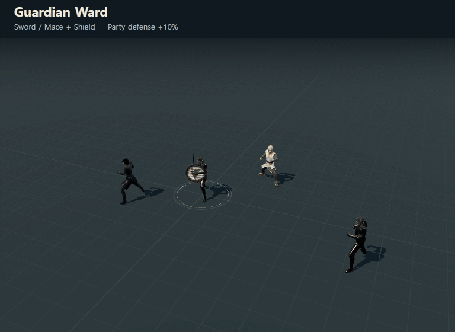
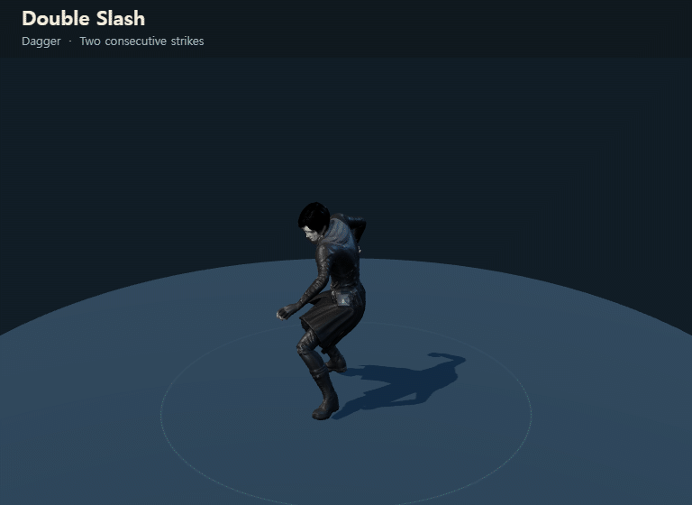
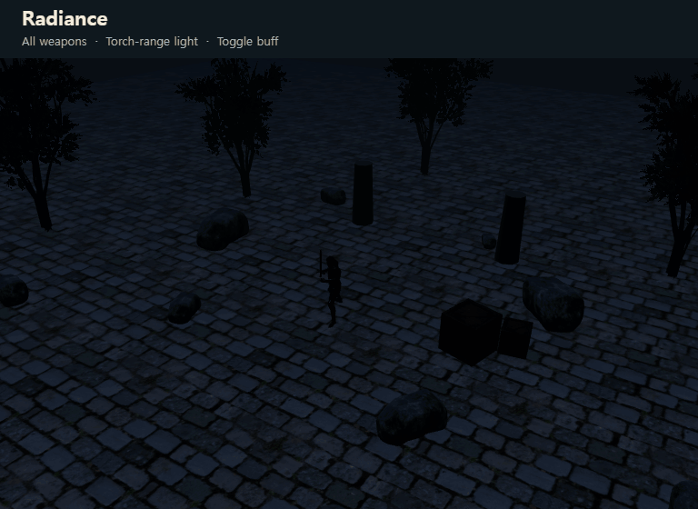
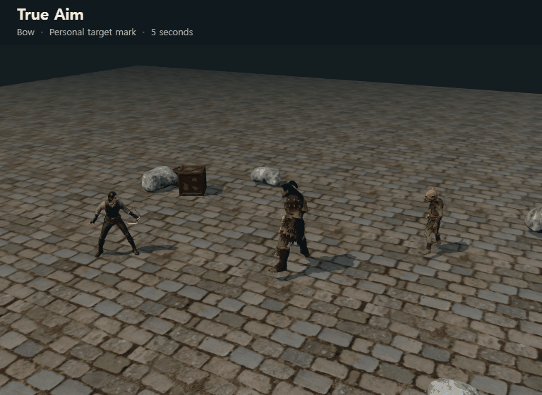

# Ability animation previews for PR review

Rendered from the existing standalone preview pages on 2026-09-13. Each GIF uses the existing character animations and VFX, with a closer camera and an English title for review. These are presentation clips, not recordings of server-side combat or damage validation.

| Ability | GIF | Loop length | Preview source |
| --- | --- | --- | --- |
| Guardian Ward | [guardian-ward.gif](guardian-ward.gif) | 2.8 s | [sword-buff-preview.html](../../../client/sword-buff-preview.html) |
| Double Slash | [double-slash.gif](double-slash.gif) | 2.4 s | [dagger-skill-preview.html](../../../client/dagger-skill-preview.html) |
| Radiance | [radiance.gif](radiance.gif) | 6.4 s | [radiance-skill-preview.html](../../../client/radiance-skill-preview.html) |
| True Aim | [true-aim.gif](true-aim.gif) | 7.2 s | [bow-mark-preview.html](../../../client/bow-mark-preview.html) |

- Resolution: 768 × 560. Animation sampled at 25 fps, played at its original speed. Identical frames are merged while preserving their display duration. All files loop indefinitely and have no audio.
- Guardian Ward: pale-gold shield crests appear on the caster and nearby party members; the more distant character receives no effect. The preview uses compact staging to keep the party visible. The game's actual radius is 20 m, duration 60 s, and cooldown 45 s.
- Double Slash: the chosen A variant, showing both consecutive strikes and their restrained blade trails. The 0.82 s attack is followed by a still interval before the loop repeats.
- Radiance: darkness, cast light, sustained illumination, then manual toggle-off at 4.8 s in the GIF. This does not depict the buff expiring early; the in-game duration remains 120 s, with a 0.8 s toggle cooldown.
- True Aim: pale-red target acquisition, pulsing personal mark, and natural disappearance. The gameplay effect lasts 5 s and its cooldown is 10 s. Only the caster's attacks benefit and only the caster sees the mark.

For a PR description, use raw GitHub image URLs pinned to the submitted commit, or attach the four GIF files in the editor. The relative image links below are intended for this repository document.

## Guardian Ward

## Double Slash

## Radiance

## True Aim

## Sources and license

These four GIFs are repository-rendered derivatives made with Three.js and Pillow, using the existing models, animations, environment assets, and procedural VFX. No new AI image, stock asset, paid generation service, or separate generation tier was used. They retain the applicable licenses of their source assets; this export does not grant a new or broader license.

See [characters](../characters.md), [items](../items.md), [props](../props.md), [animations](../animation.md), [Guardian Ward VFX](../sword-guard-preview.md), [Radiance VFX](../radiance-preview.md), and [True Aim VFX](../bow-mark-preview.md) for source attribution and license details. Source files and capture helpers are unchanged in the game; temporary frame-export helpers and PNG frames live under the ignored `logs/pr-skill-gifs/` directory. These GIFs are documentation assets, following the existing enchantment-preview GIF convention, and are not Hugging Face game-asset registrations.
