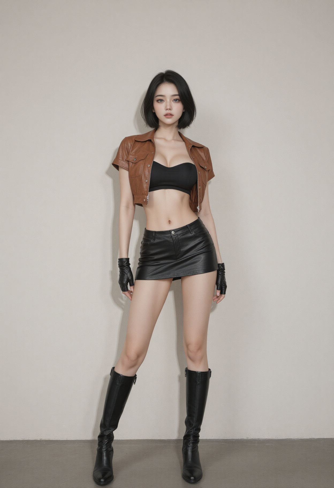

# Character Assets

## Human

- https://sketchfab.com/3d-models/blake-slim-walk-c4d-c076264ca7394357bf3f17837edd72c9
- https://sketchfab.com/3d-models/xbot-049e4a44ad8b449dba8a2c4824502f5c
- "Beauty Girl Exercising - Undressed Workout" (https://skfb.ly/pxpoo) by Polygonal Studios is licensed under Creative Commons Attribution (http://creativecommons.org/licenses/by/4.0/).
- "Beautiful Realistic Undressed Girls - 14 Anims" (https://skfb.ly/pxpoH) by Polygonal Studios is licensed under Creative Commons Attribution (http://creativecommons.org/licenses/by/4.0/).
- "Mutant Mixamo" (https://skfb.ly/6DvxK) by NAZTart is licensed under Creative Commons Attribution (http://creativecommons.org/licenses/by/4.0/).
- "MIXAMO" (https://skfb.ly/ottKO) by sdhkim is licensed under Creative Commons Attribution (http://creativecommons.org/licenses/by/4.0/).
- "Bandit Armor and Clothes - Game Model" (https://skfb.ly/6UVot) by wolkoed is licensed under Creative Commons Attribution (http://creativecommons.org/licenses/by/4.0/).
- Maria https://sketchfab.com/3d-models/maria-a04cac95ab8046e4bbdc9dec30c7d92d
- dying https://sketchfab.com/3d-models/dying-98a1d5b2288d49d993039cb161913cd3
- medieval_knight https://sketchfab.com/3d-models/medieval-knight-sculpture-game-ready-6cdd055b4afa41eb9360dbbfe75c7f10

## Female Knight

- ComfyUI에서 jibMixZIT_v10.safetensors로 원화 생성 
- Nano banana에서 T 포즈로 변형 
- meshy.ai에서 3d 모델로 변환 -> 10k 모델로 리매쉬
- mixamo.com에서 리깅 및 애니메이션 부착
- blender에서 스케일/위치 조정(rest pose 원점 발 밑에 오게) -> 매터리얼 조정 (Shader Editor에서 Alpha 끊기) -> .glb 내보내기
- tools/glb-editor에서 `본 이름 표준화`

## Thief

- female_knight와 같은 workflow
- 원화 
- grok으로 T-pose(나노 바나나가 말을 안들어서) 

## Knight

- female_knight와 같은 workflow
- 원화 
- nano banana2로 A 포즈 
