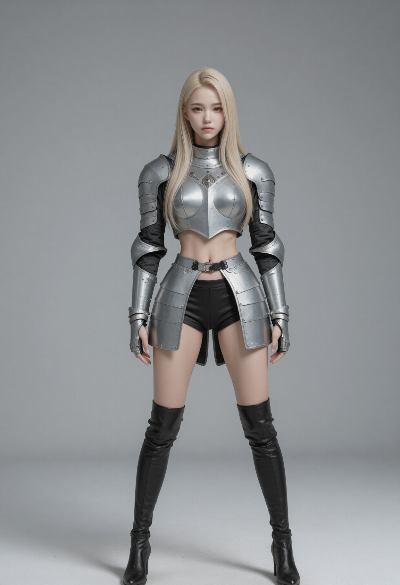
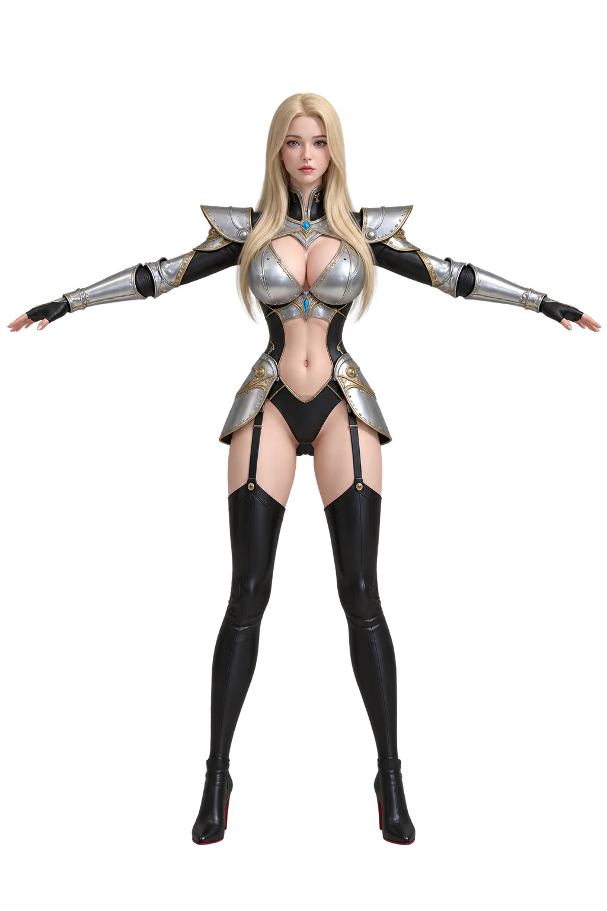
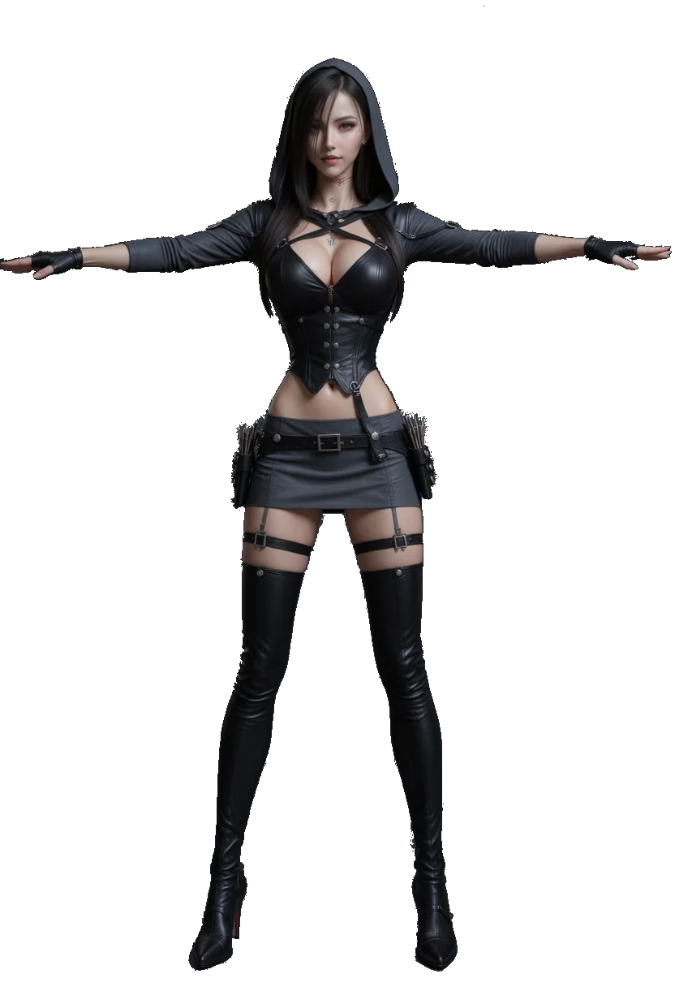
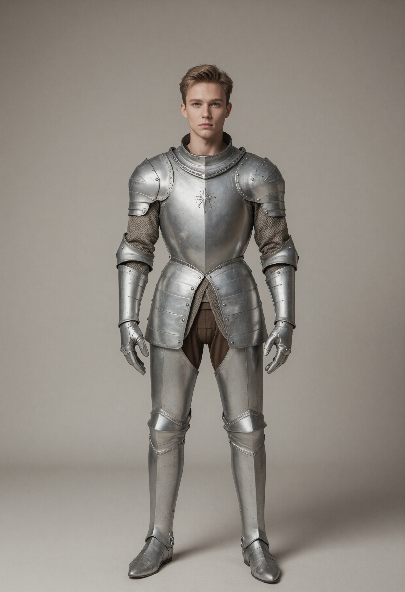
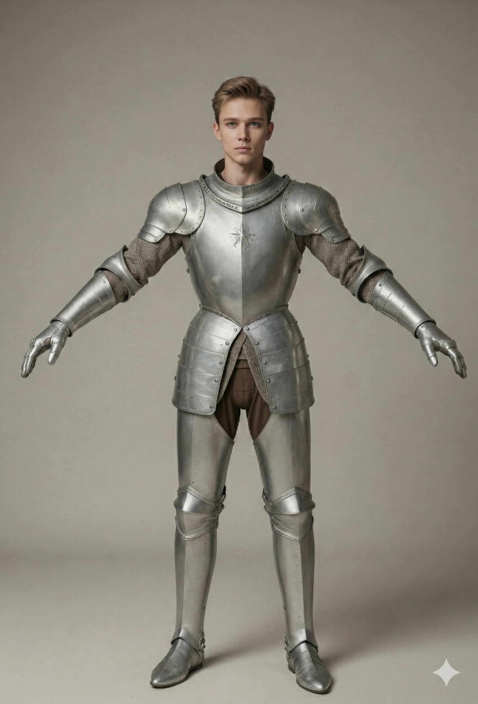
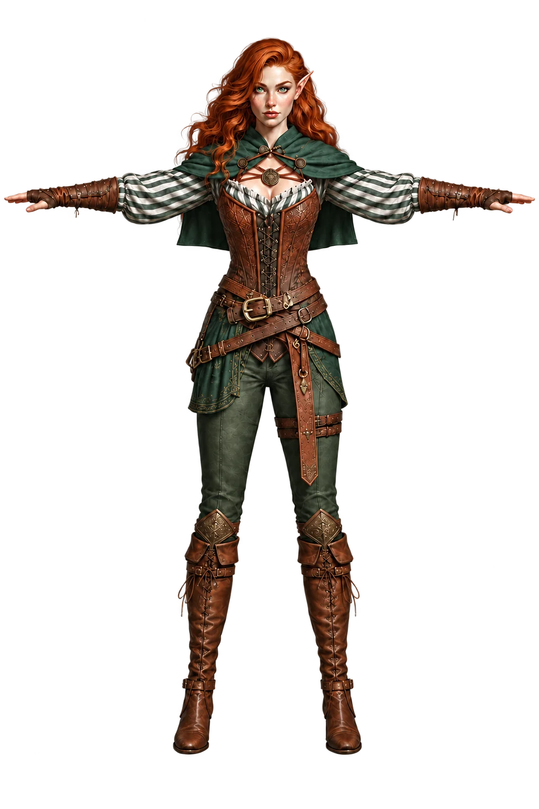

# Character Assets

## Human

- https://sketchfab.com/3d-models/blake-slim-walk-c4d-c076264ca7394357bf3f17837edd72c9 — **[미사용]** 캐릭터 미사용; 걷기 애니는 Mixamo 사용
- https://sketchfab.com/3d-models/xbot-049e4a44ad8b449dba8a2c4824502f5c — **[미사용]** 사용한 적 없음
- "Beauty Girl Exercising - Undressed Workout" (https://skfb.ly/pxpoo) by Polygonal Studios is licensed under Creative Commons Attribution (http://creativecommons.org/licenses/by/4.0/). — **[미사용]** Mixamo 도입 후 삭제
- "Beautiful Realistic Undressed Girls - 14 Anims" (https://skfb.ly/pxpoH) by Polygonal Studios is licensed under Creative Commons Attribution (http://creativecommons.org/licenses/by/4.0/). — **[미사용]** 초기 테스트용, Mixamo 도입 후 삭제
- "Mutant Mixamo" (https://skfb.ly/6DvxK) by NAZTart is licensed under Creative Commons Attribution (http://creativecommons.org/licenses/by/4.0/). — **[미사용]** Mixamo 도입 후 삭제
- "MIXAMO" (https://skfb.ly/ottKO) by sdhkim is licensed under Creative Commons Attribution (http://creativecommons.org/licenses/by/4.0/). — **[미사용]** Mixamo 사이트 알기 전 Sketchfab에서 찾은 애니, Mixamo 도입 후 미사용
- "Bandit Armor and Clothes - Game Model" (https://skfb.ly/6UVot) by wolkoed is licensed under Creative Commons Attribution (http://creativecommons.org/licenses/by/4.0/). — **[미사용]**
- Maria https://sketchfab.com/3d-models/maria-a04cac95ab8046e4bbdc9dec30c7d92d — **[미사용]** 초기 사용, 현재 미사용
- dying https://sketchfab.com/3d-models/dying-98a1d5b2288d49d993039cb161913cd3 — **[미사용]** 정적 dead 포즈 모델(CC-BY, robotgoul); 인게임 death 애니와 다름을 확인 → 캐릭터·애니 소스 아님 (death 클립은 Mixamo 계열)
- medieval_knight https://sketchfab.com/3d-models/medieval-knight-sculpture-game-ready-6cdd055b4afa41eb9360dbbfe75c7f10 — **[미사용]**

## Female Knight

- (초기) ComfyUI에서 jibMixZIT_v10.safetensors로 원화 생성 
- 현재 원화  (그리기: ComfyUI jibMixZIT_v10, A포즈 변경만 Qwen Image Edit; ChatGPT Pro 20x로 배경 투명화·키 약간 축소, 2026-08-28; WebP q85)
- Tripo(유료 등급)에서 3d 모델로 변환 -> 10k 모델로 리매쉬
- mixamo.com에서 리깅 및 애니메이션 부착
- blender에서 스케일/위치 조정(rest pose 원점 발 밑에 오게) -> 매터리얼 조정 (Shader Editor에서 Alpha 끊기) -> .glb 내보내기
- tools/glb-editor에서 `본 이름 표준화`

## Thief → Rogue

`female_thief.glb`가 `female_rogue.glb`로 개명됨 (클래스 Thief → Rogue, 커밋 7eebc39). 현재 사용 중.

- female_knight와 같은 workflow (3D 생성은 meshy.ai)
- 원화  (캐릭터 선택 UI 원화; WebP q85 변환 2026-08-28; 초기 thief 원화 `../images/characters/thief-concept.png`에서 교체)

## Knight

- female_knight와 같은 workflow (3D 생성은 meshy.ai)
- 원화 
- nano banana2로 A 포즈 
- character_concepts 원화 `character_concepts/knight.webp` (Gemini 원본을 ChatGPT Pro 20x로 배경 투명화, 2026-08-28; WebP q85)

## Other Classes

아래 플레이어 클래스는 female_knight와 같은 AI 워크플로우 (ComfyUI 원화 → Nano Banana/Grok 포즈 → 3D 생성 → Mixamo 리깅). 3D 도구는 캐릭터별로 다름(Meshy/Tripo) — License 섹션의 3D 도구 매핑 참조.

- barbarian / female_barbarian — Warrior 대체; 원화: barbarian(남) `character_concepts/barbarian.webp` (Gemini 원본을 ChatGPT Pro 20x로 배경 투명화, 2026-08-28; WebP q85), female_barbarian `character_concepts/female_barbarian.webp` (ChatGPT Pro 20x로 배경 투명화, 2026-08-28; WebP q85)
- caveman / cavewoman — 원화: caveman(남) `character_concepts/caveman.webp` (ChatGPT Pro 20x 생성, 2026-08-28; WebP q85. 이전 Qwen Image Edit 원화는 **[미사용]**), cavewoman `character_concepts/cavewoman.webp` (ChatGPT Pro 20x로 배경 투명화, 2026-08-28; WebP q85)
- priest / female_priest — 원화: priest(남) `character_concepts/priest.webp` (Gemini 원본을 ChatGPT Pro 20x로 배경 투명화, 2026-08-28; WebP q85), female_priest `character_concepts/female_priest.webp` (ChatGPT Pro 20x로 배경 투명화, 2026-08-28; WebP q85)
- ranger — 남성 ranger; 원화 `character_concepts/ranger.webp` (Gemini 원본을 ChatGPT Pro 20x로 배경 투명화, 2026-08-28; WebP q85)
- valkyrie — 단일 성별; 원화 `character_concepts/valkyrie.webp` (ChatGPT Pro 20x로 배경 투명화, 2026-08-29; WebP q85)
- rogue (남) — 남성 rogue 모델; 원화 `character_concepts/rogue.webp` (Gemini/Nano Banana 원본을 ChatGPT Pro 20x로 배경 투명화, 2026-08-28; WebP q85); female_rogue는 [Thief → Rogue](#thief--rogue) 참고

## Bard

`female_bard.glb` — 단일 성별(female). Meshy.ai Premium 등급, 생성 2026-08-05 (프롬프트명 "Crimson Vanguard").

- 원화  (ChatGPT Pro 20x로 배경 투명화, 2026-08-28; WebP q85)

기존 워크플로우와 다른 점: Meshy 출력이 63개 분리 셸에 뒤집힌 면 403개, 열린 경계 1,093개라 Mixamo 업로드가 실패했다. Blender에서 커스텀 스플릿 노멀 제거 → Recalculate Outside → 8변 이하 구멍만 메움으로 정리 후 업로드 성공. 큰 개구부는 다른 조각에 가려 보이지 않아 남겼다(머티리얼 `doubleSided`).

- Mixamo 업로드용 FBX는 머티리얼 제거 + 텍스처 임베드 해제 필요 — metallic/roughness/emissive가 물려 있으면 "unable to map your existing skeleton"으로 실패
- 텍스처: baseColor 2048² JPEG + normal 1024² JPEG (Meshy 원본 2048² PNG에서 축소)
- emissive 미연결 (Meshy 기본 `EmissiveColor [1,1,1]` 방치 시 백색 발광)

## NPC Models

플레이어 클래스 아님.

- guard — 경비병 NPC Karl (`guard.glb`, CharacterClass::Guard); 원화 `../images/characters/karl-concept.png`, 3D는 Meshy.ai (라이센스는 위 License 표 참조); 거래 창 초상화 `../images/characters/karl-portrait.png` (ChatGPT, 2026-06-12, `doc/assets/ui.md` 참조)
- npc_woman — 상인 NPC Rica (`npc_woman.glb`); 원화 `../images/characters/rica-concept.png` (Gemini) (커밋 fb299e7); 거래 창 초상화 `../images/characters/rica-portrait.png` (ChatGPT, 2026-06-10, `doc/assets/ui.md` 참조)
- maid — 여관 직원 NPC용 메이드 (`maid.glb`, NPC Miriel); 원화 `../images/characters/maid-concept.png` (ComfyUI krea2_turbo_fp8_scaled, 2026-08-31); 거래 창 초상화 `../images/characters/miriel-portrait.png` (2026-09-02, `doc/assets/ui.md` 참조); 3D는 Meshy.ai Image to 3D (유료 등급, 생성 2026-08-30), Meshy 원본 `assets/Meshy_AI_Elegant_Maid_Pose_0830152239_texture_obj.zip`(OBJ, Mixamo 업로드용) + `assets/Meshy_AI_Elegant_Maid_Pose_0830151822_texture (1).glb`(같은 모델의 GLB 재다운로드, 노멀·MR 맵 포함), Mixamo 리깅 65본 `assets/maid_mixamo.fbx` (2026-08-31, Stand To Sit 스킨째). 헤드리스 Blender에서 `fix_mixamo_transforms` → 애니 제거 → 키 1.90m(npc_woman 1.91m 기준), 발 원점 → `mixamorig:` 접두 제거 → 머티리얼은 Meshy GLB 것을 통째로 이식(UV 동일: baseColor 픽셀 일치 확인), emissive/specular 제거 → GLB export → 후처리로 본 노드의 float 오차 scale 제거·노멀/MR 1024² 축소. baseColor 2048² JPEG q94 4:4:4(exporter 기본 q92 4:2:0은 얼굴이 뭉개져 상향; q97 백업 `~/assets_original/maid/maid_q97.glb`), normal·metallicRoughness 1024² JPEG
- pink_maid — 여관 메이드 NPC Cocoly (`pink_maid.glb`); 원화 `../images/characters/pink-maid-concept.png` (ComfyUI krea2_turbo_fp8_scaled, 2026-08-31 이전 생성); 거래 창 초상화 `../images/characters/cocoly-portrait.png` (2026-09-02, `doc/assets/ui.md` 참조); 3D는 Meshy.ai Image to 3D (유료 등급, 생성 2026-08-31, 프롬프트명 "Pink Porcelain Maid"), Meshy 원본 `assets/Meshy_AI_Pink_Porcelain_Maid_0831180703_texture_obj.zip`(OBJ, Mixamo 업로드용) + `..._0831180550_texture.glb`(GLB, 머티리얼 이식용) + `..._0831180601_texture_fbx.zip`(FBX, 미사용), Mixamo 리깅 `assets/Taunt.fbx` (2026-09-01, 검지만 있는 33본 스킨째 — Meshy 메시의 손가락이 붙어 있어 Mixamo가 풀 스켈레톤을 못 만듦; 나머지 손가락 애니 트랙은 무시됨). 가공은 maid 항목과 동일 파이프라인 (키 1.90m, `mixamorig:` 제거, Meshy GLB 머티리얼 이식, baseColor 2048² JPEG q94 4:4:4, normal·MR 1024², q97 백업 `~/assets_original/pink_maid/pink_maid_q97.glb`)
- night_merchant — 야간 상인 NPC Wick (`night_merchant.glb`); 거래 창 초상화 `../images/characters/wick-portrait.png` (ChatGPT, 2026-08-27, `doc/assets/ui.md` 참조); Meshy.ai Premium 등급, 생성 2026-08-08 (프롬프트명 "The Jolly Buccaneer"). OBJ로 받아 Mixamo 리깅(Excited) — Mixamo에서 텍스처가 하얗게 깨져 Blender에서 baseColor 재연결. 손가락 본 없는 33본 스켈레톤(기존 65본과 달리 손가락 애니 안 먹음, 런타임 리타게팅이 없는 본 트랙은 무시). baseColor 2048² JPEG, 노멀맵 없음. .blend 소스 `~/assets_original/night_merchant.blend` (텍스처 팩 포함)
- steward — 영지 관리인 NPC용 (`steward.glb`); 거래 창 초상화 `../images/characters/steward-portrait.png` (사용자 제공 ChatGPT 이미지, 2026-09-07, ChatGPT Pro x20 등급; `doc/assets/ui.md` 참조); 원화 `../images/characters/steward-concept.png` (ChatGPT 이미지 생성, 2026-09-05); 3D는 Meshy.ai Image to 3D (Premium 등급, 생성 2026-09-05, 프롬프트명 "The Master Keykeeper"), Meshy 원본 `assets/steward/Meshy_AI_The_Master_Keykeeper_0905051902_texture.glb`(GLB, 머티리얼 이식용) + `..._0905051916_texture_obj.zip`(OBJ, Mixamo 업로드용), Mixamo 리깅 65본 `assets/steward/Sitting Laughing.fbx` (2026-09-05, 스킨째). `tools/blender-scripts/export_character.py`로 가공 (Blender 5.2.1, 2026-09-05): 애니 제거, 키 1.90m(maid 기준), 발 원점, `mixamorig:` 제거, Meshy GLB 머티리얼 이식(면 단위 UV 일치 검증), emissive 제거, 본 노드 float 오차 scale 제거. 텍스처는 maid의 JPEG 대신 WebP q90 — baseColor 2048², normal·MR 1024² (GLB 1.59MB). 작업 blend `assets/steward/steward.blend`. Land Registrar NPC `Aldwin`에 연결 (2026-09-05), Land Deed 판매. 2026-09-06부터 낮에는 집 1층 61번 의자에 앉고 밤에는 같은 집 2층 60번 침대에서 수면

### Estate Architect (2026-09-06)

- 영지 건축가용 모델 `client/public/models/characters/estate_architect.glb` (NPC `Rowan`, merchant). 2026-09-06 광장에 배치하고 목책·조경 도구함·바닥 재질 견본집 7종 판매를 연결.
- 거래 창 초상화 `../images/characters/estate-architect-portrait.png` — 사용자 제공 ChatGPT 이미지, ChatGPT Pro x20 등급, 2026-09-07; `doc/assets/ui.md` 참조.
- 원화: [estate-architect-concept.png](../images/characters/estate-architect-concept.png). ChatGPT Pro 20x, 생성 2026-09-06, OpenAI 이용약관 적용. 제공된 `assets/ChatGPT Image 2026년 9월 6일 오후 10_22_31.png`를 이동.
- 3D 원본: `assets/Meshy_AI__0906132418_texture.glb`. Meshy.ai Premium, 생성 2026-09-06, 유료 생성물 라이선스 적용(아래 License 참조).
- 리깅 원본: `assets/Defeated.fbx`. Mixamo, 2026-09-06 제공, 손가락 포함 65본. Mixamo 라이선스 적용(아래 License 참조).
- Blender 5.2.0 LTS에서 기존 캐릭터 내보내기 스크립트로 키 1.90m, 발 원점, 회전·스케일 적용, `mixamorig:` 접두 제거. Meshy 재질을 이식하고 면 단위 UV 일치 확인(최대 오차 0). emissive와 원본 Defeated 애니메이션 제거.
- 텍스처: WebP q90, baseColor 2048², normal·metallicRoughness 1024². GLB 1,676,780바이트, 65본, 노드 scale 없음. 기존 클라이언트 리타게팅으로 걷기·달리기·slash1을 적용해 포즈 렌더 확인.
- 작업 파일: `assets/estate_architect/estate_architect.blend` (텍스처 포함). 미리보기: `assets/estate_architect/preview.png`.

재생성:

```sh
blender -b --python-exit-code 1 -P tools/blender-scripts/export_character.py -- \
  --fbx assets/Defeated.fbx \
  --glb assets/Meshy_AI__0906132418_texture.glb \
  --name estate_architect --height 1.90 \
  --out client/public/models/characters/estate_architect.glb \
  --blend assets/estate_architect/estate_architect.blend
```

### Grida / 그리다 — ORKEA 점원 (2026-09-20)

- ORKEA에서 일할 오크 여성 점원. 캐릭터 이름은 **Grida (그리다)**, 에셋 이름은 `grida`.
- 원화: [grida-concept.png](../images/characters/grida-concept.png), 사용자 제공 2026-09-20(원화 생성일 미확인). ComfyUI 로컬 실행, **`krea2_turbo_fp8_scaled.safetensors`** (Krea 2 Turbo FP8; 사용자 확인 및 PNG 메타데이터 일치). 기본 모델 라이선스는 [Krea 2 Community License Agreement](https://www.krea.ai/krea-2-licensing); 출력물 소유권은 §5.3, 상업 이용 조건은 §2.3을 따른다. 사용한 LoRA 정보는 원본 PNG의 ComfyUI 메타데이터에 보존.
- 상점 창 초상화: [grida-portrait.png](../images/characters/grida-portrait.png) → `client/public/portraits/grida.webp`(원본 상단 2/3 크롭, 512×341, alpha 유지). 기존 원화의 얼굴·머리·의상을 참조한 상반신 구도. OpenAI Codex built-in ImageGen, ChatGPT Pro x20 등급(사용자 확인), 2026-09-20; 출력물 이용 조건과 프롬프트는 [UI 에셋 문서](ui.md#npc-거래-초상화) 참조.
- 3D 생성: Meshy.ai **Premium** 등급(사용자 확인), Image to 3D API, 2026-09-20. [Meshy 유료 생성물 소유권 조건](https://help.meshy.ai/en/articles/10137554-what-is-the-ownership-of-the-generated-models) 적용. Meshy Community에 공개 게시하지 않음.
- 생성 설정: `ai_model=meshy-7.1`, `model_type=standard`, `should_remesh=true`, `topology=triangle`, `target_polycount=10000`, A 포즈, PBR 텍스처 2048², `image_enhancement=false`로 원화 외형 유지. GLB·FBX·OBJ 요청.
- 작업 ID: `01a0ba74-d31f-7744-bc58-31ef8c01e280`. 요청·결과 기록은 `assets/grida/generation.json`, 원화 출처 기록은 `assets/grida/concept-source.json`.
- Meshy 원본: `assets/grida/grida_meshy.glb` 및 `texture_0_*.png`. 최종 재생성에 필요한 원본과 PBR 텍스처를 보존한다.
- **[미사용]** 리깅 전 검토본, 중복 Meshy FBX·OBJ·MTL, Mixamo 업로드 ZIP, 미리보기·포즈 데이터·일회성 검사 스크립트·중복 API 응답은 2026-09-21에 삭제했다.
- 게임 모델: `client/public/models/characters/grida.glb` — **9,812 triangles**, 손가락 포함 **65본**, 키 1.90m, 발밑 원점, 1,972,300바이트. `Grida` 이름의 NPC 모델로 연결.
- 리깅 원본: 사용자 제공 `/mnt/y/web_downloads/Idle (5).fbx` → `assets/grida/grida_mixamo.fbx` (Mixamo, 2026-09-20, 무료 서비스; 아래 Mixamo 라이선스 참조). 포함된 Idle 애니메이션은 제거하고 기존 게임 애니메이션 팩을 사용.
- Blender 5.2.0 LTS에서 `tools/blender-scripts/export_character.py`로 변환. Meshy 텍스처 이름만 역할별로 정규화한 임시 GLB를 사용해 재질 이식, 면 단위 UV 최대 오차 0 확인. 키·발 원점 적용, `mixamorig:` 접두·emissive·본 scale 오차 제거. WebP q90, baseColor 2048², normal·metallicRoughness 1024². 작업 파일: `assets/grida/grida_rigged.blend`. 재현: `.venv/bin/python assets/grida/export_rig.py`.
- 검증: GLB 본 이름·스킨 가중치·내장 텍스처·키·원점 확인. 실제 클라이언트 리타게팅으로 idle1·walk·run을 각각 12개 시점에서 검사하고 포즈 렌더를 확인했다. 검증 요약과 원본·결과 해시는 `assets/grida/generation.json`의 `rigging`에 보존한다.
- NPC 레지스트리 `grida` / `Grida`, 한국어 별칭 `그리다`. ORKEA 서쪽 계산 구역 옆 `(-1452.0, 1.0, 4777.0)` 근무 일정과 전시품·카트·출입구 결제 안내를 연결. 별도 개인 상점은 없으며 ORKEA의 기존 결제 흐름을 사용.
- 생성 비용: **30 API 크레딧**(5,096 → 5,066).

### Tobin / 토빈 — 강가의 낚시꾼 (2026-09-21)

- 낚싯대를 팔고, 곁에서 한 차례의 낚시를 관찰하면 낚시 스킬을 가르치는 인간 남성 NPC. 이름은 **Tobin (토빈)**, 에셋 이름은 `tobin`.
- 원화: [tobin-concept.png](../images/characters/tobin-concept.png), 1024×1536 PNG. OpenAI Codex built-in ImageGen, ChatGPT Pro 20x, 생성·수정 2026-09-21. OpenAI 생성 출력물 이용 조건 적용.
- 상점 창 초상화: [tobin-portrait.png](../images/characters/tobin-portrait.png) → `client/public/portraits/tobin.webp`(512², alpha 유지). 기존 원화의 얼굴·복장을 유지한 가슴까지의 투명 배경 초상화. OpenAI Codex built-in ImageGen 편집, ChatGPT Pro 20x, 2026-09-21. 출처·출력물 이용 조건과 편집 프롬프트는 [UI 에셋 문서](ui.md#npc-거래-초상화) 참조.
- 햇볕에 그을린 얼굴과 짧은 희끗한 수염의 친근한 중년 낚시꾼. 리넨 튜닉·가죽 조끼·모직 바지·챙 없는 모직 모자·가죽 신발의 중세풍 복장. 청바지와 현대적인 모자가 있던 초안은 **[미사용]**이며, 사용자 요청으로 복장을 수정했다.
- Meshy 변환과 Mixamo 리깅을 위해 빈손의 정면 A포즈로 제작했다. 낚싯대는 별도 장착 아이템으로 사용한다.
- 실제 생성·편집 프롬프트와 출처·해시: [concept-source.json](../../assets/tobin/concept-source.json).
- 3D 생성: Meshy.ai **Premium**(사용자 확인), Image to 3D API, `meshy-7.1`, 2026-09-21. [Meshy 유료 생성물 소유권 조건](https://help.meshy.ai/en/articles/10137554-what-is-the-ownership-of-the-generated-models) 적용. Meshy Community에 공개 게시하지 않았다.
- 10,000 polygons 목표로 생성한 **10,370 triangles**, 빈손 A포즈, PBR 텍스처 2048². 추가 폴리곤 감면 없이 GLB·FBX·OBJ와 텍스처를 다운로드했다. 작업 ID `01a0bfbf-24c2-74cb-aebb-2a24c7a883dc`, 비용 **30 API 크레딧**(4,976 → 4,946). [생성 설정·결과·해시](../../assets/tobin/generation.json).
- 재생성에 필요한 [PBR 원본 GLB](../../assets/tobin/tobin_meshy.glb), Mixamo 리깅 FBX, Blender 작업 파일, 원본 `texture_0_*.png`를 보존한다. GLB의 베이스컬러·metallicRoughness는 JPEG이므로 원본 PNG도 유지한다. 사용 완료한 업로드 ZIP과 리깅 전 FBX·OBJ·MTL, 이전 미리보기·임시 로그·중복 검증 JSON은 사용자 요청으로 삭제했다(2026-09-21). [파일 안내](../../assets/tobin/README.md).
- Mixamo 업로드 후 **텍스처 정상 표시를 사용자 확인**(2026-09-21). ZIP 루트의 OBJ·MTL·베이스컬러와 재질 참조를 맞춘 구성이며, 이후 캐릭터에도 같은 [업로드 준비 방식](creation-guidelines.md#mixamo-upload-preparation)을 사용한다.
- 리깅 전 GLB·FBX·OBJ는 메시 1개·10,370 triangles·UV 1개·2048² 텍스처·본 0개로 검증했다. 검사 결과와 삭제 파일 기록은 [generation.json](../../assets/tobin/generation.json)의 `validation`·`cleanup`에 보존한다.
- 리깅 원본: 사용자 제공 `/mnt/y/web_downloads/Idle (6).fbx` → [tobin_mixamo.fbx](../../assets/tobin/tobin_mixamo.fbx). Mixamo(Adobe), 2026-09-21, 무료 서비스; 아래 Mixamo 라이선스 참조. 포함된 Idle 애니메이션은 제거하고 기존 게임 애니메이션 팩을 사용한다.
- 게임 모델: [tobin.glb](../../client/public/models/characters/tobin.glb) — **10,370 triangles, 33본**, 키 1.90m, 발밑 원점, WebP q90. 베이스컬러 2048², 노멀·metallicRoughness 1024². 양손에 검지 체인만 있는 간소화된 리그로, 엄지·중지·약지·소지를 각각 제어할 수는 없다.
- Blender 5.2.0 LTS에서 공용 `tools/blender-scripts/export_character.py`로 원본 재질을 이식했다. 면 단위 UV 최대 오차 0, `mixamorig:` 접두·본 scale 오차 제거. 텍스처를 내장한 [Blender 작업 파일](../../assets/tobin/tobin_rigged.blend), 재현: `.venv/bin/python assets/tobin/export_rig.py`.
- 실제 클라이언트 리타게팅으로 `idle1`·`walk`·`run`·`fishing_cast`·`fishing_idle`을 각각 12개 시점에서 검사하고 동작 렌더를 검토했다. 검증 JSON 3개는 [generation.json](../../assets/tobin/generation.json)의 `rigging.export_report`·`rigging.validation`·`npc_placement.verification`에 통합하고 동작 미리보기는 삭제했다. Grida와 같은 보관 기준으로 폴더에 11개 파일을 유지한다. 클라이언트 모델 경로를 NPC 이름 `Tobin`에 연결했다.
- NPC 레지스트리 `tobin` / `Tobin`, 한국어 별칭 `토빈`. **world(-1499.9, 0.6, 4728.4), 방향 -89.0°**, tile(-23, 74), cell(4, 24)의 강가에 배치. `fishing_rod`를 작업 장비로 장착하고 캐스팅·입질 대응·실제 물고기 획득을 반복한다. 찌·바깥 낚싯줄은 실제 낚시 중에만 표시하며, 매 시도 사이에는 잠시 쉰다. [일정](../../agent-client/data/npcs/tobin/schedule.json), [낚시 연출과 구현 범위](../FISHING.md#토빈-배치-2026-09-21-구현). 상점에서 낚싯대를 기본 가격 3실버에 판매하며, 6m 이내에서 캐스팅부터 포획까지 관찰하면 낚시 스킬을 영구 습득한다.

## 텍스처 재패킹 (2026-08-06)

Meshy/Tripo 내보내기가 노멀·metallicRoughness 맵을 2048² RGBA PNG로 임베드해
캐릭터당 12~15MB였다. `tools/repack-glb-textures.py`로 전체 재패킹:
노멀·MR은 JPEG 4:4:4 1024²(q92/q90), 베이스컬러는 해상도 유지한 채 JPEG q92
(female_knight만 PNG였음), 플랫 노멀맵(knight, npc_woman)과 알파가 상수라
무의미했던 specularTexture(female_knight)는 제거.
합계 168.5MB → 33.9MB, 텍스처 VRAM 900MB → 464MB.
스크립트는 멱등이라 재실행해도 재인코딩하지 않는다.

베이스컬러 축소는 보류. `--base-max 1024`면 23.5MB/VRAM 229MB까지 내려가지만
선택 화면 크기에서 사슬갑옷·문장 같은 패턴 면이 뭉갠다(guard 45dB가 최악).
1536은 NPOT 리샘플 탓에 1024보다도 나쁘니 중간값은 없다.

## License (AI 제작 캐릭터)

위 AI 워크플로우로 만든 플레이어 캐릭터 전부(knight, barbarian, caveman, priest, rogue, ranger, valkyrie의 male/female)의 도구별 라이센스. 3D 도구는 female_knight만 Tripo, 그 외 전부 Meshy. (조사 2026-07, 약관 변경 가능)

| 단계 | 도구 | 라이센스 | 비고 |
|------|------|---------|------|
| 원화 | ComfyUI + jibMixZIT / Z-Image Turbo / Qwen Image Edit | Apache 2.0 | 상업 OK, 표시 의무 없음 (로컬 실행) |
| T/A 포즈 | Nano Banana(Gemini) / Grok | 출력물 사용자 소유, 상업 OK | 전 등급 동일, IP 배상 없음 |
| 3D 메쉬 (대부분) | Meshy.ai (유료 생성) | 완전 소유권, 상업 OK | 무료 다운그레이드해도 유지 (CC-BY 전환 안 됨) |
| 3D 메쉬 (female_knight) | Tripo (유료 Pro+ 생성) | 유료=완전 상업권 | ⚠️ 다운그레이드 후 유지 여부 약관 미명시 — 인보이스 보관·support 문의 |
| 리깅/애니 | Mixamo (Adobe) | 무료·로열티 없음·상업 OK | 원본 파일 단독 재배포 금지, 임베드는 OK |

핵심 조건:

- Meshy: 유료 때 생성분은 상업권 영구 유지. 단 ① Meshy Community에 공개 게시 안 함, ② 입력물이 타 저작권 미침해(위 원화·포즈 체인은 Apache 2.0/사용자 소유라 충족).
- Tripo: 유료 생성 시점엔 완전 상업권이나 **다운그레이드 후 유지 여부가 약관에 없음** (Meshy보다 리스크). 상업화 전 support@tripo3d.ai 확인 권장.
- **3D 도구 매핑** (Tripo=리스크, Meshy=안전): Tripo = female_knight (유일) / Meshy = 그 외 캐릭터·NPC 전부.
- 입증 대비: **Meshy·Tripo 결제 인보이스 + 생성 날짜** 보관 (유료 시점 생성 증빙).
- AI 생성 이미지는 저작권 보호가 약해 독점권 주장은 어려움(사용은 무방).
- Mixamo "단독 재배포 금지" 판단(2026-08-13): 애니메이션은 독립 배포물이 아니라 OpenMMO
  게임의 일부로 딸려나가므로 임베드에 해당한다고 본다. HF 데이터셋(`assets.lock`)과
  `assets/all_animation.blend`도 같은 게임의 빌드 소스로 취급한다.
- 같은 날 애니메이션 팩 GLB에서 Mixamo 캐릭터 메쉬(Medea)와 텍스처를 걷어냈다
  (36.5MB → 2.4MB). 런타임이 안 읽는 데이터라 크기·성능 목적 — [animation.md](./animation.md) 참조.

출처: [Meshy 취소 시 라이센스](https://help.meshy.ai/en/articles/9992023-if-i-cancel-my-subscription-will-all-my-models-revert-to-a-cc-by-4-0-license), [Tripo 약관](https://www.tripo3d.ai/terms), [Tripo 라이센스 가이드](https://www.tripo3d.ai/game-development/3d-assets-license-game-development), [Mixamo FAQ](https://helpx.adobe.com/creative-cloud/faq/mixamo-faq.html), [jibMixZIT](https://civitai.com/models/2231351/jib-mix-zit), [Z-Image Turbo](https://huggingface.co/Tongyi-MAI/Z-Image-Turbo)
