# Item Assets

- sword.glb https://www.fab.com/listings/5fe82d66-eaac-48e0-899d-1fedacdf409a
- spear.glb https://sketchfab.com/3d-models/spear-f13ddd24e2fe47aa8aca23487afd893e
- torch.glb https://sketchfab.com/3d-models/torch-stick-d8eadee1a5c14483aade99b1fe5bc150
- goblin_sword.glb https://sketchfab.com/3d-models/goblin-sword-5717ea55e34341b79efa692517e8598b
- shield_wooden.glb, shield_raven.glb https://sketchfab.com/3d-models/shield-323dfe4dbb764c439bcc6b0469f812eb
- leather_armor.glb — Meshy.ai (유료 생성, 2026-07-24, "Shadowbound Leather A"). 완전 소유권·상업 OK (characters.md License 참조)
    - 원화는 ChatGPT 이미지 생성 (ChatGPT Pro 20x, 2026-07-24 커밋) 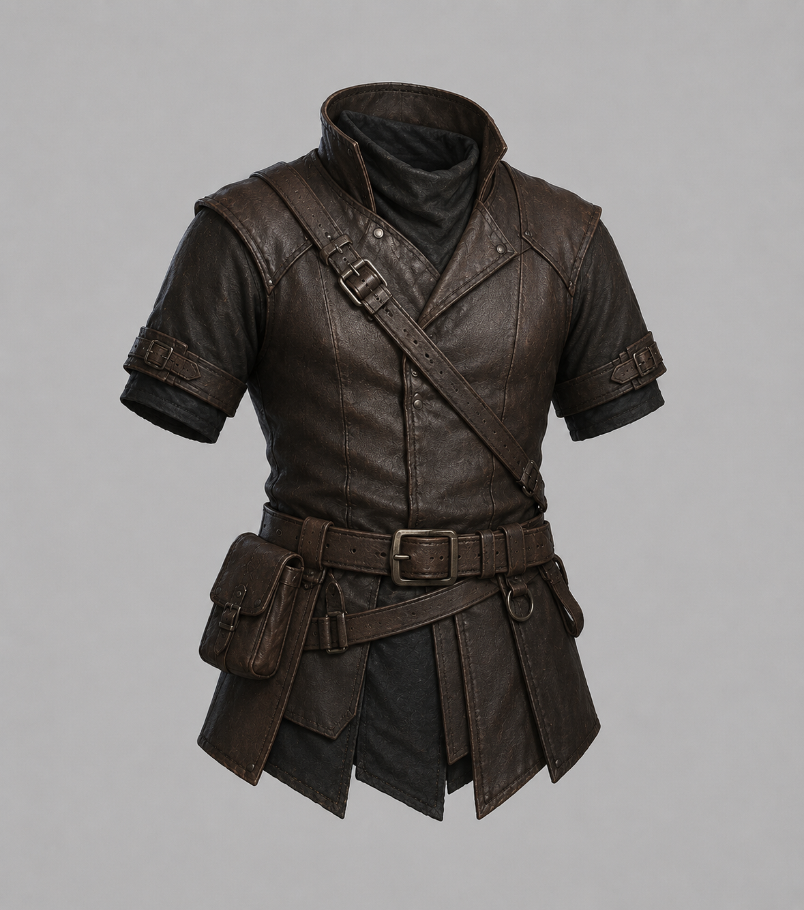
- leather_pants.glb — Meshy.ai (유료 생성, 2026-07-24, "Leather Combat Pants"). 완전 소유권·상업 OK (characters.md License 참조)
    - 원화는 ChatGPT 이미지 생성 (ChatGPT Pro 20x, 2026-07-24 커밋) 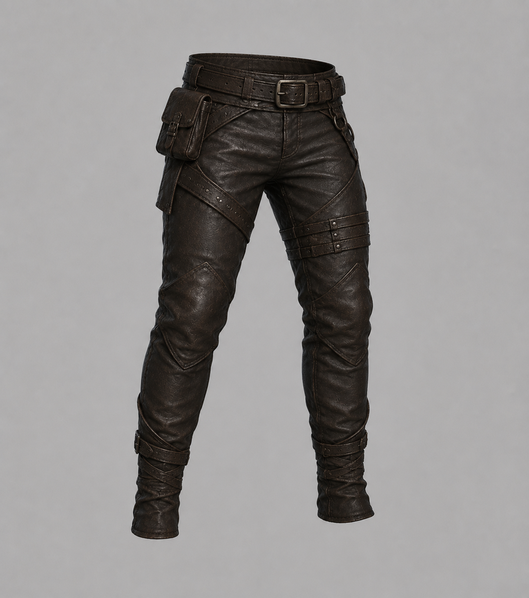
- leather_helmet.glb — Meshy.ai (유료 생성, 2026-07-28, "Leather War Helmet"). 완전 소유권·상업 OK (characters.md License 참조). FBX를 Blender로 임포트해 0.36배 스케일 적용(폭 0.24m), 원점=바닥 중심, 텍스처 512²로 축소, 검은 emissive 제거 (2026-07-29)
    - 원화는 ChatGPT 이미지 생성 (ChatGPT Pro 20x, 2026-07-29 커밋) 
- plate_armor.glb — Meshy.ai (유료 생성, 2026-07-29, "Steelbound Plate Armor"). 완전 소유권·상업 OK (characters.md License 참조). FBX를 Blender로 임포트해 0.6배 스케일 적용(높이 0.6m, leather_armor와 동일), 원점=바닥 중심, 텍스처 512²로 축소, 검은 emissive 제거. 아이콘은 Cycles 직교 렌더(약간 측면·위) 512²→128² (2026-07-31 재렌더)
    - Breastplate 원화는 ChatGPT 이미지 생성 (ChatGPT Pro 20x, 2026-07-29) 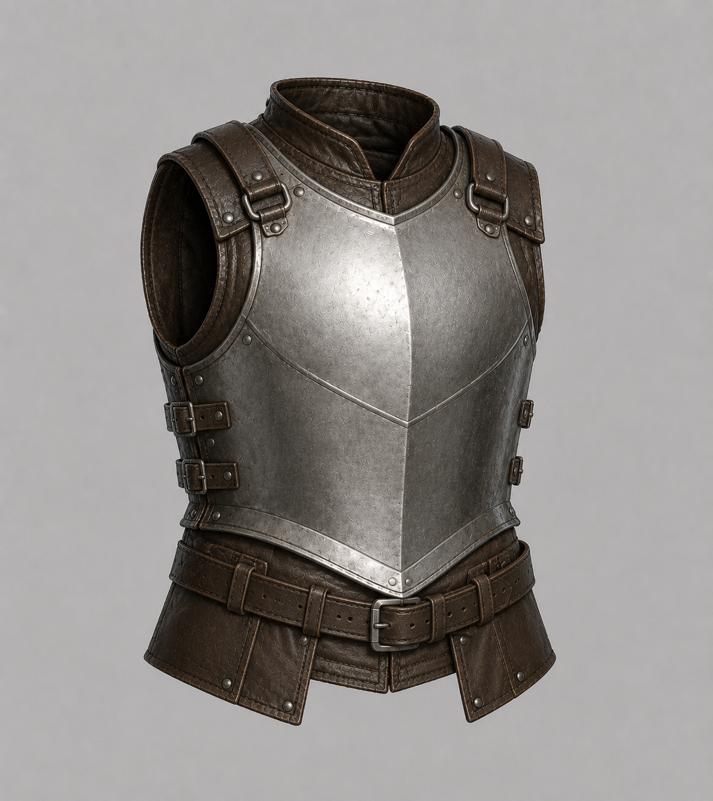
- iron_boots.glb — Meshy.ai (유료 생성, 2026-07-30, "Medieval Sabatons"). 완전 소유권·상업 OK (characters.md License 참조). FBX를 Blender로 임포트해 0.35배 스케일 적용(한 쌍 폭 0.35m, 높이 0.28m), 원점=바닥 중심, 텍스처 512²로 축소, 검은 emissive 제거 (2026-07-30)
    - 원화는 ChatGPT 이미지 생성 (ChatGPT Pro 20x, 2026-07-31 커밋) 
- leather_gloves.glb — Meshy.ai (유료 생성, 2026-07-31, "Dark Brown Leather Fingerless Gloves"). 완전 소유권·상업 OK (characters.md License 참조). FBX를 Blender로 임포트해 0.35배 스케일 적용(한 쌍 폭 0.35m, 높이 0.21m), 원점=바닥 중심, 텍스처 512²로 축소, 검은 emissive 제거. 아이콘은 Cycles 직교 렌더(약간 측면·위) 512²→128² (2026-07-31)
    - 원화는 ChatGPT 이미지 생성 (ChatGPT Pro 20x, 2026-07-31 커밋) 
- leather_boots.glb — Meshy.ai (유료 생성, 2026-07-31, "Crisscrossed Leather"). 완전 소유권·상업 OK (characters.md License 참조). FBX를 Blender로 임포트해 0.42배 스케일 적용(한 쌍 폭 0.35m, 높이 0.42m), 원점=바닥 중심, 텍스처 512²로 축소, 검은 emissive 제거. 아이콘은 Cycles 직교 측면·위 각도 렌더 512²→128² (2026-07-31)
    - 원화는 ChatGPT 이미지 생성 (ChatGPT Pro 20x, 2026-07-31 커밋) 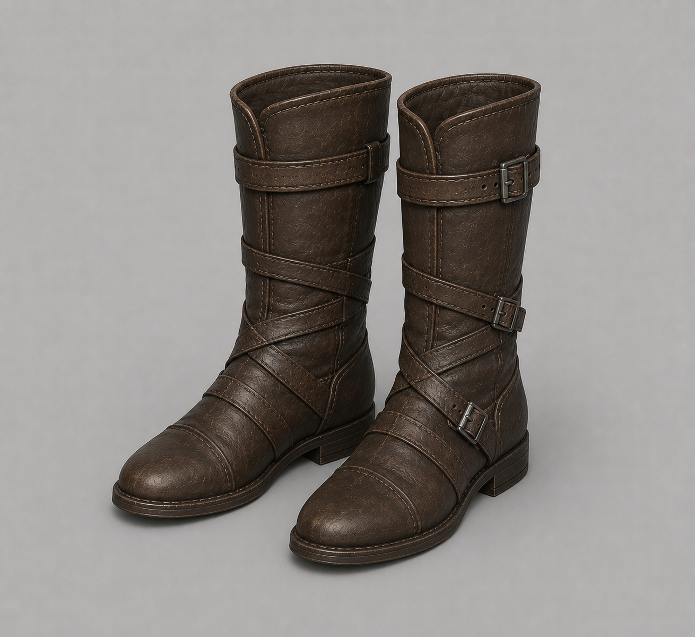
- iron_helmet.glb — Meshy.ai (유료 생성, 2026-07-31, "Medieval Great Helmet"). 완전 소유권·상업 OK (characters.md License 참조). FBX를 Blender로 임포트해 0.3배 스케일 적용(폭 0.25m, 높이 0.29m), 원점=바닥 중심, 텍스처 512²로 축소, 검은 emissive 제거. 아이콘은 Cycles 직교 측면·위 각도 렌더 512²→128² (2026-07-31)
    - 원화는 ChatGPT 이미지 생성 (ChatGPT Pro 20x, 2026-07-31 커밋) 
- iron_gauntlets.glb — Meshy.ai (유료 생성, 2026-07-31, "Twin Iron Gauntlets"). 완전 소유권·상업 OK (characters.md License 참조). FBX를 Blender로 임포트해 0.35배 스케일 적용(한 쌍 폭 0.35m, 높이 0.30m), 원점=바닥 중심, 텍스처 512²로 축소, 검은 emissive 제거. 아이콘은 Cycles 측면·위 직교 렌더 512²→128² (2026-07-31)
    - 원화는 ChatGPT 이미지 생성 (ChatGPT Pro 20x, 2026-07-31 커밋) 
- chain_mail.glb — Meshy.ai (유료 생성, 2026-08-01, "Leather Trimmed Chain"). 완전 소유권·상업 OK (characters.md License 참조). FBX를 Blender로 임포트해 0.6배 스케일 적용(높이 0.6m), X축 −90° 회전으로 눕힌 자세(가슴이 위, 바닥면 0.53×0.6m), 원점=바닥 중심, 텍스처 512²로 축소, 검은 emissive 제거. 아이콘은 Cycles 직교 측면·위 각도 렌더 512²→128² (2026-08-01)
    - 원화는 ChatGPT 이미지 생성 (ChatGPT Pro 20x, 2026-08-01 커밋) 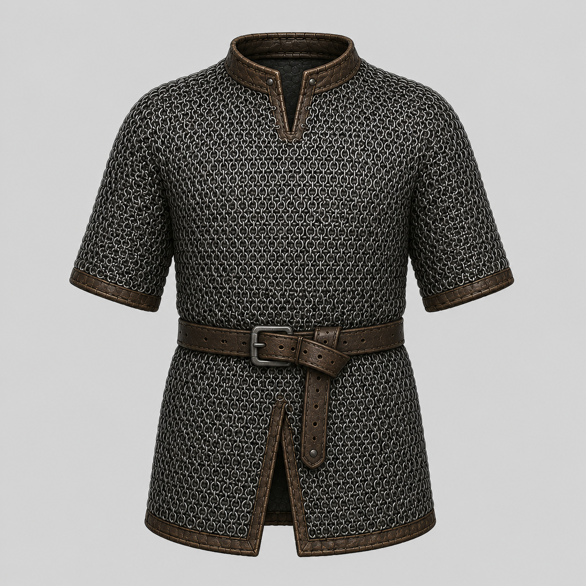
- iron_leggings.glb — Meshy.ai (유료 생성, 2026-08-01, "Knight's Leg Armor"). 완전 소유권·상업 OK (characters.md License 참조). FBX를 Blender로 임포트해 높이 0.7m로 스케일, X축 −90° 회전으로 등을 바닥에 대고 눕힘(0.33×0.70×0.36m), 원점=바닥 중심, 텍스처 512²로 축소, 검은 emissive 제거. 아이콘은 Cycles 직교 측면·위 각도 렌더(서 있는 자세) 512²→128² (2026-08-01)
    - 원화는 ChatGPT 이미지 생성 (ChatGPT Pro 20x, 2026-08-01 커밋) 
- plate_greaves.glb — Meshy.ai (유료 생성, 2026-08-01, "Twin Steel Greaves"). 완전 소유권·상업 OK (characters.md License 참조). FBX를 Blender로 임포트해 높이 0.45m로 스케일 적용(한 쌍 0.37×0.36×0.45m, 발 포함 서 있는 자세), 원점=바닥 중심, 텍스처 512²로 축소, 검은 emissive 제거. 아이콘은 Cycles 직교 측면·위 각도 렌더 512²→128² (2026-08-01)
    - 원화는 ChatGPT 이미지 생성 (ChatGPT Pro 20x, 2026-08-02 커밋) 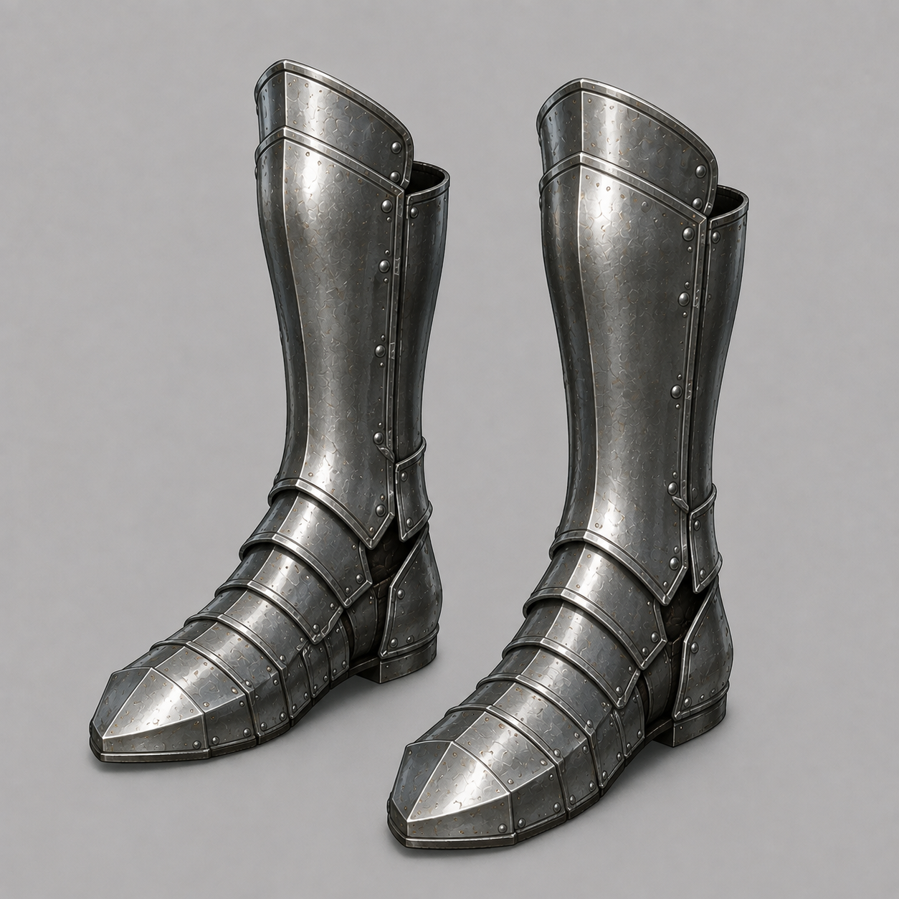
- plate_helmet.glb — Meshy.ai (유료 생성, 2026-08-01, "Iron Sentinel" 클로즈 헬름). 완전 소유권·상업 OK (characters.md License 참조). FBX를 Blender로 임포트해 높이 0.3m로 스케일 적용(0.20×0.29×0.30m), 원점=바닥 중심, 텍스처 512²로 축소, 검은 emissive 제거. 아이콘은 Cycles 직교 측면·위 각도 렌더 512²→128² (2026-08-02)
    - 원화는 ChatGPT 이미지 생성 (ChatGPT Pro 20x, 2026-08-02 커밋) 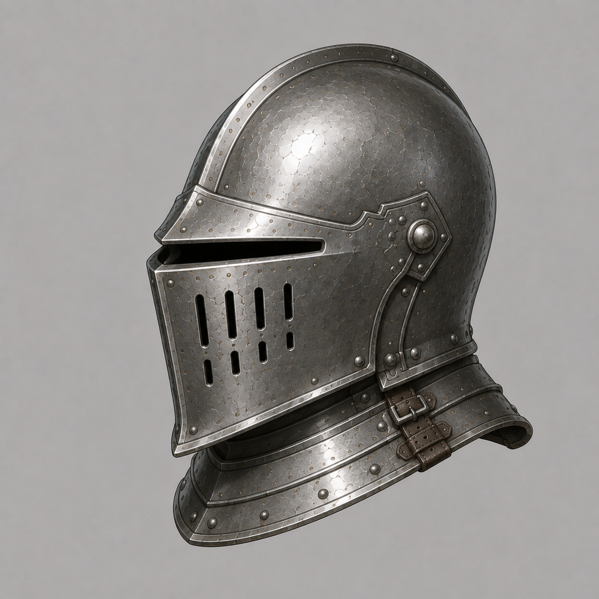
- plate_gauntlets.glb — Meshy.ai (유료 생성, 2026-08-01, "Ironclad Gauntlets"). 완전 소유권·상업 OK (characters.md License 참조). FBX를 Blender로 임포트해 한 쌍 폭 0.35m로 스케일 적용, X축 −70° 회전으로 손등 갑주가 위를 향하게 눕힘(커프 20° 들림, 0.35×0.32×0.15m), 원점=바닥 중심, 텍스처 512²로 축소, 검은 emissive 제거. 아이콘은 Cycles 직교 측면·위 각도 렌더(서 있는 자세) 512²→128² (2026-08-02)
    - 원화는 ChatGPT 이미지 생성 (ChatGPT Pro 20x, 2026-08-02 커밋) 
- cross_shield_ring.glb — Meshy.ai (유료 생성, 2026-08-01, "Medieval Cross Shield" — 실제로는 방패 문양 반지). 완전 소유권·상업 OK (characters.md License 참조). FBX를 Blender로 임포트해 0.3배 스케일 적용(외경 0.3m, 높이 0.14m — 실물 반지는 너무 작아 보이지 않아 확대), 원점=바닥 중심, 텍스처 512²로 축소, 검은 emissive 제거. 아이콘은 Cycles 직교 측면·위 각도 렌더 512²→128² (2026-08-02)
    - 원화는 ChatGPT 이미지 생성 (ChatGPT Pro 20x, 2026-08-02 커밋) 
- gold_ring.glb — Meshy.ai (유료 생성, 2026-08-12, "Sapphire Crusader Bra…" — 다운로드 파일명 기준, 제목 잘림). 완전 소유권·상업 OK (characters.md License 참조). GLB를 Blender로 임포트해 외경 0.15m로 스케일 적용(0.15×0.15×0.05m, cross_shield_ring 실측과 동일 외경), 원점=바닥 중심, 텍스처 512²로 축소, emissive 텍스처 없음 확인. 아이콘은 Cycles 직교 측면·위 각도 렌더 512²→128² (2026-08-12)
    - 원화는 ChatGPT 이미지 생성 (ChatGPT Pro 20x, 2026-08-12) 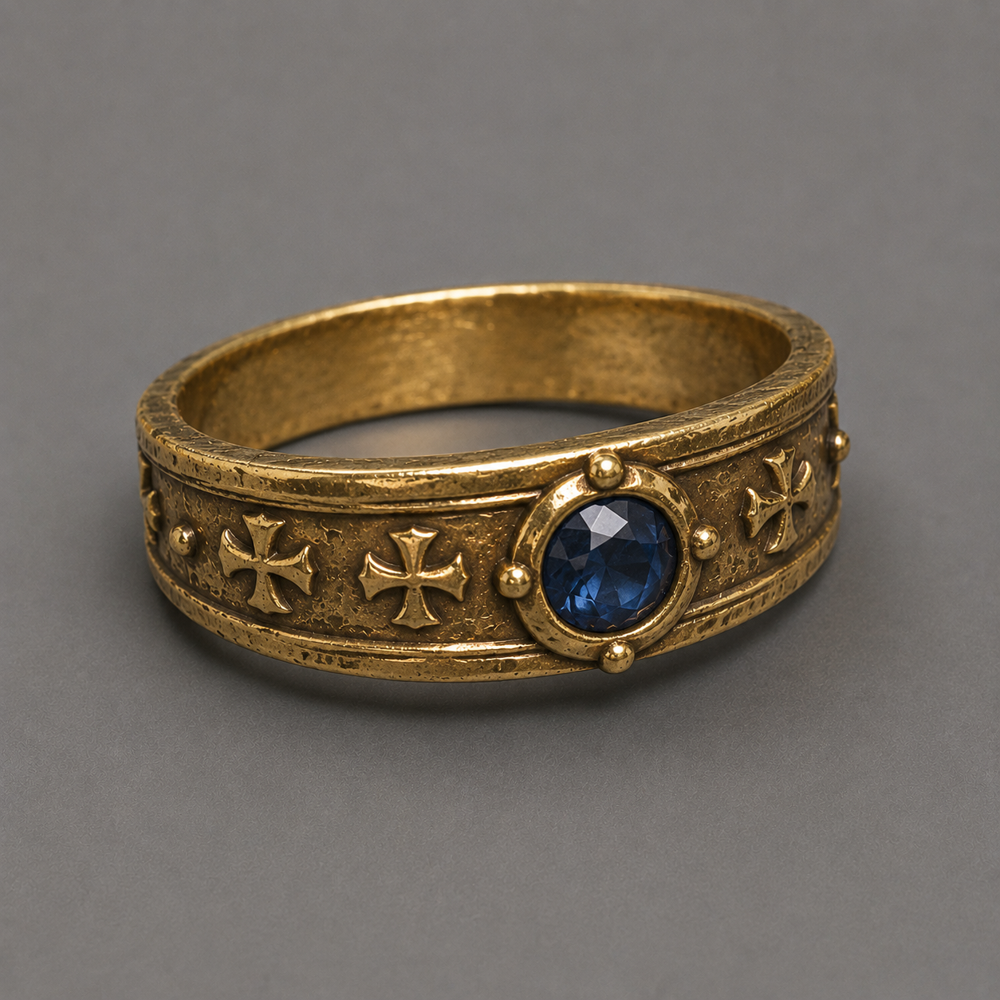
- silver_necklace.glb — Meshy.ai (유료 생성, 2026-08-13, "Harvest Medallion Nec…" — 다운로드 파일명 기준, 제목 잘림). 완전 소유권·상업 OK (characters.md License 참조). GLB를 Blender로 임포트해 최장축 0.35m로 스케일 적용(0.237×0.35×0.104m, gold_ring 0.15m와 ornate_cross_belt 0.40m 사이), 주성분 분석으로 목걸이 평면을 눕히고 펜던트를 -Y로 돌림, 원점=바닥 중심, 텍스처 512²로 축소, emissive 텍스처는 없으나 Emission Color가 화이트로 남아 있어 0으로 (export 후 emissiveFactor 없음 확인). 아이콘은 Cycles 직교 측면·위 각도 렌더 512²→128² (2026-08-13)
    - 원화는 ChatGPT 이미지 생성 (ChatGPT Pro 20x, 2026-08-13) 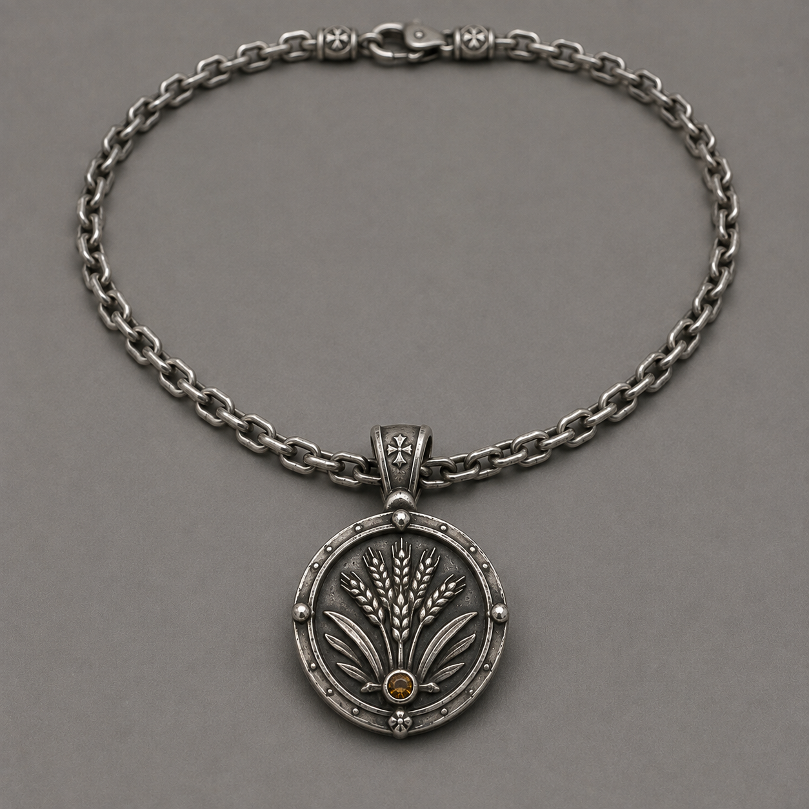
- dagger.glb — Meshy.ai (유료 생성, 2026-08-02, "Crusader's Dagger"). 완전 소유권·상업 OK (characters.md License 참조). FBX를 Blender로 임포트해 0.42배 스케일 적용(전장 0.42m, small_sword 0.54m보다 작게), sword.glb 규약에 맞춰 칼날 +X·칼날 평면 XZ·원점=그립, 텍스처 512²로 축소, 검은 emissive 제거. 아이콘은 Cycles 직교 측면·위 각도 렌더(대각선 구도) 512²→128² (2026-08-02)
    - 원화는 ChatGPT 이미지 생성 (ChatGPT Pro 20x, 2026-08-02 커밋) 
- morningstar.glb — Meshy.ai (유료 생성, 2026-08-16, "Iron Warlord's Mace"). 완전 소유권·상업 OK (characters.md License 참조). OBJ를 Blender로 임포트해 전장 0.95m로 스케일 적용(0.95×0.317×0.351m, goblin_sword 0.80m와 sword 1.20m 사이), sword.glb 손 소켓 규약에 맞춰 자루 +X·가시 머리 +X 끝·원점=그립(자루 중심선, 손잡이 끝에서 전장의 13.6% — sword.glb 비율과 동일), 텍스처 512²로 축소, emissive 텍스처 없음(Emission 0 확인, export 후 emissiveFactor 없음). OBJ에 metallic/roughness 맵이 없어 Principled metallic 0·roughness 0.55로 지정. 아이콘은 Cycles 직교 측면·위 각도 렌더(대각선 구도) 512²→128² (2026-08-16). items.csv 등록(1d8·무게 5·basePrice 6000 — D&D 5e/3.5의 모닝스타가 롱소드와 같은 1d8이면서 더 무겁고 싼 둔기인 데 맞춤). 벅베어(Lv7)가 iron_sword 대신 오른손에 드는 무기이며 10% 확률로 떨군다 — 몬스터 피해는 레벨 기반(2d6)이라 무기 교체는 외형·드롭에만 영향
    - 원화는 ChatGPT 이미지 생성 (ChatGPT Pro 20x, 2026-08-16) 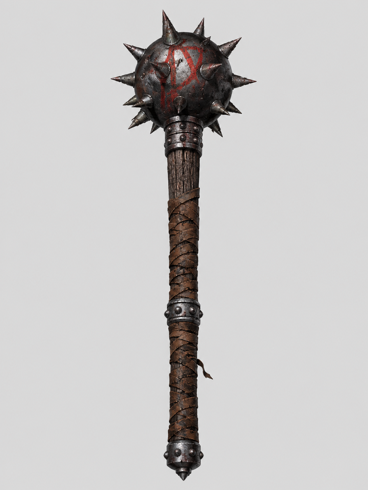
- notched_iron_sword — 신규 애셋 없음. iron_sword의 `weapons/sword.glb`와 `weapons/iron_sword.png`를 그대로 재사용한다(worn_iron_sword와 같은 방식). 홉고블린(Lv5)이 iron_sword 대신 떨구는 무기로 성능은 동일(1d8)하고 basePrice만 10000 → 2500이다 — iron_sword 매각이 NPC 골드 유입의 43%(30일 48.2M)를 차지해 수도꼭지를 좁혔다. 몬스터 피해는 레벨 기반이라 무기 교체는 외형·드롭 가치에만 영향한다 (2026-08-20)

- greatclub.glb — Meshy.ai (유료 생성, 2026-08-16, "Ironthorn Crusher"). 완전 소유권·상업 OK (characters.md License 참조). **GLB로 다시 받아 2026-08-22에 교체** — 처음엔 OBJ 패키지로 받아 `map_Kd`만 있었고 가시·테두리 쇠붙이가 금속으로 반사하지 않았다. GLB에는 base_color·metallic_roughness·normal 3장이 다 들어 있고 emissive는 없다. Blender로 임포트해 전장 1.5m로 스케일 적용(1.50×0.464×0.457m — 오거(2.4m)가 드는 무기라 사람용 sword 1.20m보다 길게, 사람 키 대비 무기 길이 비율을 오거 키에 맞춘 값), sword.glb 손 소켓 규약에 맞춰 자루 +X·가시 머리 +X 끝·원점=그립(자루 중심선, 손잡이 끝에서 전장의 13.6% — 가죽을 감은 그립 구간 안), 텍스처 3장 모두 2048²→512²로 축소(JPEG 유지). 아이콘은 Cycles 직교 측면·위 각도 렌더 512²→128², 긴 무기라 카메라를 시선축으로 -65° 롤시켜 대각선 구도를 만든다(GLB는 소켓 자세 그대로 — 아이콘용 사본만 회전, 20° 간격 + 55~75° 미세 스윕으로 종전 구도에 맞춤), 금속이 반사할 대상이 있어야 해서 회색 월드(0.55/0.57/0.62, strength 1.2) (2026-08-22). items.csv 등록(1d8·무게 10·나무·basePrice 600 — D&D 그레이트클럽은 롱소드와 같은 1d8이면서 통나무라 값이 거의 없다). 오거(Lv8)가 오른손에 드는 무기이며 10% 확률로 떨군다 — 몬스터 피해는 레벨 기반(2d8)이라 무기는 외형·드롭에만 영향
    - 원화는 ChatGPT 이미지 생성 (ChatGPT Pro 20x, 2026-08-16) 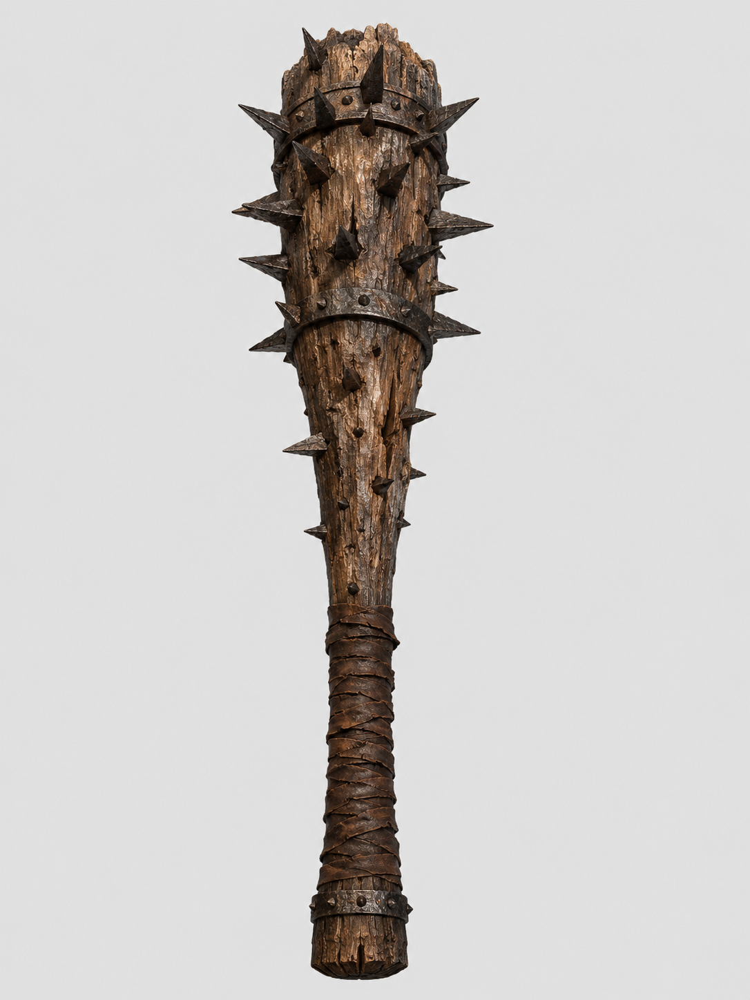
- steel_longsword.glb — Meshy.ai (유료 생성, 2026-08-17, "Silent Oath"). 완전 소유권·상업 OK (characters.md License 참조). OBJ를 Blender로 임포트해 전장 1.30m로 스케일 적용(1.300×0.126×0.045m — 티어 3 무기라 sword 1.20m보다 길게, 오거용 greatclub 1.50m보다는 짧게), sword.glb 손 소켓 규약에 맞춰 칼날 +X·칼날 평면 XZ·원점=그립(손잡이 끝에서 전장의 13.6% — sword.glb 비율과 동일, 크로스가드 바로 아래), 텍스처 2048²→512²로 축소, emissive 텍스처 없음(Emission 0 확인, export 후 emissiveFactor 없음). OBJ에 metallic/roughness 맵이 없어 Principled metallic 0·roughness 0.45로 지정(강철 날). 아이콘은 Cycles 직교 측면·위 각도 렌더(대각선 구도, 칼날이 프레임 대각선에 오도록 카메라 롤 적용 — 가늘고 길어 기본 리그로는 여백이 크다) 512²→128² (2026-08-17). items.csv 등록(1d10·무게 4·metal·basePrice 16,000 — ITEM_TIERS.md의 티어 3 무기). ogre_boss(Ogre Warlord)가 오른손에 드는 무기이며 확정 드랍으로, 임시로 쓰던 greatclub을 대체한다
    - 원화는 ChatGPT 이미지 생성 (ChatGPT Pro 20x, 2026-08-17) 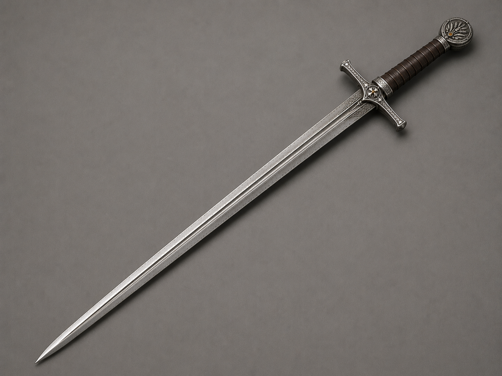
- ornate_cross_belt.glb — Meshy.ai (유료 생성, 2026-08-02, "Ornate Cross Belt"). 완전 소유권·상업 OK (characters.md License 참조). FBX를 Blender로 임포트해 0.4배 스케일 적용(직경 0.4m, 높이 0.15m), 원점=바닥 중심, 텍스처 512²로 축소, 검은 emissive 제거. 아이콘은 Cycles 직교 측면·위 각도 렌더 512²→128² (2026-08-02)
    - 원화는 ChatGPT 이미지 생성 (ChatGPT Pro 20x, 2026-08-02 커밋) 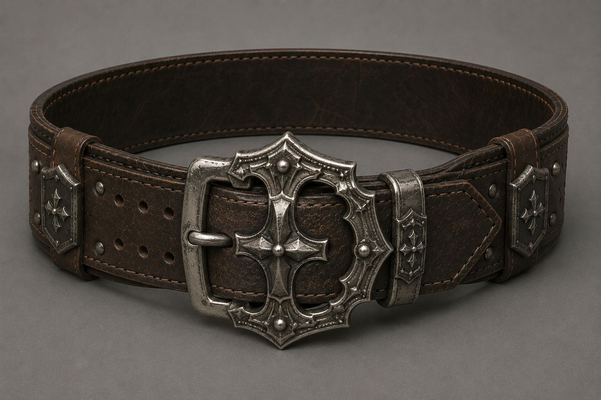
- apple.glb — Meshy AI "Crimson Apple with Leaf" (Pro 요금제, 2026-08-03 생성). 지름 0.15m로 스케일 적용, 원점을 바닥 중앙으로 이동. 텍스처 2048→512 축소, metallic/emissive 맵은 값이 거의 0이라 제거하고 metallicFactor=0. `client/public/items/objects/apple.png` 아이콘은 이 모델을 128x128로 렌더링한 것
    - 원화는 ChatGPT 이미지 생성 (ChatGPT Pro 20x, 2026-08-03) 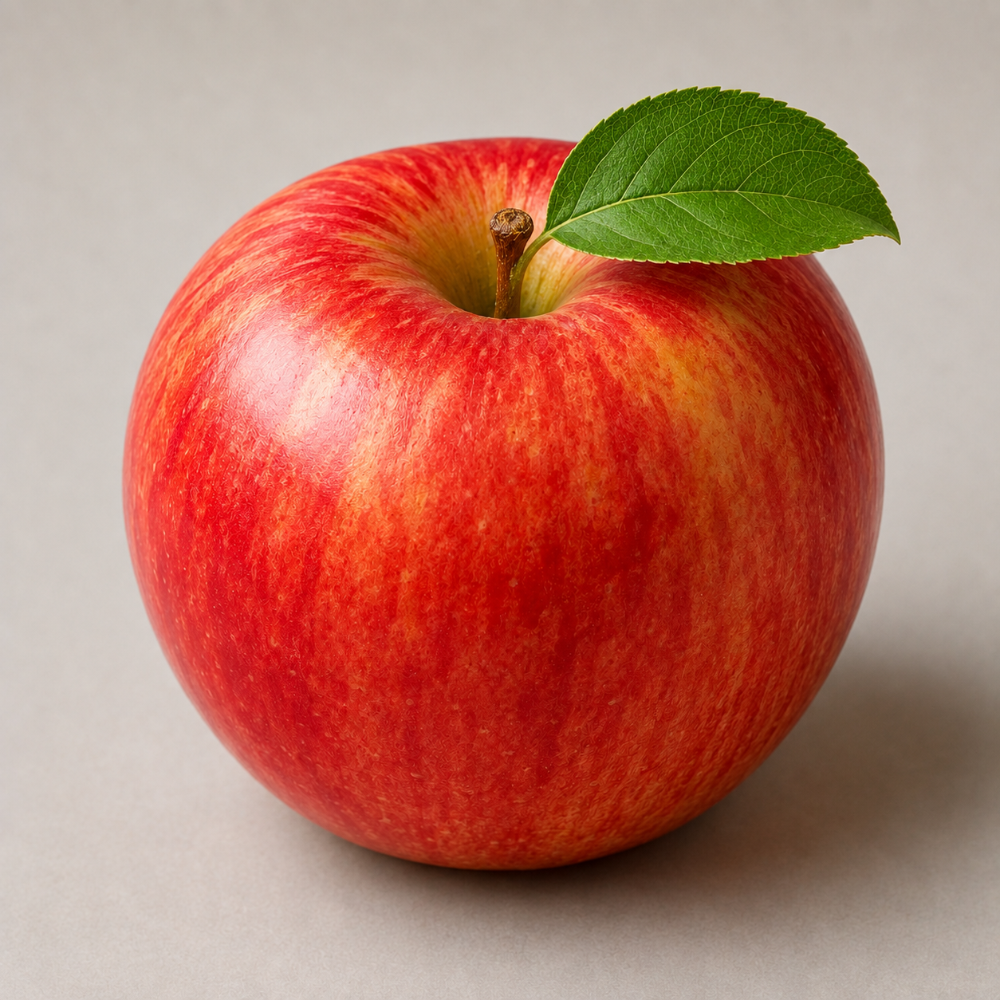
- bread.glb — Meshy.ai (유료 생성, 2026-08-03, "Crusty Loaf of Bread"). 완전 소유권·상업 OK (characters.md License 참조). FBX를 Blender로 임포트해 길이 0.28m로 스케일 적용(0.28×0.14×0.14m, 사과보다 크게), 원점=바닥 중심, 텍스처 512²로 축소, 검은 emissive 제거. 아이콘은 Cycles 직교 측면·위 각도 렌더 512²→128² (2026-08-04)
    - 원화는 ChatGPT 이미지 생성 (ChatGPT Pro 20x, 2026-08-04) 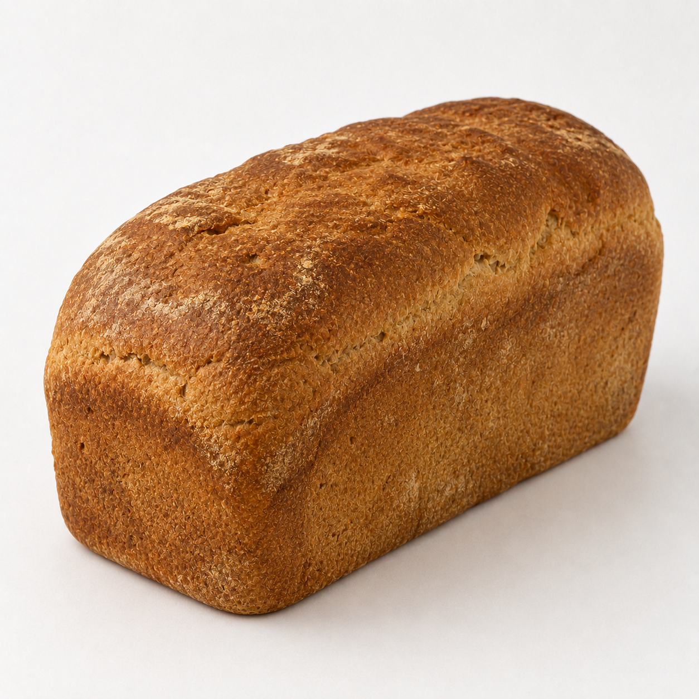
- cheese_wedge.glb — Meshy.ai (유료 생성, 2026-08-03, "Swiss cheese wedge"). 완전 소유권·상업 OK (characters.md License 참조). GLB를 Blender로 임포트해 밑면 0.15m로 스케일 적용(0.15×0.15×0.08m, bread.glb의 절반 길이), 원점=바닥 중심, 텍스처 512²로 축소, 검은 emissive 제거. 아이콘은 Cycles 직교 측면·위 각도 렌더 512²→128² (2026-08-04)
    - 원화는 ChatGPT 이미지 생성 (ChatGPT Pro 20x, 2026-08-04) 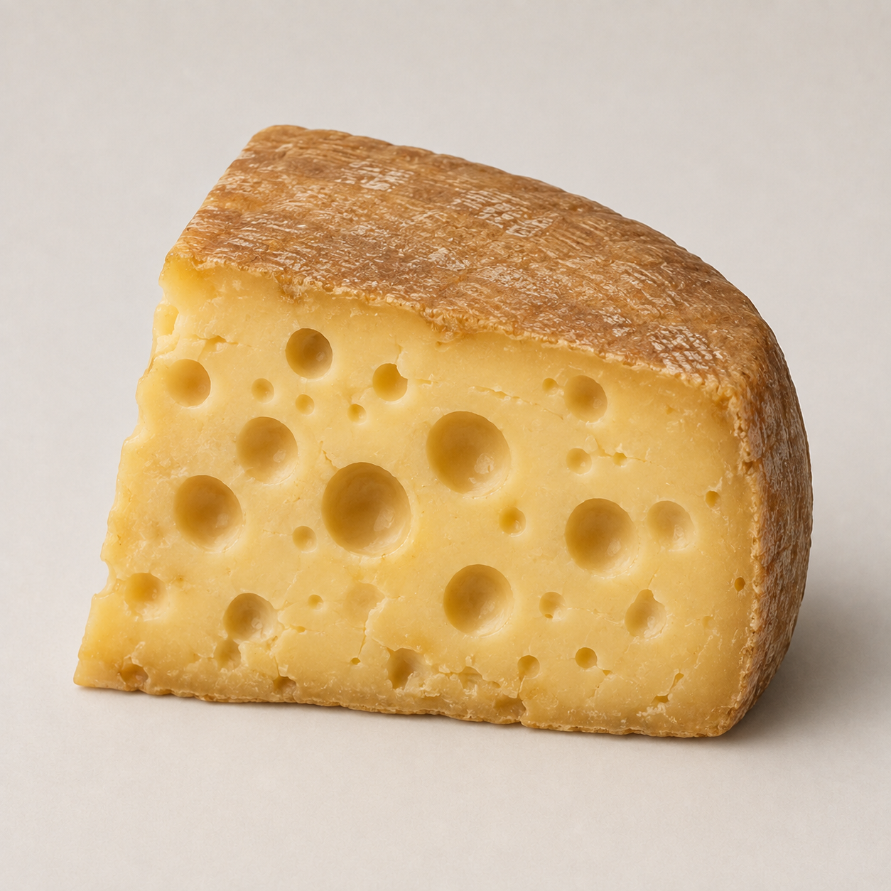
- chicken_rice.glb — Meshy.ai (유료 생성, 2026-09-02, "Sunlit Chicken Rice B", 소스 `assets/Meshy_AI_Sunlit_Chicken_Rice_B_0902151512_texture.glb`). 완전 소유권·상업 OK (characters.md License 참조). GLB를 Blender로 임포트해 접시 지름 0.35m로 스케일 적용(0.35×0.10×0.35m, bread.glb 0.28m보다 크게 — 한 끼 접시), 원점=바닥 중심, 텍스처 2048²→512²로 축소, 검은 emissive 제거. 테이블 상판 높이는 모델이 아니라 서버가 더한다(HUNGER.md "여관 식사"). 아이콘은 Cycles 직교 측면·위 각도 렌더 512²→128² (2026-09-03). items.csv 등록(food·nutrition 700·basePrice 80, 상점 판매 없음 — 여관 메이드의 `serve`로만 테이블에 오른다). chicken_curry·fried_rice·vegetable_rice는 요리별 모델을 따로 만들지 않고 이 GLB와 아이콘을 공용으로 쓴다
    - 원화는 ComfyUI 생성 (체크포인트·생성일 미기록, Meshy 생성 2026-09-02 이전) 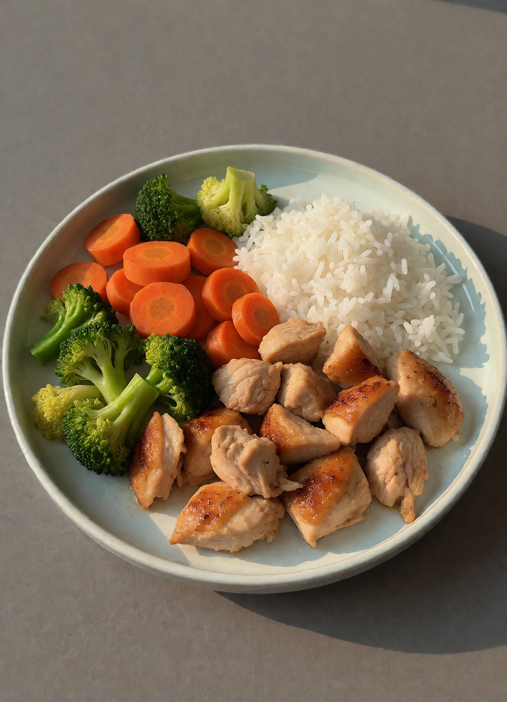
- beer.glb — Meshy.ai (유료 생성, 2026-09-02, "Foamforge Tankard", 소스 `assets/Meshy_AI_Foamforge_Tankard_0902170009_texture.glb`). 완전 소유권·상업 OK (characters.md License 참조). GLB를 Blender로 임포트해 높이 0.24m로 스케일 적용(0.28×0.24×0.21m, greater_healing_potion 0.30m보다 조금 낮게), 원점=바닥 중심, 텍스처 2048²→512²로 축소, 검은 emissive 제거. 아이콘은 Cycles 직교 측면·위 각도 렌더 512²→128² (2026-09-03). items.csv 등록(drink·nutrition 100·basePrice 20, 여관 메이드의 `serve` 전용)
    - 원화는 ChatGPT 이미지 생성 (ChatGPT Pro 20x, 2026-09-03) 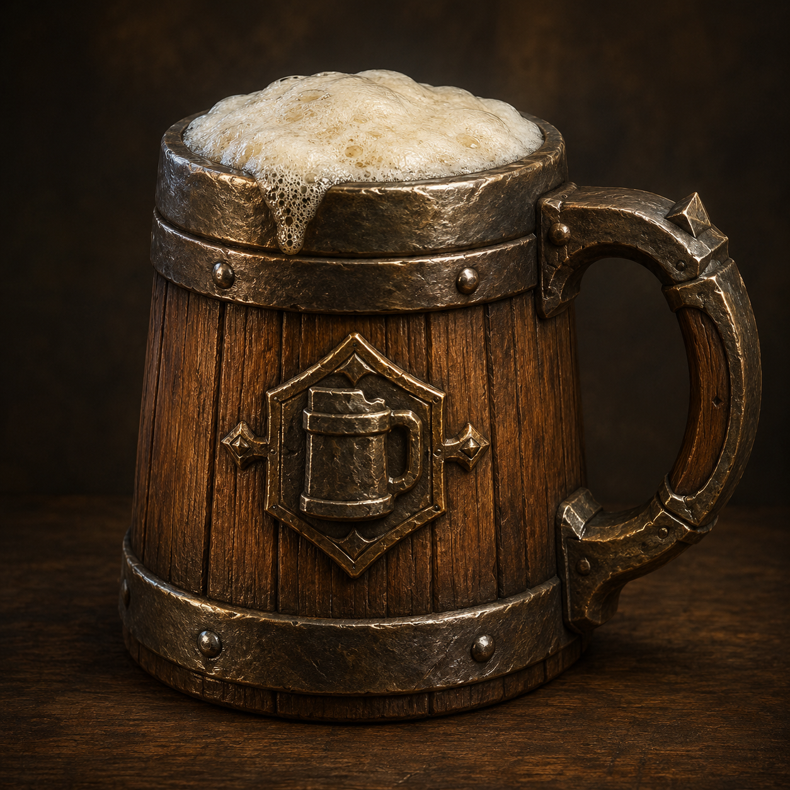
- wine.glb — Meshy.ai (유료 생성, 2026-09-02, "Crimson Chalice", 소스 `assets/Meshy_AI_Crimson_Chalice_0902170706_texture.glb`). 완전 소유권·상업 OK (characters.md License 참조). GLB를 Blender로 임포트해 높이 0.26m로 스케일 적용(0.16×0.26×0.16m), 원점=바닥 중심, 텍스처 2048²→512²로 축소, 검은 emissive 제거. 아이콘은 Cycles 직교 측면·위 각도 렌더 512²→128² (2026-09-03). items.csv 등록(drink·nutrition 120·basePrice 60, 여관 메이드의 `serve` 전용)
    - 원화는 ChatGPT 이미지 생성 (ChatGPT Pro 20x, 2026-09-03) 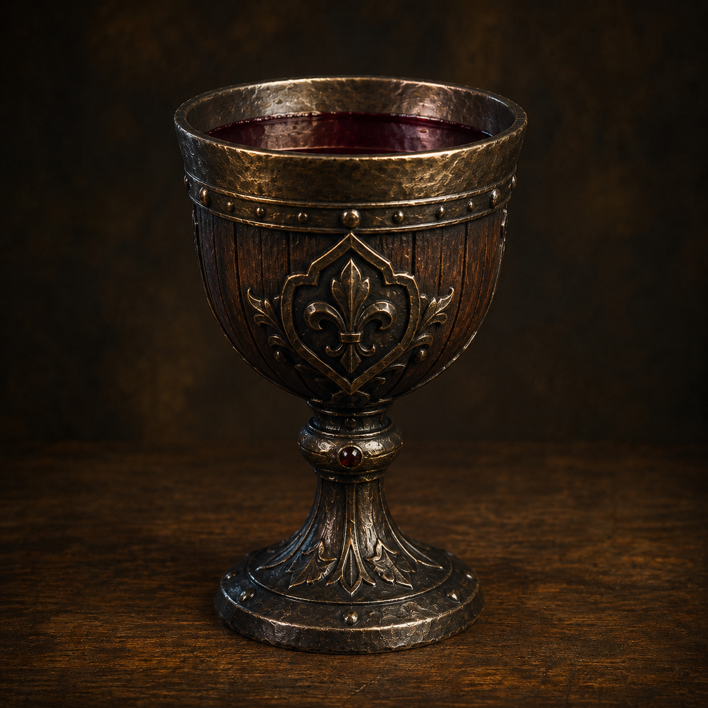
- jerky.glb — Meshy.ai (유료 생성, 2026-08-03, "Beef Jerky Strips"). 완전 소유권·상업 OK (characters.md License 참조). GLB를 Blender로 임포트해 바닥 면적 0.16m로 스케일 적용(0.16×0.16×0.05m, 사과와 같은 급이지만 납작한 무더기), 원점=바닥 중심, 텍스처 512²로 축소, 검은 emissive 제거. 아이콘은 Cycles 직교 측면·위 각도 렌더 512²→128², 2026-08-02 프로시저럴 플레이스홀더를 교체 (2026-08-04)
    - 원화는 ChatGPT 이미지 생성 (ChatGPT Pro 20x, 2026-08-04) 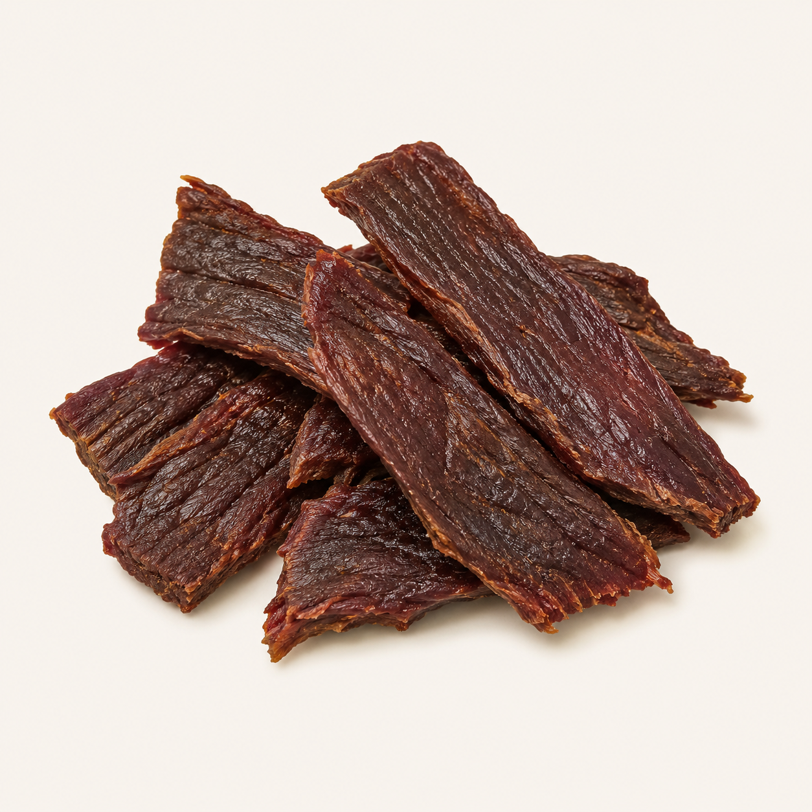
- lembas_wafer.glb (람바스 와퍼) — Meshy.ai (유료 생성, 2026-08-04, "Banana Leaf Wrapped T…" — 파일명에서 잘림). 완전 소유권·상업 OK (characters.md License 참조). GLB를 Blender로 임포트해 긴 축 0.28m로 스케일 적용(0.28×0.07×0.26m, bread.glb와 같은 길이의 납작한 꾸러미 — 잎으로 싸 끈으로 묶은 한 덩이 + 낱개 웨이퍼 한 장 구성), 원점=바닥 중심, 텍스처 512²로 축소, 검은 emissive 제거. 아이콘은 Cycles 직교 측면·위 각도 렌더 512²→128² (2026-08-04). items.csv 등록 + Rica 카탈로그 판매
    - 원화는 ChatGPT 이미지 생성 (ChatGPT Pro 20x, 2026-08-04) 
- mandolin.glb — Meshy.ai (유료 생성, 2026-08-05, "Golden Mandolin"). 완전 소유권·상업 OK (characters.md License 참조). FBX를 Blender로 임포트해 전장 0.95m로 스케일 적용(0.95×0.325×0.10m — Mixamo "Guitar Playing" 클립의 양손 간격 0.365m(리그 1.675m)를 1.91m 캐릭터 기준으로 환산하면 약 0.42m라, 그 간격이 스트럼 지점~넥 중단에 맞도록 잡은 길이). sword.glb 손 소켓 규약에 맞춰 넥 +X·사운드보드 법선 +Z, **원점=오른손 스트럼 지점**(사운드홀과 브리지 사이, 사운드보드 표면) — RightHand에 붙었을 때 넥이 왼손 쪽으로 뻗는다. 텍스처 512²로 축소, 검은 emissive 제거. 아이콘은 Cycles 직교 측면·위 각도 렌더 512²→128² (2026-08-06). items.csv 등록(`instrument` 카테고리, main_hand). `/play_music` 이모트가 오른손에 붙이는 프롭이며, 손 기준 회전·위치는 `tools/fit-hand-prop.mjs --tilt 15 --push 0.06 --lift 0.04`가 guitar_playing 클립에 맞춰 산출(둘 다 왼손 그립을 축으로 회전해 넥은 왼손에 유지 — 15°는 소리통을 가슴에서 허리로 내리고, push는 클립상 소리통에 파묻히는 오른손목이 앞으로 나오도록 소리통을 몸에 살짝 묻음). 양손 모두 손목 본이 아니라 주먹이 쥐어지는 지점 기준(오른손은 손바닥 오프셋, 왼손은 검지·엄지 본 중점)
    - 원화는 ChatGPT 이미지 생성 (ChatGPT Pro 20x, 2026-08-06) 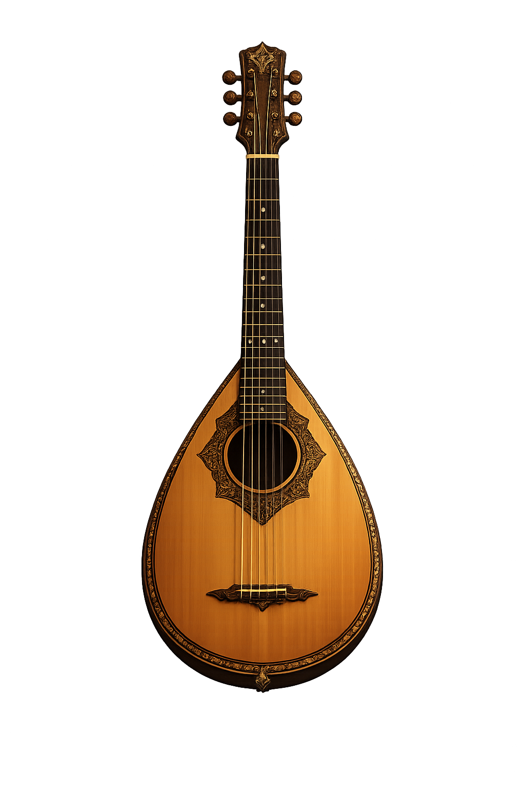
    - `worn_mandolin`(바드 시작 장비, basePrice 없음)은 같은 mandolin.glb·mandolin.png을 재사용 (2026-08-07)
- fishing_rod.glb — Meshy.ai (유료 생성, 2026-07-26, image-to-3D from the archived concept render). 완전 소유권·상업 OK (characters.md License 참조). Textures downscaled to 512², transform matched to spear.glb's hand-socket convention, `rod_tip` empty baked at the tip (script, 2026-07-28)
    - 원화는 아래 낚시 아이콘 세트와 같은 출처 (2026-07-25, contributor-owned account, tier 불명) 
- Fishing icons (10): fishing_rod.png, raw_minnow.png, raw_perch.png, raw_trout.png, river_salmon.png, golden_sturgeon.png, old_boot.png, clump_of_kelp.png, message_in_a_bottle.png, sunken_coin_pouch.png — ChatGPT image generation (2026-07-25, contributor adamxgsb-hub 개인 계정, PR #53 / 커밋 5fdaf514). tier는 PR 본문·커밋·리뷰 어디에도 기록이 없어 확인 불가 — 기여자가 CLA.md에 서명해 권리는 확보됨. concept renders cut to 128×128 transparent icons
    - 원화: [rod](../images/items/fishing_rod.png) · [minnow](../images/items/raw_minnow.png) · [perch](../images/items/raw_perch.png) · [trout](../images/items/raw_trout.png) · [salmon](../images/items/river_salmon.png) · [sturgeon](../images/items/golden_sturgeon.png) · [boot](../images/items/old_boot.png) · [kelp](../images/items/clump_of_kelp.png) · [bottle](../images/items/message_in_a_bottle.png) · [pouch](../images/items/sunken_coin_pouch.png)
- land_deed.glb / land_deed.png — Meshy.ai Image to 3D (2026-09-05, "Blackridge Estate Dee…" — 다운로드 파일명 기준). 원본은 `assets/land_deed/Meshy_AI_Blackridge_Estate_Dee_0905071232_texture.glb`, 작업 파일은 `assets/land_deed/land_deed.blend`. [export_item_asset.py](../../tools/blender-scripts/export_item_asset.py)를 Blender 5.2.0 LTS에서 실행해 문양이 위를 향하도록 눕히고 긴 변을 기존 scroll.glb와 같은 0.50m로 스케일 적용했다. 최종 W×H×D는 0.325×0.104×0.500m, 원점=바닥 중심, 회전 0·스케일 1, 텍스처 3장(baseColor·metallicRoughness·normal) 512² WebP q90, emissive 0, GLB 약 177KB. 아이콘은 Cycles 직교 사선 렌더 512²→128², 투명 배경(2026-09-05); 512² 렌더는 `assets/land_deed/land_deed-render.png`. Land Deed의 공용 두루마리 표현을 교체하며 기존 scroll.glb·scroll_of_return.png는 다른 주문서에서 계속 사용한다. 라이선스: Meshy 생성물 약관 적용, 이번 생성의 요금제·권리 조건은 미확인.
    - 원화는 사용자가 제공한 ChatGPT 생성 이미지(2026-09-05, 요금제 미확인, ChatGPT 생성물 약관 적용). `assets/ChatGPT Image 2026년 9월 5일 오후 03_10_38.png`를 원본 해상도 그대로 이동했다. 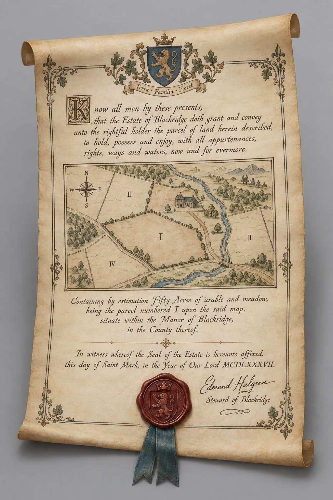
- scroll_of_party_summon.png — scroll_of_return.png의 hue-rotation 파생 (스크립트, 2026-07-31): 붉은 봉인·장식 → 보라. 3D는 기존 scroll.glb 재사용
- scroll_of_enchant_armor.png — scroll_of_enchant_weapon.png의 hue-rotation 파생 (스크립트, 2026-08-15): 파란 봉인 → 초록. 3D는 같은 색 변환을 적용한 scroll_enchant_armor.glb (doc/assets/props.md의 scroll 항목 참조)
- Hunger icons — 자체 제작 프로시저럴 플레이스홀더 (PIL 스크립트, 2026-08-02, 512² 드로잉→128² 다운스케일, 라이선스 문제 없음). 처음 9개를 만들었고, 남은 플레이스홀더는 grilled_minnow.png, grilled_perch.png, grilled_trout.png, grilled_salmon.png, grilled_sturgeon.png 5개다. 기존 ChatGPT 아이콘 스타일과 다르므로 추후 AI 아이콘으로 교체 예정
    - 교체 완료: apple.png(2026-08-03), bread.png·jerky.png(2026-08-04) — 각 모델의 Cycles 렌더. cheese.png는 cheese_wedge.png로 대체되고 삭제됨
- campfire_kit.glb — Meshy.ai (유료 생성, 2026-08-03, "Firewood Bundle"). 완전 소유권·상업 OK (characters.md License 참조). FBX를 Blender로 임포트해 0.45배 스케일 적용(장작 길이 0.45m, 0.45×0.45×0.30m 눕힌 자세), 원점=바닥 중심, 텍스처 512²로 축소, 검은 emissive 제거. 아이콘 campfire_kit.png는 Cycles 직교 측면·위 각도 렌더 512²→128², 2026-08-02 프로시저럴 플레이스홀더를 교체 (2026-08-03)
    - 원화는 ChatGPT 이미지 생성 (ChatGPT Pro 20x, 2026-08-03) 
- tip_hat.glb — Meshy.ai (유료 생성, 2026-08-13, "Feathered Coin Pouch"). 완전 소유권·상업 OK (characters.md License 참조). GLB를 Blender로 임포트해 폭 0.45m로 스케일 적용(0.45×0.20×0.45m, campfire_kit과 같은 폭), 원점=바닥 중심, 텍스처 2048²→512² 축소, emissive 없음 확인. 아이콘 tip_hat.png는 Cycles 직교 측면·위 각도 렌더 512²→128² (2026-08-13). 바닥에 놓는 팁 모자(`tip_hat` 아이템, doc/ECONOMY.md)
    - 원화는 ChatGPT 이미지 생성 (ChatGPT Pro 20x, 2026-08-13) 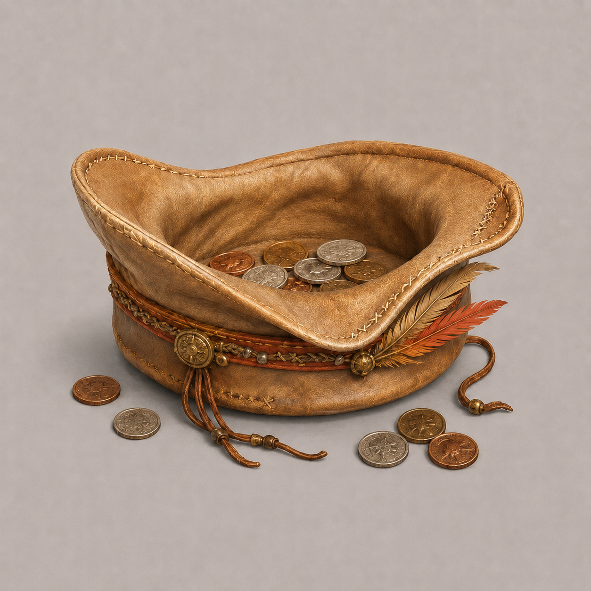
- phoenix_talisman.glb (불사조의 부적 — 죽은 자리에서 부활하는 소모품용) — Meshy.ai (유료 생성, 2026-08-19, "Sunfire Phoenix Table…" — 다운로드 파일명 기준, 제목 잘림). 완전 소유권·상업 OK (characters.md License 참조). OBJ를 Blender로 임포트해 높이 0.30m로 스케일 적용(0.129×0.30×0.029m, health_potion 0.30m와 같은 높이), X축 +90° 회전으로 석판을 세우고 문양 면을 -Y로(Meshy 산출물은 눕힌 자세), 원점=바닥 중심, 텍스처 2048²→512²로 축소, emissive 텍스처 없음(MTL `Ke 0`, Emission 0 확인, export 후 emissiveFactor 없음). OBJ에 metallic/roughness 맵이 없어 Principled metallic 0·roughness 0.5 기본값. 아이콘은 Cycles 직교 측면·위 각도 렌더 512²→128² — 가늘고 긴 석판이라 렌더용으로만 25° 뒤로 눕히고 30° 롤을 줘 대각선 구도로 문양이 보이게 함, GLB는 세운 자세 그대로 (2026-08-20). items.csv 등록(소모품·무게 0.3·basePrice 5000 — 던전을 다시 와야 하는 수고를 아끼는 값이라 티어 2 무기의 절반·회복 물약 8개 값, 사망 대화상자에서 사용하면 제자리 부활 — doc/COMBAT.md). Rica 카탈로그 판매 + 월드 드랍 0.2%
    - 원화는 ChatGPT 이미지 생성 (ChatGPT Pro 20x, 2026-08-20) 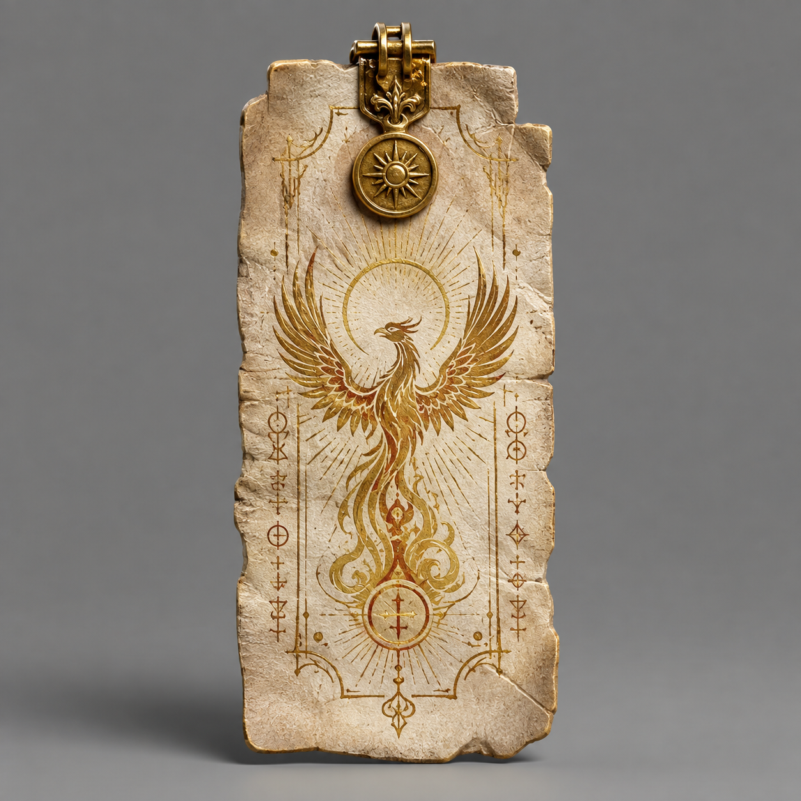
- celestial_timekeeper.glb (천체 시계 — 소지하면 해·달 위젯 옆에 시각·날짜 표시) — Meshy.ai (유료 생성, 2026-08-27, "Celestial Timekeeper"). 완전 소유권·상업 OK (characters.md License 참조). GLB를 Blender로 임포트해 높이 0.30m로 스케일 적용(0.269×0.30×0.079m, phoenix_talisman·health_potion과 같은 높이), 원점=바닥 중심, 텍스처 2048²→512²로 축소, emissive 제거. 아이콘은 Cycles 직교 측면·위 각도 렌더 512²→128² (2026-08-27). items.csv 등록(category timekeeper·무게 0.5·basePrice 8000, Rica 카탈로그 판매)
    - 원화는 ChatGPT 이미지 생성 (ChatGPT Pro 20x, 2026-08-27) 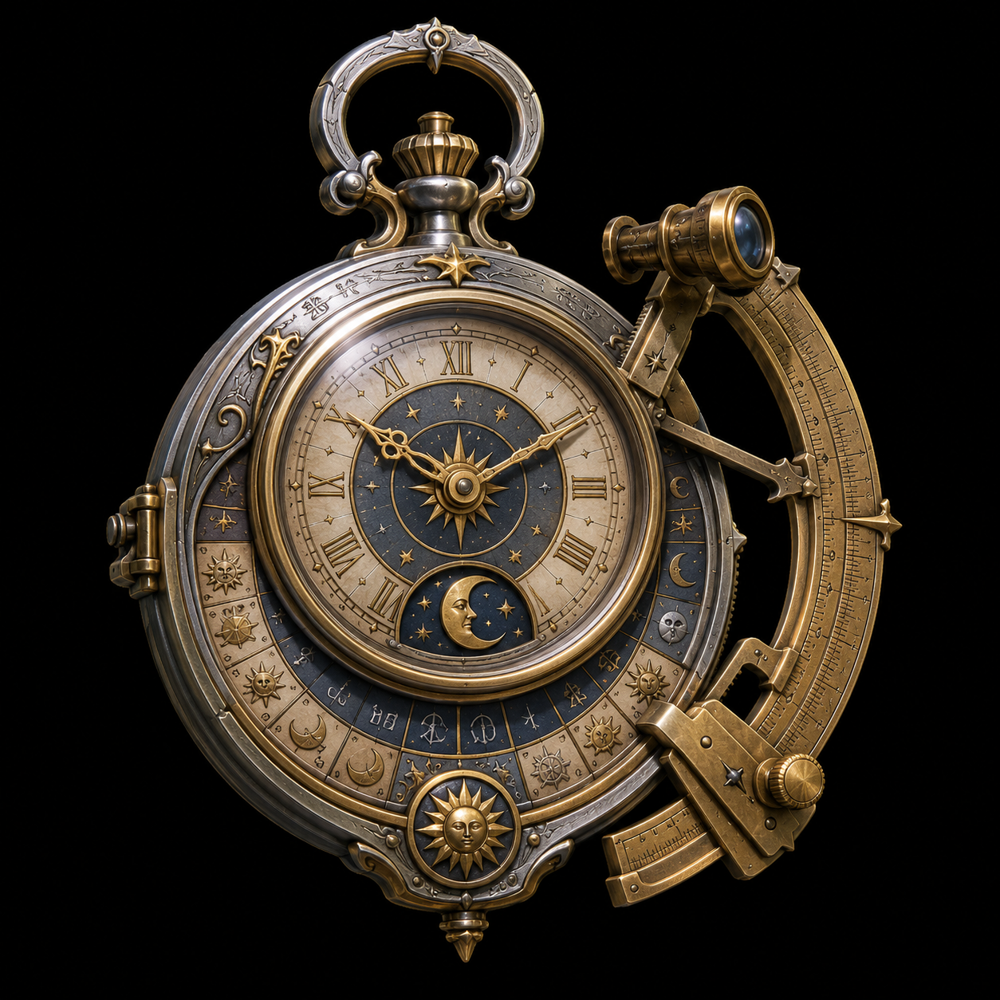
- whetstone_oil.glb / whetstone_oil.png — Meshy.ai (유료 생성, 2026-08-20, "Knight's Elixir" — 다운로드 파일명 기준). 완전 소유권·상업 OK (characters.md License 참조). **GLB로 다시 받아 2026-08-22에 교체** — 처음엔 OBJ 패키지로 받아 `map_Kd`만 있었고 은장식·유리가 금속으로 반사하지 않았다. GLB에는 base_color·metallic_roughness·normal 3장이 다 들어 있고 emissive는 없다. Blender로 임포트해 높이 0.28m로 스케일 적용(0.154×0.280×0.159m, cape_dye 병 0.265m와 healing_potion 0.30m 사이), 소스가 자체 Y축으로 누워 있어 세운 자세로 회전 적용하고 Z축 40°를 먹여 검·방패 문양이 아이콘 카메라를 보게 함(45° 간격 전방위 + 35~50° 미세 스윕으로 결정), 원점=바닥 중심, 텍스처 3장 모두 2048²→512²로 축소(JPEG 유지). 아이콘은 Cycles 직교 측면·위 각도 렌더 512²→128², 금속이 반사할 대상이 있어야 해서 회색 월드(0.55/0.57/0.62, strength 1.2) — `film_transparent`라 배경은 투명 (2026-08-22). items.csv 등록(reagent·무게 0.2·basePrice 10000 — 인챈트 주문서를 읽을 때마다 1병 소모, doc/ENCHANT.md). Rica 카탈로그 판매
    - 원화는 ChatGPT 이미지 생성 (ChatGPT Pro 20x, 2026-08-20) 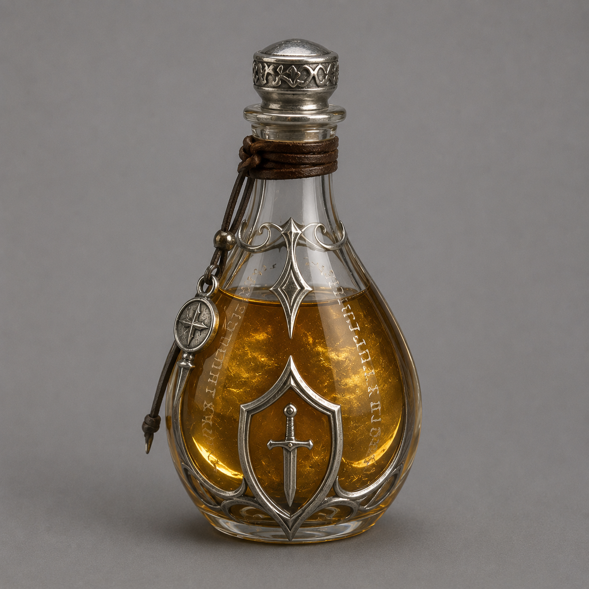
- healing_potion.glb / healing_potion.png (회복 물약) — Meshy.ai (유료 생성, 2026-08-22, "Crimson Elixir Bottle" — 다운로드 파일명 기준). 완전 소유권·상업 OK (characters.md License 참조). **GLB로 받았다** — OBJ 패키지는 포맷상 `map_Kd`만 담아 나오므로 metallic/roughness·normal 맵이 빠진다(금테가 금속으로 안 보인다). GLB에는 base_color·metallic_roughness·normal 3장이 다 들어 있고 emissive는 없다. Blender로 임포트해 높이 0.30m로 스케일 적용(0.081×0.300×0.072m, greater_healing_potion과 같은 높이), 소스가 X축 -90°로 누워 있어 세운 자세로 회전 적용, 원점=바닥 중심, 텍스처 3장 모두 2048²→512²로 축소(JPEG 유지). 아이콘은 Cycles 직교 측면·위 각도 렌더 512²→128², 금속 재질이 반사할 대상이 있어야 해서 회색 월드(0.55/0.57/0.62, strength 1.2)를 깔았다 — `film_transparent`라 배경은 그대로 투명하다 (2026-08-22). 유래 기록이 없던 Sketchfab 출처 구 애셋(`health_potion.glb` / `healing_potion.png`)을 상급 물약과 한 쌍으로 대체했다 — 구 애셋은 트리에서 제거. 2026-08-24 바닥에서 너무 작아 클릭이 어려워 루트 노드 scale 1.5(높이 0.45m)로 키움 — GLB JSON의 node scale만 바꿨고 메시·텍스처는 그대로
    - 원화는 ChatGPT 이미지 생성 (ChatGPT Pro 20x, 2026-08-22) 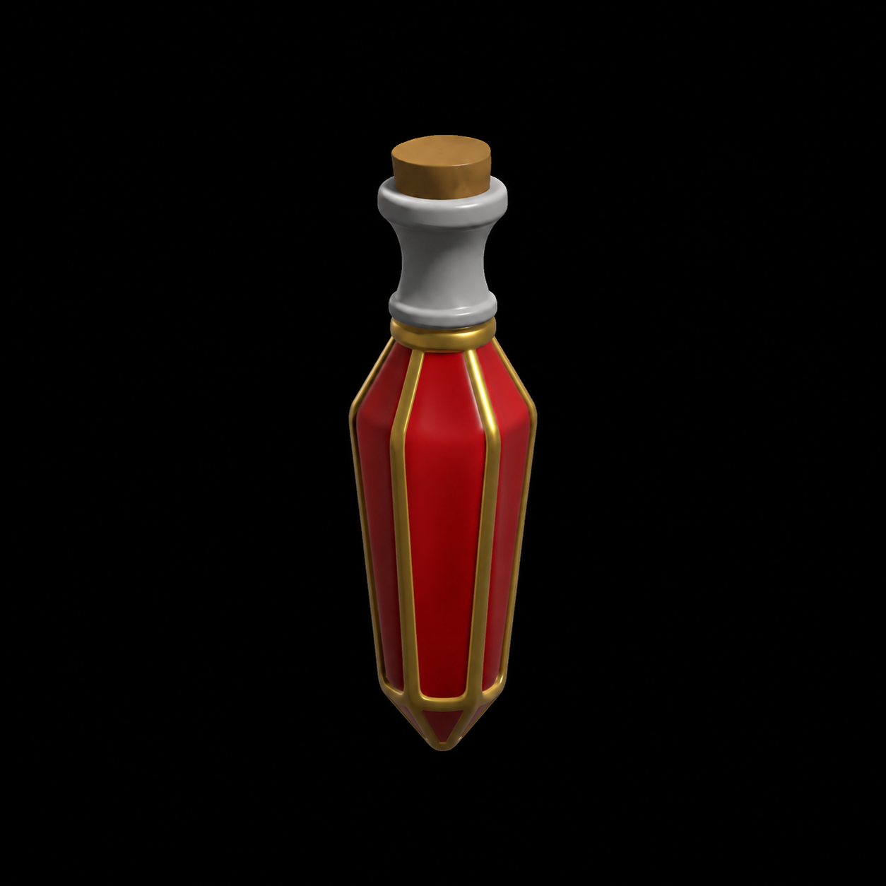
- greater_healing_potion.glb / greater_healing_potion.png (상급 회복 물약) — Meshy.ai (유료 생성, 2026-08-22, "Regal Crimson Flask" — 다운로드 파일명 기준). 완전 소유권·상업 OK (characters.md License 참조). **GLB로 받았다** — OBJ 패키지는 포맷상 `map_Kd`만 담아 나오므로 metallic/roughness·normal 맵이 빠진다(금테가 금속으로 안 보인다). GLB에는 base_color·metallic_roughness·normal 3장이 다 들어 있고 emissive는 없다. Blender로 임포트해 높이 0.30m로 스케일 적용(0.226×0.300×0.218m, healing_potion과 같은 높이 — 폭이 3배라 통이 커 보이는 것으로 등급 차를 낸다), 소스가 X축 -90°로 누워 있어 세운 자세로 회전 적용, 원점=바닥 중심, 텍스처 3장 모두 2048²→512²로 축소(JPEG 유지). 아이콘은 Cycles 직교 측면·위 각도 렌더 512²→128², 금속 재질이 반사할 대상이 있어야 해서 회색 월드(0.55/0.57/0.62, strength 1.2)를 깔았다 — `film_transparent`라 배경은 그대로 투명하다 (2026-08-22). 같은 날 healing_potion과 한 쌍으로 새로 만들어, 유래 기록이 없던 Sketchfab 출처 구 애셋(`health_potion.glb`)을 대체했다 — 지형에 이미 놓인 프롭이 참조하는 catalog id `health_potion`은 그대로 두고 모델 경로만 이 파일로 옮겼다. items.csv 등록(회복 12d4·무게 1.25·basePrice 1500 — 일반 물약의 회복량 2배, 가격·무게 2.5배). Rica 카탈로그 판매
    - 원화는 ChatGPT 이미지 생성 (ChatGPT Pro 20x, 2026-08-22) 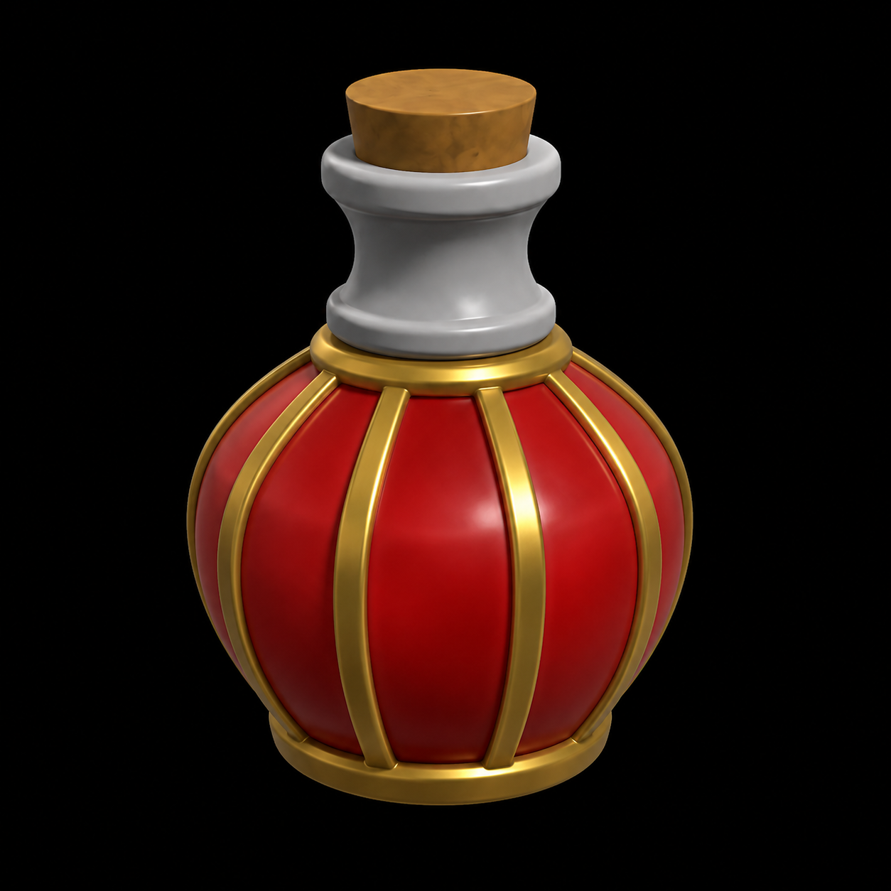
- wool_cape.png — 자체 제작. 입은 망토는 런타임에 만드는 버텍스 시트(client/src/lib/effects/cape-rig.ts)라, 아이콘용 메시를 Blender 스크립트로 따로 모델링했다: 같은 테이퍼 시트에 주름·말린 칼라·놋쇠 클래스프. Cycles 직교 측면·위 각도 렌더 512²→128² (`tools/blender-scripts/render_cape_icon.py wool_cape`, 2026-08-17). 천 색은 items.csv `capeColor`에서 읽으므로 새 망토도 같은 스크립트로 렌더한다. 외부 애셋 없음 — 라이선스 문제 없음
- cape_dye.glb / cape_dye.png — 자체 제작(절차적). [tools/blender-scripts/render_dye_icon.py](../../tools/blender-scripts/render_dye_icon.py)가 프로파일을 회전시켜 병을 만들고 GLB(0.16×0.27×0.16m, 원점=바닥 중심)와 아이콘 Cycles 렌더 512²→128²를 함께 쓴다. 외부 애셋 없음 (2026-08-18)
- cape_transfer_kit.glb / cape_transfer_kit.png — 자체 제작(절차적). [tools/blender-scripts/render_transfer_kit_icon.py](../../tools/blender-scripts/render_transfer_kit_icon.py)가 프리미티브(말린 밀랍 시트 + 끈 2줄 + 고착제 단지)로 만들고 GLB(0.24×0.09×0.07m, 눕힌 자세)와 아이콘 Cycles 렌더 512²→128²를 함께 쓴다. 외부 애셋 없음 (2026-08-18)
- wool_cape.glb — Meshy.ai (유료 생성, 2026-08-17, "Crimson Cloak with Go…" — 다운로드 파일명 기준, 제목 잘림). 완전 소유권·상업 OK (characters.md License 참조). OBJ를 Blender로 임포트해 칼라~밑단 0.60m로 스케일 적용(chain_mail의 긴 변과 같은 길이), X축 −90° 회전으로 눕힌 자세(겉면·클래스프가 위, 바닥 면적 0.414×0.600m·높이 0.215m — 세워 두면 다른 지면 아이템 사이에서 우뚝 선다), 원점=바닥 중심에서 0.1m 위(속이 빈 껍데기라 주름 골만 바닥에 닿아 — 버텍스의 0.9%만 아래 2cm 안에 있다 — 규약대로 바닥에 맞추면 클라이언트의 지면 아이템 리프트 0.05m와 겹쳐 떠 보인다. 파묻히는 0.1m는 어차피 안 보이는 안쪽 면), 텍스처 2048²→512²로 축소, emissive 없음 확인(MTL `Ke 0`, export 후 emissiveFactor 없음). OBJ에 metallic/roughness 맵이 없어 Principled metallic 0·roughness 0.85로 지정(모직). **바닥에 떨어진 망토 전용** — 입은 망토는 여전히 프로시저럴 시트이고 아이콘도 위 스크립트 렌더라, 이 GLB는 지면 아이템 렌더에만 쓰인다. 텍스처에 크림슨이 구워져 있어 `capeColor`가 다른 새 망토는 이 GLB를 재사용할 수 없다 (2026-08-18)
    - 원화는 ChatGPT 이미지 생성 (ChatGPT Pro 20x, 2026-08-17) 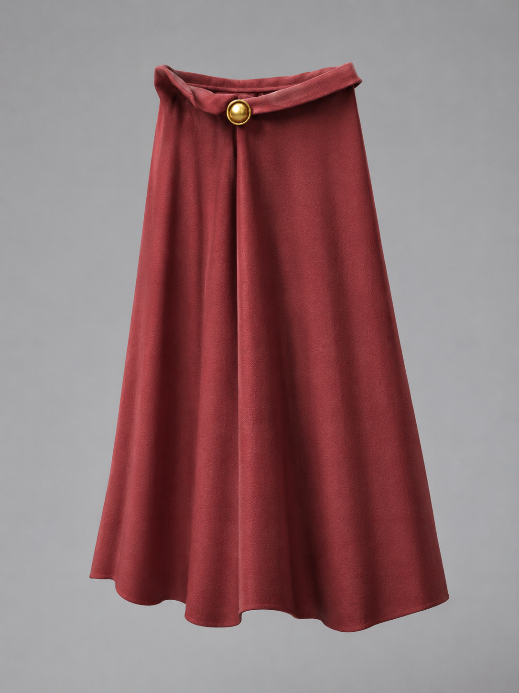
- Dungeon floor-key icons (6): crypt_key_5.png, orc_key_5.png, orc_key_10.png, ogre_key_5.png, ogre_key_10.png, ogre_key_15.png — 자체 제작(절차적). [tools/blender-scripts/render_key_icons.py](../../tools/blender-scripts/render_key_icons.py)가 프리미티브(토러스 손잡이 + 원기둥 축 + 5층당 이빨 1개: 5F 1개·10F 2개·15F 3개)로 열쇠를 만들고 던전별 금속색(크립트 무쇠·오크 청동·오거 흑철)으로 Cycles 렌더 512²→128² (2026-08-29). 외부 애셋 없음. doc/DUNGEON_REWARD.md의 잠긴 문·상자 열쇠. 바닥 드랍 모델은 아래 두 GLB를 나눠 쓴다
- dungeon_key_gold.glb / dungeon_key_silver.glb — Meshy.ai (유료 생성, 2026-08-29, "Golden Key" / "Skeleton Key"). 완전 소유권·상업 OK (characters.md License 참조). GLB를 Blender로 임포트해 눕힌 자세(긴 축 +X)로 회전, 전장 0.35m로 스케일 적용(gold 0.35×0.064×0.325m, silver 0.35×0.061×0.279m — dagger 0.42m보다 조금 짧게), 원점=바닥 중심, 텍스처 3장(base_color·metallic_roughness·normal) 2048²→512² 축소, emissive 제거. 원본은 assets/Meshy_AI_Golden_Key_0829144943_texture.glb·assets/Meshy_AI_Skeleton_Key_0829144810_texture.glb. gold는 상자를 여는 마지막 잠긴 층 열쇠(crypt_key_5·orc_key_10·ogre_key_15), silver는 그 앞 구간 열쇠(orc_key_5·ogre_key_5·ogre_key_10)에 매핑. 아이콘은 위 절차 생성 6장을 그대로 쓴다(인벤토리에서 층을 구분해야 하므로 모델 렌더로 바꾸지 않음); Meshy 입력 원화도 그 아이콘이다
- bow.glb — Meshy.ai (유료 생성, 2026-09-03, "Recurve Bow"). 완전 소유권·상업 OK (characters.md License 참조). FBX를 Blender로 임포트해 긴 축(Z)을 +X로 돌리고 전장 1.4m로 스케일 적용(1.40×0.27×0.045m — sword 1.20m와 greatclub 1.50m 사이), 원점=활 중앙 그립(다른 무기의 13.6% 규약과 달리 활은 한가운데를 쥔다), 텍스처 4장 2048²→512² 축소, emissive 제거. 아이콘은 Cycles 직교 렌더에 카메라 롤 −65°로 대각 구도, 512²→128² (2026-09-04). 원본은 `assets/Meshy_AI_Recurve_Bow_0903165428_texture_fbx/`. 손에 쥐는 자세(`poseMainHandProp`)는 아직 기본 그립이다 — `combat_ranged.glb`가 들어오면 `tools/fit-hand-prop.mjs`로 맞춘다. 원화 없음
- iron_arrow.glb / steel_arrow.glb — Meshy.ai (유료 생성, 2026-09-04, 두 번 모두 프롬프트명 "Rustic Spear on Stone" — 실제 산출물은 화살이다). 완전 소유권·상업 OK (characters.md License 참조). 활이 소비하는 탄약이자 날아가는 화살 ([COMBAT.md](../COMBAT.md) 원거리 전투). 두 생성물은 **형상이 같고 텍스처만 다르다** — iron은 어두운 갈색(평균 RGB 94,83,75), steel은 밝은 황동색(164,129,94). FBX를 Blender로 임포트해 비스듬히 누워 있던 축을 정점 주축으로 찾아 +X로 회전(화살촉이 +X, 다른 무기와 같은 방향), 전장 0.8m로 스케일 적용(0.80×0.07×0.06 W×H×D — 원본 1.22m는 활 1.4m 대비 너무 길어 2m 근거리 사격에서 사람과 몬스터 사이를 다리처럼 이었다), 원점=자루 중앙(비행 중 중심을 축으로 방향을 맞추므로), 텍스처 4장 2048²→512² 축소, emissive 제거. 아이콘은 Cycles 직교 렌더에 카메라 롤 −65°로 대각 구도 512²→128². 원본은 `assets/Meshy_AI_Rustic_Spear_on_Stone_0904125147_texture_fbx/`(iron)와 `assets/Meshy_AI_Rustic_Spear_on_Stone_0904143929_texture_fbx/`(steel). 원화 없음
- wooden_fence.glb / wooden_fence.png (목책) — Meshy.ai Image to 3D, Premium 등급, 2026-09-05 생성(사용자 확인). 원본 `assets/wooden_fence/Meshy_AI_Rustic_Wooden_Fence_F_0905115448_texture.glb`. 라이선스: 저장소 [characters.md의 License](characters.md#license-ai-제작-캐릭터)에 기록된 유료 생성물 소유권·상업 이용 조건을 따름.
    - 원화: ChatGPT 이미지 생성, ChatGPT Pro 20x, 2026-09-05. 라이선스: 사용자 소유 생성물(기존 ChatGPT 원화 출처 기준). 원래 파일명 `ChatGPT Image 2026년 9월 5일 오후 08_51_36.png`에서 내용 변경 없이 이동. 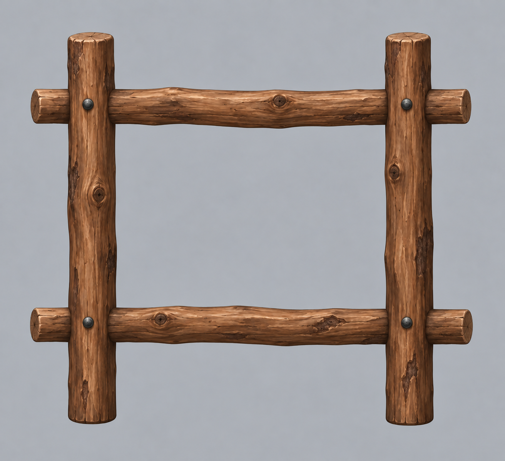
    - Blender 5.2.0 LTS에서 X축 가로폭 1m로 균등 스케일 적용. 원본도 폭 1m여서 배율은 1.0이며, 최종 크기는 1.000 × 0.914 × 0.124m (W×H×D). 세운 자세 유지, 회전 0·스케일 1 적용, 원점은 바닥 중앙. 사용자 지정 1m 구간을 기준으로 하며 높이·두께는 원본 비율 유지.
    - 게임 모델 `client/public/models/objects/wooden_fence.glb`: 메시 1개, 삼각형 2,179개, base color·metallic/roughness·normal 2048²→512², WebP q90 내장, 발광 제거, 219,424 bytes. Blender 재임포트로 크기·원점·스케일·텍스처 확인.
    - 아이콘 `client/public/items/objects/wooden_fence.png`: Cycles 투명 직교 렌더 512²→128² RGBA. 2026-09-07 Blender 5.2.0 LTS에서 세로 기둥이 화면 수직축과 일치하도록 아이콘 회전을 조정해 재렌더링했다. 가로대의 원근 기울기는 유지한다. 큰 미리보기와 packed 작업 파일은 `assets/wooden_fence/wooden_fence-render.png`, `assets/wooden_fence/wooden_fence.blend`.
    - `items.csv`의 `wooden_fence`, `category=furniture`, material wood, 무게 0.01, basePrice 100(1실버), 중첩·사용 가능. 2026-09-06부터 [목책 배치 모드](../FENCE_PLACEMENT.md)에서 1m 셀의 변에 설치·회수하며 해당 변만 통행을 차단한다. 카탈로그 `solid=true`의 일반 가구 풋프린트는 맵 에디터 배치용이고 플레이어 목책에는 별도 변 충돌을 적용한다.
    - 재현 명령: `blender -b --python-exit-code 1 -P tools/blender-scripts/export_item_asset.py -- --source assets/wooden_fence/Meshy_AI_Rustic_Wooden_Fence_F_0905115448_texture.glb --name wooden_fence --size 1 --size-axis x --icon-rotation -75 -25 -6.460664 --exposure -1.2`
- Landscaping Sample Book 아이콘 6종 — 기존 Poly Haven 지형 재질(CC0, [원본 출처](environment.md#terrain-textures))을 자체 정사각형 평면에 적용해 Blender 5.2.0 LTS에서 렌더링(2026-09-07). `shared/palette.json`의 판매 재질을 사용하며 base color·normal·roughness를 유지한다. 아이콘용 평면 0.5m, UV 0–1, 회전 (25°, −8°, −12°), 노출 −1.2, Cycles 투명 직교 렌더 512²→128² RGBA.
    - `client/public/items/objects/landscaping_palette_sand.png` ← `client/public/textures/sandy_gravel_02_1k.glb`
    - `client/public/items/objects/landscaping_palette_red_soil.png` ← `client/public/textures/red_laterite_soil_stones_1k.glb`
    - `client/public/items/objects/landscaping_palette_gravel.png` ← `client/public/textures/gravel_road_1k.glb`
    - `client/public/items/objects/landscaping_palette_pebbles.png` ← `client/public/textures/ganges_river_pebbles_1k.glb`
    - `client/public/items/objects/landscaping_palette_stone_path.png` ← `client/public/textures/stone_pathway_1k.glb`
    - `client/public/items/objects/landscaping_palette_paving.png` ← `client/public/textures/patterned_paving_02_1k.glb`
    - 큰 미리보기·packed 작업 파일: `assets/landscaping_samples/landscaping_palette_*.png`, `*.blend`. 재현: `blender -b --python-exit-code 1 -P tools/blender-scripts/render_landscaping_icons.py`. 공용 `scroll_of_return.png`는 다른 아이템에서 계속 사용한다.
- landscaping_toolbox.glb / landscaping_toolbox.png (조경사의 도구함) — 사용자 제공 Meshy.ai 생성 모델, Premium 등급(사용자 확인), 2026-09-06(제공 파일명·작업일 기준). 원본 `assets/landscaping_toolbox/Meshy_AI__0906115517_texture.glb`. 라이선스: Meshy 생성물 약관 적용.
    - 원화: 사용자 제공 ChatGPT 생성 이미지, ChatGPT Pro 20x(사용자 확인), 2026-09-06(파일명 기준). 라이선스: ChatGPT 생성물 약관 적용. `assets/ChatGPT Image 2026년 9월 6일 오후 08_23_49.png`를 변경 없이 이동했다. 원화와 원본 GLB는 이동 전후 SHA-256 일치를 확인했다. 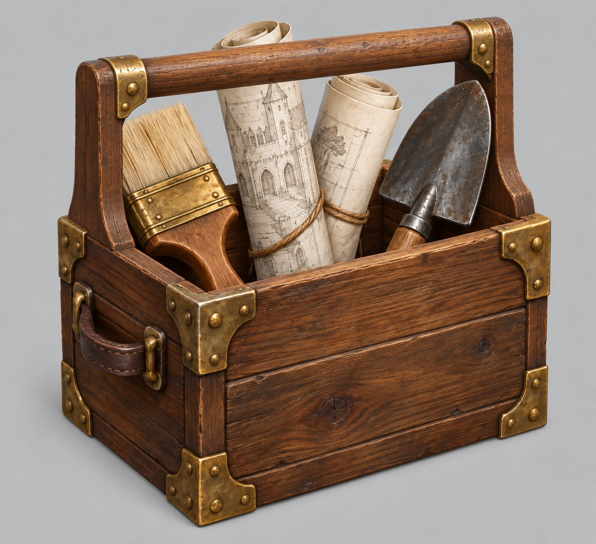
    - Blender 5.2.0 LTS에서 원본의 세운 자세를 유지하고 X축 가로폭 0.65m로 균등 스케일 적용(원본 폭 1m, 배율 0.65). 최종 크기 0.650 × 0.514 × 0.485m (W×H×D), 원점=바닥 중앙, 회전 0·스케일 1. 실측 비교: 기존 chest.glb 폭 1.476m, crate.glb 폭 1.128m, campfire_kit.glb 폭 0.450m. 휴대 도구함으로 상자 가구보다 작게 하되 바닥에서 붓·삽·손잡이가 식별되도록 모닥불 키트보다 크게 잡았다.
    - 게임 모델 `client/public/models/objects/landscaping_toolbox.glb`: 메시·머티리얼 각 1개, 삼각형 3,825개, base color·metallic/roughness·normal 2048²→512², WebP q90 내장, 발광 제거, 애니메이션 없음, 304,736 bytes.
    - 아이콘 `client/public/items/objects/landscaping_toolbox.png`: Cycles 128 samples, 투명 직교 사선 렌더 512²→128² RGBA. 정면·옆면과 붓·삽·도면이 보이도록 아이콘 복사본만 Euler (-62°, -25°, -8°) 회전, exposure -0.5, margin 1.10. 원본 자세의 게임 모델은 별도로 보존한다. 큰 미리보기와 packed 작업 파일은 `assets/landscaping_toolbox/landscaping_toolbox-render.png`, `assets/landscaping_toolbox/landscaping_toolbox.blend`.
    - `items.csv`의 `landscaping_toolbox`에 `Landscaper's Toolbox`로 연결하고 `tools/convert.mjs`로 `data/items.json`을 재생성했다. category tool, material wood, 임시 무게 2, 중첩 불가. Rowan 판매가 50 silver, 드롭 없음. `consumable=true`로 사용 가능하며 전용 처리에서 소모하지 않는다. 반복 사용·영지 편집은 [영지 설계 §4](../LAND_SYSTEM.md#4-영지-꾸미기-조경사의-도구함)에 구현했다.
    - 추가 조경 견본집 7종은 기존 `scroll.glb`와 `scroll_of_return.png`를 재사용한다 (2026-09-06). 원본 출처·라이선스는 이 문서의 해당 스크롤 항목을 따른다. 새로 생성한 에셋은 없다.
    - Blender 재임포트로 크기·바닥 중앙 원점·스케일·삼각형 수·512² 텍스처 3장·발광 없음 확인. 128² 아이콘의 알파·테두리 여백과 두 크기 렌더를 확인했다. 로컬 게임 서버의 모델·아이콘 URL 응답은 각각 파일과 SHA-256이 일치한다. 원본 GLB·작업 blend·큰 렌더·게임 GLB를 Hugging Face에 업로드하고 원격 파일 해시 검증 후 assets.lock에 revision `47b18253aee7daaccd8efb10df8829b02ac8b006`을 기록했다 (2026-09-06).
    - 재현 명령: `blender -b --python-exit-code 1 -P tools/blender-scripts/export_item_asset.py -- --source assets/landscaping_toolbox/Meshy_AI__0906115517_texture.glb --name landscaping_toolbox --size 0.65 --size-axis x --icon-rotation -62 -25 -8 --exposure -0.5`
- Bait icons (worm, breadcrumbs, shrimp) — **아직 없음**. `items.csv`의 `worm`/`breadcrumbs`/`shrimp`는 임시로 기존 `clump_of_kelp.png`/`bread.png`/`raw_minnow.png`를 가리킨다 (2026-09-08). 128×128 투명 아이콘 3장이 준비되면 `objects/worm.png`, `objects/breadcrumbs.png`, `objects/shrimp.png`로 넣고 CSV 경로만 바꾼다. **[임시]**
