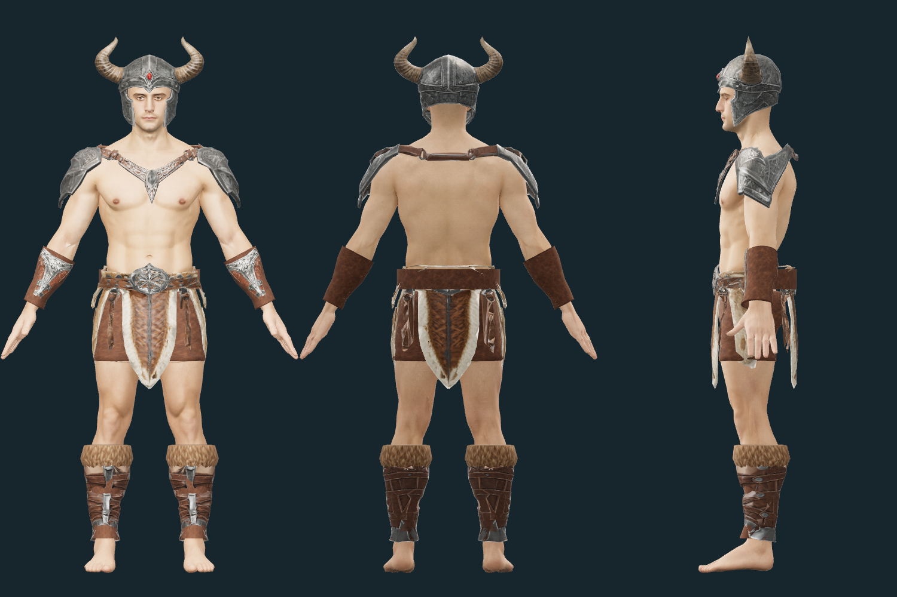

# Modular Barbarian — 남성 바바리안 복장

2026-09-30 제작. [기존 남성 원화](../../client/public/character_concepts/barbarian.webp)를
기준으로 기존 모듈형 남성의 65본 리그에 맞춘 다섯 교체 파츠다.
맨가슴·허벅지·손·발을 유지하며, 투구를 착용하면 헤어를 숨긴다.

## 파일과 미리보기

제작용은 `assets/modular_human_male_01/parts/fitted/`, 게임용은
`client/public/models/characters/modular_male/`에 같은 이름으로 저장한다.

| 파일 | 구성 | Triangles |
| --- | --- | ---: |
| `helmet_barbarian.glb` | 뿔·붉은 보석·볼 보호대가 있는 열린 투구 | 1,453 |
| `top_barbarian.glb` | 양쪽 견갑·가죽 연결끈·가슴 장식 | 1,860 |
| `pants_barbarian.glb` | 벨트·가죽과 모피 앞뒤 자락·가죽 안감 | 3,410 |
| `boots_barbarian.glb` | 양쪽 정강이 보호대·모피 커프·가죽 안감, 발은 노출 | 2,704 |
| `gloves_barbarian.glb` | 양쪽 손목 보호대·가죽 커프, 손은 노출 | 2,098 |

- 편집 원본: `assets/modular_human_male_01/parts/fitted/barbarian_parts.blend`.
  몸체와 다섯 파츠가 한 리그를 공유하며 텍스처를 내장한다.
- Meshy 입력 모델: `assets/modular_human_male_01/parts/barbarian_sources/`.
- 파츠 원화: `doc/images/characters/modular_human_male_01/parts/*_barbarian.png`.
- 추가 소재 원본: 같은 폴더의 `barbarian_leather.png`, `barbarian_fur.png`.
  생성 원본을 보존하고 GLB에는 Lanczos로 축소한 1024² 텍스처를 내장한다.
- [프롬프트·설정·작업 ID·비용·해시](modular-barbarian-sources.json).
- [게임용 입력·출력 해시](../../client/public/models/characters/modular_male/manifest.json).

개발 서버의 `/modular-character-preview.html?outfit=barbarian`으로 바로 착용한 모습을 본다.
각 슬롯을 따로 교체하거나 `바바리안 세트 입기` 버튼으로 전체를 적용한다.
이번 연결은 제작 미리보기와 게임용 자산 준비까지다. 신규 캐릭터의 아이템 지급,
`modularEquipment.ts`의 아이템 매핑과 실제 게임 기본 복장 적용은 아직 포함하지 않았다.



## 체형 맞춤

투구는 Head 본에 고정하고, 견갑과 가슴 연결끈에는 몸체의 가중치를 옮겼다.
하의의 허리와 벨트는 골반을 따르며 아래 자락은 양쪽 허벅지 가중치를 연속적으로 혼합한다.
앞자락에서 뒷자락을 복제하고 뒤 벨트와 가죽 안감을 추가해 기본 몸체의 속옷을 가린다.

손목 보호대와 정강이 보호대는 한쪽을 맞춘 뒤 반대쪽을 대칭 제작했다.
각각 ForeArm·Leg 본을 따르며, 몸체 단면에서 필요한 여유를 계산한다.
Meshy 결과에서 부족했던 가죽 둘레·안감과 모피 커프는 로컬에서 만들었다.
추가 소재의 UV는 전용 가죽·모피 텍스처를 반복 사용한다.
머리·얼굴·기존 몸체의 형상과 가중치, 기존 애니메이션은 유지한다.

몸체와 다섯 부위는 숨김 포함 **25,416**, 표시 **25,045 triangles**다.
철검 302 triangles를 포함하면 **25,718 / 표시 25,347**이며,
기본 절차형 망토까지 추가하면 각각 120이 늘어난다.
얼굴 지정 영역 **1,505 triangles**와 몸체의 4096px 텍스처는 그대로다.
전체 목표 15,000–20,000보다 많으며, 안감·뒷자락·보호대 둘레를 포함한 현재 제작본의 수치다.
목표 수치만 맞추기 위한 일괄 감축은 하지 않았다.

## 재생성

저장소 루트에서 실행한다. 프로젝트 `.venv`의 NumPy·Pillow,
FFmpeg·Blender와 클라이언트 Node 의존성을 사용한다.

```sh
.venv/bin/python tools/fit-modular-barbarian.py
blender -b --python-exit-code 1 -P tools/blender-scripts/pack_modular_plate.py -- --outfit barbarian
node tools/prepare-modular-character.mjs --parts-only
```

Windows에서는 `.venv/Scripts/python.exe`를 사용한다.
`--parts-only`는 기존 동작 팩을 유지하고 파츠와 manifest의 해당 해시만 갱신한다.
필요한 생성 원본과 제작·게임용 모델은 `assets.lock`에 고정한 Hugging Face 자산을 사용한다.
일회성 API 생성 스크립트와 임시 검토 파일은 최종본 정리 때 삭제했다.

## 출처와 라이선스

- 참고 원화는 [캐릭터 출처 기록](characters.md#other-classes)의 남성 바바리안이다.
- 파츠 원화·보완 원화·소재 텍스처: OpenAI Codex built-in ImageGen,
  **ChatGPT Pro 20x**, 2026-09-30. OpenAI 생성 출력물 이용 조건 적용.
  실제 프롬프트와 참조 이미지는 출처 JSON에 기록한다.
- 3D·PBR: Meshy Image to 3D API, **Meshy Premium**, `meshy-7.1`, 2026-09-30.
  Ultra 4K 형상, 2K PBR, triangle remesh. 목표는 투구 1,400, 상의·하의 각 1,800,
  한쪽 정강이 보호대 900, 한쪽 손목 보호대 700이다.
  채택 5종 **175크레딧**, 최초 보호대 2종을 포함한 총 **245크레딧**.
  [Meshy 유료 생성물 이용 조건](https://help.meshy.ai/en/articles/10137554-what-is-the-ownership-of-the-generated-models)을 따르며 Community에 게시하지 않았다.
- **[미사용]** `*-unused-v1.png`, `*-unused-v1.glb`: 최초 손목·정강이 보호대.
  모피 누락과 길쭉한 손목 형상 때문에 교체했다. 중간 파일 4개는 삭제하고
  프롬프트·작업 ID·비용·해시와 당시 경로는 출처 JSON에 보존했다.
- 몸체·가죽 안감의 기초 형상·Mixamo 리그·동작은
  [모듈형 남성 출처](modular-human-male-01.md)를 따른다.
- 착용 미리보기 PNG는 위 게임용 자산을 Three.js로 렌더한 프로젝트 제작 이미지다.

## 검증

- 게임용 GLB 5종: Khronos glTF Validator 오류·경고·정보·힌트 0.
- 게임용 파츠의 65본·본 순서·기준 행렬이 몸체와 일치하며 한 스켈레톤을 공유한다.
- 게임용 51클립 × 5시점, **255포즈**의 유한 정점·체형 범위 검사와 브라우저 오류 0.
- 기본 자세·대기·걷기·달리기·전투 대기·공격의 정면·후면·측면을 압축본으로 확인했다.
- 모듈형 복장·캐릭터 로더·동작 관련 테스트와 `npm run check`, `npm run lint` 통과.

확대하면 모피의 메시 윤곽과 반복 텍스처가 보인다. 천 시뮬레이션은 사용하지 않으며,
검증은 모든 장비 조합과 모든 프레임에서 관통이 없음을 보장하지 않는다.
