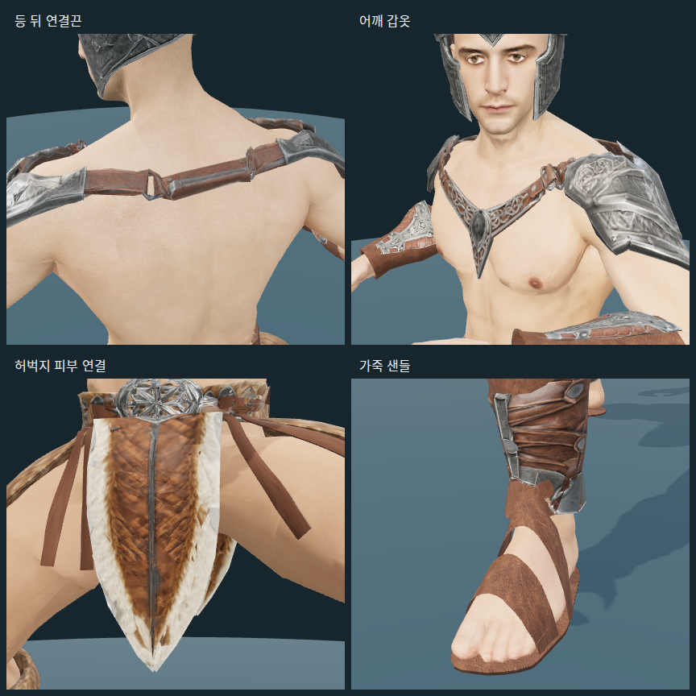
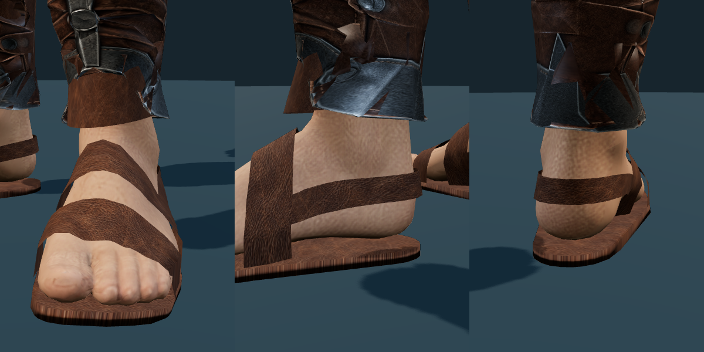

# Modular Barbarian — 남성 바바리안 복장

2026-09-30 제작. [기존 남성 원화](../../client/public/character_concepts/barbarian.webp)를
기준으로 기존 모듈형 남성의 65본 리그에 맞춘 다섯 교체 파츠다.
맨가슴·허벅지·손을 유지하고 발에는 가죽 샌들을 신긴다. 투구를 착용하면 헤어를 숨긴다.

## 파일과 미리보기

제작용은 `assets/modular_human_male_01/parts/fitted/`, 게임용은
`client/public/models/characters/modular_male/`에 같은 이름으로 저장한다.

| 파일 | 구성 | Triangles |
| --- | --- | ---: |
| `helmet_barbarian.glb` | 뿔·붉은 보석·볼 보호대가 있는 열린 투구 | 1,453 |
| `top_barbarian.glb` | 양쪽 견갑·가죽 연결끈·가슴 장식 | 1,860 |
| `pants_barbarian.glb` | 벨트·앞뒤 모피·곡면 옆 모피·가죽 끈, 반바지 안감 제거 | 3,323 |
| `boots_barbarian.glb` | 양쪽 정강이 보호대·모피 커프·가죽 안감·샌들 | 3,416 |
| `gloves_barbarian.glb` | 양쪽 손목 보호대·가죽 커프, 손은 노출 | 2,098 |

- 편집 원본: `assets/modular_human_male_01/parts/fitted/barbarian_parts.blend`.
  몸체와 다섯 파츠가 한 리그를 공유하며 텍스처를 내장한다.
- Meshy 입력 모델: `assets/modular_human_male_01/parts/barbarian_sources/`.
- 파츠 원화: `doc/images/characters/modular_human_male_01/parts/*_barbarian.png`.
- 추가 소재 원본: 같은 폴더의 `barbarian_leather.png`, `barbarian_fur.png`.
  생성 원본을 보존하고 GLB에는 Lanczos로 축소한 1024² 텍스처를 내장한다.
- [프롬프트·설정·작업 ID·비용·해시](modular-barbarian-sources.json).
- [게임용 입력·출력 해시](../../client/public/models/characters/modular_male/manifest.json).

개발 서버의 `/modular-character-preview.html?outfit=barbarian`으로 바로 착용한 모습을 본다.
각 슬롯을 따로 교체하거나 `바바리안 세트 입기` 버튼으로 전체를 적용한다.
이번 연결은 제작 미리보기와 게임용 자산 준비까지다. 신규 캐릭터의 아이템 지급,
`modularEquipment.ts`의 아이템 매핑과 실제 게임 기본 복장 적용은 아직 포함하지 않았다.

어깨·등 연결끈 밀착, 피부 경계 제거와 가죽 샌들 추가 후:



## 체형 맞춤

투구는 Head 본에 고정하고, 견갑과 가슴 연결끈에는 몸체의 가중치를 옮겼다.
앞자락에서 뒷자락을 복제하고 뒤 벨트를 추가했다.
2026-09-30 수정에서 갈색 반바지처럼 보이던 안감 1,035 triangles를 제거했다.
몸체의 기존 `covered_skin` 영역 형상은 유지하며, 아래 후속 수정에서 피부 재질로 바꿨다.
옆 모피 두 장과 가죽 끈 네 개는 실제 허리띠 표면에서 윗부분을 샘플링하고
1.5mm 안쪽으로 넣어 연결했다. 옆 모피는 두께 6mm의 곡면, 끈은 두께 3mm로 만들었다.
모두 Hips 본을 따르며, 윗부분 두 줄의 위치와 법선은 물리 계산 후에도 고정한다.
기존 모피·가죽 텍스처를 재사용한다.
앞뒤 모피는 원래 UV와 윤곽을 유지하고, 줄인 벨트에 맞춘 허리 고정축에서 움직인다.
각 메시의 `pelt_physics`에 종류·고정 본·회전축 위치·바깥 방향·길이·충돌체와 격자 구성을 기록한다.
`pelt-rig.ts`가 전체 갱신과 충돌을 맡고, `pelt-cloth.ts`가 옆 모피와 끈의 변형을 계산한다.
옆 모피는 각각 9열 × 11행, 끈은 각각 3열 × 11행으로 총 330개 제어점을 사용한다.
1/60초 고정 간격의 Verlet 계산에 길이·전단·굽힘 제약을 4회 적용한다.
옆 모피와 끈은 모두 휘어지되 감쇠와 원래 형상으로 돌아가는 힘을 높이고 바람 반응을 줄여 묵직하게 움직인다.
충돌 보정으로 생긴 속도를 제거해 몸에 닿은 가장자리가 계속 떨리지 않게 한다.
물리 갱신 사이에는 정점·법선 계산과 업로드를 건너뛰며, 지연된 프레임도 최대 4단계만 계산한다.
2026-09-30 출처 JSON에 기록한 초기 움직임 값은 같은 날 떨림·성능 조정에서 위 설정으로 변경했다.
앞뒤 모피는 기존 1/60초 진자 계산과 최대 약 77도의 회전 제한을 유지한다.
충돌은 골반·다리의 타원체로 근사한다. 끈과 옆 모피의 세로 구간은 최대 4%까지만
늘어나도록 제한하며, 접촉 시 압축과 접힘은 허용한다.
2026-09-30 가죽 끈이 속옷에 묻히던 부분을 수정했다. 끈 네 개의 골반 충돌체만
중심 `[0, 0.98, -0.023]`, 반지름 `[0.205, 0.215, 0.155]`m로 조정해
골반과 허벅지 사이의 충돌 범위를 넓혔다. 고정점·형상·텍스처·움직임 계수는 유지한다.
같은 날 후속 요청으로 허리띠를 실제 허리 단면에 맞춰 줄였다. 뒤쪽 가죽은 몸체에서
바깥면 13mm·안쪽 면 9mm의 여유를 두고, 앞쪽 장식의 굴곡은 유지한다.
앞뒤 모피의 윗부분도 새 벨트에 연결했다. 가죽 끈 네 개와 옆 모피 두 장의 부착 위치를
좌우 대칭으로 0.24rad(약 14도) 앞쪽 중앙으로 옮기고 고정점을 다시 샘플링했다.
**[미사용 — 아래 연속 피부 베이크로 대체]** 속옷처럼 보이던 1,180 triangles의 71개 UV 조각을 기존 4096px 피부 텍스처의 피부 영역으로
옮겼다. `restored_skin` 재질은 기존 피부의 색·표면 맵을 공유하고 법선 강도는 0.25다.
텍스처 이미지·몸체 형상·스킨 가중치·리그·삼각형 수는 유지하며 추가 생성 비용은 없다.
추가 마감에서 뒷판은 앞판의 곡면을 뒤집어 사용하고, 뒤쪽 골반 충돌체를 실제 몸체에
맞춰 뒤로 과하게 들리지 않도록 조정했다. 앞판 자체는 유지한다.
앞판에 가려지던 안쪽 끈만 부착 각도 1.06rad에서 0.83rad로 옮기고 길이를
옆 끈과 같은 0.28m로 맞췄다. 보이던 바깥 끈 두 개의 정점·UV·물리 설정은 그대로다.
장식 벨트의 뒤쪽 잔여 면을 제거하고 옆 이음매를 뒤 벨트의 4mm 두께에 맞춰 폈다.
뒤 벨트는 이음매에서 앞쪽으로 약 2도 겹쳐 연결하며 윗단 위의 돌출 면은 제거했다.
이 정리로 하의는 116 triangles 줄었고 기존 소재 이미지와 리그는 유지한다.
고정된 윗줄을 제외한 법선과 안쪽 면은 변형된 격자에 맞춰 갱신한다.
캐릭터마다 변형용 메시를 복제하고 텍스처·재질과 몸체의 65본 스켈레톤은 공유한다.
순간이동·장비 재착용·미리보기 시점 변경 시 초기화하고 해제 시 원래 메시를 복구한다.
제작 미리보기·캐릭터 선택 미리보기·게임의 갱신 및 해제 경로에 연결했다.
일반 GLB 뷰어나 Blender에서는 기본 형상·가중치만 적용된다.

손목 보호대와 정강이 보호대는 한쪽을 맞춘 뒤 반대쪽을 대칭 제작했다.
각각 ForeArm·Leg 본을 따르며, 몸체 단면에서 필요한 여유를 계산한다.
Meshy 결과에서 부족했던 가죽 둘레·안감과 모피 커프는 로컬에서 만들었다.
추가 소재의 UV는 전용 가죽·모피 텍스처를 반복 사용한다.
머리·얼굴·기존 몸체의 형상과 가중치, 기존 애니메이션은 유지한다.

추가 요청으로 어깨 갑옷과 등 연결끈을 몸 표면 쪽으로 당겼다. 가까운 몸체 면을 기준으로
변위를 부드럽게 평균해 장식의 굴곡을 유지한다. 기본 자세의 등 끈 간격 중앙값은
29.23mm에서 14.69mm, 최대값은 58.85mm에서 25.77mm로 줄었다.
피부는 새 소재를 만들고 원래 UV로 되돌려 골반·허벅지를 연속적으로 다시 베이크했다.
높이 0.61~1.21m 사이에서 기존 피부와 부드럽게 섞고, 속옷 테두리의 색·법선·거칠기 흔적을
함께 제거했다. 해당 영역의 겹치는 정점 법선도 연결한다. 기존 얼굴 텍스처 픽셀,
몸체 정점 위치·삼각형·스킨 가중치·65본 리그는 그대로다.
원래 색·법선·거칠기 이미지와 UV는 `assets/modular_human_male_01/parts/skin_sources/`에 보존한다.
새 소재는 `parts/body_skin_surface.png`의 중앙 영역을 사용하며 기존 피부색에 맞춰 베이크한다.
샌들은 기존 가죽 소재로 밑창과 두 줄의 넓은 발등 끈을 만들고 발·발가락의 가중치를 옮겼다.
발가락은 노출하며, 최초 양쪽 샌들에 488 triangles를 추가했다.

같은 날 후속 수정에서 발등 끈을 실제 발 단면에서 바깥쪽으로 6mm 떨어진 위치에 맞췄다.
뒤꿈치를 감싸며 뒤쪽 발등 끈 양끝에 연결되는 폭 23mm의 가죽 끈도 추가했다.
발·발가락 가중치를 유지하며 양쪽 샌들은 합계 712 triangles다.
속옷을 선택하면 기존 `covered_skin`의 반바지 색·거칠기를 복원하고,
바바리안 하의에서는 텍스처가 있는 `restored_skin`으로 되돌린다.
캐릭터별 메시의 재질 참조를 교체하므로 다른 캐릭터의 복장에는 영향을 주지 않는다.
몸체 GLB·텍스처·삼각형 수는 바꾸지 않았다.

앞 모피 판은 원본에 겹친 표면이 있었고, 깊이를 줄인 후 면 간격이 0.001mm 이하인
부분도 생겨 깜박였다. 바깥쪽 면의 투영 경계를 분할해 중복 면을 제거하고,
원래 UV와 윤곽을 따라 두께 4mm의 닫힌 판으로 다시 만들었다. 뒷판에도 같은 형상을 적용한다.
기존 벨트·옆 모피·끈·물리 계수는 유지한다.



몸체와 다섯 부위는 숨김 포함 **26,041**, 표시 **25,670 triangles**다.
철검 302 triangles를 포함하면 **26,343 / 표시 25,972**이며,
기본 절차형 망토까지 추가하면 각각 120이 늘어난다.
얼굴 지정 영역 **1,505 triangles**와 몸체의 4096px 텍스처는 그대로다.
전체 목표 15,000–20,000보다 많으며, 뒷자락·곡면 옆 모피·가죽 끈·보호대 둘레를 포함한 수치다.
목표 수치만 맞추기 위한 일괄 감축은 하지 않았다.

## 재생성

저장소 루트에서 실행한다. 프로젝트 `.venv`의 NumPy·SciPy·Pillow·Shapely 2.1 이상,
FFmpeg·Blender와 클라이언트 Node 의존성을 사용한다.

```sh
.venv/bin/python tools/restore-modular-skin.py
.venv/bin/python tools/fit-modular-barbarian.py
blender -b --python-exit-code 1 -P tools/blender-scripts/pack_modular_plate.py -- --outfit barbarian
node tools/prepare-modular-character.mjs --parts-only
```

Windows에서는 `.venv/Scripts/python.exe`를 사용한다.
`--parts-only`는 기존 동작 팩을 유지하고 파츠와 manifest의 해당 해시만 갱신한다.
필요한 생성 원본과 제작·게임용 모델은 `assets.lock`에 고정한 Hugging Face 자산을 사용한다.
`restore-modular-skin.py`는 보존한 원래 지도·UV와 새 피부 소재에서 베이크한다.
스크립트와 소재가 같으면 이미 처리한 몸체를 유지한다.
일회성 API 생성 스크립트와 임시 검토 파일은 최종본 정리 때 삭제했다.
최종 정리에서 이전 비교 이미지 세 장과 작업용 임시 백업·검토 스크립트를 제거했다.
현재 미리보기와 재생성용 원본은 유지한다. 두 Blender 파일의 사용하지 않는 소재·이미지도
정리했으며 장면 객체와 폴리곤 수는 그대로다. 몸체 면 추출을 재사용하고 중복 벨트 정점 계산과
GLB 재읽기를 줄였다. 정리 전후 생성 결과의 문서·바이너리가 같은지 비교했다.

## 출처와 라이선스

- 참고 원화는 [캐릭터 출처 기록](characters.md#other-classes)의 남성 바바리안이다.
- 파츠 원화·보완 원화·소재 텍스처: OpenAI Codex built-in ImageGen,
  **ChatGPT Pro 20x**, 2026-09-30. OpenAI 생성 출력물 이용 조건 적용.
  실제 프롬프트와 참조 이미지는 출처 JSON에 기록한다.
- 3D·PBR: Meshy Image to 3D API, **Meshy Premium**, `meshy-7.1`, 2026-09-30.
  Ultra 4K 형상, 2K PBR, triangle remesh. 목표는 투구 1,400, 상의·하의 각 1,800,
  한쪽 정강이 보호대 900, 한쪽 손목 보호대 700이다.
  채택 5종 **175크레딧**, 최초 보호대 2종을 포함한 총 **245크레딧**.
  [Meshy 유료 생성물 이용 조건](https://help.meshy.ai/en/articles/10137554-what-is-the-ownership-of-the-generated-models)을 따르며 Community에 게시하지 않았다.
- **[미사용]** `*-unused-v1.png`, `*-unused-v1.glb`: 최초 손목·정강이 보호대.
  모피 누락과 길쭉한 손목 형상 때문에 교체했다. 중간 파일 4개는 삭제하고
  프롬프트·작업 ID·비용·해시와 당시 경로는 출처 JSON에 보존했다.
- 몸체·Mixamo 리그·동작은
  [모듈형 남성 출처](modular-human-male-01.md)를 따른다.
- 착용 미리보기 PNG는 위 게임용 자산을 Three.js로 렌더한 프로젝트 제작 이미지다.
- 피부 소재 `body_skin_surface.png`: 내장 ImageGen, **ChatGPT Pro 20x**, 2026-09-30.
  기존 `base-front.png`의 피부색을 참고해 만든 소재이며 OpenAI 생성 출력물 이용 조건 적용.
  최종 프롬프트와 베이크 설정은 출처 JSON의 `skin_surface_revision`에 기록한다.
  어깨·샌들 형상은 로컬 편집이며 추가 Meshy 생성·크레딧 사용은 없다.

## 검증

- 게임용 GLB 5종: Khronos glTF Validator 오류·경고·정보·힌트 0.
- 게임용 파츠의 65본·본 순서·기준 행렬이 몸체와 일치하며 한 스켈레톤을 공유한다.
- 기본 자세·대기·걷기·달리기·전투 대기·공격·점프를 게임용 압축본으로 확인했다.
- 옆 모피와 끈의 고정점 60개를 실제 허리띠 메시와 비교했다. 모두 표면에서 1.5mm 이내다.
- 6개 동작을 1,080프레임 연속 재생했다. 고정 정점 288개의 최대 위치 오차는 약 0.000000045m,
  자유 구간의 최대 늘어남은 약 4.0004%였으며 유한 정점 검사와 브라우저 오류 검사도 통과했다.
- 정지 후 600프레임 안정화하고 120프레임을 비교했을 때 정점 위치 변화는 0이었다.
- 로컬 헤드리스 Chrome에서 한 캐릭터의 물리·메시 갱신 평균 약 0.69ms를 측정했다.
  WebGL 그림자 렌더링도 확인했다. 군중·모바일 성능은 측정하지 않았다.
- 펠트·망토·모듈형 복장·캐릭터 로더·동작 테스트 66개와 `npm run check`, `npm run lint` 통과.
- 끈 겹침 수정: 전투 대기 시작 자세를 600프레임 안정화한 뒤 확대 확인했다.
  끈 앞면의 정점·세로 중간점에서 몸체로 향하는 광선을 비교했을 때,
  최저 간격은 수정 전 약 -8.7mm에서 수정 후 +4.5mm로 개선됐다.
  6개 동작 1,080프레임에서 끈 고정점 오차 0, 최대 늘어남 약 4.0004%를 확인했고,
  펠트 물리 테스트 12개와 게임용 GLB 검증도 통과했다.
- 후속 벨트·배치·피부 수정: 세 높이의 같은 212방향에서 허리띠 바깥면과 몸체 사이의
  평균 방사 간격이 약 51mm에서 17mm로 줄었다. 새 고정점 60개는 벨트 안쪽 1.5mm에 있다.
  게임용 모델의 6동작·1,080프레임에서 고정점 오차 0, 최대 늘어남 약 4.0004%,
  브라우저 오류 0을 확인했다. 관련 테스트 30개 통과, 게임용 몸체·하의 GLB 오류 0이다.
  몸체에는 기존 경고 19개와 피부 면의 자동 접선 생성 경고 2개가 있으며 하의는 경고 0이다.
- 추가 마감: 앞판과 기존 바깥 끈 두 개의 모든 정점 속성·물리 설정이 수정 전과 일치한다.
  뒷판과 앞판을 고정축 기준으로 비교한 대칭 오차는 0.00002mm 미만이다.
  게임용 하의는 glTF Validator 지적 0, 6개 동작·1,080프레임에서 브라우저 오류와
  고정점 위치 오차 0, 최대 늘어남 약 4.0004%다. 관련 테스트 30개 통과.
- 어깨·피부·샌들: 게임용 3개 GLB의 오류 0. 상의·신발의 경고는 0이며 몸체는 기존 계열의
  경고 17개다. 얼굴 영역의 원본 텍스처 픽셀 1,248,558개가 일치하고 몸체 형상·가중치가
  유지된다. 6동작의 등·어깨·허벅지·발 30시점과 1,080프레임 물리 검증,
  관련 테스트 30개를 통과했다.
- 샌들·속옷·모피 후속 수정: 신발·하의 GLB의 오류·경고·정보·힌트 0.
  앞판을 통과하는 7,149개 광선에서 중복 면이 없고 두께는 약 4mm로 일정하다.
  게임용 모델의 6동작·54시점·1,080프레임에서 오류·비정상 정점·옆자락 고정점 이동이 없다.
  속옷과 바바리안 하의의 재질 전환, 캐릭터 간 재질 독립성을 확인했다.
  관련 테스트 31개와 `npm run check`, `npm run lint`를 통과했다.

확대하면 모피의 메시 윤곽과 반복 텍스처가 보인다. 충돌체는 몸체의 근사 형상이며,
자락끼리의 충돌과 지면 충돌은 계산하지 않는다. 앞뒤 모피는 제한된 회전축을 사용하며,
극단적인 자세와 모든 장비 조합에서의 관통 방지를 보장하지는 않는다.
