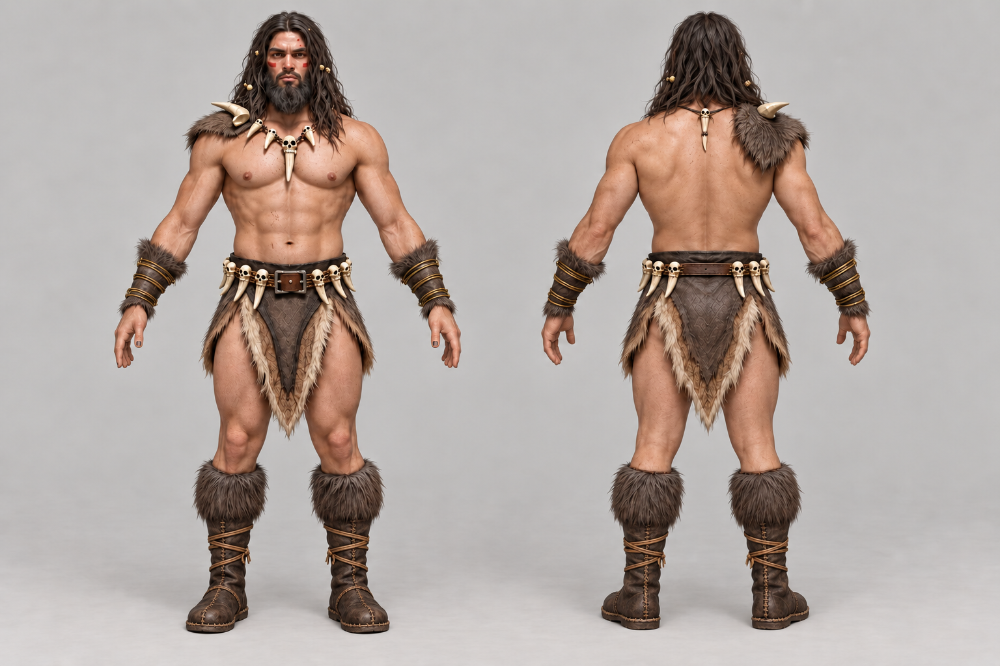

# Modular Caveman — 원시전사 복장 원화

2026-10-03 제작·수정. **[미사용]** 사용자 검토용 전체 복장 원화 v2다.

- [기존 원시전사 원화](../../client/public/character_concepts/caveman.webp)를 복장 기준으로,
  [남성 모듈형 몸체 원화](../images/characters/modular_human_male_01/base-front.png)를 체형 참고로 사용했다.
- 오른쪽 모피 어깨 장식, 뼈·송곳니 목걸이, 모피 테두리 가죽 하의와 뼈 장식 허리띠,
  가죽·모피 손목 보호대를 유지했다.
- 사용자 요청으로 맨발을 갈색 가죽 부츠로 바꿨다. 기존 종아리 모피는 부츠 커프로 연결하고,
  가죽 끈·봉제선·평평한 가죽 밑창을 앞뒤에 표현했다. 발과 발목을 모두 덮는다.
- **[미사용]** 맨발 v1 이미지는 중간 파일 정리 요청으로 삭제했다. 생성 프롬프트·해시는 보관한다.
- 같은 복장의 앞·뒤 전신을 나란히 배치했다. 등쪽 목걸이 장식과 고정 방식은 제안 단계이며,
  파츠 제작 전에 장식 소속·안팎 순서·연결부를 검토한다.
- 원화의 체형은 참고용이며 실제 몸체 피팅·리깅·동작 호환을 검증한 결과가 아니다.

## 출처와 라이선스

- 생성: OpenAI Codex built-in ImageGen, **ChatGPT Pro 20x**, 2026-10-03.
- OpenAI 생성 출력물 이용 조건 적용. 참조 원화의 출처 기록은 [캐릭터 문서](characters.md#other-classes)와
  [남성 몸체 문서](modular-human-male-01.md)를 따른다.
- [실제 생성 프롬프트·참조 파일·SHA-256](modular-caveman-concept-sources.json).

후속으로 [Tripo용 부위별 앞뒤 원화 8장](modular-caveman-parts.md)을 제작했다.
상의는 [Tripo 피팅·리깅과 제작 미리보기](modular-caveman-tripo-top.md)까지 진행했다.
다른 부위 모델과 일반 게임 적용은 후속 작업이다.
