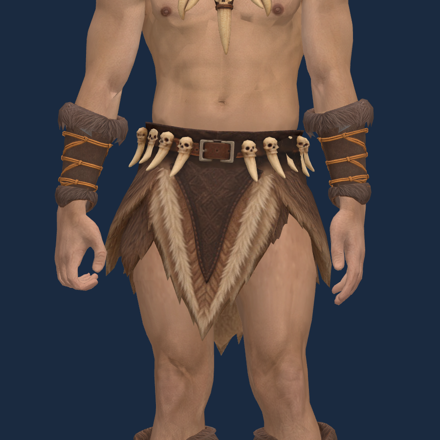
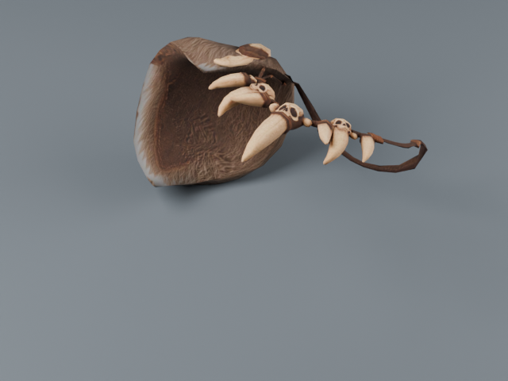

# 원시전사 기본 복장 등록 — 2026-10-04

신규 남성 원시전사는 승인된 모듈형 복장 4종을 각 1개 자동 장착하고 시작한다.
여성 원시전사는 기존 통합 모델을 사용하므로 기존 시작 장비를 유지한다.

| 아이템 ID | 한국어 이름 | 슬롯 |
| --- | --- | --- |
| `worn_caveman_top` | 낡은 원시전사 어깨 덮개 | chest |
| `worn_caveman_pants` | 낡은 원시전사 모피 하의 | pants |
| `worn_caveman_boots` | 낡은 원시전사 모피 부츠 | boots |
| `worn_caveman_bracers` | 낡은 원시전사 손목 보호대 | hands |

각 부위는 방어 1이며 가격·상자 드랍 티어를 지정하지 않고 `untradeable=true`로 등록한다.
상점의 단품·일괄 판매와 플레이어 거래를 차단한다. 공통 시작 장비인 낡은 철검과 낡은 횃불도
함께 지급한다. 기존 캐릭터에 소급 지급하지 않는다.

## 사용 자산과 출처

새 AI 생성이나 유료 호출 없이 승인된 Tripo 피팅 모델을 재사용했다.
출처·라이선스·원본 보관 위치는 기존 [상의](modular-caveman-tripo-top.md),
[하의](modular-caveman-tripo-pants.md), [부츠](modular-caveman-tripo-boots.md),
[손목 보호대](modular-caveman-tripo-bracer.md) 기록을 따른다.

`node tools/prepare-modular-character.mjs --caveman-only`로 `top_caveman`, `pants_caveman`,
`boots_caveman`, `gloves_caveman`을 `client/public/models/characters/modular_male/`에 등록했다.
본·UV·모피 물리 설정을 유지하며 기존 게임용 파츠와 같은 메시 압축·512px 텍스처 변환을
적용했다. 입력과 출력 SHA-256은 해당 폴더의 `manifest.json`에 기록한다.

미리보기의 착용 처리를 공통 게임 런타임으로 옮겨 상의의 맨가슴, 하의의 피부 복원,
부츠의 종아리 절단, 보호대의 팔 피부 절단을 동일하게 적용한다.
판금 바지와 부츠를 함께 착용하면 기존 미리보기와 같이 0.43m에서 바지를 자르고,
장비를 바꾸거나 벗으면 원래 메시를 복원한다.

바닥용 모델과 투명 128px 인벤토리 아이콘은 로컬 Blender 렌더로 제작했다.
손목 보호대는 한쪽만 분리하고 어깨 덮개·하의는 바닥에 눕힌다.
`client/public/models/armor/caveman_{top,pants,boots,bracers}.glb`와
`client/public/items/armor/caveman_{top,pants,boots,bracers}.png`가 게임용 출력이다.
텍스처는 512px로 줄였으며 작업용 Blender 파일은 `assets/items/caveman_{top,pants,boots,bracers}/`에 보관한다.

```bash
blender -b -t 6 --python-exit-code 1 --python tools/blender-scripts/export_caveman_items.py
```

## 검증

- 신규 생성 시 부위·수량·장착 슬롯·캐릭터 목록의 장비와 판매·거래 속성 확인.
- 상점의 단품·일괄 판매와 플레이어 거래 차단 테스트 통과.
- 게임용 GLB 8종: Khronos glTF Validator 오류·경고 0.
- 실제 게임 모델의 착탈·독립 캐릭터·판금 바지 혼합·피부 복원과 기존 미리보기·모피 물리 등
  관련 프런트엔드 테스트 81개 통과.
- `cargo fmt`, `cargo check`, `npm run check`, `npm run lint` 통과.

## 허벅지 피부 연결 보정 — 2026-10-04

속옷을 피부로 복원한 영역과 아래 허벅지의 색·질감 차이를 줄였다.
`tools/restore-modular-skin.py`에서 원본 몸체의 실제 허벅지 피부를 샘플링하고,
각 다리의 둘레 방향과 높이에 맞춰 복원 영역에 이어 붙였다. 위쪽은 기존 복부 피부로
부드럽게 연결한다. 원래 속옷 경계에 남은 표면 음영은 주변 피부의 법선을 공간 평균하여
완화했다. 이미 보정한 법선은 다시 텍스처를 베이크할 때 중복 보정하지 않는다.

추가 AI 생성·유료 호출은 없다. 원본 몸체 텍스처는 기존 Meshy Premium 출처이며,
기존 피부 소재는 [피부 생성 기록](modular-barbarian-sources.json)의
`skin_surface_revision`에 기록된 내장 ImageGen / ChatGPT Pro 20x 출력이다.
이번 변경은 이 자산들을 재사용한 로컬 GLB 텍스처 베이크와 표면 음영 보정이다.

몸체 위치·삼각형·UV·리그·본 가중치·장비 형상은 유지한다. 얼굴 영역의 원본 텍스처
1,248,558픽셀이 일치하며, 기존 노멀·거칠기 텍스처도 유지한다.
게임용 몸체는 `node tools/prepare-modular-character.mjs --part base`로 다시 압축한다.
보정 전 비교용 `base-before.glb`와 `runtime-before.glb`는 사용자 요청으로 2026-10-09 삭제했다.
현재 재생성은 수정된 몸체 GLB, 피부 원본 텍스처와 `tools/restore-modular-skin.py`를 사용한다.
[삭제 목록·해시](cleanup-2026-10-09.json).

같은 대기 자세·조명에서 수정 전후를 비교했고 원본 데이터 보존 검사가 통과했다. 게임용 몸체 GLB는 오류 0이며 기존 경고 17개와 같다.
[입출력 해시·검증 기록](modular-caveman-skin-match.json).




## 어깨 덮개 바닥 배치 보정 — 2026-10-04

바닥용 `caveman_top.glb`에 X축 −90° 회전을 적용해 목걸이와 어깨 덮개가 앞면을 위로
향하고 눕도록 했다. 원점은 회전 후 바닥 중앙으로 맞췄다. 착용용 모델은 기존 피팅본을
사용한다. 아이콘 카메라 각도를 보상해 기존 아이콘의 구도를 유지했다.
기존 Tripo 모델을 로컬 편집했으며 추가 생성·유료 호출은 없다.

```bash
blender -b -t 6 --python-exit-code 1 --python tools/blender-scripts/export_caveman_items.py -- --parts top
```

회전 전후 정점 대응·최저 높이 0을 확인했고 glTF Validator 오류·경고 0이다.
해시와 배치 수치는 [런타임 기록](modular-caveman-runtime.json)의 `top_ground_revision`에 보관한다.



## 하의 경량화 — 2026-10-04

프레임 저하에 대한 사용자 요청으로 하의를 야만용사의 기존 물리 방식으로 다시 제작했다.
앞뒤는 허리 힌지, 양옆은 9×11 천 격자로 처리해 고밀도 메시의 128/512회 휘어짐 보정을
제거했다. 허리와 뼈 장식·앞뒤 질감은 원본을 유지하고 옆 모피는 기존 야만용사 소재를
재사용했다. 추가 AI 생성·유료 호출은 없다.

착용용 `pants_caveman.glb`, 바닥용 `caveman_pants.glb`, 아이콘과 Blender 원본을 갱신했다.
원본·압축본 각각 7종 동작 검사, 관련 테스트 81개, GLB 3종의 오류·경고 0을 확인했다.
CPU 바지 물리 비용은 비교 측정에서 약 19–23ms/프레임에서 0.2–0.6ms로 줄었다.
게임 전체 FPS 측정은 아니다. [피팅·출처·측정 기록](modular-caveman-tripo-pants.md#현재-경량-버전-v2--2026-10-04).
