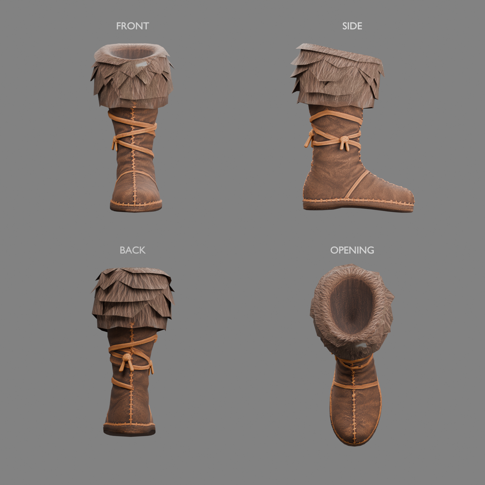
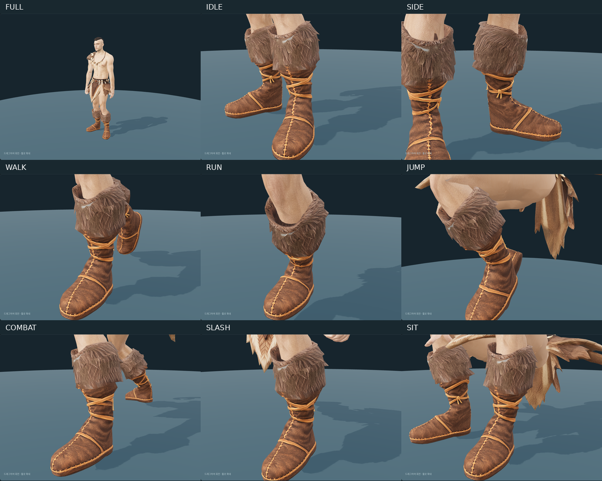

# 원시전사 부츠 — Tripo 피팅과 리깅

2026-10-04 사용자 전달 `fur-lined+boot+3d+model.glb`를 공통 몸체에 맞추고 반대쪽을 대칭 제작했다. 원시전사 세트 미리보기에서 기존 상의·하의와 함께 착용하며 사용자가 최종 형태를 확인했다. 판금 바지와의 혼합 착용은 아래 보정으로 확인했으며, 게임 장비 등록과 나머지 긴 바지 조합 검수는 남아 있다.

원본은 한쪽 부츠 **2,059 triangles**, UV 분리 포함 정점 2,462개다. 내장 JPEG와 UV를 유지했으며 쿼드 수는 확인되지 않았다. 모피 커프의 층과 가죽 끈·봉제·밑창은 원본 구조를 유지했다. 원본 용접 진단은 연결 성분 1개, 경계 모서리 82개, 비다양체 모서리 160개이며 퇴화 면과 붕괴 UV 삼각형은 없다. 폐쇄된 단일 표면으로 재생성하지 않았다.



## 피팅·리깅

기준은 `fitted/base.glb`, `interfaces/v1`, 기존 `human_male_01_mixamo_candidate_v2` 65본이다. 부츠 높이는 약 0.478m로 무릎 아래다. 실제 발목·종아리 단면을 따라 가죽 통과 모피를 맞추고 안쪽에는 최소 6mm의 여유를 두었다. 앞코·낮은 밑창·끈은 유지했다. 반대쪽은 X축 대칭 후 삼각형 감기 방향과 법선을 보정했다. 최종 두 부츠는 **5,178 triangles**다.

각 부츠는 해당 쪽의 `Leg`, `Foot`, `ToeBase`만 사용한다. 0.18m 위 종아리와 모피는 `Leg` 100%다. 발목은 부드럽게 연결하고 발등은 `Foot`를 따른다. 앞코에는 최대 55%의 완만한 `ToeBase` 가중치를 적용했다. 최초 몸체 가중치 전사 방식은 발등 일부에 종아리·발가락 영향이 겹쳐 **[미사용]**이며 현재 구간별 가중치로 대체했다. 별도 물리 본이나 천 시뮬레이션은 추가하지 않았다.

사용자의 두께 조정 요청에 따라 가죽 통의 기준 여유를 14mm에서 12mm로, 모피의 추가 반경을 35mm에서 27mm로 줄였다. 피부 쪽 최소 여유 6mm는 유지하고 입구와 발목을 조금 더 가깝게 맞췄다. 원본 발·밑창 크기와 리깅 방식은 유지했다.

사용자가 표시한 윗단의 큰 삼각형 모서리는 0.395m 위에서만 국소 분할하고 둥글게 다듬었다. UV 경계를 유지하면서 새 정점의 UV를 보간하고, 피부와의 6mm 입구 여유를 다시 보정했다. 윗단은 살짝 말린 모피 형태이며 아래쪽 털 끝과 가죽·끈·밑창 위치는 유지했다. 원본 대칭 4,118 triangles에서 필요한 윗단 분할 1,060개를 더해 최종 5,178 triangles가 되었다.

미리보기는 부츠 안의 발·발목 메시를 숨기고 종아리 피부를 휴지 자세 높이 0.43m에서 잘라 모피 내부의 관통을 줄인다. 벗으면 원래 몸체 메시로 복원한다. 공통 몸체 파일, 애니메이션, 기존 상의·하의 파일은 변경하지 않았다. 하의 착용 시 기존 피부 텍스처 복원도 유지한다.

첫 라운딩은 윗단보다 낮은 옆 모피 끝에 각을 남겼다는 사용자 평가에 따라 보정 범위를 0.395–0.435m로 넓혔다. 바깥쪽 돌출부는 피부에서 최대 38mm까지 완만하게 제한하며 6mm 구간에서 부드럽게 연결한다. 양쪽 측면을 확대해 윗단과 겹친 털 끝의 연결을 확인했다.

사용자가 모피 보정을 확인한 뒤, 측면에서 뒤쪽 발목이 지나치게 꺾여 보이는 부분을 펴도록 요청했다. 0.05–0.24m 구간의 뒤쪽 오목한 가죽을 뒤꿈치와 부츠 통의 뒤선을 연결하는 방향으로 채웠다. 앞코·밑창·모피 정점과 리깅 방식은 유지하고 뒤쪽에서 최대 약 27mm 보정했다. 대기 자세의 같은 측면에서 전후를 비교하고 7종 동작을 다시 확인했다.

## 판금 바지 혼합 착용 보정 — 2026-10-04

사용자 검수에서 판금 바지의 발목 부분이 부츠 아래로 튀어나오는 것을 확인했다.
미리보기에서 원시전사 부츠가 실제로 장착된 경우, 표시 중인 판금 바지 메시도 피부와 같은
기준 자세 높이 0.43m에서 잘라 모피 안쪽에 넣는다. UV·법선·본 가중치는 기존 절단 도구로
보간하며 GLB 원본은 변경하지 않는다. 부츠를 벗거나 판금 신발로 바꾸면 원래 바지로
복원한다. 가죽 부츠에는 별도 0.235m 절단선을 적용하고, 바바리안 정강이 보호대의 기존
0.46m 절단선도 유지한다. 로딩 실패 시에는 자르지 않는다.

실제 판금 GLB를 로드해 7개 클립 전환에서 절단 유지, 신발 교체 시 복원을 검사했다.
전투 대기의 종아리 측면을 확대해 발목 돌출이 사라진 것을 확인했다.
관련 테스트 50개와 `npm run check`, `npm run lint`가 통과했다.

## 확인 범위

대기·걷기·달리기·점프·전투 대기·공격·앉기 7종의 실제 공통 리그 애니메이션을 각 25개 시점에서 검사했다. 정점 좌표와 가중치는 유효하며 반대쪽 다리 영향은 없다. 종아리 모피의 모서리 길이는 부동소수점 오차 범위에서 유지된다. 가죽 발목과 앞코는 의도적으로 변형되므로 하의 모피의 2% 길이 제한을 적용하지 않는다. 최댓값 등 수치는 [동작 검사](modular-caveman-tripo-boots-animation-v1.json)에 기록했다. 브라우저에서 확대 동작과 부츠 교체·복원도 확인했다. 모든 극단 자세의 관통이나 혼합 장비 조합을 보증하는 검사는 아니다.



원본 조립 합계는 몸체 13,891＋헤어 933＋상의 2,110＋하의 5,797＋부츠 5,178＝**27,909 triangles**다. 런타임 피부 절단 후 숨긴 영역 포함 **27,778**, 실제 표시 **25,772**, 얼굴 **1,505**다. 검·손목 보호대는 포함하지 않는다. 대략적인 전체 목표 15,000–20,000보다 크지만 숫자만 맞추는 데시메이션은 하지 않았다.

편집본 `caveman-boots-fitting.blend`에는 공통 리그·몸체·기존 상의와 하의·양쪽 부츠·발목/종아리 연결 기준선·숨긴 원본 참조와 패킹된 텍스처가 있다. Blender는 기본 피팅 자세이며 하의 움직임은 Three.js 미리보기에서 실행한다.

```bash
.venv/bin/python tools/fit-tripo-caveman-boots.py
node tools/validate-tripo-caveman-boots.mjs
blender -b --python-exit-code 1 --python tools/blender-scripts/review_tripo_caveman_boots.py
```

출처는 사용자 Tripo Studio 생성물이며 원본 출력물 이용 조건을 따른다. 생성일·작업 ID·실제 구독 등급·제출 이미지는 별도 확인되지 않았다. 이전 약 USD 20/월 구독 정보는 이전 출처 기록으로 구분했다. 이번 피팅에 추가 유료 생성은 없다.

- [출처·보관 파일·해시](modular-caveman-tripo-boots-sources.json)
- [피팅·리그 검사](modular-caveman-tripo-boots-fitting-v1.json)
- [원본 구조 검사](modular-caveman-tripo-boots-review-v1.json)

- [중간 파일 정리 기록](modular-caveman-tripo-boots-cleanup.json)
