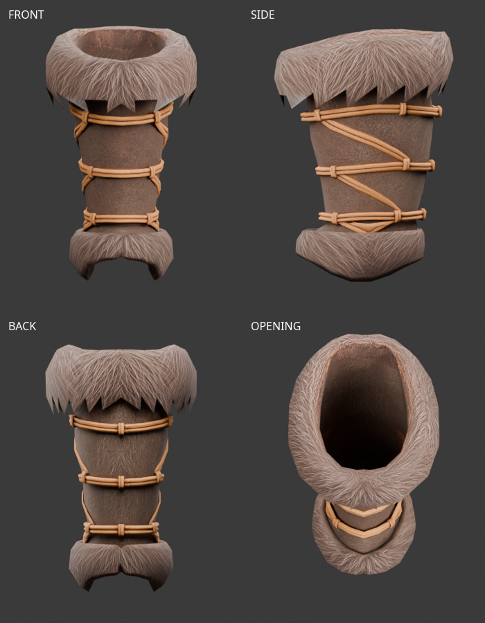
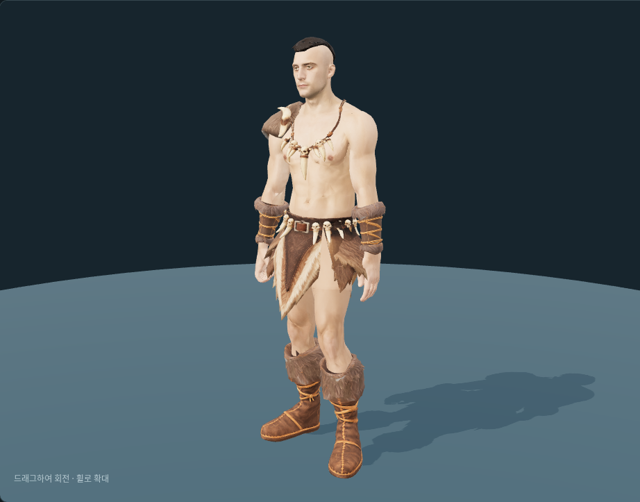
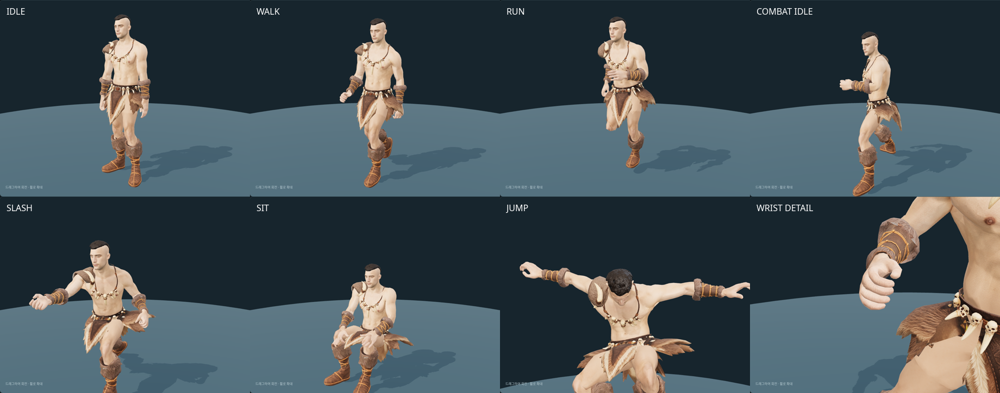

# 원시전사 손목 보호대 — Tripo 피팅·리깅

2026-10-04 사용자가 전달한 `fur+boot+3d+model.glb`를 원본 그대로 보관했다. 파일명에는 boot가 있으나 실제 형태는 앞서 선택한 손 장비 원화의 가죽·모피 손목 보호대다. 같은 날 실제 팔 단면에 피팅하고 반대쪽을 대칭 제작해 공통 리그에 연결했다.

원본은 **1,814 triangles**, UV 분리 포함 정점 2,192개, 메시와 재질 각 1개이며 내장 2048×2048 JPEG를 유지했다. 본과 애니메이션은 없다. 쿼드 수와 생성 시 요청한 폴리곤 수는 확인되지 않았다. 단순 대칭 쌍은 피팅 전 **3,628 triangles**에 해당한다.

가죽 통, 위·아래 모피, 세 줄의 끈과 매듭이 있다. 윗입구는 비어 있으며 손·손가락은 모델에 없다. 손목 쪽 입구와 털의 여유, 각진 모피 윤곽은 실제 팔에 맞추는 단계에서 확인한다.

진단용 용접 후 연결 성분은 23개, 경계 모서리 341개, 비다양체 모서리 360개다. 퇴화 면과 붕괴 UV 삼각형은 없다. 이 기록은 원본의 표면 구성 진단이며 몸체 착용이나 동작 검수 합격을 뜻하지 않는다. 원본 구조는 변경하지 않았다.

출처는 사용자 Tripo Studio 생성물이며 기존 출력물 이용 조건을 따른다. 생성일·작업 ID·현재 구독 등급·실제 제출 이미지는 별도 확인되지 않았다. 기존 약 USD 20/월 구독 정보는 이전 출처 기록으로 구분했다. 이번 검수에 추가 유료 생성은 없다.

- [출처·텍스처·원본 해시](modular-caveman-tripo-bracer-sources.json)
- [원본 구조 검사](modular-caveman-tripo-bracer-review-v1.json)

## 피팅·리깅 후보 v1 — 2026-10-04

현재 몸체 `parts/fitted/base.glb`와 `interfaces/v1`을 기준으로 48개 팔 단면·128개 둘레 방향을
샘플링했다. 손목에서 팔꿈치 방향으로 8–238mm 구간에 배치하며, 단면상 피부에서 최소 4mm 여유를 두고
원본 가죽·모피·끈의 높낮이를 유지한다. 피부 가림선 위로 약 16.4mm 겹친다.
원본 삼각형·UV·2048 텍스처는 변경하지 않았으며 쌍은 **3,628 triangles**다.

왼쪽을 먼저 피팅한 뒤 X 대칭과 삼각형 방향 반전으로 오른쪽을 만들었다. 기존 65본의 계층·
rest 변환·inverse bind를 그대로 사용한다. 왼쪽·오른쪽 ForeArm에 각각 100% 연결하므로
가죽 통이 손목 회전 때문에 늘어나지 않는다. 손과 손가락은 보호대 밖에서 독립적으로 움직인다.

미리보기의 손 장비에 `원시전사 모피 손목 보호대`를 추가했고 원시전사 세트 버튼에도 포함했다.
보호대를 불러온 경우에만 팔꿈치에서 손목으로 23% 지점 아래의 팔 피부를 가린다. 손은 가리지
않으며 벗거나 로딩이 실패하면 원래 피부로 복원한다. 보호대 원본은 변경하지 않고 별도로 보관했다.

실제 대기·걷기·달리기·점프·전투 대기·공격·앉기 클립을 각각 25회 샘플링했다. 본 연결,
가중치 합계와 유한 좌표를 검사했고 보호대 모서리 길이 오차는 최대 약 0.00003%다.
전투 대기·공격·앉기에서는 손목 입구를 확대 검토했다. 브라우저 오류는 없었으며
착탈·로딩 실패를 포함한 관련 테스트 **48개**, `npm run check`, `npm run lint`가 통과했다.

원시전사 세트의 절단 전 합계는 **31,537 triangles**, 미리보기에서 피부를 절단한 후
숨김 포함 **31,252**, 실제 표시 **29,246**, 얼굴 **1,505**다. 헤어 포함이며 무기는 제외했다.
예산 범위 15,000–20,000보다 크지만 숫자를 맞추기 위한 데시메이션은 하지 않았다.
사용자가 원시전사 세트의 착용 결과를 승인했다. 다른 소매와의 혼합 조합·게임 등록은 남아 있다.

- 최종 메시: `assets/modular_human_male_01/parts/caveman_tripo_bracer_v1/gloves_caveman.glb`
- 편집본: `assets/modular_human_male_01/parts/caveman_tripo_bracer_v1/caveman-bracer-fitting.blend`
- 편집본에는 공통 몸체와 리그, 피팅 쌍, 손목·팔뚝 기준 곡선과 숨긴 원본이 있으며 텍스처를 포함했다.
  하의 펠트 물리는 미리보기에서 실행되며 Blender에는 기준 자세를 보관한다.
- [피팅 치수·리그 검사](modular-caveman-tripo-bracer-fitting-v1.json)
- [실제 애니메이션 검사](modular-caveman-tripo-bracer-animation-v1.json)

추가 유료 생성 없이 사용자의 Tripo 원본으로 제작했다. 최종 GLB·Blender·원본의 바이너리는
커밋 워크플로우로 게시하고 `assets.lock`에 기록한다. 승인 후 개별 중간 렌더와 임시 스크립트·로그를
정리했으며 [정리 기록](modular-caveman-tripo-bracer-cleanup.json)에 범위를 남겼다.
