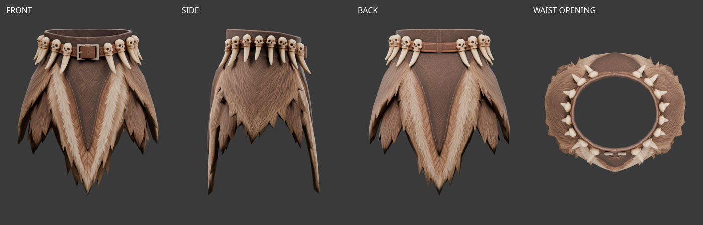
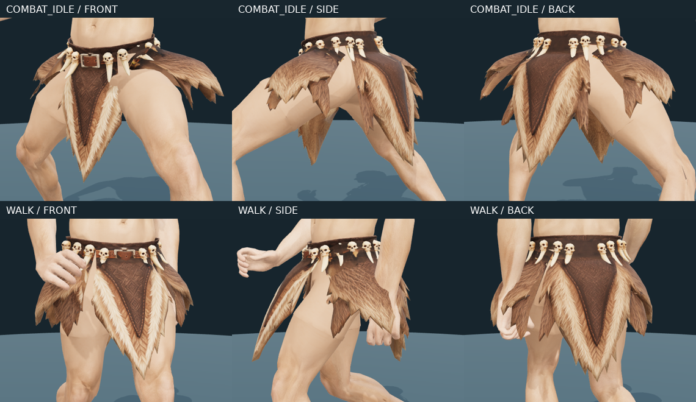
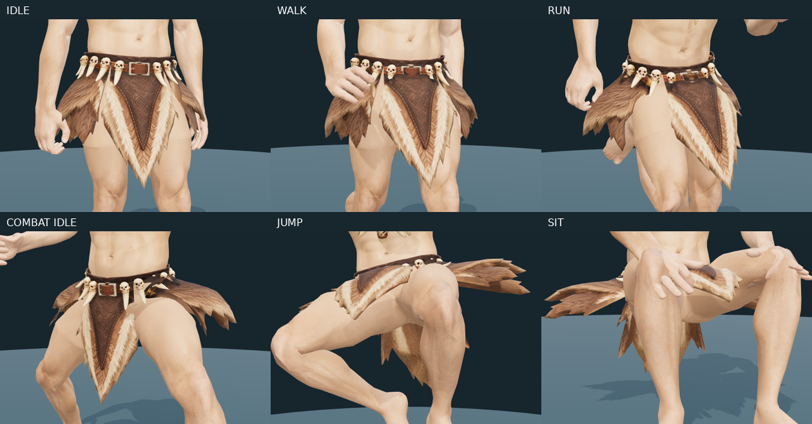

# 원시전사 하의 — Tripo 피팅과 모피 움직임

2026-10-04 사용자 전달 `skeletal+belt+3d+model.glb`를 그대로 보관하고 현재 공통 몸체에 피팅했다. 미리보기에서 상의와 함께 착용할 수 있으며 사용자가 최종 피팅과 움직임을 확인했다. 게임 장비 등록과 다른 세트의 장갑·부츠 조합 검수는 아직 하지 않았다.

원본은 **4,960 triangles**, UV 분리 포함 정점 6,575개, 메시·재질 각 1개다. 내장 2048×2048 JPEG는 그대로 유지했다. 생성 당시 쿼드 수는 확인되지 않았다. 원본 용접 진단의 연결 성분 19개 중 큰 성분은 가죽·모피이며 나머지 18개는 뼈 장식이다.



## 피팅·리깅

기준은 `parts/fitted/base.glb`, `interfaces/v1`, `human_male_01_mixamo_candidate_v2`의 기존 65본이다. 실제 몸체 허리 단면에 맞추고 내부 몸체와의 간격을 보정했다. 원본, 공통 몸체와 사용자가 선택한 상의는 변경하지 않았다.

허리띠·뼈 장식 2개 메시와 앞·뒤·왼쪽·오른쪽 모피 4개 메시로 분리했다. 분할선 UV를 보간하고 허리 아래에 17mm 겹침을 남겼다. 분할·겹침으로 최종 **5,797 triangles**다. 모든 정점은 **Hips 100%**이며 허벅지 본에 끌려 다리 사이로 늘어나는 가중치는 없다.

네 조각은 각자 허리에서 흔들린다. 끝으로 갈수록 아래로 완만하게 휘는 곡률에 모서리 길이 보정을 적용하고, 최대 연장을 2%＋1µm 오차로 제한한다. 벨트·해골·이빨에는 휘어짐을 적용하지 않는다. 기존 바바리안의 판·천에는 새 옵션을 적용하지 않는다.

옆 모피는 가벼운 설정과 이전 무거운 설정 사이로 조정했다. 감쇠 19, 복원 강도 52, 중력 반응 10, 몸체 이동에 대한 관성 입력 0.6, 최대 허리 힌지 각도 1.05rad다. 이전 무거운 설정(26/40/14/0.2/0.65rad)은 움직임이 너무 적다는 사용자 평가에 따라 대체했다.

양옆의 길이 50% 지점에 독립적인 두 번째 힌지를 추가했다. 길이의 14% 구간에서 접힘을 부드럽게 연결하고, 아래 절반은 감쇠 12·복원 강도 28·관성 반응 0.65로 허리 쪽보다 늦게 움직인다. 위·아래를 통째로 같은 각도로 회전시키지 않는다. 실제 원본 메시에서 위·아래 구간의 상대 기울기 변화가 약 21–23도까지 나타나는 것을 확인했다.

사용자가 측면에 표시한 세로 중심선을 따라 앞·뒤 날개가 안쪽으로 접히는 축도 추가했다. 원본 모피의 세로 중앙 경로를 따라 축을 잡아 몸체의 전역 Y축만 사용하지 않는다. 기본 접힘은 각 날개 0.16rad이며, 가로 힌지 움직임에 따라 감쇠 14·복원 강도 36으로 부드럽게 변한다. 중심선 주변 25mm에서 연결하고 허리의 위쪽 25mm는 고정한다. 기존 가운데 가로 굽힘과 세로 굽힘을 함께 적용한 뒤 동일한 길이 제한과 접촉 보정을 수행한다.

옆 천은 기본 최소 기울기 0.24rad로 피부에서 여유를 두고, 다리가 벌어지는 방향과 앞뒤 움직임에 비례한 0.45의 추가 반응으로 걷는 동안 조금 더 올라간다. 옆 허리 충돌 반경은 0.185/0.155/0.145m, 해당 허벅지는 0.115/0.215/0.132m로 넓혔다. 접촉하는 부분만 보정하며, 최종 길이 보정이 접촉을 되돌리지 않도록 접촉 표면은 512회 투영한다. 투영 중에도 2% 모서리 연장 제한을 유지한다.

뒷천의 아래 굽힘은 0.60에서 0.15로 줄이고 허벅지 접촉은 국소 보정으로 바꿨다. 전투 대기에서 전체 판을 들어 올리며 윗부분을 꺾던 동작을 줄여 허리 아래로 곧게 떨어진다. 앞천의 설정은 유지했다.



연결된 표면 방식은 사용자 요청과 다리 사이 변형을 만족하지 못해 **[미사용]**이다. 이후 네 개의 강체 판 방식은 판대기처럼 보인다는 사용자 지적에 따라 위 휘어짐 방식으로 대체했다.

## 확인 범위

실제 런타임 물리를 60Hz로 실행해 대기·걷기·달리기·점프·전투 대기·공격·앉기 7종을 검사했다. 원본 GLB 정점 대비 1mm 이상 모서리의 최대 연장은 약 **2.094%**다. 허리 장식의 형태 유지와 숨김·복원·재부착, 브라우저 로딩도 확인했다. 수치 검사는 극단 자세의 모든 관통이나 다른 장비와의 조합 합격을 뜻하지 않는다.



미리보기는 바바리안 하의의 피부 표시 규칙으로 맨다리를 복원한 뒤 바바리안 메시를 숨긴다. 상의에는 별도 피부 가림을 적용하지 않는다. 허리 장식은 하의 소속이며, 미제작 원시전사 손·부츠와의 혼합은 미검증이다.

현재 몸체 13,891＋헤어 933＋상의 2,110＋하의 5,797＝**22,731 triangles**, 표시 **22,360**, 얼굴 **1,505**다. 검·장갑·부츠는 포함하지 않는다. 대략적인 15,000–20,000 목표보다 크지만 숫자만 맞추는 데시메이션은 하지 않았다.

편집본 `caveman-pants-fitting.blend`에는 공통 몸체·리그·허리 기준선·원본 참조·6개 작업 메시가 있다. Blender는 기본 피팅 자세이며 움직임은 Three.js 미리보기에서 재현한다.

```bash
.venv/bin/python tools/fit-tripo-caveman-pants.py
node tools/validate-tripo-caveman-pants.mjs
blender -b --python-exit-code 1 --python tools/blender-scripts/review_tripo_caveman_pants.py
```

출처는 사용자 Tripo Studio 생성물이며 기존 출력물 이용 조건을 따른다. 생성일·작업 ID·실제 구독 등급·제출 이미지는 별도 확인되지 않았다. 이전 약 USD 20/월 구독 정보는 이전 출처 기록으로 구분했다. 추가 유료 생성은 없다.

- [출처·보관 파일·해시](modular-caveman-tripo-pants-sources.json)
- [피팅·리그 검사](modular-caveman-tripo-pants-fitting-v1.json)
- [실제 런타임 동작 검사](modular-caveman-tripo-pants-animation-v1.json)
