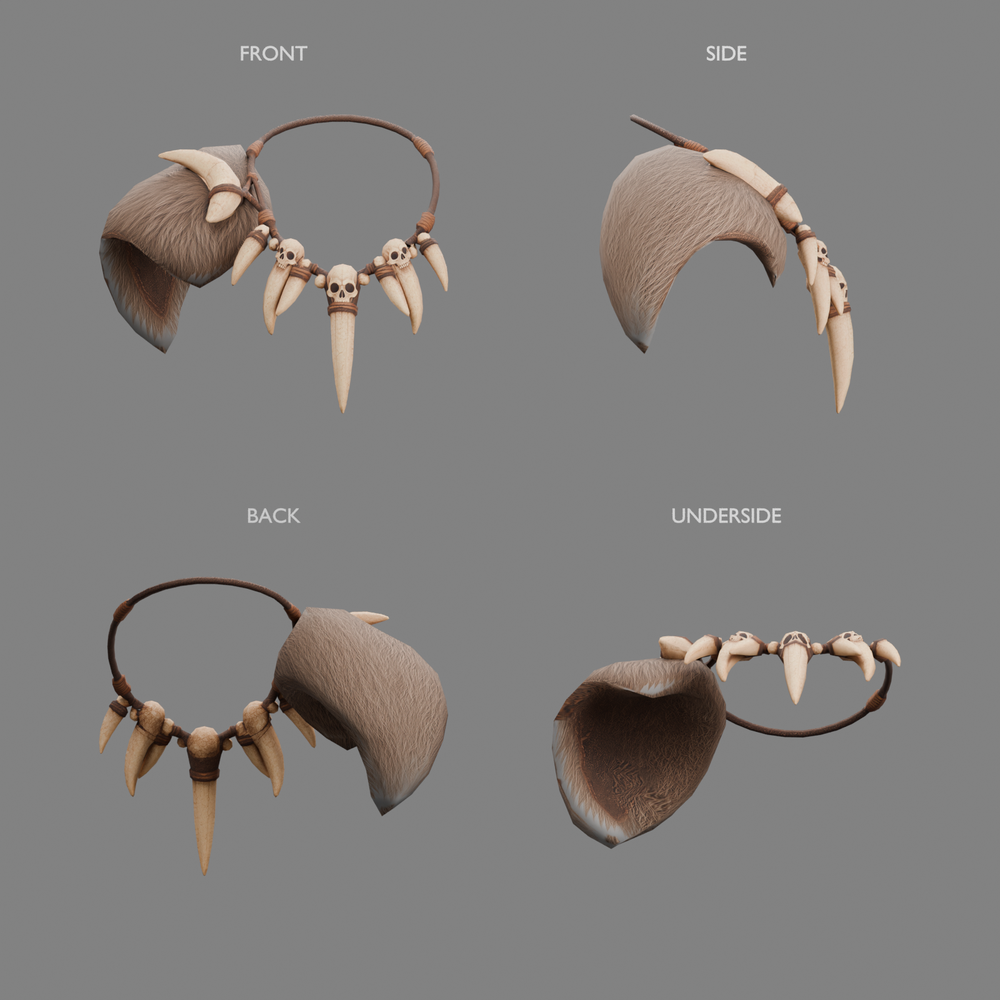
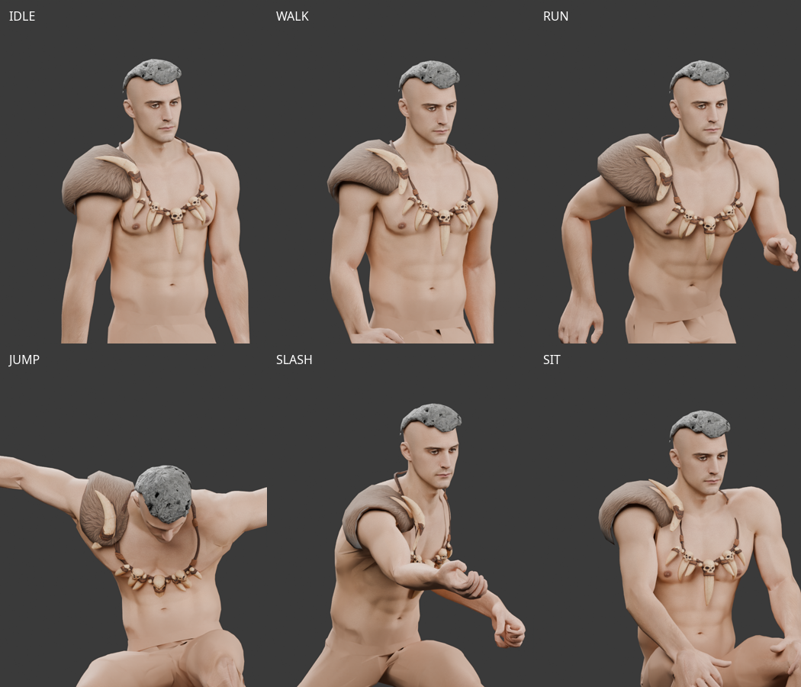
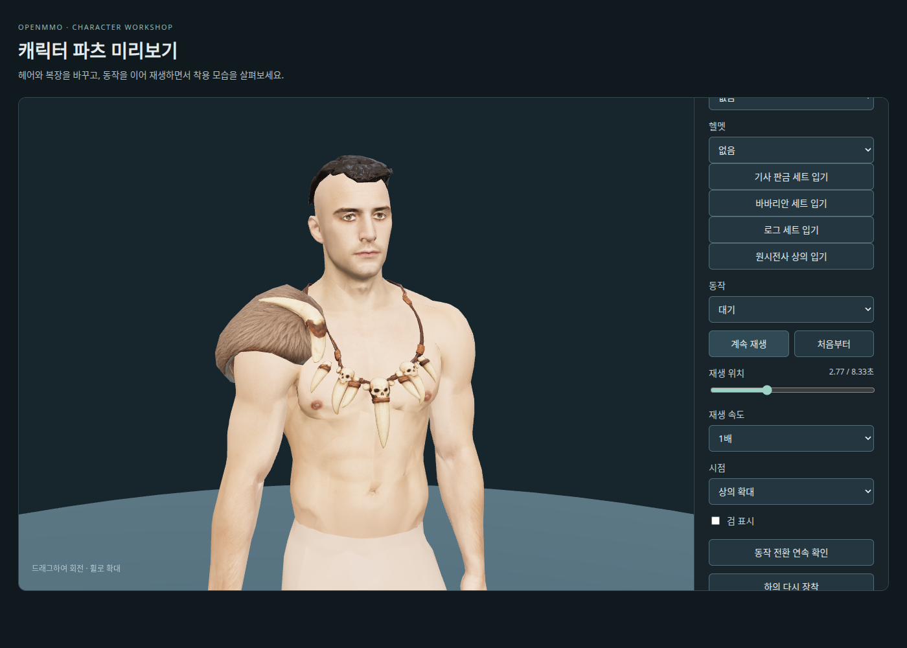

# Caveman 상의 — Tripo 원본과 피팅·리깅

2026-10-03 사용자가 Tripo Studio에서 생성한 상의를 전달했다.
`Y:\public\web_downloads\bone+necklace+3d+model.glb`는 현재 환경에서
`/mnt/y/web_downloads/bone+necklace+3d+model.glb`로 접근했다.



## 원본 확인

- **2,110 triangles**, UV 분할 포함 2,815 vertices. 앞서 제안한 2,000 triangles에 가깝다.
- 메시·재질 각 1개, 내장 2048×2048 JPEG 색상 텍스처 1장. 본·스킨·애니메이션은 없다.
- 정면에서 펠트가 화면 왼쪽에 있고, 측면과 아래쪽 렌더에서 둥근 어깨 공간과 안감이 보인다.
- UV 이음 정점을 0.00001 간격으로 진단용 용접한 사본은 연결 성분 3개, 경계 모서리 5개,
  비다양체 모서리 9개다. 원본 정점은 수정하지 않았으며 연결 성분의 장식 소속과 작은 열린 경계는
  피팅 때 확인한다. 퇴화 면·접힌 UV 삼각형은 현재 검사에서 0개다.
- 렌더는 원본을 따로 정규화해 전시한 결과다. 실제 몸체 착용·피팅·리깅 합격을 뜻하지 않는다.

## 보관 파일

- [전달 파일과 바이트가 같은 원본](../../assets/modular_human_male_01/parts/caveman_tripo_top_v1/source.glb).
- [출처·SHA-256·생성 정보](modular-caveman-tripo-top-sources.json),
  [원본 메시 진단](modular-caveman-tripo-top-review-v1.json),
  [피팅 후보 선택 명세](modular-caveman-source-selection.json).

원본은 그대로 보관하고 피팅 결과는 별도 GLB에 저장했다. 중복된 원본 검수 Blender는 삭제했으며,
최종 편집용 Blender 안에 수정하지 않은 Tripo 원본도 보관한다.

## 사용자가 선택한 피팅 (2026-10-04)



사용자가 첨부한 이전 동작 검수 화면의 형태를 선택했다. 이후 시도한 장식 위치·가중치와
동작 여유 공간 변경은 미채택으로 기록하고, 선택한 GLB를 바이트까지 동일하게 복원했다.
선택 파일 SHA-256은 `e495478ffdcf1d018a9c1faed604d91e92b6b2df91e1baf1599544800ad9ab9f`다.

- [피팅·리깅 GLB](../../assets/modular_human_male_01/parts/caveman_tripo_top_v1/top_caveman.glb).
- [텍스처·몸체·샘플 자세를 포함한 편집용 Blender](../../assets/modular_human_male_01/parts/caveman_tripo_top_v1/caveman-top-fitting.blend).
- [피팅과 본 검증](modular-caveman-tripo-top-fitting-v1.json),
  [런타임·91개 자세의 수치 검수](modular-caveman-tripo-top-animation-v1.json),
  [렌더·Blender 보관 기록](modular-caveman-tripo-top-fitted-review-v1.json).

현재 1.90m 남성 몸체와 같은 65본·기준 자세·inverse bind 행렬을 사용한다. 펠트는
착용자 오른쪽 어깨에 있고, 어깨 장식은 `RightShoulder`, 목걸이는 `Spine2`에 연결했다.
펠트는 `Spine2`·`RightShoulder`·`RightArm` 표면 가중치를 보간했다. 원본 2,110 triangles,
UV와 내장 2K JPEG를 유지했으며, 노멀은 피팅 형상에 맞춰 갱신했다.

실제 `bindModularPart` 연결과 idle·walk·run·jump·slash·combat idle·sit의 각 13개 자세에서
유한 좌표·UV 이음·뼈 장식의 형태 유지 검사를 통과했다. 렌더에서는 노출 피부를 유지했다.
이는 관통 없는 최종 게임 적용 승인을 뜻하지 않는다. 극단적인 점프에서 중앙 송곳니와 가슴,
앉기·공격 중 어깨 안쪽에는 관통 진단이 남는다. 선택한 모양을 우선 보존하며,
수치 결과와 미채택 보정 사유를 함께 기록했다. 보정본·중복 장면·재생성 가능한 자세 캐시는
사용자 요청으로 삭제했다. [정리 내역](modular-caveman-cleanup.json)을 참고한다.
게임 등록·혼합 장비 검증은 아직 진행하지 않았다.

몸체·crop 머리·이 상의만 합친 예산은 숨긴 영역 포함 **16,934 triangles**, 활성 영역
**16,563 triangles**다. 얼굴 할당 1,505 triangles는 유지했다. 아직 전달되지 않은 하의·손목
보호대·부츠와 무기는 이 합계에 포함하지 않는다.

재현 명령은 다음과 같다. Blender 타임라인의 REST와 7종 동작 마커는 샘플 자세이며 연속 애니메이션이 아니다.

```sh
.venv/bin/python tools/fit-tripo-caveman-top.py
.venv/bin/python tools/validate-tripo-caveman-top.py
blender -b --python-exit-code 1 --python tools/blender-scripts/review_tripo_caveman_top.py
```

## 출처와 이용 조건

- 생성 도구: 사용자 확인 **Tripo Studio**. 전달일은 2026-10-03이며 정확한 생성일은 미확인이다.
- 이전 [Tripo 출처 기록](modular-rogue-tripo-sources.json)에 사용자 보고 약 월 20달러 구독이 있다.
  이 파일의 구독 티어·작업 ID·모델 버전·실제 입력 이미지·프롬프트·폴리곤 설정은 별도 확인되지 않았다.
- 원본 Tripo Studio 출력물 이용 조건과 계정 출처를 따른다. GLB의 `asset.version=2.0`은
  glTF 파일 형식이며 Tripo 생성 모델 버전으로 기록하지 않는다.
- 비교 원화는 [부위 원화 기록](modular-caveman-parts-sources.json)의 ImageGen,
  **ChatGPT Pro 20x**, 2026-10-03 생성물이다. 실제 제출 이미지로 확인된 것은 아니다.
- 로컬 검수는 Blender 5.2.0 LTS와 프로젝트 Python 환경을 사용했다. 새 AI 생성·유료 호출은 없다.

## 로컬 제작 미리보기 (2026-10-04)

[원시전사 상의 미리보기](https://localhost:10004/modular-character-preview.html?outfit=caveman)를
열면 선택한 원본 피팅 GLB를 직접 불러와 상의 확대·대기 동작으로 시작한다. 검·다른 의상은
초기 상태에서 숨기고 노출된 가슴·목·팔을 유지한다. 상의 선택과 「원시전사 상의 입기」 버튼으로
다시 착용할 수 있으며, 기존 동작·회전·확대·재생 위치 조절을 사용한다.



[브라우저 검증 기록](modular-caveman-tripo-top-workshop-v1.json): 7종 동작의 21개 샘플,
다른 상의와의 교체, 피부 표시, 에셋 로딩을 확인했다. 표시 합계는 16,563 triangles다.
미리보기 전용 연결이며 일반 게임의 의상 슬롯에는 아직 등록하지 않았다.
