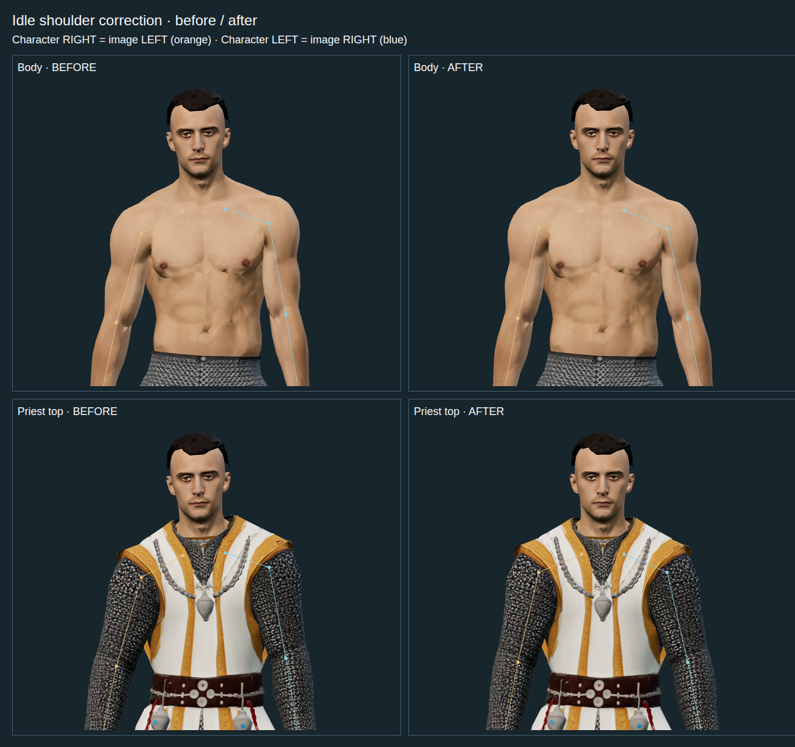
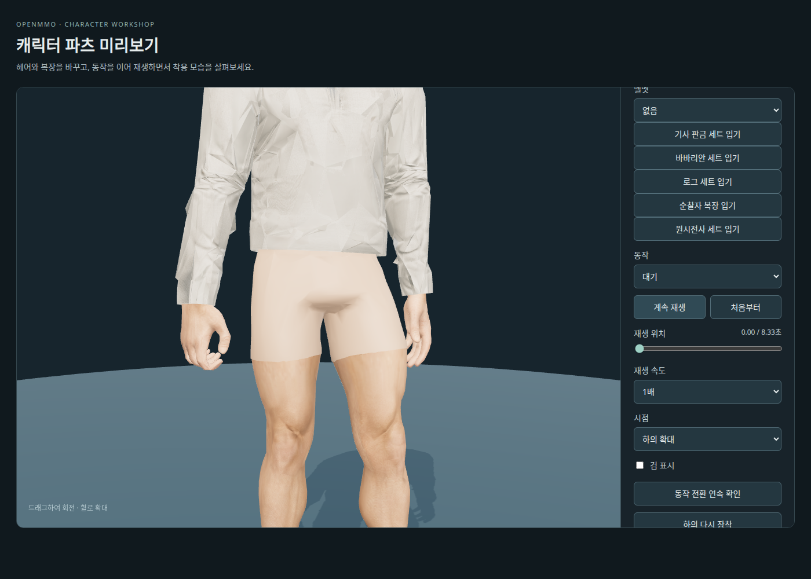
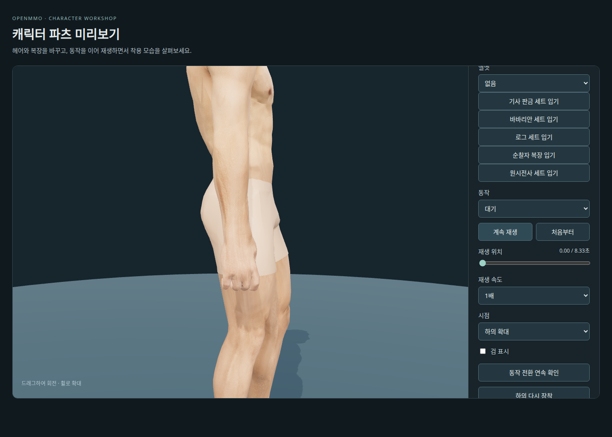
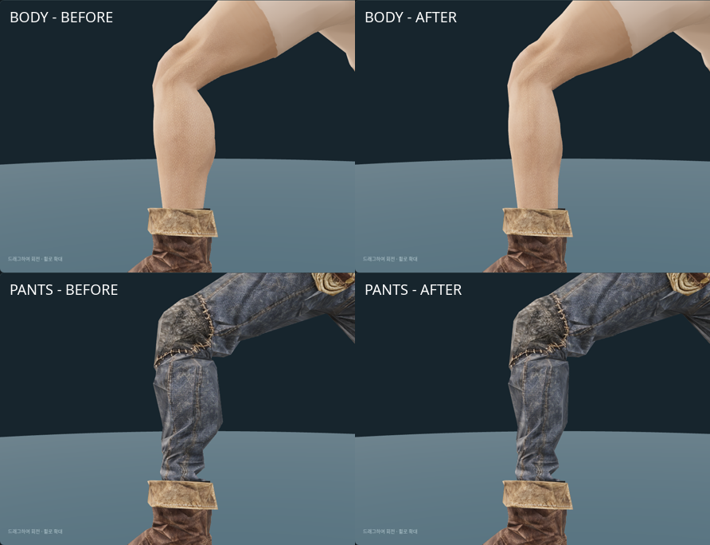
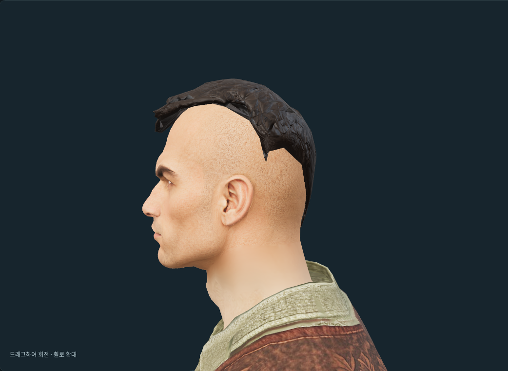
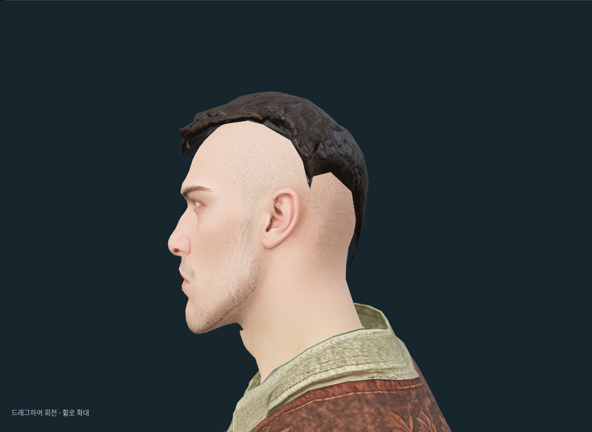

# Modular Human Male 01 — 최종 보관 파일

2026-09-29 사용자 요청으로 중간 작업물과 검증·테스트 파일을 정리했다.
기본 파츠, 편집용 원본, 애니메이션과 검 그립 설정 11파일을 남겼다.
같은 날 [기사 판금 세트](modular-knight-plate.md)의 파츠·입력 원본·편집 파일 11개를 추가했다.
게임과 미리보기에서 사용하는 기존 경로는 유지한다.

2026-09-30 [바바리안 복장](modular-barbarian.md)의 5종 파츠와
`barbarian_parts.blend`, `parts/barbarian_sources/`의 생성 원본을 추가했다.
같은 리그를 사용하며 제작 미리보기에서 부위별로 교체한다.

같은 날 바바리안 착용 시 보이던 속옷 영역을 사용자의 요청으로 피부 재질로 변경했다.
최초의 1,180 triangles·71개 UV 조각 재배치는 피부 경계선이 남아 대체했다.
원래 UV를 복원하고 새 피부 소재를 골반·허벅지에 연속 베이크한 `restored_skin`을 사용한다.
경계의 색·법선·거칠기와 정점 법선을 함께 연결하며 얼굴 텍스처, 몸체 정점 위치·삼각형·
스킨 가중치·리그는 유지한다. 보존 원본은 `parts/skin_sources/`에 있다.
몸체 GLB 제작용·게임용과 `character_parts.blend`, `plate_parts.blend`,
`barbarian_parts.blend`에 반영했다. 재처리 도구는 `tools/restore-modular-skin.py`이며,
세부 내용은 [바바리안 복장 기록](modular-barbarian.md)을 따른다.
후속 수정에서 속옷 선택 시 기존 반바지 재질을 복원하도록 했다. 바바리안 하의에서는
연속 피부 재질을 사용하며, 몸체 자산을 추가하거나 복제하지 않고 메시별 재질 참조를 전환한다.

## 파일 구성

| 경로 (`assets/modular_human_male_01/` 기준) | 용도 |
| --- | --- |
| `parts/fitted/base.glb` | 영역별로 분리한 최종 몸체 |
| `parts/fitted/hair_crop.glb` | 짧은 크롭 헤어 |
| `parts/fitted/hair_sidepart.glb` | 짧은 옆가르마 헤어 |
| `parts/fitted/top_linen.glb` | 천 셔츠와 갑옷용 목깃·앞트임 안감 |
| `parts/fitted/top_leather.glb` | 가죽 갑옷 |
| `parts/fitted/pants_cloth.glb` | 천 바지와 부츠 착용용 끝단 |
| `parts/fitted/gloves_leather.glb` | 가죽 장갑 |
| `parts/fitted/boots_leather.glb` | 가죽 부츠 |
| `parts/fitted/character_parts.blend` | 최종 파츠 편집 원본; 24개 이미지 내장, 외부 라이브러리 없음 |
| `rigged_hand_tuned/animations.glb` | 손가락·어깨·대기 자세·접지 보정을 저장한 7동작 |
| `rigged_hand_tuned/hand-grips.json` | 동작별 검 부착 위치·회전과 손 자세 프로파일 |
| `parts/fitted/*_plate.glb` | 기사 판금 갑옷·바지·장갑·신발·헬멧 5종 |
| `parts/fitted/plate_parts.blend` | 한 리그와 내장 텍스처를 사용하는 판금 편집 원본 |
| `parts/plate_sources/*_plate.glb` | 판금 재가공용 Meshy 입력 GLB 5종 |

최종 파츠는 `human_male_01_mixamo_candidate_v2`의 같은 65본과 기준 자세를 사용한다.
몸체는 숨김 영역을 포함해 13,891 triangles, 얼굴 지정 영역은 1,505 triangles다.
가죽 갑옷 착용 시 안쪽 셔츠의 겨드랑이·소매·목깃·앞트임 안감을 표시하고, 부츠 착탈에 따라 바지 끝단을 바꾼다.
천 셔츠 밑단은 허리밴드 안으로 들어간다. 가리는 몸체·의상 영역은 런타임에서 숨긴다.

여기서 최종은 현재 보관·사용하는 버전을 뜻한다. 장갑 겹침, 의상·헤어의 시각 품질과
숨긴 형상을 포함한 조합 폴리곤 예산 검토는 남아 있다.

## 사용과 복원

저장소 루트에서 최종 제작 에셋만 복원한다.

```sh
bash tools/fetch-assets.sh assets/modular_human_male_01/
```

개발 서버의 `/modular-character-preview.html`에서 헤어·복장·색상과 동작을 확인한다.
미리보기는 확정 애니메이션만 사용하며, 삭제한 이전 손 자세와의 비교 기능은 제공하지 않는다.

게임용 압축 파츠 10개와 동작 9팩은 `client/public/models/characters/modular_male/`에 있다.
재생성에는 위 최종 파일과 기존 공용 애니메이션 팩을 사용한다.

```sh
node tools/prepare-modular-character.mjs
```

프로젝트 `.venv`의 Pillow·NumPy와 클라이언트 Node 의존성이 필요하다.
출력과 입력 해시는 [게임 manifest](../../client/public/models/characters/modular_male/manifest.json)에 기록한다.
파츠를 만들 때 신발별 접지 높이를 [modularSoleOffsets.json](../../client/src/lib/utils/modularSoleOffsets.json)에 함께 기록한다.
GLB를 다시 만들지 않고 높이만 다시 재려면 `--sole-offsets`를 쓴다.
완성된 전용 애니메이션은 다시 리타게팅하거나 접지·손가락 보정을 중복 적용하지 않는다.
검 부착 트랙은 `hand-grips.json`에서 가져와 캐릭터 믹서에서 함께 혼합한다.

## 일반 대기 자세의 어깨 펴기 — 2026-10-04

사용자 요청으로 일반 대기(`idle1`)에서 양쪽 어깨를 조금 뒤로 열었다.
`Spine2` 좌표의 Y축을 기준으로 `LeftShoulder`는 +6도, `RightShoulder`는
-6도 회전한다. 상완 관절은 동작 전체에서 약 13mm 뒤로 이동한다.
기존 호흡·몸통·머리·하체·손가락 트랙, 기준 골격과 의상 형상은 유지한다.
전투 대기를 포함한 다른 동작은 변경하지 않았다.

제작 미리보기용 `rigged_hand_tuned/animations.glb`에 보정값을 저장하고
게임용 `locomotion.glb`를 다시 만들었다. 게임의 `idle2`~`idle5`는 기존에도
`idle1`의 복제이므로 같은 보정을 받는다. 나머지 8개 동작 팩은 파일 해시가 동일하다.
기존 사용자 제공 Mixamo 애니메이션을 로컬에서 편집했으며 출처·라이선스는 유지한다.
추가 AI 생성이나 유료 호출은 없다. 수정 전 제작 파일은
Hugging Face 자산 저장소의 revision `33a8a0642c25af1364ad6feea5ee2cf176c300b9`에 보존된다.

```sh
.venv/bin/python tools/adjust-modular-idle-shoulders.py --degrees 6
node tools/prepare-modular-character.mjs --pack locomotion
```

도구는 기록된 보정값과의 차이만 적용하므로 재실행해도 중복 회전하지 않는다.
다른 각도를 지정해 같은 파일을 조정할 수 있으며 `--degrees 0`은 보정을 해제한다.

제작본 452개·게임본 560개의 나머지 트랙과 모든 키프레임 시간값이 그대로임을 확인했다.
대기 25시점의 머리·양발 위치 차이는 0이고, 정면·측면의 의상 착용 및 맨몸을 비교했다.
복장 미리보기 7동작·21자세, GLB 2파일 검증 오류·경고 0, 관련 테스트 33개를 통과했다.
해시와 관절 위치 차이는 [검증 기록](modular-idle-shoulders.json)에 있다.

## 일반 대기 자세의 좌우 대칭 — 2026-10-09

사용자가 대기 중 캐릭터 왼쪽 어깨가 올라가고 오른쪽 어깨가 내려가는 차이를 확인했다.
기존 자세는 상체의 옆 기울기 약 3°와 양팔 벌림 약 7°/19°가 겹쳐 있었다.
40% 시점의 상완 관절 높이 차이는 몸통 좌표에서 약 6.4mm, 실제 모델 좌표에서는 약 29.4mm였다.

`idle1`의 양쪽 쇄골·상완·팔뚝·손 회전은 좌우 반전한 쿼터니언의 중간값으로 맞췄다.
`Spine2`는 월드 기준 좌우 기울기·비틀림을 제거하고 앞뒤 회전 성분을 유지한다.
골반·하체·손가락·머리 트랙과 기준 골격·inverse bind·의상 형상은 유지한다.
기존 6° 어깨 뒤로 열기도 유지한다. 이 보정은 본 자세의 대칭이며 메시·가중치의 완전 대칭은 아니다.

제작용 `rigged_hand_tuned/animations.glb`와 게임용 `locomotion.glb`에 반영했다.
게임의 `idle2`~`idle5`도 같은 보정된 `idle1` 복제다. 다른 동작·키 시간·길이는 바꾸지 않았다.
각 대기를 501시점 검사해 상완 관절 높이 차이 최대 **0.032mm**, 좌우 반전 팔 관절 오차
최대 **0.583mm**, 양팔 벌림 **12.85–13.52°**를 확인했다.
기준 골격 일치·가중치 기준 유지·회전 정규화·재실행 시 결과 불변도 확인했다.

```sh
.venv/bin/python tools/symmetrize-modular-idle.py
node tools/prepare-modular-character.mjs --pack locomotion
node tools/validate-modular-idle-symmetry.mjs
```

기존 사용자 제공 Mixamo 애니메이션을 로컬에서 편집했으며 추가 생성·유료 호출은 없다.
수정 전 파일의 보관 revision과 입력·출력 해시는 [대칭 검사](modular-idle-symmetry-v1.json),
변경한 9개 회전 트랙과 출처·검증은 [편집 기록](modular-idle-symmetry-edit-v1.json)에 있다.
정면 정투영 비교의 왼쪽 열은 수정 전, 오른쪽 열은 수정 후다. 주황색은 캐릭터 오른팔이다.



## 검 그립 보정 — 2026-09-29

대기·걷기·달리기·점프·전투 대기·공격의 오른손을 같은 손잡이 둘레에 맞췄다.
검지·새끼의 과도한 접힘을 풀고 중지·약지의 끝마디를 조정했으며,
엄지는 검지 쪽 손잡이를 감싸도록 바꿨다. 손잡이 중심을 손바닥 앞쪽으로
약 11mm, 손바닥 면에서 바깥쪽으로 약 14mm 옮겨 검지 안에 파묻히던 위치를 조정했다.
기존 일반 대기의 별도 위치 보정은 새 공통 그립으로 대체했다.

걷기의 검 부착 회전은 오른손목 트랙으로 옮겨 손 안에서 검이 따로 기울지 않게 했다.
검의 기존 월드 회전과의 최대 차이는 241시점에서 0.006도 미만이다.
최종 손가락 회전은 `animations.glb`에 저장하고 `hand-grips.json`의
`sword_grip`에 기록했다. 게임용 9팩도 재생성했으며 추가 AI 생성·크레딧 사용은 없다.

오른손 보정 이외의 원본 트랙 363개가 유지되는 것을 확인했다.
애니메이션 GLB 10개는 glTF Validator 지적 0, 게임 로더는 51클립·255포즈 검사 통과다.
제작 미리보기의 6동작·18포즈와 맨손·판금 장갑 확대를 확인했으며,
관련 테스트 36개, `npm run check`, `npm run lint`도 통과했다.

## 판금 바지용 셔츠 밑단 보정 — 2026-09-29

천 바지보다 앞쪽 허리선이 안으로 들어간 판금 바지에서 셔츠가 벨트를 관통하던 부분을 수정했다.
셔츠 몸통의 높이 1.165m 아래를 부드럽게 좁혀 밑단이 두 바지의 허리밴드 안으로 들어가게 했다.
삼각형 수·UV·텍스처·스킨 가중치와 소매·목깃은 유지했다. 제작용·게임용 `top_linen.glb`와
`character_parts.blend`를 갱신했으며 추가 AI 생성·크레딧 사용은 없다.

천·판금 바지의 정면·측면·후면과 걷기·달리기를 비교했다. 게임용 압축본은
대기·걷기·달리기·점프·전투 대기·공격의 12포즈·36시점에서 허리 경계를 확인했다.
GLB 2종의 검증 오류와 브라우저 오류는 0이며, GLB별 기존 경고 8개는 변경 전과 같다.
Blender 원본과 제작 GLB의 셔츠 정점 위치도 일치한다.

## 기본 천 셔츠와 속옷의 허리 연결 — 2026-10-08

기본 천 셔츠(`top=linen`)와 속옷(`pants=none`) 조합에서 조여진 셔츠 밑단과
함께 숨겨진 허리 몸체 때문에 허리 사이가 비어 보이던 문제를 수정했다.
이 조합에서는 하단 몸통을 바깥쪽으로 펴고 Y=1.135–1.20m에서 원래 형상으로 부드럽게 연결한다.
완전히 펼친 기준 단면은 좌우 반경 0.185m·앞뒤 반경 0.14m, 중심 Z=-0.015m다.
셔츠 Y 좌표·UV·인덱스·스킨 가중치는 유지한다. 아래쪽 법선을 다시 계산하고
Y=1.20m 위의 원래 사용자 법선, 소매·목깃은 유지한다.

허리 몸체는 Y=1.09m 아래를 복원해 약 1.065m의 셔츠 밑단 안쪽에서 겹친다.
천·판금·사제 바지로 교체하면 원래 넣어 입는 형상과 피부 가림으로 복원한다.
상의 제거 시 몸체 전체를 복원하며, 셔츠 몸통이 없으면 허리 몸체를 자르지 않는다.
사제 상의의 내부 대리 셔츠에는 이 보정을 적용하지 않는다. 원본 GLB는 수정하지 않았다.

네 방향의 기본 자세와 대표 동작 7종의 각 40% 시점을 앞뒤에서 확인했다.
실제 자산의 91시점 검사에서 셔츠 정점이 유한하며, 움직이는 골반 기준에서 허리 상단이
셔츠 밑단을 보수적으로 최소 약 21.2mm 덮는다. 전체 표면의 충돌 합격은 아니다.
원본 인덱스·UV·가중치, 상단 형상·법선과 착탈 복원을 확인했고,
타입 검사·린트·관련 테스트 88개가 통과했다.
[브라우저 검사](modular-linen-underwear-waist-review-v1.json),
[실제 자산 동작 검사](modular-linen-underwear-waist-validation-v1.json).



위 이미지는 기존 자산을 표시한 로컬 Chromium 제작실 화면 캡처다. 원본 Meshy·Mixamo
출처와 이용 조건을 따르며 새 AI 생성·크레딧 사용은 없다.
재현: `node tools/validate-linen-waist.mjs`.

## 속옷 허리–엉덩이 실루엣 — 2026-10-08

속옷의 잘록한 허리에서 엉덩이로 갑자기 튀어나오던 후면을 기존 판금 하의의 부드러운 곡선에 맞췄다.
속옷은 기본 몸체의 재질 영역이므로 `pants=none`일 때 몸통과 다리의 뒤쪽 형상을 함께 보정한다.
판금 후면을 좌우 대칭·XY ±12mm로 평활화하고 Z=-25mm를 중심으로 깊이의 90%를 사용한다.
Y=0.76–0.86m에서 보정을 시작하고 Y=1.14–1.20m에서 원래 몸통으로 부드럽게 연결한다.
앞면·X/Y·하단 다리·상체·얼굴과 UV·인덱스·가중치를 유지하며 다른 하의로 교체하면 원래 형상을 복원한다.
원본 GLB는 수정하지 않는다. 셔츠 허리 절단과 함께 적용되며 상의 제거 시 속옷 형상으로 복원한다.



[수정 전](../images/characters/modular_human_male_01/parts/underwear/underwear-seat-v1-before-side.png),
[판금 기준](../images/characters/modular_human_male_01/parts/underwear/underwear-seat-v1-plate-side.png),
[셔츠 착용](../images/characters/modular_human_male_01/parts/underwear/underwear-seat-v1-linen-side.png).
네 방향과 대표 동작 7종의 앞뒤 각 40% 시점을 확인했다.
실제 자산 91시점 검사에서 유한 정점과 기본 자세의 몸통·다리 이음 위치 일치를 확인했고,
다른 하의 교체·반복 선택·셔츠 착탈도 통과했다. 타입 검사·린트·관련 테스트 68개가 통과했다.
[실루엣 검수](modular-underwear-seat-review-v1.json), [형상·동작 검사](modular-underwear-seat-validation-v1.json).
[셔츠 허리 회귀 검사](modular-linen-underwear-waist-validation-v2.json)의 보수적 수직 겹침은 최소 약 21.2mm다.
이 검사는 전체 표면 충돌의 합격을 뜻하지 않는다.

기본 몸체의 숨김 포함 **13,891 triangles**, 얼굴 배분 **1,505**를 유지한다.
이미지는 로컬 Chromium 화면 캡처이며 기존 Meshy·Mixamo 몸체와 판금 하의의 출처·이용 조건을 따른다.
새 AI 생성·크레딧 사용은 없다. **[미사용]** 보정 전 속옷 실루엣은 수정하지 않은 원본 GLB에서 비교할 수 있다.
재현: `.venv/bin/python tools/measure-underwear-seat.py`, `node tools/validate-underwear-seat.mjs`.

## 가죽 갑옷 길이·허리 보정 — 2026-09-29

가죽 갑옷의 앞자락 최저점을 0.96m에서 1.10m로 올려 허리띠 윗부분을 살짝 덮도록 줄였다.
가슴·어깨 형상은 유지하고, 높이 1.30m 아래에서 허리로 내려갈수록 폭과 두께를 최대 14% 좁혔다.
앞트임·버클·테두리와 기존 UV·텍스처·스킨 가중치는 유지하며, 가죽 갑옷은 기존 **3,757 triangles**다.

짧아진 앞트임 뒤에는 기존 셔츠 면 135 triangles를 안쪽으로 넣어 목깃 영역에 추가했다.
셔츠 단독 착용에서는 숨기며, 셔츠 파츠의 숨김 포함 합계는 **4,744 triangles**다.
가죽 갑옷과 천 바지를 조합할 때는 바지 허리 영역도 표시해 밑단 아래 빈틈을 막는다.
제작 GLB 2종·게임용 셔츠·`character_parts.blend`를 갱신했다. 추가 AI 생성·크레딧 사용은 없다.

천·판금 바지의 정면·측면·후면과 6동작·12포즈·36시점에서 허리 경계를 확인했다.
GLB 오류·브라우저 오류 0, 기존 GLB 경고는 유지된다. 관련 테스트 20개와
`npm run check`, `npm run lint`를 통과했다.

후속 겨드랑이 보정: 아래 테두리에 섞인 팔 가중치 때문에 전투 자세에서 뾰족하게
끌려 나오던 부분을 수정했다. 양쪽 겨드랑이 아래는 몸통 가중치를 따르게 하고 위쪽으로
부드럽게 전환했다. 정점 위치·삼각형·UV·텍스처와 앞서 맞춘 길이·허리 형상은 유지한다.
제작 GLB와 Blender 원본에 반영했으며, 6동작의 양쪽 겨드랑이를 36시점에서 확인했다.
GLB 오류·브라우저 오류 0, GLB의 기존 경고 2개는 동일하다. 추가 생성 비용은 없다.

## 속옷 차림의 발목 연결 — 2026-09-29

신발을 신으면 숨기는 발 영역에 발목까지 포함되어, 하의를 벗었을 때 신발 위로 틈이 드러났다.
맨발용 발목(`ankles`)과 신발용 발목(`boot_ankles`)을 분리했다. 신발 밖으로 드러나는
발목은 원래 굵기를 유지하고, 신발 안에 가려지는 아래쪽만 맞춘다. 하의를 입으면 두 영역을 숨기고, 속옷 차림에서는 신발
착용 여부에 맞는 영역만 표시한다. 기존 맨발의 형상·UV·스킨 가중치와 리그는 유지한다.

신발용 발목 371 triangles가 추가되어 몸체의 숨김 포함 합계는 13,891이다.
속옷·크롭 헤어·철검 조합은 판금 신발에서 합계 15,835 / 표시 14,200,
가죽 신발에서 합계 16,581 / 표시 14,946 triangles다. 망토는 포함하지 않는다.
얼굴 지정 영역 1,505 triangles와 텍스처는 유지했다.

제작용·게임용 `base.glb`, `character_parts.blend`, `plate_parts.blend`와 게임 manifest를 갱신했다.
기존 몸체를 로컬에서 편집했으며 추가 AI 생성·크레딧 사용은 없다.
가죽·판금 신발의 6동작·12포즈·72시점과 맨발의 정면·측면·후면을 확인했다.
게임용 형상은 제작용과 일치하며, Blender 원본의 위치 차이는 0.005mm 미만이다.
GLB 2종의 오류는 0이다. 기존 경고 16개에 새 파츠의 자동 접선 생성 경고 3개가 추가된다.
관련 테스트 36개, `npm run check`, `npm run lint`를 통과했다.

같은 날 굵기 보정: 처음 적용한 발목 축소가 너무 가늘다는 사용자 피드백에 따라,
높이 0.225m 위의 신발용 발목을 원래 굵기로 복원했다. 축소는 신발 내부의 0.15~0.225m에만
부드럽게 적용한다. 판금 신발 입구의 좌우 폭은 최대 55%, 앞뒤 폭은 45% 넓히고 뒤로 22mm 옮겼다.
가죽 신발 입구는 좌우·앞뒤를 최대 20% 넓히고 뒤로 7mm 옮겼다. 판금 바지 밑단도 같은
변형으로 맞춰 신발 바깥을 덮게 했다. 발끝·밑창, UV·스킨 가중치, 삼각형 수는 유지한다.

제작용·게임용 몸체·신발 2종·판금 바지와 두 Blender 원본에 반영했다. 추가 생성 비용은 없다.
속옷 차림 72시점, 판금 바지 36시점에서 6동작을 확인하고 천 바지 조합도 비교했다.
GLB 8파일의 검증 오류 0, 기존 경고 유지, 관련 테스트 36개 통과다.
Blender의 수정 메시와 제작 GLB의 최대 위치 차이는 0.007mm 미만이다.

## 천 바지의 신발용 밑단 보정 — 2026-09-29

천 바지가 신발 입구 안쪽으로 튀어나오던 부분을 수정했다. 신발용 `tucked_cuffs`의
다리가 마주 보는 안쪽 면만 정강이 축 쪽으로 최대 8mm 옮겼다. 안쪽 거리 35mm에 걸쳐
부드럽게 적용하며, 높이 0.235m부터 효과를 줄여 0.32m 위는 기존 모양을 유지한다.
좌우 폭·앞뒤 단면 두께·높이, 맨발용 밑단·바지 몸통·허리와 연결선,
UV·텍스처·스킨 가중치는 원래대로 유지한다.

사용자가 표시한 앞쪽 돌출과 뒤쪽 틈은 밑단을 뒤로 옮겨 맞췄다. 신발용 밑단의 높이
0.225m 아래는 뒤로 25mm 이동하고, 0.33m까지 부드럽게 원래 위치로 연결한다.
앞쪽 천은 신발 테두리 안으로 들어가고 뒤쪽은 신발 입구에 가까워진다.
단면을 축소하지 않으며, 앞선 안쪽 면 보정과 신발 자체 형상은 유지한다.

**[미사용]** 최초의 좌우 25%·앞뒤 30% 축소와 뒤로 12mm 이동은 발목이 너무 가늘다는
사용자 피드백으로 되돌렸다. 원래 형상에 안쪽 면 보정과 밑단의 후방 이동을 적용하고,
아래의 발목 굵기 보정을 더한 것이 최종본이다.

천 바지의 숨김 포함 합계는 2,556 triangles, 신발용 밑단은 647로 동일하다.
상의 없음·천 바지·크롭 헤어·철검 조합은 판금 신발에서 합계 18,391 / 표시 13,504,
가죽 신발에서 합계 19,137 / 표시 14,250 triangles다. 망토는 포함하지 않으며 얼굴 지정 영역은
기존 1,505 triangles다. 제작용·게임용 `pants_cloth.glb`, `character_parts.blend`와
게임 manifest를 갱신했다. 기존 파츠의 로컬 편집으로 추가 AI 생성·크레딧 사용은 없다.

가죽·판금 신발의 대기·걷기·달리기·점프·전투 대기·공격을 12포즈·72시점에서 확인했다.
GLB 2종의 오류와 브라우저 오류는 0이며 GLB별 기존 경고 8개는 동일하다.
게임용 형상·스킨 데이터는 제작용과 일치하고, Blender 원본의 위치 차이는 0.005mm 미만이다.

## 천 바지 발목 굵기 보정 — 2026-09-29

사용자가 빨간 선으로 표시한 부츠 위의 가는 부분을 조금 넓혔다. 신발용 `tucked_cuffs`의
좌우 단면은 최대 12%, 앞뒤는 최대 8% 확장했다. 높이 0.19~0.235m에서 효과를 부드럽게
늘리고, 0.265~0.37m에서 줄여 종아리와 연결한다. 기존 후방 이동을 반영한 정강이 축을
기준으로 확장하며, 정점 이동은 최대 6.81mm다. 맨 아래 끝단과 상단 연결선은 유지한다.

맨발용 밑단·바지 몸통·허리·신발 형상, UV·텍스처·스킨 가중치·리그·삼각형 수는 동일하다.
제작용·게임용 `pants_cloth.glb`, `character_parts.blend`와 게임 manifest를 갱신했다.
기존 파츠의 로컬 편집으로 추가 AI 생성·크레딧 사용은 없다.

가죽·판금 신발의 6동작·12포즈·72시점을 확인했다. GLB 2종의 오류는 0이며 기존 경고
8개씩은 유지된다. 게임용 형상·스킨 데이터는 제작용과 일치하고, Blender 원본과의
최대 위치 차이는 0.004mm 미만이다.

후속 앞면 보정: 사용자가 추가로 표시한 부츠 바로 위의 오목한 주름을 채웠다.
높이 0.205~0.30m의 앞면에서 주변 윤곽보다 들어간 정점만 앞으로 이동하고, 위아래와
측면으로 갈수록 효과를 줄였다. 변경한 298정점의 이동 중앙값은 7.76mm, 최대는 22.39mm다.
좌우 폭·높이·뒷면, 신발 안쪽 끝단과 기존 연결선은 유지했다. 제작용·게임용 천 바지와
Blender 원본을 갱신했으며, 양쪽 발목 확대와 가죽·판금 신발의 6동작·72시점을 확인했다.
GLB 오류 0·기존 경고 유지, 제작용과 게임용 형상 일치, Blender 위치 차이 0.004mm 미만이다.
추가 AI 생성·크레딧 사용은 없다.

후속 옆면 보정: 비스듬한 정면에서 표시한 캐릭터 왼쪽 발목 바깥 면의 꺼짐을 채웠다.
높이 0.205~0.31m의 해당 면에서 43정점만 바깥으로 옮겼으며, 이동 중앙값은 0.50mm,
최대는 4.04mm다. 높이·앞뒤 좌표와 반대쪽 다리는 유지한다. 제작용·게임용 천 바지와
Blender 원본을 갱신했다. 같은 각도의 전후 비교와 가죽·판금 신발의 6동작·72시점을
확인했으며, GLB 오류 0·기존 경고 유지와 제작용·게임용 형상 일치를 확인했다.
Blender 위치 차이는 0.004mm 미만이며 추가 AI 생성·크레딧 사용은 없다.

## 긴 장갑·정강이 보호대와 의류 — 2026-09-30

`modularClothing.ts`가 장비 교체 시 기준 자세의 의류 메시를 잘라 소매·바지의 겹침을 제거한다.
소매는 좌우 ForeArm→Hand 축을 따라 바바리안 보호대 23%, 판금 장갑 85%, 가죽 장갑 89%
지점에서 끝난다. 기준 축은 현재 남성 리그의 팔꿈치·손목 위치다. 바바리안 정강이 보호대는
높이 0.46m, 모피 커프 안쪽에서 천·판금 바지를 자른다. 천 바지는 기존 두 종류의 발목 밑단도 숨긴다.
짧은 가죽·판금 신발에는 기존 신발용 밑단을 사용한다.
판금 상의도 천 셔츠와 같은 장갑 경계에서 소매를 자른다. 몸통과 소매가 한 메시이므로
중앙 폭 ±0.28m 안쪽은 절단에서 제외해 몸통 갑옷을 보존한다.

절단선을 지나는 삼각형은 UV·법선·접선·본 가중치를 보간해 분할한다. 같은 경계를 기준으로
노출되는 팔뚝·종아리 피부도 복원한다. 실제 형상을 교체하므로 그림자에도 같은 절단이 적용된다.
표시되는 의류만 절단하며, 원본 형상과 절단 결과를 공유 캐시에 보관하고 장비를 벗으면 원본으로 복원한다.
다른 캐릭터의 메시에는 영향을 주지 않고 원본 지오메트리를 해제할 때 절단 캐시도 해제한다.
기존 GLB·Blender 원본·텍스처는 유지하며 추가 생성 자산·비용은 없다.

의류 절단·복장 전환·캐릭터 로더 테스트 35개와 타입 검사·린트를 통과했다.
제작 미리보기에서 천 바지는 장갑·신발 16조합의 7동작·448포즈, 판금 바지는
신발 4종·7동작·112포즈를 렌더하고 정점·가중치와 브라우저 오류를 검사했다.
전투 대기 확대 및 달리기·공격 화면도 확인했다.

## 출처와 정리 범위

- 원화와 등 텍스처 보정: OpenAI Codex built-in ImageGen, **ChatGPT Pro 20x**, 2026-09-28.
  OpenAI 생성 출력물 이용 조건 적용. 원화는 `doc/images/characters/modular_human_male_01/`에 유지한다.
- 형상·PBR: **Meshy Premium**, `meshy-7.1`, 2026-09-28. 몸체 35크레딧, 파츠 7종 총 245크레딧.
  [Meshy 유료 생성물 이용 조건](https://help.meshy.ai/en/articles/10137554-what-is-the-ownership-of-the-generated-models) 적용.
- 리그: 사용자 제공 Adobe Mixamo `Idle (11).fbx`, 2026-09-28 확인, 무료 서비스.
  원본 SHA-256은 `f774a2ca19699412a1ce45720c7d00b618ff3e168d6ca77a626feffa98da9a8c`다.
  라이선스는 [캐릭터 출처 기록](characters.md#license)을 따른다.
- 실제 프롬프트·작업 ID·설정·원본 해시는 [출처 기록](modular-human-male-01-sources.json)에 모았다.
- 추가 판금의 원화·Meshy 출처와 비용은 [판금 출처 기록](modular-knight-plate-sources.json)에 분리했다.
- **[미사용]** Meshy 24본 리그 시험(5크레딧), 이전 정면 손바닥 리그, 재리깅 전 몸체,
  중복 GLB·FBX·OBJ·텍스처·ZIP, 비교 애니메이션, 렌더·스크린샷, 검증 JSON·로그,
  일회성 제작·검사 스크립트와 Blender 백업은 현재 폴더와 `assets.lock`에서 제거했다.

삭제 전 기록은 HF `jake-song-openmmo/onlinerpg-assets`의
`6f15946b4d61d860c9037775a6fbb3e6c303e1be` 리비전에 남아 있다.
정리 당시 `assets.lock`은 기본 최종 11파일만 복원하도록 갱신했으며, 삭제한 중간 작업물은 복원 대상이 아니다.


## 공통 몸체 종아리 실루엣 — 2026-10-01

사용자가 지정한 측면 실루엣에 맞춰 양쪽 종아리 뒤쪽 돌출을 줄였다. 앞으로 제작할 모든
바지가 이 체형을 기준으로 피팅되도록 **공통 제작 원본 `parts/fitted/base.glb` 자체를 갱신**했다.
게임용 `base.glb`와 manifest, `character_parts.blend`, `plate_parts.blend`,
`barbarian_parts.blend`, 새 기준 제작 파일 `interfaces/v1/outfit-reference.blend`에도 반영했다.
신규 바지는 이 최신 몸체를 불러와 피팅한다. 이미 내보낸 다른 복장의 바지 메시는 자동으로
변형되지 않으며, 수정 작업을 할 때 최신 몸체를 기준으로 재피팅한다.

높이 0.27–0.54m의 뒤쪽만 부드럽게 줄였으며 최대 이동량은 **21.8mm**다. 정강이 앞면과
무릎 위, 얼굴·UV·텍스처·리그·스킨 가중치·삼각형 수를 유지했다. 몸체 13,891 triangles와
얼굴 1,505 triangles는 동일하다. `legs`뿐 아니라 같은 피부를 사용하는 `ankles`와
`boot_ankles` 대체 메시에도 같은 변형을 적용해 착탈 시 예전 종아리가 튀어나오지 않게 했다.

절단 높이·중심·법선은 유지하고 최신 삼각형에서 연결 단면을 다시 추출해 `interfaces/v1`로
보관했다. 종아리 단면과 일부 긴 삼각형이 걸친 발목 단면이 바뀌므로 로그 바지·부츠도 이
단면으로 재피팅했다. 7개 게임 클립·91개 자세의 발목 검사를 다시 통과했다.



상단은 몸체, 하단은 로그 바지이며 왼쪽이 이전, 오른쪽이 수정본이다. 개발용 미리보기의
전투 대기 42% 시점과 같은 카메라를 사용했다. Chromium 캡처를 FFmpeg로 배치했다.
기존 몸체의 출처·라이선스를 따르는 로컬 형상 편집이며 추가 AI 생성·크레딧 사용은 없다.

- [형상·런타임·GLB 검증 기록](modular-male-calf-shape-v1.json): 제작용/게임용 형상·가중치 일치,
  원본 텍스처 바이트 보존, 검사한 GLB 4종 오류 0. 몸체의 기존 구조 관련 경고 17개는 남아 있다.
- [편집본 동기화 기록](modular-male-calf-editable-v1.json): 기존 편집 파일의 해당 메시 정점과
  노멀만 갱신했다. 리그·편집 구성을 유지했다.
- 재현에 필요한 수정 전 몸체는 `parts/body_shape_sources/base-before-calf-v1.glb`에 보관한다.
  수정 전 Blender 백업 3개는 사용자 요청으로 삭제했고 현재 편집본은 유지했다.
  과거 제작 기록의 `99016ab…` 몸체 해시는 이 보존본을 가리킨다.
- 재현 도구는 `tools/reshape-modular-calves.py`, 편집본 동기화는
  `tools/blender-scripts/sync_modular_body_calves.py`다. 몸체 재현은 보존본에서 시작하므로
  감소량이 누적되지 않고, 후속 몸체 수정이 발견되면 덮어쓰기를 중단한다.

미리보기에서 **시점 → 종아리 측면 확대**를 고르고 하의를 `없음`/`로그 바지`로 바꾸면
공통 몸체와 바지의 실루엣을 비교할 수 있다.

## 게임용 크롭 헤어 전송량 최적화 — 2026-10-03

`hair_crop.1d79d6b6.glb`의 색상 2048px·법선 1024px·금속성/거칠기 1024px
텍스처 3장을 512×512 JPEG q90·4:4:4로 축소하고, 메시에는 정점 속성의
양자화·재배치 없이 `EXT_meshopt_compression`을 적용했다. 원본은 불투명
재질이며 알파 채널이 없다. 933 triangles, 재질 1개, 정점 속성 5개,
본 가중치·65본 순서·역바인드 행렬·파츠 메타데이터를 유지한다.
삼각형 인덱스는 시작 꼭짓점만 순환하며 형상과 방향은 같다.
게임 기본 헤어 색상으로 앞·뒤 확대 렌더를 비교했으며 윤곽은 같고,
머리카락 표면의 미세한 질감은 조금 부드러워진다. 얼굴 텍스처와 몸체는 유지한다.
제작용 GLB·Blender·이미지 원본과 기존 Meshy Premium·ChatGPT Pro 20x
출처·라이선스를 보존하며, 추가 AI 생성이나 유료 호출은 없다.

파일은 **4,800,636 → 420,980바이트(91.2% 감소)**, gzip level 6 전송량은
**4,692,863 → 403,637바이트(91.4% 감소)**다. 빌드 시 생성되는 새 파일명은
`hair_crop.2d84ddb1.glb`다. 게임 manifest에 출력 SHA-256을 갱신했다.

Khronos glTF Validator 오류 0이며 기존 경고 2개(런타임 접선 생성·스킨 메시의
부모 노드)가 유지된다. meshopt 미지원 안내 1개는 별도 디코딩 비교로 보완했다.
정점 속성·면 방향·스킨 데이터를 확인했고, 게임 로더의 브라우저 이미지
디코딩·렌더링·페이지 오류는 0이었다. 51동작·255자세에서 정점 위치 차이 0,
모듈형 캐릭터 관련 테스트 42개 통과와 제작용 원본 재생성 SHA-256 일치를 확인했다.

```sh
node tools/prepare-modular-character.mjs --part hair_crop
```

## 크롭 헤어 뒤통수 두피 관통 보정 — 2026-10-03

뒤통수 확대에서 피부가 두 군데 드러나던 원인은 최적화 전 제작용 원본의
헤어 표면이 두피 안으로 들어간 것이었다. 후면에만 최대 4mm의 부드러운
돌출 보정을 적용하고 표면 법선을 함께 변형했다. 659개 정점을 보정했으며,
앞머리·933 triangles·UV·원본 텍스처·스킨 가중치·65본 리그는 유지한다.
제작용·게임용 `hair_crop.glb`와 `character_parts.blend`에 반영했다.
기존 출처·라이선스를 따르는 로컬 편집이며 추가 AI 생성·크레딧 사용은 없다.

뒤통수 관심 영역의 0.5mm 간격 17,288점 검사에서 두피 관통은 765 → 0점,
수정 후 최소 간격은 3.47mm였다. 앞·뒤 게임 로더 렌더에서 피부가 비치던
자국이 사라졌으며, 51동작·255자세의 유한 정점 검사와 관련 테스트 42개가 통과했다.
GLB 오류 0, 기존 경고 2개·meshopt 미지원 안내 1개와 브라우저 오류 0을 확인했다.
Blender 원본과 제작용 GLB의 위치 차이는 0.000008mm 미만이다.
게임용은 420,960바이트로 최적화 용량을 유지하며 새 빌드 파일명은
`hair_crop.217fa2c1.glb`다. 입력·출력 해시는 게임 manifest와
[보정 기록](modular-male-hair-rear-clearance-v1.json)에 남겼다.

보정 전 제작용 원본은 `parts/hair_shape_sources/hair_crop-before-rear-clearance-v1.glb`에
보존한다. 재생성은 저장소 루트에서 실행한다.

```sh
.venv/bin/python tools/repair-modular-hair.py
blender -b --python-exit-code 1 -P tools/blender-scripts/sync_modular_hair.py
node tools/prepare-modular-character.mjs --part hair_crop
```

## 게임용 몸체 전송량 최적화 — 2026-10-03

`base.974ed1c2.glb`의 얼굴·전신 공용 색상맵은 **4096×4096 해상도**를 유지하며(2026-10-08 최적화에서 1024²로 축소),
제작용 PNG에서 WebP q95·effort 6으로 저장했다. 법선은 1024px JPEG q92,
금속성/거칠기는 1024px JPEG q90·4:4:4로 처리해 기존 게임용 해상도를 유지한다.
`EXT_texture_webp`와 `EXT_meshopt_compression`을 사용하며 게임 로더의 지원을 확인했다.
메시의 정점 속성은 양자화·재배치하지 않는다.

숨김 포함 13,891 triangles, 얼굴 지정 영역 1,505 triangles, 메시 10개·
primitive 13개·정점 속성 69개·재질 2개를 유지한다. UV·법선·접선·스킨 가중치·
65본 순서·역바인드 행렬·부위별 숨김 메타데이터와 `restored_skin` 재질도 유지한다.
삼각형 인덱스는 시작 꼭짓점만 순환하며 형상과 방향은 같다. 제작용 GLB·Blender·
이미지 원본과 기존 Meshy Premium·ChatGPT Pro 20x 출처·라이선스는 보존하며,
추가 AI 생성이나 유료 호출은 없다.

파일은 **4,878,424 → 3,455,684바이트(29.2% 감소)**, gzip level 6 전송량은
**4,464,955 → 3,351,941바이트(24.9% 감소)**다. 얼굴 해상도를 보존해 장비 파츠보다
감소 폭은 작다. 새 빌드 파일명은 `base.f42ae04e.glb`이며 게임 manifest를 갱신했다.

전신·얼굴 확대의 전후 렌더를 확인했으며 얼굴 확대 전체 프레임 PSNR은 57.31dB다.
장비 18종을 결합하고 속옷·판금·바바리안·로그 조합의 숨김·메시 절단 결과를 비교했다.
51동작·255자세에서 몸체와 장비의 정점 위치 차이는 0이었다. 실제 게임 조립 로더도
통과했고 브라우저 이미지 디코딩·렌더링·페이지 오류는 0이다. GLB 오류 0,
기존 경고 17개(런타임 접선 생성·스킨 메시 부모 노드)와 meshopt 미지원 안내 1개를
확인했으며 별도 디코딩 비교로 보완했다. 관련 테스트 67개가 통과했고
제작용 재생성 SHA-256이 일치했다.

몸체는 `tools/optimize-modular-part.mjs`의 `--body` 옵션을 사용한다.

```sh
node tools/prepare-modular-character.mjs --part base
```

## 게임용 가죽 부츠 전송량 최적화 — 2026-10-03

`boots_leather.7ef16da4.glb`의 색상 2048px·법선 1024px·금속성/거칠기 1024px
텍스처 3장을 512×512 JPEG q90·4:4:4로 축소하고, 메시에는 정점 속성의
양자화·재배치 없이 `EXT_meshopt_compression`을 적용했다. 기본 천 바지를
함께 착용한 앞·뒤 확대 렌더에서 가죽 주름·봉제선·발목 스트랩·밑창을 비교했다.
형상과 이음은 유지되며, 확대에서는 가죽의 미세한 질감이 조금 부드러워진다.
1,455 triangles, 재질 1개, 정점 속성 5개, UV·스킨 가중치·65본 순서·
역바인드 행렬·장비 메타데이터를 유지한다. 삼각형 인덱스는 시작 꼭짓점만
순환하며 형상과 방향은 같다. 제작용 GLB·Blender·이미지 원본과 기존
출처·라이선스를 보존하며, 추가 AI 생성이나 유료 호출은 없다.

파일은 **3,185,972 → 294,256바이트(90.8% 감소)**, gzip level 6 전송량은
**3,090,694 → 272,619바이트(91.2% 감소)**다. 빌드 시 생성되는 새 파일명은
`boots_leather.2b82cfa2.glb`다. 게임 manifest에 출력 SHA-256을 갱신했다.

Khronos glTF Validator 오류 0, 기존 경고 2개(런타임 접선 생성·스킨 메시 부모 노드)가
동일하며 meshopt 미지원 안내 1개가 있다. 별도 디코딩 비교로 정점 속성·면 방향·
스킨 데이터·재질 설정을 확인했다. 게임 로더의 브라우저 이미지 디코딩·렌더링·
페이지 오류 0, 51동작·255자세에서 정점 위치 차이 0을 확인했다.
모듈형 캐릭터 관련 테스트 29개가 통과했고, 제작용 원본 재생성 출력의 SHA-256도 일치했다.

```sh
node tools/prepare-modular-character.mjs --part boots_leather
```

## 게임용 리넨 상의 전송량 최적화 — 2026-10-03

`top_linen.776a37a6.glb`의 색상 2048px·법선 1024px·금속성/거칠기 1024px
텍스처 3장을 512×512 JPEG q90·4:4:4로 축소하고, 메시에는 정점 속성의
양자화·재배치 없이 `EXT_meshopt_compression`을 적용했다. 기본 천 바지를
함께 착용한 앞·뒤 확대 렌더에서 목 여밈·소매·봉제선·옷 주름을 비교했다.
형상과 이음은 유지되며, 확대에서는 옷감의 미세한 질감이 조금 부드러워진다.
메시 4개·4,744 triangles, 재질 1개, 정점 속성 20개, UV·스킨 가중치·65본 순서·
역바인드 행렬·장비 메타데이터를 유지한다. 삼각형 인덱스는 시작 꼭짓점만
순환하며 형상과 방향은 같다. 제작용 GLB·Blender·이미지 원본과 기존
출처·라이선스를 보존하며, 추가 AI 생성이나 유료 호출은 없다.

파일은 **2,926,748 → 418,852바이트(85.7% 감소)**, gzip level 6 전송량은
**2,741,078 → 368,671바이트(86.6% 감소)**다. 빌드 시 생성되는 새 파일명은
`top_linen.8bf767cd.glb`다. 게임 manifest에 출력 SHA-256을 갱신했다.

Khronos glTF Validator 오류 0, 기존 경고 8개(런타임 접선 생성·스킨 메시 부모 노드)가
동일하며 meshopt 미지원 안내 1개가 있다. 별도 디코딩 비교로 정점 속성·면 방향·
스킨 데이터·재질 설정을 확인했다. 게임 로더의 브라우저 이미지 디코딩·렌더링·
페이지 오류 0, 51동작·255자세에서 정점 위치 차이 0을 확인했다.
모듈형 캐릭터 관련 테스트 29개가 통과했고, 제작용 원본 재생성 출력의 SHA-256도 일치했다.

```sh
node tools/prepare-modular-character.mjs --part top_linen
```

## 게임용 천 바지 전송량 최적화 — 2026-10-03

`pants_cloth.cac09869.glb`의 색상 2048px·법선 1024px·금속성/거칠기 1024px
텍스처 3장을 512×512 JPEG q90·4:4:4로 축소하고, 메시에는 정점 속성의
양자화·재배치 없이 `EXT_meshopt_compression`을 적용했다. 기본 가죽 부츠를
함께 착용한 앞·뒤 렌더에서 허리·주머니·무릎 주름·봉제선·발목 이음을 비교했다.
형상과 이음은 유지되며, 확대에서는 옷감의 미세한 질감이 조금 부드러워진다.
메시 4개·2,556 triangles, 재질 1개, 정점 속성 20개, UV·스킨 가중치·65본 순서·
역바인드 행렬·장비 메타데이터를 유지한다. 삼각형 인덱스는 시작 꼭짓점만
순환하며 형상과 방향은 같다. 제작용 GLB·Blender·이미지 원본과 기존
출처·라이선스를 보존하며, 추가 AI 생성이나 유료 호출은 없다.

파일은 **2,356,128 → 310,604바이트(86.8% 감소)**, gzip level 6 전송량은
**2,205,275 → 271,886바이트(87.7% 감소)**다. 빌드 시 생성되는 새 파일명은
`pants_cloth.88718e70.glb`다. 게임 manifest에 출력 SHA-256을 갱신했다.

Khronos glTF Validator 오류 0, 기존 경고 8개(런타임 접선 생성·스킨 메시 부모 노드)가
동일하며 meshopt 미지원 안내 1개가 있다. 별도 디코딩 비교로 정점 속성·면 방향·
스킨 데이터·재질 설정을 확인했다. 게임 로더의 브라우저 이미지 디코딩·렌더링·
페이지 오류 0, 51동작·255자세에서 정점 위치 차이 0을 확인했다.
모듈형 캐릭터 관련 테스트 29개가 통과했고, 제작용 원본 재생성 출력의 SHA-256도 일치했다.

```sh
node tools/prepare-modular-character.mjs --part pants_cloth
```

## 판금 바지·가죽 부츠 입구 연결 — 2026-10-04

사용자 검수에서 판금 바지의 발목 판이 가죽 부츠 밖으로 튀어나오는 것을 확인했다.
공통 장비 표시 함수에서 가죽 부츠가 로드되어 선택된 경우, 판금 바지의 기준 자세 높이
0.235m 아래를 절단한다. 부츠의 최고 입구 0.245m보다 10mm 안쪽으로 넣으며 UV·법선·
본 가중치는 기존 절단 도구로 보간한다. 제작용·게임용 GLB 원본은 변경하지 않는다.

부츠를 벗거나 판금 신발로 바꾸면 바지는 원래 형상으로 복원한다. 원시전사 부츠의 0.43m,
바바리안 정강이 보호대의 0.46m 절단선은 각각 유지한다. 가죽 부츠가 로딩되지 않으면
바지를 자르지 않는다. 미리보기와 게임이 공유하는 `showModularOutfit`에 적용했다.

실제 판금 GLB·가죽 부츠를 미리보기에서 조합해 7개 동작 전환의 절단선 유지와 신발 교체를
검사하고, 전투 대기의 종아리 확대에서 입구 연결을 확인했다. 브라우저 오류는 없었다.
관련 테스트 50개, `npm run check`, `npm run lint`가 통과했다. 게임에 접속한 검사는 하지 않았다.

바바리안의 발목 쪽 회색 판은 바지가 아니라 보호대 자체 장식이다. 바지를 벗긴 화면으로
확인했으며, 사용자가 장식 유지를 선택해 바바리안 메시와 기존 절단 처리는 수정하지 않았다.
혼합 착용 검수의 임시 이미지·스크립트·로그는 [정리 기록](modular-caveman-tripo-boots-cleanup.json)에
범위를 남기고 삭제했다.

## 짧은 크롭 왼쪽 관자놀이 틈 보수 — 2026-10-08

기본·각진·순찰자 얼굴에서 같은 위치에 보이던 삼각형 두피 노출은 공통 `hair_crop`의
관자놀이 면 사이 틈이었다. 같은 UV 영역의 기존 정점 세 개를 연결하는 삼각형 한 면을
추가해 **933 → 934 triangles**로 보수했다. 정점을 추가하거나 이동하지 않았으며,
기존 면·노멀·UV·텍스처·본 가중치·65본 계층과 헤어 윤곽을 보존했다.
이 보수에서는 얼굴 GLB와 얼굴 표시 코드를 추가 변경하지 않았다.

수정 전 GLB는 `assets/modular_human_male_01/parts/hair_shape_sources/hair_crop-before-temple-cover-v1.glb`에
보관한다. 제작용 `parts/fitted/hair_crop.glb`, 편집용 `parts/fitted/character_parts.blend`,
게임용 `client/public/models/characters/modular_male/hair_crop.glb`에 반영했다.
기존 Meshy Premium·ChatGPT Pro 20x 제작 자산의 출처와 이용 조건을 유지한다.
수정일은 2026-10-08이며 이번 보수에는 새 AI 생성이나 유료 호출이 없다.
[원본·출력 해시와 속성 보존 검사](modular-male-hair-temple-cover-v1.json).

기본·각진·순찰자 얼굴에 제작용 헤어와 게임용 압축 헤어를 각각 착용해 앞·좌·우·뒤를
확인했다. 틈 내부 다섯 지점의 카메라 광선이 여섯 조합 모두에서 헤어에 먼저 닿는지 검사했다.
순찰자 얼굴에서는 대기·걷기·달리기·점프·공격·앉기 동작의 정규화 시간 0.4도 확인했다.
게임용 헤어는 **420,968바이트**, 934 triangles·65본·512px JPEG 텍스처 세 장이다.
[브라우저·압축 검수](modular-male-hair-temple-cover-browser-v1.json).

```sh
.venv/bin/python tools/repair-modular-hair-temple.py
blender -b -t 4 --python-exit-code 1 --python tools/blender-scripts/sync_modular_hair_temple.py
node tools/prepare-modular-character.mjs --part hair_crop
```





## 기본 몸체 게임용 텍스처 최적화 — 2026-10-08

`base.1ad71121.glb`에 해당하는 게임용 `base.glb`를 확정 원본에서 다시 압축했다.
얼굴·전신 공용 색상맵을 **4096² → 1024² WebP quality 90·effort 6**으로 줄였다.
법선(1024² JPEG q92)과 금속성/거칠기(1024² JPEG q90·4:4:4)는 바이트 단위로 동일하고,
메시 인덱스·정점 속성·UV·노드 변환·본 계층·역바인드 행렬도 동일하다.

게임 파일은 **3,478,968 → 1,209,468바이트(65.23% 감소)**,
gzip level 6 기준은 **3,359,887 → 1,090,351바이트**다.
색상 텍스처는 **2,500,636 → 231,184바이트**다. 새 빌드 파일명은 `base.49426eea.glb`이며 manifest를 갱신했다.

기존 최적화 스크립트를 그대로 썼다. 제작 원본·출처·라이선스(Meshy Premium·ChatGPT Pro 20x)는 위 기록을 따르며,
새 생성이나 유료 호출은 없다. 게임용 바이너리는 에셋 커밋 때 Hugging Face에 게시하고 `assets.lock`으로 고정한다.

실제 게임 로더로 압축 전후 GLB를 불러와 얼굴 확대·전신과 대기·달리기·점프·공격·앉기를 확인했다.
얼굴 특징은 유지되며 확대 시 피부·목의 미세 질감은 부드러워진다. 브라우저 예외와 요청 오류는 없었다.
관련 테스트 **64개**, `npm run check`, `npm run lint`가 통과했다.

재현: `node tools/prepare-modular-character.mjs --part base`.
[해상도·용량·해시·검사 기록](modular-base-runtime-textures-1024.json).
