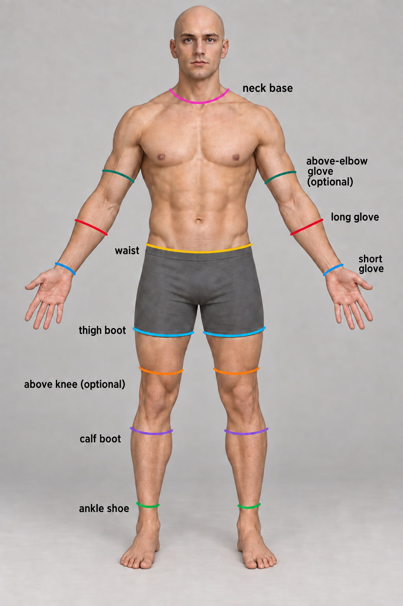

# 모듈형 복장 절단선과 연결 기준

2026-10-01. 남성 모듈형 캐릭터의 서로 다른 상의·하의·장갑·신발·투구를
조합하기 위한 공통 제작 기준이다. 절단 위치와 함께 겹침 방향, 가림 범위,
경계의 리깅을 맞춘다. 모든 복장을 같은 선에서 맞대어 끝내는 방식은 사용하지 않는다.

**상태: 제작 원칙 합의 완료, 3D 기준 테두리와 치수 확정·기존 에셋 적용은 후속 작업.**
2026-10-01 rogue 제작 과정에서 필수 7종의 피부 단면·겹침 구간 후보를 `interfaces/v0`로
추출했다. 아직 의상 여유 공간·동작을 검증한 확정 규격은 아니다.
[재현 스크립트와 제작 워크플로우](modular-outfit-workflow.md#4-몸체의-연결-테두리-재현)를 참고한다.
이 문서 작성으로 기존 GLB나 게임의 가림 처리가 변경된 것은 아니다.
현재 남성 체형에 우선 적용하며, 다른 체형은 별도 피팅과 검증이 필요하다.

## 기준 그림과 몸체



그림은 사용자의 절단 위치 제안을 바탕으로 2026-10-01에
[원본 정면 원화](../images/characters/modular_human_male_01/base-front.png)에서 기준선 8종을
새로 그린 참고도다. 긴 장갑 선은 팔꿈치 아래로 옮기고 좌우 선과 명칭을 통일했다.
이후 팔꿈치 위 장갑용 청록색 선을 추가해 현재 총 9종이다.
목 밑은 분홍색, 선택 사항인 무릎 바로 위 기준은 주황색이다.
그림의 픽셀 위치·기울기·손 자세를 그대로 3D 치수나 기준 자세로 사용하지 않는다.
기반 캐릭터 이미지의 출처는 [캐릭터 제작 기록](characters.md)을 참고한다.

- 기준 형상: `assets/modular_human_male_01/parts/fitted/base.glb`.
- 기준 리그: `human_male_01_mixamo_candidate_v2`, 손가락을 포함한 기존 65본.
- 게임 내 좌표: 미터 단위, Y 위, +Z 전방, 발밑 원점. 현재 기준 몸체 높이는 1.90m.
- 기준 자세: 기존 몸체의 A 자세와 손바닥이 아래·몸통 쪽을 향하는 자세를 유지한다.
- 좌우는 착용자 기준이다. Blender 내부 축과 내보낸 GLB의 축을 구분한다.

기준 파일·리그의 보관 정보는 [남성 몸체 안내](modular-human-male-01.md),
현재 몸체의 제작 참고점은 [도적 부위 설계](modular-rogue-parts.md)를 따른다.

## 절단선 종류

아래 이름은 제작 문서용 식별자이며 현재 런타임의 슬롯이나 마스크 이름이 아니다.
팔과 다리의 기준은 좌우 각각 만든다. 선은 몸 둘레를 도는 3D 테두리로 정의하고,
관절이 크게 접히는 중심부는 피해서 피팅한다.

| 기준 | 그림 위치 | 용도와 배치 원칙 |
| --- | --- | --- |
| `neck_base` | 분홍 선 | 목 밑. 높은 옷깃·목 보호대·투구의 접촉 영역을 정한다. 머리를 실제로 분리하는 절단선은 아니다. |
| `waist` | 노란 선 | 상의·하의 연결. 바지 허리와 상의 밑단이 겹치는 구간을 함께 정한다. |
| `glove_short` | 파란 선 | 손목 부근. 짧은 장갑과 긴 소매의 연결 기준. |
| `glove_long` | 빨간 선 | 팔꿈치 아래의 팔뚝. 긴 장갑 입구 기준이며 팔꿈치 접힘 중심에서 떨어뜨린다. |
| `glove_above_elbow` | 청록 선 | 선택 규격. 팔꿈치를 넘은 상완 아래 구간. 오페라 장갑·긴 팔 보호대용이며 접힘 중심보다 위에 둔다. |
| `boot_thigh` | 하늘색 선 | 허벅지 높이. 허벅지까지 올라오는 부츠의 입구 기준. |
| `boot_calf` | 보라색 선 | 무릎 아래 종아리 윗부분. 무릎 아래까지 올라오는 부츠 기준. |
| `shoe_ankle` | 초록 선 | 발목 부근. 신발과 짧은 부츠의 연결 영역. |
| `boot_above_knee` | 주황 선 | 선택 규격. 무릎 바로 위. 무릎을 덮는 부츠가 필요할 때 별도 규격으로 확정한다. |

그림은 초기 long boots·short boots 표기를 thigh boot·calf boot로 바꿔 실제 높이를 구분한다.
어깨나 팔꿈치 관절 중심에서의 추가 분리는 현재 필수가 아니다. 견갑이나 소매를 독립적으로
교체할 필요가 생길 때 검토한다. 기준선 개수만큼 모든 옷을 별도 장비로 나누지 않는다.

## 연결부의 겹침과 안팎 순서

연결부는 한 줄이 아닌 폭을 가진 겹침 구간으로 만든다. 두 파츠의 끝을 정확히
맞대는 것만으로 연결을 해결하지 않는다. 바깥 파츠 안에 안쪽 파츠가 들어갈 공간을
확보하고, 움직일 때도 겹침이 유지되도록 형상과 가중치를 함께 맞춘다.

| 연결 | 기본 안팎 순서 | 제작 기준 |
| --- | --- | --- |
| 소매와 장갑 | 장갑이 소매를 덮음 | 소매 끝을 장갑 안쪽으로 연장하고 장갑 입구에 두께·여유 공간을 둔다. |
| 바지와 부츠 | 부츠가 바지를 덮음 | 바지 끝을 부츠 안쪽으로 넣는다. 넓은 바지는 부츠용 밑단 형상을 준비한다. |
| 넣어 입는 상의와 하의 | 허리밴드가 상의를 덮음 | 상의 밑단을 허리밴드 아래까지 연장한다. 벨트·허리 장식의 소속 파츠를 기록한다. |
| 밖으로 입는 상의와 하의 | 상의가 바지 허리를 덮음 | 상의 내부에 바지 허리가 들어갈 공간을 확보한다. 벨트·주머니의 돌출과 충돌도 확인한다. |
| 옷깃과 목 보호대·투구 | 조합별 지정 | 목을 덮는 장비와 높은 옷깃이 충돌하면 옷깃을 숨기거나 낮춘 대체 형상을 사용한다. |

짧은 소매와 짧은 장갑 사이처럼 피부가 의도적으로 드러나는 조합은 연결하지 않는다.
노출된 피부를 가림 처리하지 않고 소매·장갑의 각 끝단을 독립적으로 마감한다.

겹침 깊이와 단면 둘레·여유 공간의 공통 수치는 아직 확정하지 않았다.
도적 설계의 허리 25–35mm, 발목 30–40mm 겹침은 해당 복장의 모델링 시작값이며,
모든 복장에 검증된 공통 치수가 아니다. 기준 몸체의 3D 테두리와 동작 검증으로 확정한다.

## 3D 기준 테두리와 리깅

Blender 제작 원본에 재사용 가능한 기준 테두리와 겹침 구간을 저장한다.
각 기준에는 몸체 둘레의 형태, 위치·방향, 안쪽 의상이 들어갈 범위와 바깥 의상의
내부 여유 공간을 기록한다. 앞면 높이만 맞추지 않고 뒤·옆 단면까지 확인한다.
의상의 두께가 다르므로 모든 파츠의 경계 정점을 같은 좌표로 강제하지 않는다.

- 같은 몸체·본 계층·기준 자세·bind 정보를 사용한다. 새 의상마다 다른 체형으로 리깅하지 않는다.
- 겹침 구간은 공통 기준에서 스킨 가중치를 전사하고 보정한다. 같은 본 이름만으로 호환을 판정하지 않는다.
- 허리는 골반·척추, 손목은 팔뚝·손, 발목은 종아리·발 사이의 변형이 서로 어긋나지 않게 한다.
- 팔꿈치 위 장갑은 상완·팔뚝 가중치를 맞추고, 팔을 굽힐 때 안쪽 접힘과 바깥쪽 늘어남을 검증한다.
- 피부를 직접 이어 붙이는 파츠가 생기면 경계 위치·가중치·노멀까지 별도로 일치시킨다.
- 기준 몸체나 테두리를 변경하면 버전을 남기고 영향을 받는 기존 복장도 다시 검사한다.

## 피부와 안쪽 의상 가림

가림 대상은 피부와 안쪽 의상을 구분한다. 긴 장갑 아래의 피부만 숨기면 소매가
장갑을 뚫을 수 있으므로, 장갑 내부에 충분히 들어간 소매 부분도 조합에 맞게 숨긴다.
부츠와 바지, 허리밴드와 상의에도 같은 원칙을 적용한다.

- 가림 경계는 바깥 파츠의 입구보다 안쪽에 두어 움직임 중 빈틈이 보이지 않게 한다.
- 열린 옷깃·반장갑·샌들처럼 노출되는 영역은 남긴다. 좌우가 다르면 각각 지정한다.
- 장비를 벗거나 교체하면 현재 조합에서 가림 범위를 다시 계산해 피부와 옷을 복원한다.
- 가림용 구역 분할은 장비 슬롯 분리와 별개다. 기준 몸체 원본의 피부를 영구 삭제하지 않는다.
- 외부 장비가 정상적으로 표시될 때 가림을 함께 적용한다. 로딩 실패로 몸만 사라지지 않게 한다.

구체적인 마스크 이름과 메시 분할·런타임 구현은 후속 작업이다.
현재 구현 상세는 [캐릭터 커스터마이제이션](../CHARACTER_CUSTOMIZATION.md)을 참고한다.

## 긴 옷과 예외 조합

긴 튜닉·로브·치마의 외형을 허리선에서 자를 필요는 없다. 허리는 내부 연결 기준으로
유지하고 늘어지는 옷자락은 해당 의상의 일부로 제작한다. 아래에 착용하는 바지·부츠와의
가림 및 동작 중 관통은 별도로 확인한다.

넓은 소매나 바지가 좁은 장갑·부츠 안에 들어가지 않으면 안으로 넣는 대체 형상을 만든다.
팔꿈치 위 장갑과 긴 소매를 조합할 때도 안쪽 소매를 좁히거나 충분히 덮인 영역을 숨긴다.
대체 형상이 없는 조합은 미지원으로 기록한다. 기준선을 공유한다는 이유만으로
모든 실루엣과 모든 장비 조합의 호환을 보장하지 않는다.

각 복장 제작 문서에는 다음 내용을 남긴다.

| 기록 항목 | 내용 |
| --- | --- |
| 기준 몸체와 리그 | 참조 파일·버전, 리그 식별자 |
| 연결 규격 | 사용하는 절단선, 확정된 테두리 버전 |
| 겹침 | 안팎 순서, 겹침 깊이, 입구 내부 여유 공간 |
| 가림 | 피부 영역과 의상 영역, 좌우 차이 |
| 대체 형상 | 부츠용 바지 끝단, 장갑용 소매, 낮춘 옷깃 등 |
| 호환 범위 | 검증한 다른 세트, 미지원 조합과 이유 |
| 검증 기록 | 동작·시점, 발견한 문제와 보정 결과 |

## 적용 순서와 완료 기준

1. 기준 몸체에서 필수 7종의 테두리와 겹침 구간을 만들고 좌표·둘레·버전을 기록한다.
2. 기존 천 복장·기사 판금·바바리안 및 제작할 도적 복장의 연결 방식을 분류한다.
3. 먼저 손목·발목·허리에 공통 규격을 적용하고, 피부·안쪽 의상 가림을 함께 맞춘다.
4. 같은 세트와 다른 세트를 섞어 검사한다. 기사 상의＋도적 장갑, 도적 바지＋기사 부츠처럼
   소재·두께가 다른 조합을 포함한다. 미제작 파츠는 제작 후 검증한다.
5. 목 연결과 긴 장갑·긴 부츠를 검사하고, 필요한 경우 팔꿈치 위·무릎 위 선택 규격을 적용한다.

검증은 정면·후면·측면과 연결부 확대에서 수행한다. 대기·걷기·달리기·점프·공격·앉기,
팔 굽힘과 손목 회전, 목 회전을 포함하고 실제 게임에서 사용하는 변형 결과를 확인한다.
장갑·부츠·투구 착탈과 서로 다른 순서의 교체도 검사한다.

연결부의 틈, 피부·안쪽 옷 관통, 겹친 표면의 깜빡임, 의도하지 않은 피부 소실이 없어야 한다.
개별 파츠를 해제했을 때도 정상 외형이 복원되어야 한다. 먼저 각 연결 규격의 대표 조합을
검증하되, 새 복장의 호환을 선언할 범위에는 해당 연결부의 지원 조합 검사를 포함한다.
합격한 조합과 미검증 조합을 구분해 기록한다.

폴리곤·얼굴 디테일·출처 기록은 기존 [에셋 제작 지침](creation-guidelines.md)을 따른다.

## 기준 그림 편집 기록

- 편집 도구: OpenAI Codex built-in ImageGen, **ChatGPT Pro 20x**, 2026-10-01.
- 입력: 표시가 없는 원본 `base-front.png`. 사용자 제안을 바탕으로 기준선 8종과 이름을 새로 요청했다.
- 출력: `cut-position.png`, 1024×1536 PNG. OpenAI 생성 출력물 이용 조건 적용.
- 입력 SHA-256: `5b9fa90790195fd9f85892452eee13c7daeb1d691bf2acbe65bbbde52502d7a8`.
- **[미사용]** 사용자 초안과 목·무릎 선만 추가한 중간 편집본은 이 새 참고도로 대체했다.
- 기준선 8종을 새로 그린 프롬프트:

```text
Use case: precise-object-edit.
Edit target: the supplied original unmarked male character concept artwork. Create a clean clothing modular connection reference by overlaying exactly eight types of colored guide lines and their names. Preserve the man, anatomy, face, pose, hands, gray shorts, lighting and gray background. Keep the full portrait 1024x1536 framing. These are drawn colored clothing construction annotations, never wounds or literal cuts.
Draw smooth consistent 5px strokes. Left/right matching limb lines should correspond anatomically. Limb lines follow cross sections perpendicular to the local limb axis, not one horizontal line across the entire body. Each line spans the visible width of its body part with a tiny extension outside the silhouette. No rear dashed loops. Labels black sans serif 21px, unobstructed and legible in the surrounding empty background. Use these exact labels and colors:
1. "neck base", magenta #e733bc. A shallow U-shaped curve at the neck/shoulder junction from approximately (442,241) through (506,263) to (571,241). Label to the upper right around (646,235).
2. "waist", golden yellow #edc82f. Across the upper edge of the shorts, a shallow natural curve from (373,620) through (507,636) to (637,620). Label in empty background left of waist at (278,621).
3. "long glove", red #e52c48. Across both upper FOREARMS below the elbow fold, never on the elbow. Left-image arm roughly (207,539) to (285,583), right-image arm (731,583) to (807,539). Label outside right arm around (814,518).
4. "short glove", blue #168bde. Across both wrists just proximal to the hand/wrist fold: left-image (146,658) to (197,690), right-image (817,690) to (869,658). Label in right-side empty background around (883,637), wrapping as two words on two lines only if needed to stay in frame.
5. "thigh boot", cyan #24bee5. Across both upper thighs at shorts hem height: left-image (341,840) to (491,849), right-image (520,849) to (671,840). Label in left background around (209,839).
6. "above knee (optional)", orange #ee8520. Across each lower thigh ABOVE the upper edge of kneecap, around y919: left-image (355,917) to (473,922), right-image (540,922) to (657,917). Label in left background around (105,920). Do not put lines through the kneecaps.
7. "calf boot", violet #7a49b5. Across upper calves BELOW the knee joint around y1068: left-image (337,1061) to (440,1071), right-image (570,1071) to (674,1061). Label in left background around (220,1069).
8. "ankle shoe", green #1fbd65. Across the low shins just ABOVE ankle bones around y1288: left-image (349,1286) to (402,1290), right-image (603,1290) to (657,1286). Label in left background around (226,1288).
No title, no other text, no extra lines. Coordinates are approximate guidance; fit the guide marks to visible anatomical landmarks. Keep labels clear of body and lines. This is a clean redraw of annotations from the original artwork, not a redraw of the character.
```

### 팔꿈치 위 장갑 기준 추가

- 같은 도구·등급으로 2026-10-01 편집. 기존 8종에 청록색 `above-elbow glove (optional)`을 추가했다.
- 입력: 직전 `cut-position.png`, SHA-256 `465b1d4c73808613cb3aa5acd4b8c5330586021d5032baa37106ae6063701ab2`.
- 출력: 동일 경로에 교체한 9종 기준선 그림. 기존 8종 편집본은 **[미사용]**이다.
- 실제 편집 프롬프트:

```text
Use case: precise-object-edit. Edit target: supplied annotated male clothing reference image. Preserve the entire existing picture, person, anatomy, pose, background, all eight existing colored line types, their positions and every existing label. Add ONLY a ninth guide type for opera-length gloves that extend ABOVE the elbows onto the LOWER UPPER ARMS. Draw two smooth dark teal #007c78 lines, same 5px thickness and curved cross-section style as the existing guides, across both lower upper arms clearly ABOVE the elbow creases, midway between elbow and biceps center. In the 1024x1536 image, approximately left-image outer arm (252,436) through (292,452) to inner arm (331,472); mirror on right-image inner arm (686,472) through (726,452) to outer arm (765,436). Adjust to the actual skin silhouette, perpendicular to each upper arm's axis. These new lines must remain clearly above the red long glove forearm lines and above the elbow joint itself, not at shoulder or wrist. Add black bold sans serif label to the RIGHT in empty background around x795 y401, wrapped across three lines exactly: 'above-elbow' then 'glove' then '(optional)'. Match existing label font style, use about 23px so it fits inside the canvas without touching body or existing labels. Keep 1024x1536 portrait. These are clothing guide overlays, no literal cuts or wounds. No other changes.
```
