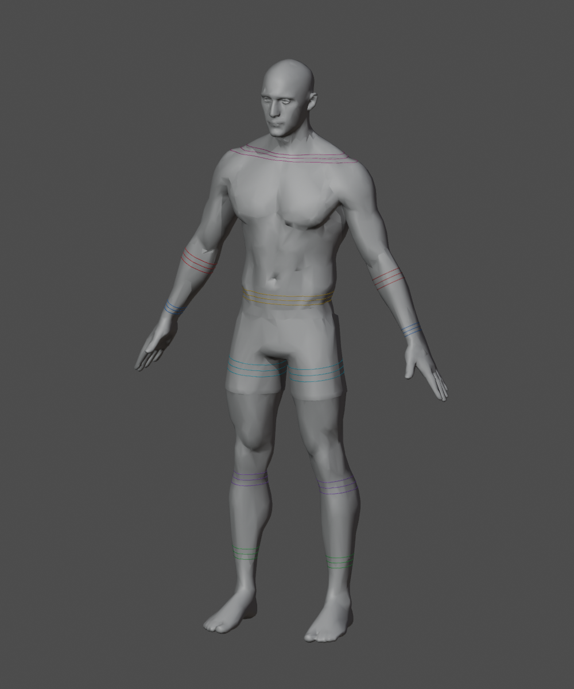

# 모듈형 복장 제작 워크플로우

2026-10-01. 첫 적용 예제는 [rogue](modular-rogue-parts.md)다.
이 문서는 반복 제작 절차이며, 연결 규격 자체는
[복장 연결 기준](modular-outfit-connections.md), 출처·예산은
[에셋 제작 지침](creation-guidelines.md)을 따른다.
**생성 성공, 피팅 완료, 게임 호환 합격은 서로 다른 단계다.**

## 1. 복장별 제작 명세

새 복장마다 아래 파일을 복사해 새 이름과 출처를 기록한다. 기존 복장의 작업 ID를
새 복장 명세에 복사하지 않는다. 자동 생성으로 결정할 수 없는 항목은 미확정으로 둔다.

- 원화·연결부·가림·지원 조합: `doc/assets/modular-<outfit>-parts.md`.
- 원화 출처·프롬프트·해시: `modular-<outfit>-parts-sources.json`.
- 재현 가능한 생성 입력: [rogue 제작 명세](modular-rogue-build.json).
- 실제 생성 작업 ID·설정·비용·출력 해시: [rogue Meshy 기록](modular-rogue-meshy-sources.json).
- 시도별 선택과 남은 보정: [원본 선택 명세](modular-rogue-source-selection.json). 이 파일은
  생성 요청용 명세가 아니라 검수 도구의 입력이다. `source_glb`로 서로 다른 시도의 파츠를 조합한다.

**모든 신규 바지의 피팅 기준은 현재 `assets/modular_human_male_01/parts/fitted/base.glb`다.**
2026-10-01 종아리 실루엣을 줄인 공통 원본과 `interfaces/v1`을 사용한다.
[공통 몸체 변경 기록](modular-human-male-01.md#공통-몸체-종아리-실루엣--2026-10-01)을 확인하고,
이전 생성 명세의 몸체 해시·v0 단면·오래된 편집본을 새 복장에 복사하지 않는다.
`tools/outfits/body_shape.py`는 이전 체형에 맞춘 메시를 이행할 때 사용한 변형이다.
새 몸체에 이미 피팅한 바지에는 이 축소를 중복 적용하지 않는다.

몸체 GLB 경로와 SHA-256, 리그 ID, 연결 테두리 버전, 슬롯별 소속을 고정한다.
동일한 본 이름만으로 리깅 호환을 가정하지 않는다. 한 착용 캐릭터의 몸체·얼굴·헤어·무기·망토를
포함해 15,000–20,000 triangles 예산을 배분한다. 작은 장갑·부츠에 아이템 일반 예산을 적용하지 않는다.

## 2. 원화 검토와 입력 준비

1. 실제 몸체의 정면·측면과 기준 자세를 대조한다. 그림의 픽셀을 미터 치수로 사용하지 않는다.
2. 목·허리·손목·발목에서 바깥 파츠, 안쪽 파츠, 겹침, 노출 피부를 구분한다.
3. 앞뒤 그림의 좌우·주머니·버클·손가락 개수와 개구부를 확인한다.
4. 벨트·주머니·후드·견갑의 소속을 결정하고 관절을 가로지르는 장식을 점검한다.
5. 생성 입력 한 장에는 같은 물체의 한 시점만 남긴다. 앞뒤 시트는 시점을 분리해 다중 이미지로
   제출한다. 이 과정은 원화 재생성이 아니라 입력 영역 추출이며 원본을 보존한다.
6. 시점마다 형상이 충돌하면 우선 시점을 지정한다. 좌우 한쪽만 생성하는 경우 반대쪽은
   이후 3D에서 대칭 제작한다. 손가락·발가락 본 대응과 삼각형 방향도 바꿔야 한다.

rogue 예제는 상의·바지·장갑 각각 2시점, 손목 천·부츠 각각 1시점을 사용한다.
부츠는 주 시점만 사용해 두 시점의 버클 위치 차이를 생성기에 동시에 강제하지 않는다.
입력 영역은 제작 명세의 `crop: [x, y, width, height]`로 보존한다.
기술 입력의 추출은 FFmpeg를 사용한다. 시각 디자인 수정은 ImageGen을 쓰고 새 버전으로 남긴다.

## 3. Meshy 생성과 회수

저장소 루트에서 실행한다. Linux에서는 `.venv/bin/python`, Windows에서는
프로젝트 `.venv\Scripts\python.exe`를 사용한다. Python 표준 라이브러리와 FFmpeg가 필요하다.

```bash
.venv/bin/python tools/outfits/meshy.py plan doc/assets/modular-rogue-build.json
.venv/bin/python tools/outfits/meshy.py prepare doc/assets/modular-rogue-build.json
.venv/bin/python tools/outfits/meshy.py submit doc/assets/modular-rogue-build.json
.venv/bin/python tools/outfits/meshy.py collect doc/assets/modular-rogue-build.json
```

- `plan`: 요청과 파츠 예산만 표시한다. API 호출 없음.
- `prepare`: 원화 해시를 검사하고 입력을 재현한다. 유료 요청 없음.
- `submit`: 유료 생성 요청. 키는 `~/.config/meshy/key`에서 읽고 기록에 넣지 않는다.
- `collect`: 기존 요청의 상태·실제 비용을 기록하고 GLB·프리뷰·PBR 맵을 회수한다.
  진행 중이면 나중에 같은 명령을 실행한다. 재생성하지 않는다.

스크립트는 제출 전에 `SUBMITTING`을 저장하고 응답 직후 작업 ID를 저장한다.
같은 입력·설정·작업 ID는 다시 제출하지 않는다. 타임아웃으로 작업 ID를 받지 못했으면
Meshy 작업 내역과 대조해 ID를 복구한다. 이 상태의 기록을 삭제하고 무조건 재실행하지 않는다.
설정이나 원화를 바꾸는 재시도는 새 버전의 명세·기록·출력 폴더를 쓴다.
같은 기록 파일에 대해 여러 프로세스를 동시에 실행하지 않는다.

완료 후 정리한 기록에는 삭제된 출력이 `retained: false`로 남는다.
분할 입력은 필요할 때 `prepare`로 재현한다. 과거 명세에 `collect`를 실행하면
정리한 출력도 다시 내려받으므로, 보관한 후보 검수에는 선택 명세를 사용한다.

`meshy-7.1`, 삼각형 리메시, 파츠별 목표 수, PBR 2K, 원화 자동 개선 끄기를 명시한다.
자동 리깅·A 포즈 강제는 사용하지 않고 기존 몸체에 피팅한다. 생성기의 폴리곤 목표는
최종 실측값과 다를 수 있다. 숫자를 맞추기 위한 후처리 데시메이션은 하지 않는다.
API 필드는 [Meshy 공식 문서](https://docs.meshy.ai/en/api/multi-image-to-3d)를 확인한다.

## 4. 몸체의 연결 테두리 재현

```bash
blender -b --python-exit-code 1 --python tools/blender-scripts/build_outfit_reference.py -- --preview
```

기본 출력은 `assets/modular_human_male_01/parts/interfaces/v1/` 아래의
`outfit-reference.blend`와 `interfaces.json`이다. 다른 체형은 `-- --base <GLB> --output <폴더>`로
명시한다. 현 스크립트의 높이와 본 이름은 현재 1.90m 남성 전용이며 다른 체형에는 그대로 쓰지 않는다.

기준 몸체의 실제 삼각형과 평면을 교차시켜 닫힌 피부 단면을 구하고, 필수 7종·좌우 12개
연결부의 중심/겹침 구간 양끝을 곡선으로 저장한다. JSON은 게임 좌표인 미터·Y 위·+Z 전방,
Blender 곡선은 Blender 좌표로 변환한다. 본 위치와 몸체 파일은 원본을 바꾸지 않는다.
부츠용 대체 피부 `body_boot_ankles`는 단면 추출에서 제외한다.



위 이미지는 Blender 5.2.0 LTS에서 스크립트로 렌더한 v0 검사 화면이다.
기존 몸체의 출처·라이선스를 따르며 AI 원화를 3D 치수로 변환한 결과가 아니다.

**v0는 초기 후보다.** 피부 단면은 의상 안쪽 표면이 아니며, 의상 두께·여유 공간은
`garment_clearance_m: null`로 미확정이다. 구간 폭도 동작 검증 전 시작값이다.
단면을 추출했다고 공통 연결 규격을 확정하지 않는다. 팔꿈치 위·무릎 위 선택 규격은 아직 생성하지 않는다.
테두리·기준 몸체를 변경하면 `--version v2`처럼 새 버전을 만들고 영향받는 복장을 재검사한다.
기존 출력의 몸체 해시나 버전이 달라지면 스크립트가 덮어쓰기를 차단한다.

## 5. 생성 메시 검수와 Blender 피팅

```bash
blender -b --python-exit-code 1 --python tools/blender-scripts/review_outfit_sources.py -- \
  --config doc/assets/modular-rogue-source-selection.json \
  --image doc/images/characters/modular_human_male_01/parts/rogue/meshy-review-selected.png \
  --report doc/assets/modular-rogue-mesh-review-selected.json
```

리뷰 도구는 GLB를 직접 불러와 앞뒤 렌더, triangles, 연결 성분, 경계/비다양체 모서리,
퇴화 면·UV, 바운딩 박스와 리깅 유무를 기록한다. UV 이음의 중복 정점은 진단 복사본에서만 용접한다.
`--blend <출력.blend>`를 추가하면 텍스처를 포함한 검사 장면도 보관한다.
각 파츠는 별도로 크기를 정규화해 전시하므로 **이 그림은 착용·피팅 결과가 아니다.**
경계 모서리가 0이어도 두께 있는 속 빈 의상일 수 있으므로 구멍이 막혔다고 자동 판정하지 않는다.

피팅은 다음 순서로 진행한다.

1. 중복 물체, 누락된 손가락 구멍, 막힌 커프, 주머니/로프 손실, 좌우 오류를 시각 검사한다.
   오류가 큰 파츠는 재생성 또는 명시적인 토폴로지 수정을 거친다.
   표면이 깨져 보이면 GLB뿐 아니라 내려받은 base-color/normal과 UV도 확인한다.
   rogue 상의 v1/v2는 base-color 자체가 색 띠로 손상돼 있었으며, 해상도 증가만으로 해결되지 않았다.
   상의 v3는 정면 한 장만 넣어 텍스처가 복원됐다.
   이처럼 같은 실패가 반복되면 입력 시점을 줄이는 등 한 조건씩 바꿔 비교하고, 무조건 반복 생성하지 않는다.
2. 공통 몸체·리그·테두리가 있는 Blender 제작 파일에 원본을 참조용으로 보존하고 작업 사본을 넣는다.
3. 몸통·소매·바지·손·발을 각각 실제 단면에 맞춘다. 단순 전체 바운딩 박스 스케일링만으로
   피팅 완료로 판정하지 않는다. 안쪽 형상과 입구 두께·여유를 함께 만든다.
4. 상의 밑단·바지 끝을 안쪽까지 연장하고 안팎 순서를 맞춘다. 같은 선에 맞대지 않는다.
   연결 곡선이 편집본에 존재하는 것만으로 적용 완료가 아니다. 출력 메시의 중심·축·둘레와
   겹침 여유를 단면에서 직접 측정하고 실제 동작에서도 확인한다.
5. 기존 몸체에서 가중치를 전사하고, 허리·손목·발목의 겹침 양쪽을 함께 보정한다.
   손가락은 각 손가락 본을 따르며 반대 손이나 이웃 손가락에 잘못 전사되지 않게 제한한다.
6. 부츠 대칭 제작, 장갑+손목 천 통합 등 슬롯 단위 출력을 만든다. 편집용 레이어는 보존한다.
7. 기준 본 계층·rest/bind 행렬을 비교하고 정점 가중치 합계와 정상적인 본 인덱스를 검사한다.

기존 `tools/fit-modular-plate.py`, `tools/fit-modular-barbarian.py`에는 세트별 보정값이 많다.
다른 복장에 그대로 실행하지 않는다. 범용 절차로 확인된 부분만 새 도구에 옮기고,
복장별 보정은 명세 또는 전용 스크립트로 분리한다.

## 6. 가림·게임 연결·완료 판정

| 단계 | 합격 증거 |
| --- | --- |
| 원화 검토 | 파츠 소속, 좌우, 노출 피부, 안팎 순서와 보정 항목 |
| 3D 생성 | 실제 GLB·PBR 회수, 해시·비용·삼각형 실측, 앞뒤 검토 |
| 피팅·리깅 | 실제 몸체 착용 렌더, 연결부 확대, 같은 bind 정보, 가중치 검사 |
| 가림 | 피부와 안쪽 옷을 구분, 착탈/로딩 실패 시 복원, 좌우 비대칭 반영 |
| 동작·혼합 | 실제 게임의 대기·걷기·달리기·점프·공격·앉기와 팔/손목/목 회전 |
| 출시용 보관 | 숨김 포함/표시 triangle 합계와 얼굴 배분, 출처, 편집본, 지원 조합 기록 |

같은 세트 검증 후 기사 상의+rogue 손 장비, rogue 바지+기사 부츠 등 혼합 조합을 검사한다.
짧은 소매/반장갑용 가림을 긴 소매/일반 장갑 규칙으로 대신하지 않는다.
목을 덮는 장비에는 낮춘 옷깃 대체 형상이 필요할 수 있다. 대체 형상 없이는 지원을 선언하지 않는다.

프로젝트의 기존 프리뷰·게임 경로에서 정상 동작을 확인한 파츠만 런타임에 등록한다.
실패한 항목은 문제·수정 방법·재검증 결과를 남기고 미검증을 합격으로 바꾸지 않는다.
최종 GLB·Blender·원본은 `/assets/`의 바이너리 보관 정책을 따른다. 커밋 요청 시 저장소 커밋
워크플로우로 Hugging Face 업로드와 `assets.lock` 갱신을 수행한다.

## 도구 검증

```bash
.venv/bin/python -m unittest discover -s tools/outfits -v
```

유료 생성의 중복 제출 방지, 응답 유실 시 재제출 차단, 입력 변경 시 새 기록 요구, 누락된 입력이 있을 때 전체 제출 중단을 검사한다.
Blender 도구는 실제 기준 몸체와 생성 GLB를 실행 입력으로 검증한다. 자동 검사는
옷 관통·디자인 일치·혼합 호환의 시각 검증을 대체하지 않는다.


## Rogue 첫 적용 결과

5종의 원본을 생성·검수했고, 상의 v3·반장갑 v2·나머지 v1을 피팅 후보로 보관했다.
상의 2회와 반장갑 1회의 추가 시도까지 총 8건, 255크레딧이다.
[실제 결과·검수 이미지·남은 작업](modular-rogue-parts.md#피팅-후보-선택)을 참고한다.
이후 공통 발목 단면·가중치와 몸체 종아리 보정을 반영한 4개 슬롯 후보 v3를 만들었다.
[현재 피팅 결과](modular-rogue-parts.md#상의-레이어마감-보정-v5--2026-10-01),
[게임 동작 검사](modular-rogue-animation-review-v5.json),
[실패와 수정 이력](modular-rogue-fitting-history.json)을 참고한다.
`tools/fit-modular-rogue.py`의 변형 기준점·UV 수정 면은 선택 원본 해시에 종속되므로 다른 복장에
그대로 사용하지 않는다. 표면 가중치 전사와 rig/bind 검사는 재사용 가능한 절차다.
토폴로지·UV 마무리, 최종 가림과 혼합 장비 검증이 남아 있어 자동화된 완성 공정으로 취급하지 않는다.
v1의 발목 단면 적용 누락을 재발시키지 않도록 연결부는 유한 좌표뿐 아니라
둘레 누락·안팎 순서·동작 중 여유와 확대 화면을 함께 검사한다.

v4에서 사용자 검수로 발견한 소매 구멍을 연속 메시와 겨드랑이 안감으로
보정하고, 양쪽 끝단을 `glove_long` 단면과 17.5mm 겹침에 맞췄다.
가중치 전사 후 점프에서 발생한 과도한 늘어남도 보정했으며 소매 모서리의 늘어남과
삼각형 붕괴 검사를 추가했다. [이전 피팅 이력](modular-rogue-parts.md#이전-피팅과-정리-이력--2026-10-01)을 참고한다.

현재 선택 후보는 v5다. 후속 사용자 검수에서 드러난 레이어 관통과 베스트·숄의 구멍 때문에
상의의 외부 레이어도 연속 메시로 교체하고, 덮이는 내부 면을 잘랐다. 손목 천은 실제 피부
단면과 가중치를 따르며 92개 자세에서 피부 포함 여부·간격을 검증한다.
유한 좌표·정점 가중치 검사만으로 시각 검수를 통과했다고 판단하지 않는다.
[v5 기록](modular-rogue-parts.md#상의-레이어마감-보정-v5--2026-10-01)을 참고한다.
