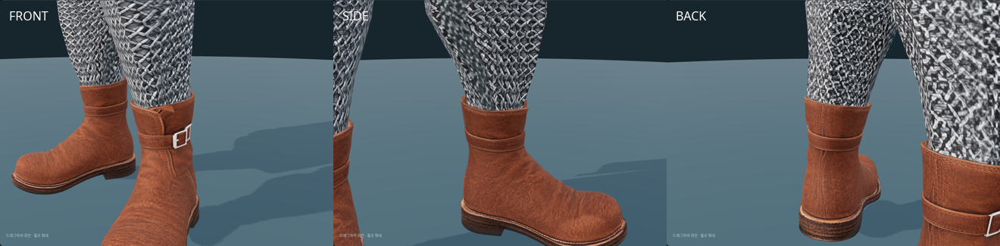

# 사제 가죽 앵클부츠 — Tripo 피팅·리깅

2026-10-09. 사용자가 전달한 `Y:\public\web_downloads\brown+leather+boot+3d+model.glb`를
`/mnt/y/web_downloads/brown+leather+boot+3d+model.glb`에서 회수했다.
현재는 좌우 대칭 제작·피팅·리깅을 마친 **개발용 미리보기 후보**다. 게임 출시 장비로는 등록하지 않았다.

- 원본: `assets/modular_human_male_01/parts/priest_tripo_boots_v1/source.glb`.
- 한 짝 **1,112 triangles**, UV 이음 포함 **1,109 vertices**. 좌우 복제 시 보정 전 **2,224 triangles**다.
- 메시·재질 각 1개, 내장 2048×2048 JPEG 1개. 리깅·애니메이션 없음.
- 논의한 생성 목표는 한 짝 500쿼드다. 실제 생성 설정과 원래 쿼드 수는 GLB로 확정할 수 없다.
- [출처·해시](modular-priest-tripo-boots-sources.json), [형상 검사](modular-priest-tripo-boots-source-review-v1.json).

원본 검수 이미지와 중복 전체 화면은 사용자 요청으로 정리했다. 원본 검사 수치·해시는 보존한다.

## 원본 검수와 보정

갈색 가죽·막힌 앞코/뒤꿈치·은색 버클 하나가 [원화](modular-priest-boots.md)와 일치한다.
정면의 버클은 그림 오른쪽에 있어 착용자 왼발 바깥쪽 배치와 맞는다.
정확한 발바닥 좌우 형태와 실제 비율은 몸체 피팅에서 확인한다.

진단 사본에서 원본 단위 1e-5 용접 후 연결 성분 1개, 경계·비다양체 모서리 0개,
퇴화 면·붕괴 UV 삼각형 0개다. 이 수치는 착용 가능한 내부 구조를 보증하지 않는다.
입구가 얕은 깔때기 형태로 막혀 있다. 입구 중앙의 아래 방향 광선은 원본 높이 0.7104에서
약 0.2049 아래인 0.5055에서 안쪽 면에 닿는다. 이는 원본 좌표 단위이며 실제 착용 치수가 아니다.
원본 검수 때 발견한 막힌 면 27개는 아래 착용 사본에서 제거하고 입구 안쪽을 마감했다.
원본 바이트와 텍스처는 변경하지 않았다.

## 피팅·리깅과 미리보기

- 착용 사본: `assets/modular_human_male_01/parts/priest_tripo_boots_v1/boots_priest.glb`.
- 편집본: 같은 폴더의 `priest-boots-fitting-v1.blend`. 현재 몸체와 숨긴 원본을 포함한다.
- 한 짝 1,139, 좌우 **2,278 triangles**. 막힌 면 27개를 빼고 한 짝당 54면의 열린 안쪽 마감을 추가했다.
- [피팅 수치](modular-priest-tripo-boots-fitting-v1.json), [Blender 검수](modular-priest-tripo-boots-review-v1.json).

현재 몸체 `parts/fitted/base.glb`와 `human_male_01_mixamo_candidate_v2` 65본을 사용했다.
`interfaces/v1`의 기록된 몸체 해시는 이전 버전이므로 현재 몸체와 발목 윤곽을 다시 대조했다.
최대 표면 차이는 약 2.1mm이며 피팅은 현재 몸체의 실제 단면을 사용했다.
오른발은 X 대칭과 삼각형 방향 반전으로 만들고 각 발의 `Leg`·`Foot`·`ToeBase`만 연결했다.
기존 본 계층·rest 변환·inverse bind 일치와 정규화 가중치를 확인했다.
원본 GLB·내장 JPEG는 그대로 보관하며, 외부 표면의 UV도 유지했다.

입구 높이는 약 0.244–0.259m다. 사슬 바지 밑단은 실측한 입구 윤곽보다 8mm 아래에서 자르고
안쪽으로 넣는다. 밑단 가중치도 같은 다리 본으로 연결했다. 맨발·다른 부츠·미로딩으로 전환하면
원래 바지와 발 피부가 복원된다. 기본 천·판금 바지와 로그·순찰자 바지에도 같은 부츠 입구 처리를 연결했다.
2026-10-09 사용자가 미리보기에서 모든 바지와의 피팅을 확인하고 결과를 승인했다.

[미리보기 페이지](https://localhost:10004/modular-character-preview.html?outfit=priest&fit=boots-v1)는
사제 성의·사슬 바지·새 앵클부츠를 기본 선택한다. 신발 선택에서 착탈할 수 있다.
대기·걷기·달리기·점프·전투 대기·공격·앉기 7종의 각 40% 시점을 브라우저에서 확인했다.
텍스처 디코딩·페이지 오류·실패한 자산 요청도 검사했다.
[브라우저 검수](modular-priest-tripo-boots-workshop-v1.json),
[대표 동작](../images/characters/modular_human_male_01/parts/priest/tripo-boots-fitted-motion-v1.png).

실제 부츠의 175시점 동작 검사에서 유한 정점·좌우 본 대응·단단한 부츠목의 길이 유지를 통과했다.
조립 상태의 91시점 검사에서 유한 정점·안쪽 밑단·착탈·반복 선택·미로딩 복원을 통과했다.
양쪽 발목의 3높이·각 48방향에서 부츠 외면과 피부 사이 최소 여유는 약 7.4mm다.
이는 정적 외면 간격이며 전체 내부 두께나 모든 동작의 표면 충돌 합격을 뜻하지 않는다.
[부츠 동작](modular-priest-tripo-boots-animation-v1.json),
[조립 검사](modular-priest-tripo-boots-assembly-v1.json), [단면 검사](modular-priest-tripo-boots-sections-v1.json).

몸체·짧은 머리·사제 상의·바지·부츠 합계는 숨김 포함 보관 **22,529**, 런타임 **22,021**,
표시 **13,690 triangles**, 얼굴 **1,505**다. 장갑·투구·무기·망토는 제외한다.
보관 합계는 공통 목표 15,000–20,000을 넘으므로 완성 세트 예산 검토가 남아 있다.
목표 숫자만 맞추기 위한 데시메이션은 하지 않았다.

타입 검사·린트·관련 테스트 91개가 통과했다. 기존 사제 상의/하의의 허리 겹침 검토는 별도 후속 작업이다.
[공통 제작 워크플로우](modular-outfit-workflow.md)를 따른다.

재현: `.venv/bin/python tools/fit-tripo-priest-boots.py`,
`node tools/validate-tripo-caveman-boots.mjs --part priest`, `node tools/validate-priest-boots.mjs`,
`blender -b --python-exit-code 1 --python tools/blender-scripts/review_tripo_priest_boots.py`.

## 출처

사용자 제공 Tripo Studio 출력이며 기존 출력 이용 조건과 계정 출처 기록을 따른다.
기존 사용자 보고 구독은 월 약 USD 20이며 이 파일의 생성 날짜·등급·작업 ID는 별도 미확인이다.
검수 이미지는 Blender 5.2.0 LTS 로컬 렌더다. 새 AI 생성·유료 호출은 없다.
