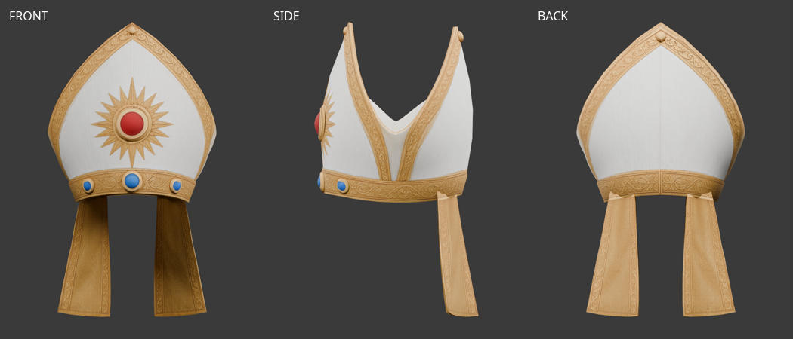
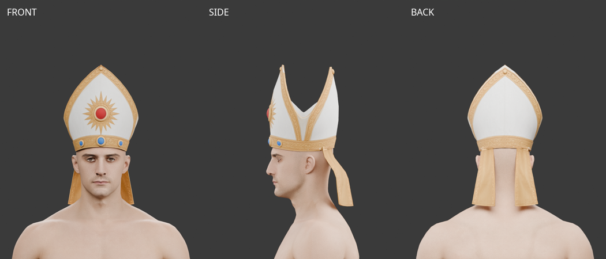
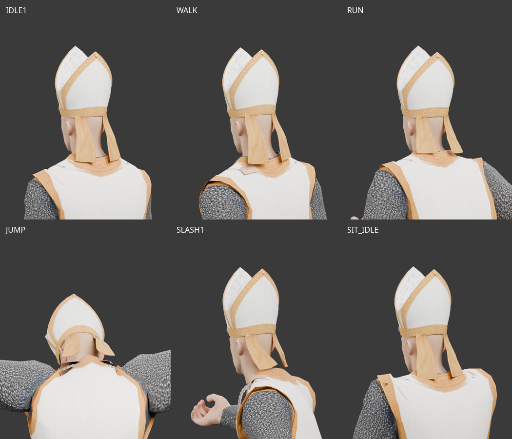
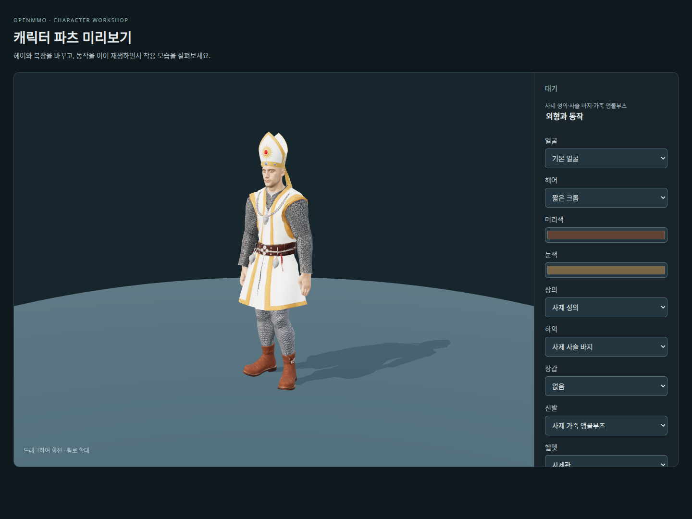
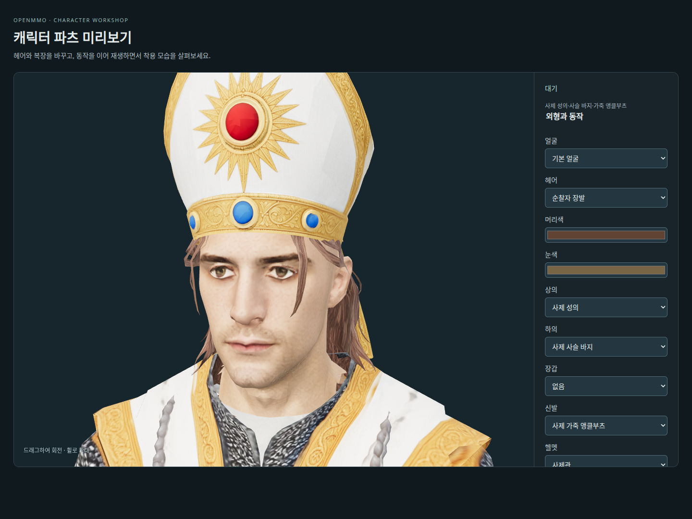
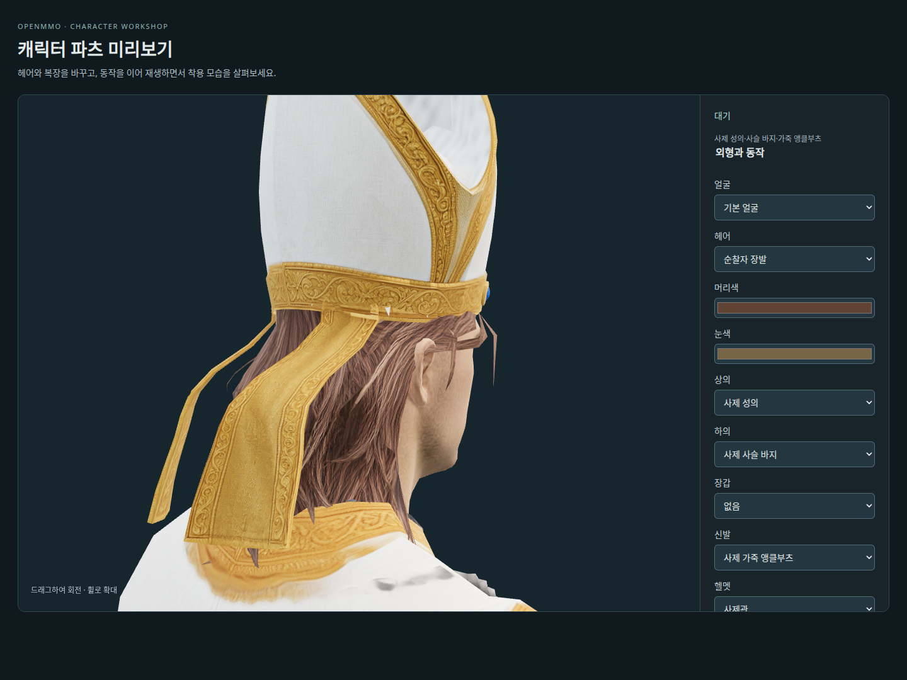
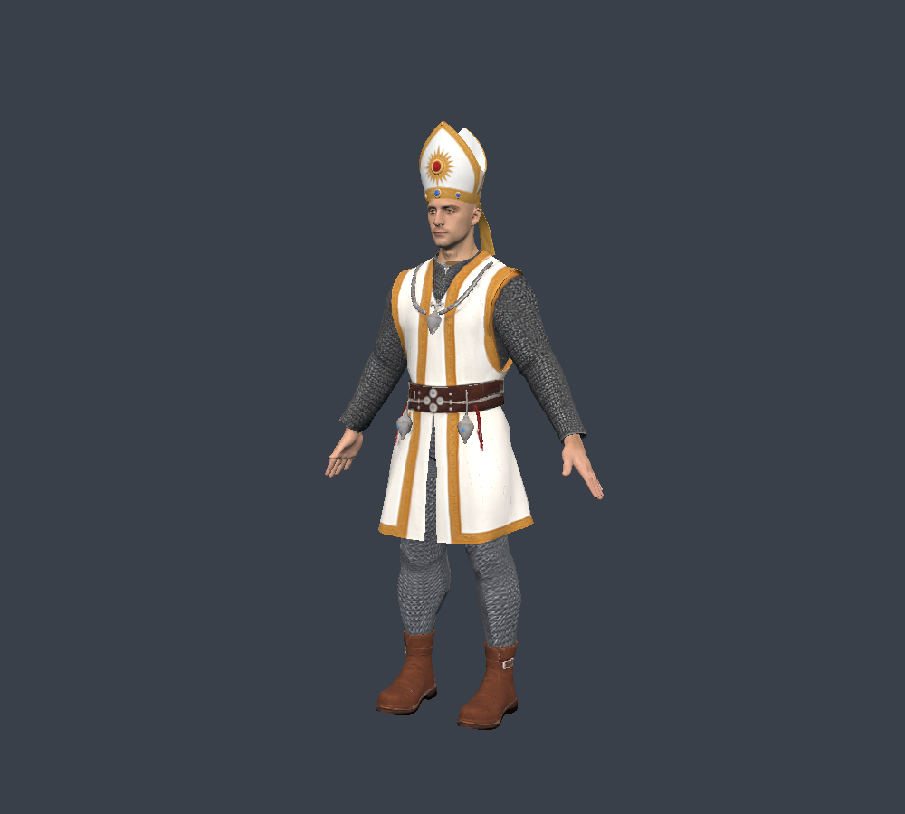

# 사제관 — 사용자 제공 Tripo 메시 피팅

2026-10-09. 사용자가 전달한 `Y:\public\web_downloads\bishop+mitre+3d+model.glb`를
`/mnt/y/web_downloads/bishop+mitre+3d+model.glb`에서 읽어 원본을 보관했다.
Tripo 구독 등급·생성일·작업 ID·실제 제출한 시점 조합은 확인되지 않았다.
원화는 [사제관 앞·뒤·옆면](modular-priest-helmet.md)이며, 원본 모델은 기존 Tripo 출력물
이용 조건을 따른다. 새 AI 생성이나 재생성은 하지 않았다.

## 원본과 피팅

- 원본·출력: `assets/modular_human_male_01/priest/tripo_helmet_v1/{source,helmet_priest}.glb`.
- 편집본: 같은 폴더의 `priest-helmet-fitting.blend`. 원본은 숨김 컬렉션에 보관하고,
  현재 기본 남성 몸체·사제 상의와 게임 동작 표본을 함께 넣었다.
- 원본과 피팅 모델 모두 **1,924 triangles**. 예산을 맞추기 위한 감면은 하지 않았다.
- 기본 머리에 이마 띠를 맞추고, 실제 머리 표면 기준으로 가까운 정점은 3mm, 삼각형 중심은 2mm 여유를 목표로 보정했다.
  뒤쪽 천은 목·옷깃 뒤로 이동하고 Head→Neck→Spine2 가중치를 사용한다. 천 물리 시뮬레이션은 없다.
- 앞판 안쪽에 바깥 보석 무늬가 잘못 복제되어 있어 안쪽 면 211개의 UV를 기존 흰 천 영역에
  다시 연결했다. 외부 UV와 원본 텍스처 바이트, 삼각형 개수는 보존했다.
- 현재 공통 몸체의 65개 본 계층·역바인드 행렬이 일치하고 가중치 합계 검사를 통과했다.

## 검수와 범위

[제작 미리보기](https://localhost:10004/modular-character-preview.html?outfit=priest)에서
사제 복장을 열면 사제관도 착용한다. 헬멧 선택에서 착탈할 수 있다.
2026-10-09에는 제작 미리보기만 연결했다. 2026-10-10 시작 장비 연결은 아래 기록을 따른다.

기본 얼굴로 브라우저 로딩, 걷기·달리기·점프·베기·앉기 전환, 사제관 해제·재장착을
확인했고 pageerror는 없었다. `npm run check`, `npm run lint`를 통과했다.
7개 동작을 각 13개 시점으로 검사해 유한 좌표·UV 경계 벌어짐·리그 연결을 확인했다.
별도 Blender 표본 렌더로 머리·옷깃과 뒤쪽 천을 검토했다.
숫자 검사는 모든 자세의 옷 관통을 보장하지 않으며 다른 얼굴과 혼합 복장은 추가 검수가 필요하다.
점프에서 뒤쪽 천의 최대 모서리 늘어남은 약 1.52배여서 동적 천 표현의 개선 여지가 있다.

브라우저의 현재 전체 사제 조합은 숨김 포함 **23,011 triangles**, 표시 **14,680 triangles**,
기본 얼굴 **1,505 triangles**였다. 숨김 포함 합계는 15,000–20,000 목표보다 높다.
사제관 자체는 목표 약 2,000 triangles 이내다.






검수 이미지는 제공 GLB를 Blender·브라우저로 렌더한 것으로 같은 출처·이용 조건을 따른다.

- [원본 메시 수치](modular-priest-tripo-helmet-source-review-v1.json)
- [출처·해시·피팅 기록](modular-priest-tripo-helmet-fitting-v2.json)
- [게임 동작 수치](modular-priest-tripo-helmet-animation-v2.json)

```bash
.venv/bin/python tools/fit-tripo-priest-helmet.py
node tools/validate-tripo-rogue.mjs --directory assets/modular_human_male_01/priest/tripo_helmet_v1 --part helmet_priest --report doc/assets/modular-priest-tripo-helmet-animation-v2.json
blender -b -t 6 --python-exit-code 1 --python tools/blender-scripts/review_tripo_priest_helmet.py -- --raw
blender -b -t 6 --python-exit-code 1 --python tools/blender-scripts/review_tripo_priest_helmet.py
```

## 머리 크기 재피팅 — v2

사용자가 이마 앞쪽이 뜨고 모자가 크다고 지적해 가로와 세로 스케일을 약 14%,
앞뒤 스케일을 약 15% 줄였다. 이마 띠의 아래 높이는 유지하고, 머리 표면과 삼각형 중심의
간격을 함께 검사해 축소로 생긴 뒤통수 관통을 보정했다.
원본·외부 UV·1,924 triangles·리그를 유지한다. 안쪽 띠 표본 간격은 v2 피팅 기록에 남겼다.

**[미사용]** v1 피팅은 머리에 비해 커서 v2로 교체했다. 이전 모델·검수 이미지·수치 기록은
정리하고 원본과 최종 v2 자료를 보관했다. 재생성 가능한 `validation-poses.json`도 삭제했다.
동작 표본 렌더에 사용하는 `animation-snapshots.json`은 유지한다.

## 사제관 아래 헤어 표시

2026-10-09. 사제관은 선택된 헤어를 남기고 머리 윗부분만 가린다.
띠 안쪽으로 헤어 뿌리를 압축하고, 뒤쪽 머리의 깊이를 줄여 사제관과 겹치지 않게 한다.
순찰자·웨이브 장발을 선택하면 뒤로 내려오는 천도 머리 바깥으로 이동한다.
착탈·헤어 교체 시 원본 형상을 복원하며 공유 원본 GLB는 변경하지 않는다.
사제관 로딩 실패 시에는 원래 헤어를 표시하고, 판금·바바리안 투구의 기존 가림은 유지한다.

기본 얼굴에서 순찰자·웨이브 장발의 앞뒤 모습과 사제관 착탈을 브라우저로 검수했다.
클리핑·복원·공유 메시 독립성과 장발 해제 시 뒤쪽 천 복원은 자동 테스트로 확인한다.
아래 이미지는 기존 헤어·사제관을 브라우저에서 렌더한 것으로 원본의 출처·이용 조건을 따른다.





## 시작 장비와 GPU 텍스처 압축 — 2026-10-10

`worn_priest_helmet`을 남성 사제의 시작 장비에 추가했다. 머리 슬롯에 자동 착용하며,
기존 시작 복장처럼 방어력 1, 거래 불가, 상점 매각 불가다. 생성 화면에서도 착용한다.
기존 캐릭터의 인벤토리를 소급 변경하지 않는다.

사제관·상의·바지·부츠의 게임용 GLB는 원본에서 512×512 KTX2 UASTC로 변환했다.
금색 장식과 사슬 질감을 위해 quality 3, RDO 0.5, Zstd 18, sRGB와 10단계 mipmap을 사용한다.
Meshopt 압축을 유지하며 원본 토폴로지·UV·리깅은 바꾸지 않는다.

| 부위 | 게임용 GLB 바이트 | KTX2 바이트 | triangles |
| --- | ---: | ---: | ---: |
| 사제관 | 379,936 | 302,195 | 1,924 |
| 성의 | 454,832 | 288,507 | 3,913 |
| 바지 | 373,852 | 308,431 | 1,513 |
| 부츠 | 381,328 | 295,579 | 2,278 |

GPU 지원 형식에 따라 BC7/ASTC 등으로 변환한다. 8bpp 형식에서는 mipmap 포함
네 장 약 1.33 MiB이며, 같은 해상도의 RGBA8 네 장 약 5.33 MiB보다 약 75% 작다.
지원 형식이 없는 장치는 RGBA로 대체하므로 절감량은 장치에 따라 달라진다.
다운로드 파일 크기는 기존 JPEG 3벌 659,644바이트에서 KTX2 3벌 1,210,012바이트로 증가한다.
사제관 포함 최종 합계는 1,589,948바이트이며, 최초 사용 시 별도 Basis transcoder도 로드한다.

Three.js의 KTX2Loader를 공용 GLB 로더에 연결하고 렌더러 초기화·압축 형식 감지가
끝난 후 로딩한다. transcoder JS/WASM은 설치된 Three.js에서 Vite 빌드에 포함한다.
같은 모델과 텍스처는 기존 캐시로 공유한다.

재현에는 `@gltf-transform/{core,extensions,functions}` 4.3.0, `meshoptimizer`, `sharp`,
KTX-Software 4.4.2의 `toktx`를 사용했다. `toktx`는 PATH 또는 `TOKTX` 환경변수로 지정한다.

```bash
node tools/prepare-modular-character.mjs --priest-only
blender -b -P tools/blender-scripts/export_priest_items.py -- --parts helmet
```

사제관 인벤토리 아이콘·바닥 모델은 기존 피팅 모델을 Blender로 렌더·정적 변환한 파생물이다.
`assets/items/priest_helmet/`에 편집용 `.blend`를 보관하며, 생성 기록은 이 문서를 따른다.
아이콘은 `client/public/items/armor/priest_helmet.png`, 바닥 모델은
`client/public/models/armor/priest_helmet.glb`다. 바닥 모델은 기존 아이템 파이프라인의
512×512 이미지 텍스처를 사용한다. 출처·이용 조건은 위 사용자 제공 Tripo 원본과 같다.
새 유료 생성은 없다.


검증: 생성·지급 및 매각/거래 제한 서버 테스트 3개, 클라이언트 착탈·헤어/피부 복원 테스트
66개, `cargo fmt`, `cargo check`, `npm run check`, `npm run lint`, `npm run build`를 통과했다.
Chromium의 WebGPURenderer WebGL2 대체 경로에서 네 텍스처 모두 ASTC 4×4,
512×512, 10 mip levels, 각 349,552바이트를 확인했다. 각 슬롯 해제·재장착 렌더에
페이지 오류와 에셋 요청 실패가 없었다. 실제 WebGPU 하드웨어 경로는 별도 실측하지 않았다.




### WebGPU 골격 버퍼 갱신 수정 — 2026-10-10

첫 렌더 후 옷자락 물리를 초기화하면 뼈가 65개에서 73개로 늘어난다.
이때 기존 WebGPU 바인딩이 남아 4,160바이트 버퍼에 4,672바이트를 쓰는 검증 오류가 발생했다.
골격 확장·복원 시 해당 메시의 GPU 렌더 바인딩을 해제해 본체·그림자 패스가 다시 생성되도록 했다.
공유 지오메트리·재질·텍스처는 유지한다.
Chromium SwiftShader의 WebGPUBackend에서 원래 오류를 재현한 후, 그림자 활성화,
각 장비 착탈, 옷자락 물리 해제·재초기화를 포함해 GPU 검증 오류 0건을 확인했다.
실제 하드웨어 GPU 성능은 측정하지 않았다.


### 바지 드롭 후 정점 레이아웃 갱신 수정 — 2026-10-10

상의를 벗은 상태에서 사슬바지를 해제하면 속옷 보정으로 몸통 지오메트리의 tangent 속성이
제거된다. 이전 레이아웃을 사용하는 본체·그림자 파이프라인이 남아 `Vertex buffer slot 5`
누락과 `DrawIndexed(4761)` 검증 오류가 발생했고, 이어서 command buffer 제출이 실패했다.
바닥 아이템 GLB 자체의 문제는 아니다. 모듈형 의상 지오메트리를 교체할 때 해당 메시의
렌더 바인딩을 해제해 정점 레이아웃을 다시 구성한다. 공유 지오메트리·재질·텍스처는 유지한다.
Chromium SwiftShader WebGPUBackend에서 게임의 비동기 파이프라인·그림자를 켜고 원래
오류를 재현했다. 수정 후 사슬바지 바닥 모델 표시, 바지 해제·재착용·반복 드롭 조건에서
GPU 검증 오류가 없었다.

### 착탈 후 달리기 중 하체 소실 수정 — 2026-10-10

사제 로브·사슬바지를 입었다 벗은 뒤 같은 장비 상태를 반복 적용하면, 속옷 보정과
부츠 경계 보정이 하체 지오메트리를 연속 교체했다. 렌더 바인딩이 계속 해제되어
비동기 파이프라인 준비 중인 하체가 그려지지 않았다. 적용한 복장 구성이 같으면
형상 갱신을 건너뛰고 외형 색상은 계속 갱신한다. 새 파츠 로딩 시에는 복장 캐시를
무효화하고, 최신 착용 요청이 적용될 때까지 해당 파츠를 숨긴다.
Chromium SwiftShader WebGPUBackend에서 그림자·달리기·착탈·동일 장비 반복 적용으로
소실을 재현했다. 수정 후 하체 표시 정상, 파이프라인 대기 0건, GPU 검증 오류 0건을
확인했다. 관련 테스트 55개, `npm run check`, `npm run lint`를 통과했다.
