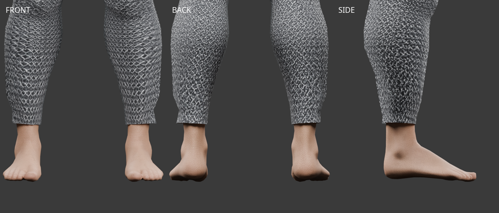
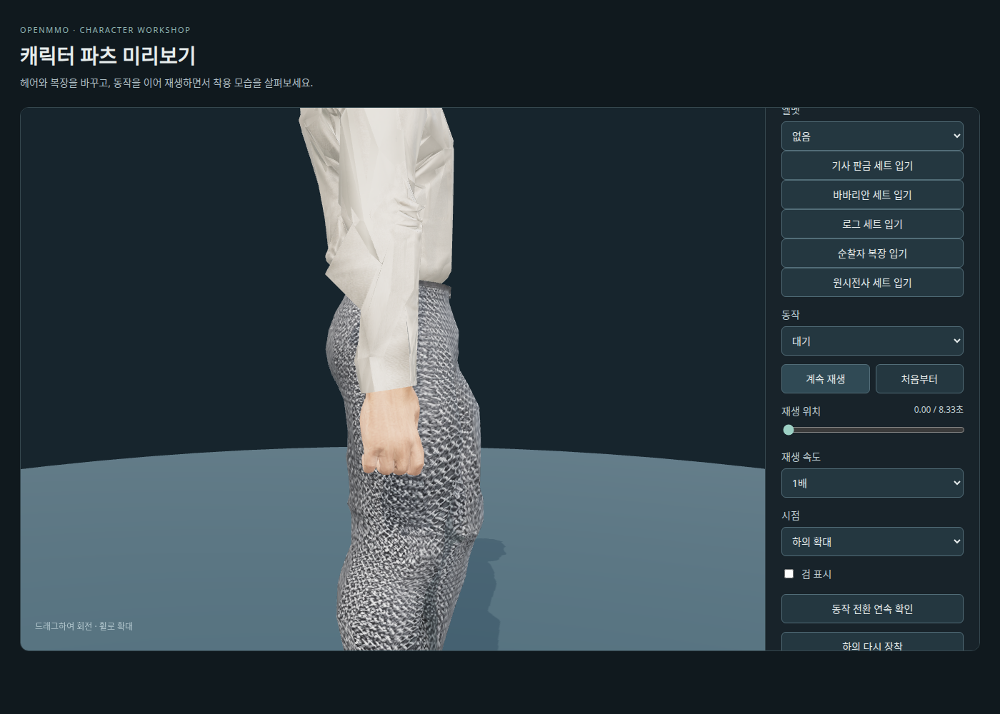
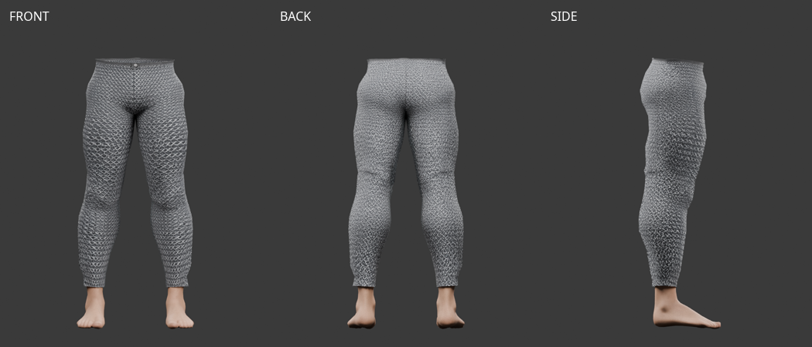
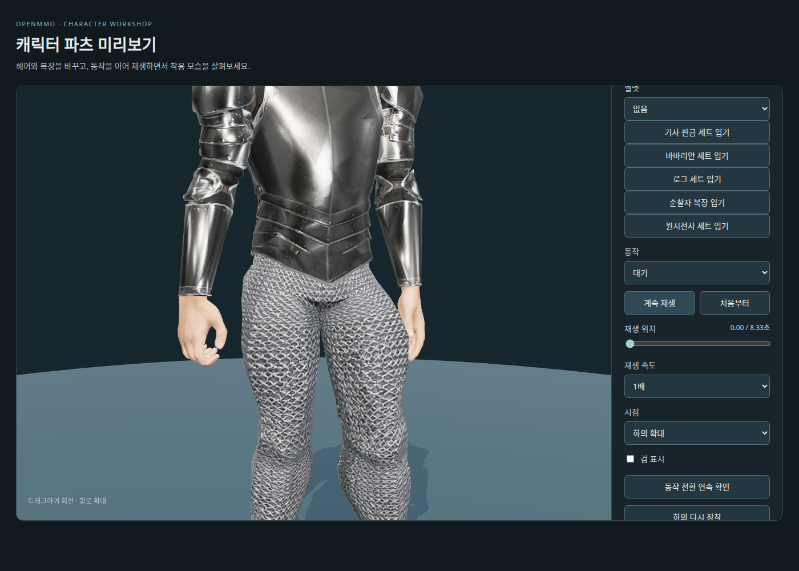
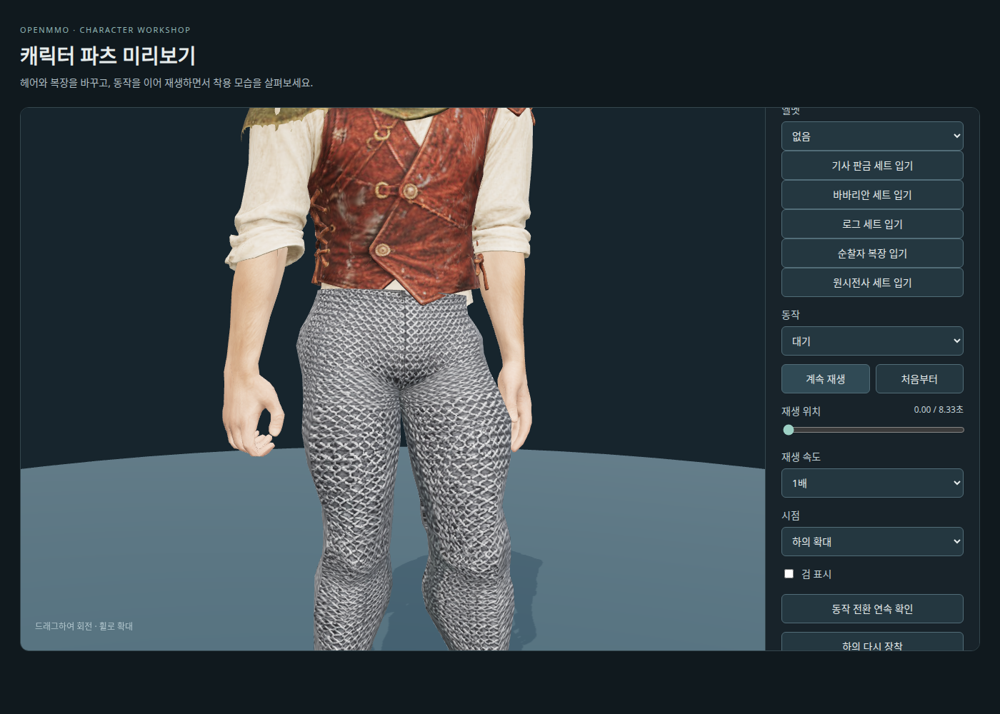
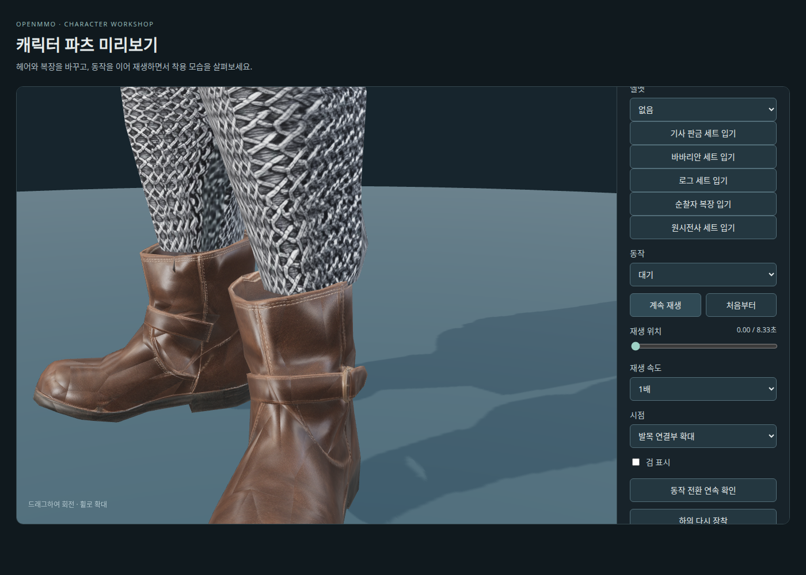
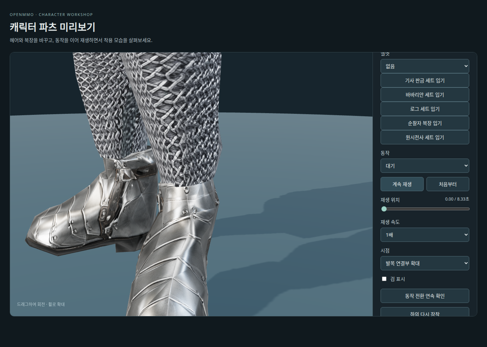
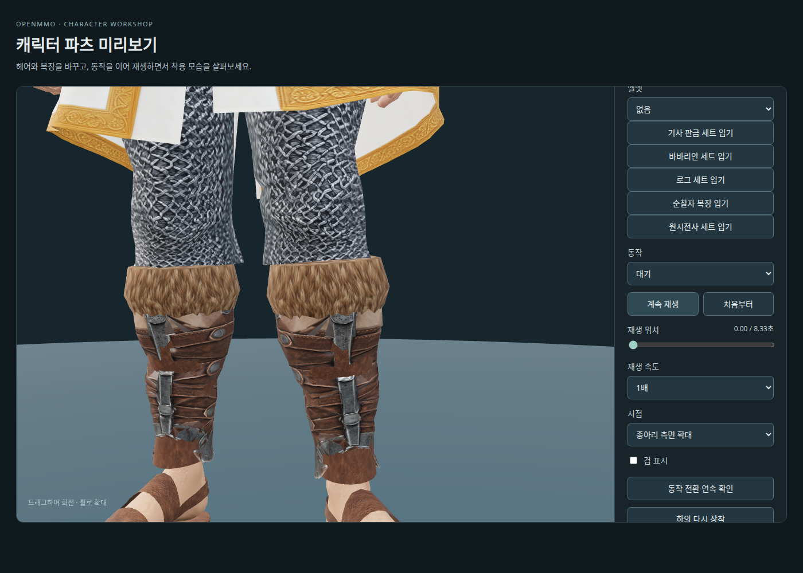
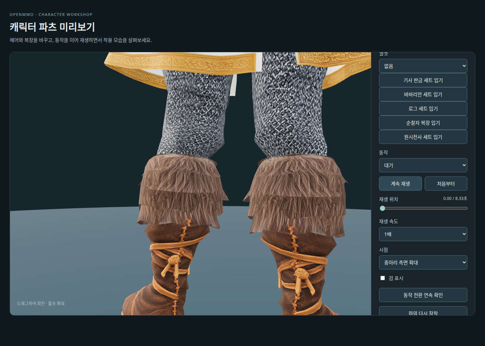
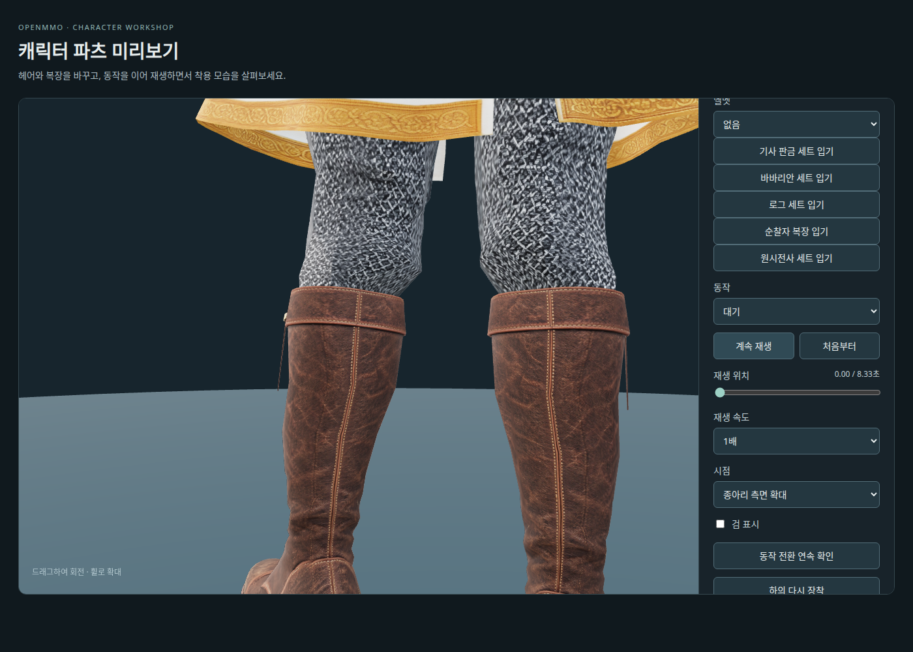

# 사제 사슬 하의 — Tripo 피팅

2026-10-08. 사용자가 전달한 `Y:\public\web_downloads\chainmail+pants+3d+model.glb`를
`/mnt/y/web_downloads/chainmail+pants+3d+model.glb`에서 회수했다.
원본은 **2,034 triangles**, 메시·재질 각각 1개, 내장 2048×2048 JPEG이며 리깅은 없다.
논의한 목표는 1,000쿼드였으며 실제 생성 설정은 미확인이다.

## 보관과 피팅

- 원본: `assets/modular_human_male_01/parts/priest_tripo_pants_v1/source.glb`.
- 피팅·리깅: 같은 폴더의 `pants_priest.glb`, 현재 v4 **1,513 triangles**.
- 편집본: 같은 폴더의 `priest-pants-fitting-v4.blend`.
- [출처·해시](modular-priest-tripo-pants-sources.json), [피팅 수치](modular-priest-tripo-pants-fitting-v4.json).
- [보정 이력](modular-priest-tripo-pants-fitting-history.json), [원본 형상 검사](modular-priest-tripo-pants-source-review-v1.json).

원본은 별도 보관했다. 착용 사본에서 허리 안쪽의 움푹 들어간 막힌 팬 30면과 양쪽 발목의
막힌 팬 42면을 제거했다. 이후 사용자 요청으로 검은 발목 마감과 접힌 테두리를 정리한 v2로 갱신했다.
숫자를 맞추기 위한 데시메이션은 하지 않았다. 허리 마감과 작은 앞 여밈은 하의 소속이며,
외부 벨트·흰 옷자락은 상의 소속이다.

### 발목 마감 v2 — 2026-10-08

원본 좌표 Y=0.09 아래의 검은 마감·접힌 안쪽 면을 제거하고, 경계에 걸친 면을 잘랐다.
잘린 경계의 UV는 원본에서 보간하며 내장 JPEG 바이트는 그대로 유지한다.
남은 사슬 부분을 기존 착용 밑단 높이까지 연장하고 공통 발목 단면에 맞췄다.
허리와 두 발목에 열린 테두리 3개가 있으며, 같은 위치·UV의 중복 정점은 합쳤다.
이전 1,962삼각형 후보는 `pants_priest-black-cuffs-v1.glb`와
`priest-pants-black-cuffs-v1.blend`는 2026-10-09 중간 결과물 정리 때 삭제했다. **[미사용]** 비교용 이전 후보이며 현재 제작실은 아래의 허리–엉덩이 보정을 더한 v4를 사용한다.



현재 `parts/fitted/base.glb`, `interfaces/v1`, `human_male_01_mixamo_candidate_v2` 65본을 사용한다.
허리·가랑이·무릎 높이를 각각 정렬하고 몸체 표면에서 가중치를 전사했다.
발목의 단면·가중치는 기존 공통 절차를 사용하며 종아리 축소를 중복 적용하지 않았다.
초기 피부 표시 검사에서 나타난 발목 위 관통은 면 중심·모서리 표본 보정을 0.215m 위까지
적용해 수정했다. 보정 후 기본 자세의 앞뒤 화면에서 해당 피부 노출이 해소된 것을 확인했다.
그림·단면 후보의 존재만으로 모든 연결부 호환이 확정된 것은 아니다.

### 엉덩이 실루엣 v3 — 2026-10-08, [미사용]

상의를 벗었을 때 뒤로 뾰족하게 솟던 부분을 기준 몸체의 뒤쪽 표면에 맞춰 줄였다.
Y=0.77–1.11m의 후면에서 과한 깊이만 줄이고 허리·허벅지·옆면으로 점진적으로 연결한다.
앞면, X/Y 좌표, 하단 다리·발목, 위쪽 허리 경계는 유지한다. 토폴로지·UV·내장 JPEG도 동일하며
**1,513 triangles / UV 이음 포함 1,361 vertices**다. 가중치는 보정된 형상에서 다시 전사했다.

처음 정점만 몸체 뒤 10mm에 맞춘 후보는 큰 삼각형 사이로 피부가 두 곳 보여 제외했다.
면 중심과 모서리 중점에 뒤쪽 피부와 4mm 여유를 보정한 최종 후보에서는 기본 자세의
피부 표시 앞뒤 렌더에 해당 노출이 보이지 않는다. 전체 자세의 피부 충돌 합격은 아니다.

상의 없는 네 방향과 대표 동작 7종의 각 40% 시점, 기존 부츠 다섯 조합·맨발 복원·재장착을
브라우저에서 확인했다. 별도 동작 검사 91시점에서 유한 정점·UV 이음 유지와 65본 연결을 통과했다.
[실루엣과 착용 검사](modular-priest-tripo-pants-seat-review-v3.json).


이미지는 기존 자산을 착용한 로컬 Chromium 제작실 화면 캡처이며 새 AI 생성은 없다.
출처·이용 조건은 원본 사슬 바지와 기준 몸체의 기록을 따른다.
**[미사용]** 이전 v2는 `pants_priest-seat-before-v2.glb`와 `priest-pants-fitting.blend`는 중간 결과물 정리 때 삭제했다.
v1/v2 검수와 아래 부츠별 화면은 해당 보정 당시 기록이다. v3 부츠 절단 재확인은 위 실루엣 검사에 기록했다.

### 허리–엉덩이 연결 v4 — 2026-10-08

사용자 비교 사진에서 v3의 허리가 급히 들어간 뒤 엉덩이가 다시 불룩해 보이는 문제가 남았다.
**[미사용]** v3 GLB는 `pants_priest-seat-before-v3.glb`, 편집본 `priest-pants-fitting-v3.blend`는 중간 결과물 정리 때 삭제했다.

현재 v4는 기존 `parts/fitted/pants_plate.glb`의 후면 곡선을 기준으로 허리부터 엉덩이·위쪽 허벅지까지 연결했다.
기준 표면을 XY ±12mm에서 평활화하고 Z=-25mm를 중심으로 뒤쪽 깊이의 90%를 사용했다.
위쪽 허리에서 보정이 사라지던 전환을 없애 잘록하게 들어간 부분도 함께 펴고, 하단은 Y=0.76–0.86m에서 점진적으로 연결한다.
면 중심·모서리 중점의 몸체 여유 4mm를 유지한다. X/Y, 앞면, 아래쪽 다리·발목, 토폴로지·UV·내장 JPEG는 그대로다.
**1,513 triangles / UV 이음 포함 1,361 vertices**이며 새 AI 생성이나 유료 호출은 없다.
판금 하의는 [기존 판금 자산 기록](modular-knight-plate-sources.json)의 출처·이용 조건을 따른다.



[수정 전](../images/characters/modular_human_male_01/parts/priest/tripo-pants-seat-v4-before-side.png)과
[판금 기준](../images/characters/modular_human_male_01/parts/priest/tripo-pants-seat-v4-plate-reference-side.png)을 같은 시점에서 비교했다.
기본 셔츠 착용과 상의 없는 옆·뒤, 대표 동작 7종의 각 40% 시점, 부츠 5종·맨발 복원·재장착을 확인했다.
별도 91시점 검사에서 유한 정점·UV 이음·65본 연결이 통과했으며 기본 자세 피부 표시에서 후면 노출이 보이지 않는다.
[착용 검사](modular-priest-tripo-pants-seat-review-v4.json),
[대표 동작](../images/characters/modular_human_male_01/parts/priest/tripo-pants-seat-v4-motion.png).
허리 후면 90표본의 판금 기준 오차는 약 12.0mm에서 3.8mm로 줄었다.
[단면 비교](modular-priest-tripo-pants-seat-profile-v4.json)는 기본 자세의 형상 비교이며 충돌 검사는 아니다.
화면은 로컬 Chromium 캡처로, 포함된 자산의 기존 출처·이용 조건을 따른다.

## 검수와 제작실



- [피부 표시 앞뒤](../images/characters/modular_human_male_01/parts/priest/tripo-pants-fitted-v4-skin.png), [발목 확대](../images/characters/modular_human_male_01/parts/priest/tripo-pants-fitted-v4-ankles.png).
- [상의 조합과 허리 확대](../images/characters/modular_human_male_01/parts/priest/tripo-pants-fitted-v4-connections.png).
- [리그·동작 수치](modular-priest-tripo-pants-animation-v4.json), [Blender 기본 자세 검수 기록](modular-priest-tripo-pants-review-v4.json).
- [브라우저 착탈·동작 검사](modular-priest-tripo-pants-workshop-v1.json).

대기·걷기·달리기·점프·베기·전투 대기·앉기 각 13시점에서 유한 정점·UV 이음 유지와
실제 `bindModularPart` 연결을 확인했다. 기존 65본 rest 계층·inverse bind가 일치한다.
이 검사는 모든 관통이나 자연스러운 변형의 합격을 뜻하지 않는다.

[제작실](https://localhost:10004/modular-character-preview.html?outfit=priest&fit=pants-v1)은
사제 상의와 이 하의를 함께 선택하며 맨발로 표시한다. 바지를 입으면 다리·발목 피부와
기존 천 바지를 숨긴다. 벗기·교체·로딩 실패 시 피부를 복원한다. 착탈·재장착과 5종 동작을
브라우저에서 확인했고, `npm run check`, `npm run lint`, 관련 테스트 52개가 통과했다.

**개발용 착용 후보이며 게임 출시 장비로 등록하지 않았다.**
[현재 v4 허리 단면 검사](modular-priest-tripo-pants-waist-review-v4.json)는 3mm 여유 기준을 통과하지 못했다.
내보낸 상의 스키닝 기준에서 허리 주변 1.04–1.12m의 비교 광선 중 최대 약 19.6mm의
반경 역전이 있어, 특히 달리기·공격의 상의와 하의 겹침 보정이 남는다.
이 검사는 양쪽 표면이 만나는 광선만 비교하며 앞트임·후면 트임과 보조 본 8개의 런타임
옷자락 움직임을 완전한 삼각형 충돌로 검사하지 않는다. Blender 동작 시트도 보조 본 움직임을 포함하지 않는다.
브라우저 검사에서는 보조 본 움직임을 활성화했다. 아래 다섯 신발 조합을 제외한 다른 상의·부츠와의 혼합 조합은 미검증이다.

## 판금 갑옷과 허리 연결 — 2026-10-09

판금 갑옷 옆으로 드러나던 사슬 바지의 높은 허리 테두리를 조합별로 정리했다.
실제 표시 중인 `top_plate`와 `pants_priest`를 함께 착용할 때만 기존 허리 보정과 절단을 순서대로 적용한다.
Y=0.92–1.04m에서 허리 반경을 0.23→0.16m, 앞뒤 깊이를 0.17→0.10m로 점진적으로 좁힌다.
중심은 Z=-0.035m다. 절단 높이는 앞쪽 1.06m이며 뒤 중앙으로 최대 9cm 낮아져 갑옷 뒤쪽 밑단을 따른다.
절단만 한 초기 후보에서는 바지 폭 때문에 가장자리 간섭이 남아 안쪽 보정을 추가했다.



갑옷 제거·교체·미로딩 시 원래 허리를 복원하며 기존 부츠 5종 절단과 함께 적용된다.
원본 GLB는 유지하고 절단 경계의 UV·가중치는 기존 함수로 보간한다.
맨발 조합의 사슬 바지는 1,513→1,081 triangles다. 몸체·판금 상의·하의 조합은 숨김 포함 보관
**18,505**, 런타임 **18,073**, 표시 **10,589** triangles이며 얼굴 배분은 **1,505**다.
헤어·장갑·부츠·투구·무기·망토는 제외한다.

네 방향과 대표 동작 7종의 40% 시점에서 연결을 확인했다.
실제 자산의 91시점 유한 정점 검사, 착탈·재선택·미로딩 복원과 부츠 5종 조합을 통과했다.
타입 검사·린트·관련 테스트 69개가 통과했다. 전체 동작 표면 충돌 합격은 아니다.
[착용 검사](modular-priest-plate-waist-review-v1.json), [동작·조합 수치](modular-priest-plate-waist-validation-v1.json).
이미지는 로컬 Chromium 캡처이며 사슬 바지는 이 문서, 갑옷은 [판금 자산 기록](modular-knight-plate-sources.json)의
출처·이용 조건을 따른다. 새 AI 생성·유료 호출은 없다.
재현: `node tools/validate-priest-plate-waist.mjs`.

## 로그 상의와 허리 연결 — 2026-10-09

사슬 바지의 높은 허리가 로그 조끼 밑단을 가리던 부분을 조합별로 정리했다.
실제 표시 중인 `top_rogue`와 `pants_priest`를 함께 착용할 때 기존 `tripo_pants_waist` 절단을 적용해
기본 자세 Y=1.105m 위를 제거한다. 기존 1.14m 허리보다 3.5cm 낮다.
상의 제거·교체·미로딩 시 원래 허리를 복원하며 부츠 5종 절단과 함께 적용한다.
원본 GLB는 유지하고 잘린 경계의 UV·스킨 가중치는 기존 절단 함수로 보간한다.

이전 v1 화면은 중간 결과물 정리 때 삭제했다. 현재 화면은 아래 v2 검수에 남겼다.

네 방향과 대표 동작 7종의 40% 시점에서 밑단과 연결을 확인했다.
실제 자산의 91시점 유한 정점·가중치 검사, 반복 선택·착탈·미로딩 복원·부츠 5종 조합을 통과했다.
판금 상의 조합의 기존 검사도 다시 통과했다. 타입 검사·린트·관련 테스트 70개가 통과했다.
전체 동작 표면 충돌 합격은 아니다.
[착용 검사](modular-priest-rogue-waist-review-v1.json), [동작·조합 수치](modular-priest-rogue-waist-validation-v1.json).
맨발 조합 하의는 1,513→1,357 triangles이며 몸체·로그 상의·하의 조합은 숨김 포함 보관
**20,281**, 런타임 **18,423**, 표시 **13,722** triangles, 얼굴 배분 **1,505**다.
헤어·장갑·부츠·투구·무기·망토는 제외한다.

이미지는 로컬 Chromium 화면 캡처이며 기존 사슬 바지와 [로그 상의](modular-rogue-parts.md)의 출처·이용 조건을 따른다.
새 AI 생성·유료 호출은 없다. 재현: `node tools/validate-priest-plate-waist.mjs rogue`.

### 로그 속셔츠 밑단 보정 v2 — 2026-10-09

피부를 숨겨도 남는 삼각형 얼룩은 로그 상의 자체의 겹친 안쪽 가죽 면과 음영이 구워진 속셔츠 UV 영역이었다.
앞쪽 안쪽 가죽 면 15개를 제거하고 리넨 정점 22개를 최대 12mm 안으로 넣었다.
앞쪽 리넨 UV 정점 15개는 기존 아틀라스의 깨끗한 리넨 영역으로 옮겼다. 이미지 바이트·리그·가중치는 유지했다.
사슬 바지 조합에서는 몸체 피부 경계도 Y=1.105m로 맞추며 상의 제거·교체·미로딩 시 복원한다.
수정 전 상의는 [미사용] `top_rogue-undershirt-before-v1.glb`로 보관했다.



[착용 화면](modular-priest-rogue-waist-review-v2.json), [조합 검사](modular-priest-rogue-waist-validation-v2.json),
[상의 메시 보정](modular-rogue-undershirt-fitting-v1.json), [압축본 검사](modular-rogue-undershirt-game-validation-v1.json).
정면·후면·옆면과 대표 7종 동작을 확인했고 제작용·게임용 모델 각각 91시점 검사를 통과했다.
타입 검사·린트·관련 테스트 71개가 통과했다. 전체 표면 충돌 합격을 의미하지 않는다.
현재 몸체·상의·사슬 하의 조합은 숨김 포함 보관 **20,266**, 런타임 **18,299**, 표시 **13,598** triangles,
얼굴 **1,505**다. 헤어·장갑·부츠·투구·무기·망토는 제외한다.
v1 보관 수치 18,579는 잘린 런타임 몸체를 원본 합계로 잘못 사용한 값이라 20,281로 정정했다.
출처는 기존 Tripo Studio 출력이며 새 AI 생성·유료 호출은 없다.

## 가죽 부츠 밑단 연결

2026-10-08 가죽 부츠 옆으로 사슬 밑단이 나오던 부분을 런타임에서 자르도록 수정했다.
`pants_priest`와 실제 표시 중인 `boots_leather`를 함께 착용하면 기존 `leather_boots` 절단을
적용해 기준 자세 Y=0.235m 아래를 제거한다. 부츠 상단 0.245m보다 1cm 낮은 경계다.
UV·스킨 가중치는 기존 절단 함수로 보간하며, 원본 GLB는 보존한다.
부츠 벗기·교체·로딩 실패 시 전체 길이를 복원한다.

앞·뒤·옆 확대와 대기·걷기·달리기·점프·공격·전투 대기·앉기의 각 40% 시점에서
기존처럼 부츠 옆으로 길게 나오던 밑단이 제거된 것을 확인했다. 전체 동작의 충돌 검사는 아니다.
재선택·재장착과 맨발 복원을 확인했고, 타입 검사·린트·관련 테스트 53개가 통과했다.
[검사 기록](modular-priest-leather-boots-review-v1.json).



이 이미지는 로컬 제작실의 브라우저 화면 캡처이며 새 AI 생성은 없다.
포함된 사슬 바지와 가죽 부츠의 출처·이용 조건은 각 원본 자산 기록을 따른다.

## 판금 신발 밑단 연결

2026-10-08 판금 신발도 함께 착용할 때만 기준 자세 Y=0.22m 아래를 자르도록 수정했다.
판금 신발의 최대 높이는 약 0.23218m이며, 가죽 부츠보다 낮은 입구에 맞춰 별도
`plate_boots` 절단을 사용한다. 원본 GLB는 보존하고 UV·스킨 가중치는 기존 함수로 보간한다.
맨발·다른 신발·로딩 실패 시 해당 조합의 밑단으로 복원한다.

앞·뒤·옆 확대와 대표 동작 7종의 각 40% 시점에서 신발 옆으로 내려오던 사슬 밑단이
제거된 것을 확인했다. 전체 동작의 충돌 검사는 아니다. 재선택·재장착·맨발 복원을 확인했고,
타입 검사·린트·관련 테스트 54개가 통과했다. [검사 기록](modular-priest-plate-boots-review-v1.json).



로컬 제작실의 브라우저 화면 캡처이며 새 AI 생성은 없다. 사슬 바지는 이 문서의 출처를,
판금 신발은 [판금 자산 기록](modular-knight-plate-sources.json)의 출처·이용 조건을 따른다.

## 바바리안 정강이 보호대 밑단 연결

2026-10-08 사슬 바지와 실제 표시 중인 `boots_barbarian`을 함께 착용하면
`barbarian_pants_boots`로 기준 자세 Y=0.479m 아래를 자르도록 수정했다.
모피 입구의 안쪽·바깥쪽 높이는 각각 0.478m·0.482m다. 초기 기존 `greaves`의 0.46m
절단은 입구 아래로 사슬 끝이 남아 확대 검수에서 제외했고, 바깥 입구보다 3mm 낮게 올렸다.
보호대 아래 피부는 같은 경계 아래만 표시해 틈에 빈 공간이 생기지 않게 했다.
맨발·다른 신발·로딩 실패 시 밑단과 피부 표시를 복원한다. 원본 GLB는 보존한다.

세 방향 확대와 대표 동작 7종의 각 40% 시점을 확인했다. 전체 동작의 충돌 검사는 아니다.
착탈·재선택·재장착과 하단 피부 복원 테스트를 추가했고, 타입 검사·린트·관련 테스트
56개가 통과했다. [검사 기록](modular-priest-barbarian-boots-review-v1.json).



로컬 제작실의 브라우저 화면 캡처이며 새 AI 생성은 없다. 사슬 바지는 이 문서의 출처를,
보호대는 [바바리안 자산 기록](modular-barbarian-sources.json)의 출처·이용 조건을 따른다.

## 원시전사 모피 가죽 부츠 밑단 연결

2026-10-08 `pants_priest`와 실제 표시 중인 `boots_caveman`을 함께 착용할 때
`caveman_pants_boots`로 실제 모피 입구의 굴곡에 맞춰 자른다.
초기 0.43m 수평 절단은 가죽 통의 관통을 없앴지만 사용자의 후속 사진에서 모피 입구를
덮는 밑단이 남았다. **[미사용]** [초기 검수](modular-priest-caveman-boots-review-v1.json).
0.465m 수평 절단도 시험했으나 입구가 낮은 방향에서 틈이 보여 제외했다.

`tools/measure-caveman-boot-cuff.py`로 원본 부츠의 수직 단면 128방향에서 입구 높이와
안쪽 반경을 추출했다. 입구 높이는 약 0.43580–0.47808m이며 절단선은 각 방향에서
3mm 낮다. 밑단 위 45mm 범위에서 점진적으로 좁혀 입구 안쪽으로 3mm 넣고,
밑단 가중치는 해당 다리의 `Leg` 본에 맞춘다. 기존 순찰자 입구 보정 코드를 공통 함수로
재사용하며 순찰자 프로파일과 동작은 유지한다. 원본 GLB·텍스처는 보존하고 UV·가중치는 보간한다.
부츠 교체·벗기·로딩 실패 시 해당 조합의 밑단으로 복원한다.

네 방향 확대와 대표 동작 7종의 각 40% 시점에서 입구를 덮던 사슬 끝이 안으로
들어간 것을 확인했다. 전체 동작의 충돌 검사는 아니다. 착탈·재선택·재장착을 확인했고,
타입 검사·린트·관련 테스트 85개가 통과했다. 양쪽 절단 경계의 입구 반경·본 가중치·UV와
기존 순찰자 절단의 회귀 테스트를 포함한다. [수정 검수](modular-priest-caveman-boots-review-v2.json).



로컬 제작실의 브라우저 화면 캡처이며 새 AI 생성은 없다. 사슬 바지는 이 문서의 출처를,
부츠는 [원시전사 부츠 기록](modular-caveman-tripo-boots-sources.json)의 출처·이용 조건을 따른다.

## 순찰자 가죽 부츠 밑단 연결

2026-10-08 사슬 바지와 실제 표시 중인 `boots_ranger`를 함께 착용하면 기존
`ranger_pants_boots` 절단과 안쪽 보정을 적용한다. 원본 부츠에서 측정한 128방향 입구
프로파일을 재사용하며, 높이는 약 0.46231–0.48177m다.
각 방향의 입구보다 3mm 낮게 자르고, 밑단 위 45mm를 점진적으로 좁혀 입구 안쪽으로
3mm 넣는다. 밑단 가중치는 부츠와 같은 다리의 `Leg` 본에 맞춘다.
UV·가중치는 보간하고 원본 GLB는 보존한다. 부츠 벗기·교체·로딩 실패 시 해당 조합의 밑단으로 복원한다.

네 방향 확대와 대표 동작 7종의 각 40% 시점에서 밑단이 부츠 입구 안으로 들어간 것을
확인했다. 전체 동작의 충돌 검사는 아니다. 착탈·재선택·재장착을 확인했고,
타입 검사·린트·관련 테스트 86개가 통과했다. [검사 기록](modular-priest-ranger-boots-review-v1.json).



로컬 제작실의 브라우저 화면 캡처이며 새 AI 생성은 없다. 사슬 바지는 이 문서의 출처를,
부츠는 [순찰자 부츠 기록](modular-ranger-tripo-boots-sources.json)의 출처·이용 조건을 따른다.

## 예산과 출처

몸체·crop 헤어·사제 상의·하의의 보관 GLB 합계는 **20,251 triangles**다.
제작실의 목 가림을 적용한 조합은 **19,822**, 표시 합계는 **12,920**, 얼굴 배분은 기존 **1,505**다.
신발·장갑·사제관·무기·망토는 제외하며, 보관 GLB의 숨김 포함 합계는 15,000–20,000 목표를 조금 넘는다.
[예산 기록](modular-priest-tripo-pants-budget-v4.json).

출처는 사용자 확인 Tripo Studio 생성물이며 원래 출력물 이용 조건과 기존 계정 출처 기록을 따른다.
이 파일의 생성일·정확한 구독 등급·모델 버전·작업 ID·실제 제출 원화는 미확인이다.
이전 약 USD 20/월 구독 보고는 과거 정보로 구분했다. 전달·피팅일은 2026-10-08이다.
새 AI 생성이나 유료 API 호출은 없다. 원화 출처는 내장 ImageGen / **ChatGPT Pro 20x**이며
[앞뒤 원화 기록](modular-priest-pants-sources.json)을 따른다.

## 재현

```bash
.venv/bin/python tools/fit-tripo-priest-pants.py
node tools/validate-tripo-rogue.mjs --directory assets/modular_human_male_01/parts/priest_tripo_pants_v1 --part pants_priest --report doc/assets/modular-priest-tripo-pants-animation-v4.json
blender -b -t 6 --python-exit-code 1 --python tools/blender-scripts/review_tripo_priest_pants.py -- --rest-only --revision 4
.venv/bin/python tools/review-ranger-waist.py --top assets/modular_human_male_01/parts/priest_tripo_top_v1/top_priest.glb --pants assets/modular_human_male_01/parts/priest_tripo_pants_v1/pants_priest.glb --poses assets/modular_human_male_01/parts/priest_tripo_pants_v1/validation-poses.json --report doc/assets/modular-priest-tripo-pants-waist-review-v4.json --revision 4 --heights 1.04 1.06 1.08 1.10 1.11 1.12
```

마지막 허리 검사는 현재 후보에서 실패로 종료하며, 실패 수치가 포함된 보고서를 저장한다.

## 중간 결과물 정리 — 2026-10-09

사용자 요청으로 교체된 모델·편집본과 이전 검수 이미지를 삭제했다.
원본, 현재 GLB·편집본, 최종 비교 화면과 수치 검증·출처 기록은 유지한다.
[삭제 목록과 해시](modular-priest-cleanup-v1.json).
