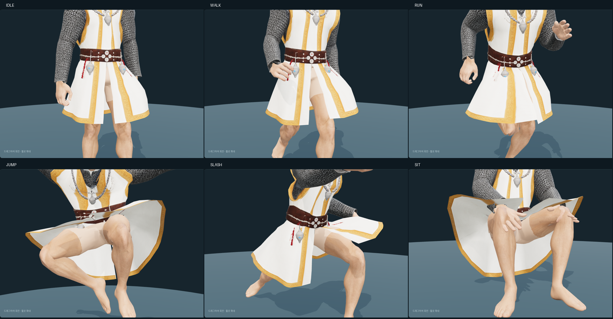

# 남성 사제 상의 — Tripo 원본과 착용 후보

2026-10-08 사용자 전달 `/mnt/y/web_downloads/medieval+robe+3d+model.glb`를
`assets/modular_human_male_01/priest/tripo_top_v1/source.glb`에 원형 그대로 보관했다.
`/mnt/y`는 사용자가 알려준 `Y:\public` 경로다. 추가 생성·유료 API 호출은 없다.

## 원본 검수

- **3,913 triangles**, UV 분리 포함 정점 4,743개, 메시·재질 각 1개.
- 내장 텍스처: 2048×2048 JPEG 한 장. 별도 노멀·거칠기 텍스처는 없다.
- 리그·애니메이션 없음. GLB는 삼각형 메시이므로 생성 당시 실제 쿼드 수는 확인되지 않는다.
- 앞뒤 트임에 하단 사슬이 없고, 사슬 소매·옷깃과 벨트·목걸이 장식은 남아 있다.
- 위치 용접 진단의 연결 성분 11개, 경계 모서리 495개, 퇴화 면·면적이 0인 UV 삼각형 0개.
  경계 수에는 목·소매·밑단 등 열린 의상 테두리가 포함되므로 개수만으로 결함을 판정하지 않는다.

## 피팅 후보

**[미사용]** 착용 형태 검토용이며 게임용 완성 복장이 아니다.
현재 `fitted/base.glb`와 기존 `human_male_01_mixamo_candidate_v2` 65본에 맞췄다.
목·허리·손목의 `interfaces/v1` 단면은 기록된 몸체 해시가 달라 이번 피팅의 확정 치수로 쓰지 않았다.
원본의 삼각형 인덱스·UV·내장 텍스처를 유지하며 최종 GLB도 **3,913 triangles**다.

소매의 어깨~손목 축을 실제 몸체에 맞추고, 몸통·소매 표면에 여유 공간을 보정했다.
몸통은 척추 본 사이에서 연결하고, 소매는 같은 쪽 팔·팔뚝·손 본을 따른다.
분리된 은색 장식·붉은 끈은 가슴 또는 골반에 고정해 형태를 유지한다.
허리 아래 성의는 상의 소속이다. 내보낸 GLB는 기존 65본과 호환되도록 골반에 고정하고,
브라우저에서는 옷자락에 보조 본 8개를 추가해 간단히 움직인다.

속옷 선택 시 옆면으로 허벅지가 관통하던 문제는 옷자락 피팅으로 보정했다.
기본 자세와 대기 동작 13시점의 몸통·허벅지 단면을 골반 기준으로 합치고,
35mm의 단면 여유를 주어 필요한 정점만 바깥으로 이동했다. 최대 이동량은 약 46.5mm다.
다리 피부를 가리지 않아 앞뒤 트임과 밑단 아래의 피부는 그대로 보인다.
기본 자세와 대기 13시점에서 허리 아래 옷과 몸의 삼각형 교차가 없음을 검사했고,
브라우저에서도 속옷 조합의 네 방향을 확인했다. 이 기록은 보조 본 적용 전 기준 피팅이다.

판금 바지 조합에서는 바지의 허리·골반이 로브 옆면으로 돌출해, 사제 상의를 입었을 때만
바지 윗부분을 안쪽으로 좁히는 변형을 적용했다. 높이 0.92–1.04m 구간에서 부드럽게 연결하고,
1.04m 이상은 중심 Z=-0.035m, 반폭 0.16m·반깊이 0.10m의 타원 안으로 제한한다.
정점 높이·삼각형·UV·스킨 가중치는 유지하며, 변형은 장비 조합별로 한 번 계산해 공유한다.
앞뒤 트임 안의 바지와 하단 판금은 유지되고, 상의 교체 시 원래 바지로 복원된다.
가죽·바바리안·순찰자·원시전사 부츠의 밑단 보정과 조합·복원을 브라우저에서 확인했다.

바바리안 벨트·모피 하의 조합에서는 벨트를 같은 허리 보정으로 넣고, 모피·끈은
중심 Z=-0.015m, 반깊이 0.145m의 타원 안으로 좁혔다. 반폭은 높이 0.92–1.04m에서
0.22m에서 0.16m로 연결한다. 앞뒤 트임 안에서 보이는 모피는 유지한다.
이 조합의 모피 시뮬레이션 8개는 해제해 바깥으로 다시 밀려나지 않게 하고 연산을 줄인다.
정점·삼각형 추가 없이 캐시된 변형을 공유하며, 원본 GLB는 변경하지 않았다.
사제 상의를 벗으면 원래 하의와 시뮬레이션으로 복원한다.
대기 앞·옆·뒤와 걷기 시점을 검토하고, 6종 동작 각 13시점의 유한 정점,
피팅 위치 유지, 장비 교체·재착용·캐시 재사용을 확인했다. 극단 동작의 정밀 충돌 검수는 포함하지 않는다.

원시전사 허리띠 하의에도 같은 조합 보정을 적용했다. 벨트·뼈 장식은 허리 안으로 넣고,
앞뒤 가죽 패널·옆 모피는 위의 모피 단면으로 제한한다. 사제 상의와 함께 입을 때만
하의 시뮬레이션 4개를 해제하며, 트임 안의 가죽·모피와 원래 복장으로의 복원을 유지한다.
앞·옆·뒤 및 걷기 시점과 6종 동작 각 13시점의 유한 정점·피팅 유지·재착용을 확인했다.
정점·삼각형 추가나 원본 GLB 변경은 없다.

로그 바지 조합에서는 분리된 주머니 4개, 총 346 triangles를 제거한다. 위치를 10µm 단위로
합쳐 UV 이음을 연결한 뒤, 연결 조각의 최소 높이가 0.9–1.0m이고 최대 높이가 1.05m를
넘는 주머니만 제외한다. 바지 본체와 작은 벨트 고리는 보존하며 원본 2,022 triangles 중
주머니 제거만 적용하면 1,676 triangles다. 기존 허리 절단·순찰자 부츠 보정과 함께 캐시하고,
사제 상의나 바지를 해제하면 원래 조합으로 복원한다. 원본 GLB와 남은 정점의 위치·UV·
스킨 가중치는 유지한다. 앞·옆·뒤와 6종 동작 각 13시점, 원본 복원·재사용·부츠 조합을 확인했다.

순찰자 가죽바지의 돌출된 허리띠에는 기존 사제용 허리 단면 보정을 재사용한다.
높이 0.92m 아래는 유지하고 위쪽만 안으로 좁혀, 3,714 triangles와 UV·스킨 가중치·정점 높이를
보존한다. 순찰자 부츠의 밑단 보정과 함께 캐시하며, 사제 상의를 벗으면 원래 하의 조합으로 복원한다.
대기 앞·옆·뒤, 6종 동작 각 13시점의 유한 정점과 장비 교체·재착용·부츠 조합을 확인했다.
추가 정점·시뮬레이션이나 원본 GLB 변경은 없다.

첫 후보의 소매 축이 앞쪽으로 어긋나고 소매 끝에 골반 가중치가 섞였다.
원본 소매의 깊이 방향 기울기를 반영하고 가중치를 표면을 따라 부드럽게 연결해 수정했다.
소매와 겨드랑이의 극단 자세 변형은 후속 시각 보정 대상이다.

검토 장면은 기존 짧은 머리·천 바지를 함께 입힌다. 몸통·팔·바지 안쪽 피부를
장면에서 임시 가림 처리했다. 기준 몸체 파일과 게임의 가림 규칙은 변경하지 않았다.
피부를 가리지 않은 초기 착용 검수에서는
어깨·몸통 등의 피부 관통을 확인할 수 있다. 가림 처리만으로 혼합 장비의 호환을 선언하지 않는다.

## 가벼운 옷자락 움직임

많은 사제가 함께 등장하는 상황을 고려해 정밀 천 격자 대신 **각도 스프링 8개**를 사용한다.
앞뒤 트임의 양쪽에 4개씩 배치하고, 허리 연결부는 고정한 채 아래를 부드럽게 연결한다.
같은 쪽 허벅지 방향으로 최소 벌어짐을 정하고, 다리가 내려오면 감쇠 스프링으로 복귀한다.
옷·몸 삼각형 충돌, 천 자체 충돌, 주름 계산, 반복 길이 보정은 실행하지 않는다.

- 갱신: 최대 30Hz, 한 프레임에 최대 한 번. 숨김·복귀·긴 프레임·순간이동 시 상태 초기화.
- 렌더링: 기존 GPU 스키닝을 사용한다. GLB 65본은 유지하고 런타임에서 이 상의만 73본을 쓴다.
- 정점: 추가 0개. CPU에서 정점 위치나 노멀을 프레임마다 갱신하지 않는다.
- 공유: 같은 원본 옷의 가중치·정점 데이터 한 벌을 공유하고, 스프링과 본 상태는 캐릭터별로 분리한다.
- 수명: 옷 제거 시 원래 메시·골격을 복원하고, 마지막 사용자가 제거될 때 공유 데이터를 해제한다.
- 가림: 렌더러의 프러스텀 컬링을 유지하며, 기존 보조 동작 스케줄러의 갱신 분산에 연결했다.

[런타임 검수·100명 CPU 측정](modular-priest-tripo-top-runtime-v1.json)에서 7종 동작 각 13시점의
유한 정점·UV 이음, 뒤늦은 파츠 바인딩과 원래 골격 복원을 확인했다.
100명·240프레임의 평균 처리 시간은 약 1ms/프레임이었다. Node CPU 전용 측정이며
애니메이션 믹서·드로콜·GPU 렌더링은 포함하지 않는다. 실제 게임 FPS를 의미하지 않는다.



대기·걷기의 표본에서는 옷자락과 몸의 삼각형 교차가 없었다. 달리기의 일부 시점,
점프·공격·앉기에서는 관통과 거친 접힘이 남는다. 정밀 충돌 합격을 선언하지 않으며,
후속 보정도 제어점·반복 수를 늘리기 전에 피팅과 최소 벌어짐부터 조정한다.

## 내보낸 스키닝 기준 검토

실제 클라이언트의 `bindModularPart`와 보정된 게임 애니메이션으로 7종 동작을 각 13시점 검사했다.
65본의 rest 계층·inverse bind 일치, 유한 정점과 가중치 합계, UV 이음이 벌어지지 않는 것을 확인했다.
수치 검사는 옷과 몸의 관통이나 자연스러운 변형의 합격을 의미하지 않는다.
현재 점프에서 짧은 모서리의 최대 연장 비율은 약 3.92배로, 겨드랑이 등의 추가 보정이 필요하다.

Blender 기준 검수는 GLB의 골반 고정 스키닝 기준으로, 현재 브라우저의 보조 본 움직임은 포함하지 않는다. 중간 렌더 이미지는 정리했다.
연속된 옆면·앞뒤 트임·금색 밑단과 원본 UV는 유지했다.

기준 GLB 합계는 몸체 13,891 + 기존 머리·바지 3,490 + 사제 상의 3,913 = **21,294 triangles**다.
현재 머리 영역은 2,575 triangles이며 얼굴만의 부분 집계는 미확정이다.
임시 가림·절단을 적용한 Blender 표시 수는 출처 JSON의 fitted_mesh_review.budget에 기록했다.
최종 런타임 표시 수와 15,000–20,000 목표의 전체 예산 검토는 후속 작업이다.
사제관·새 하의·장갑·샌들·무기·망토는 이 합계에 포함하지 않는다.

## 보관과 재현

[사제 상의 제작 미리보기](https://192.168.0.17:10004/modular-character-preview.html?outfit=priest).
상의 선택 항목으로 착탈하고 동작·시점을 바꿀 수 있다. 브라우저에서 원본 파츠 로딩,
사제 상의 선택·해제·재선택과 오류 없음, `npm run check`·`npm run lint`를 확인했다.
이 연결은 개발 미리보기 전용이며 게임 장비 등록은 아니다.

- 원본: `assets/modular_human_male_01/priest/tripo_top_v1/source.glb`.
- 착용 후보: 같은 폴더의 `top_priest.glb`.
- 편집본: 같은 폴더의 `priest-top-fitting.blend`; 원본 참조는 숨김 컬렉션으로 보관한다.
- [출처·파일 해시](modular-priest-tripo-top-sources.json).
- 원본·Blender 착용 검수 수치는 출처 JSON의 source_mesh_review·fitted_mesh_review에 합쳤다.
- [피팅·리그](modular-priest-tripo-top-fitting-v1.json), [동작 수치](modular-priest-tripo-top-animation-v1.json).
- [속옷 조합 대기 자세의 옷·몸 교차 검사](modular-priest-tripo-top-idle-clearance-v1.json).
- [가벼운 옷자락 런타임 검수](modular-priest-tripo-top-runtime-v1.json).

```bash
.venv/bin/python tools/fit-tripo-priest-top.py
node tools/validate-tripo-rogue.mjs --directory assets/modular_human_male_01/priest/tripo_top_v1 --part top_priest --report doc/assets/modular-priest-tripo-top-animation-v1.json
node tools/validate-priest-robe.mjs
blender -b -t 6 --python-exit-code 1 --python tools/blender-scripts/review_tripo_priest_top.py -- --raw
blender -b -t 6 --python-exit-code 1 --python tools/blender-scripts/review_tripo_priest_top.py
blender -b -t 6 --python-exit-code 1 --python tools/blender-scripts/review_tripo_priest_top.py -- --masked --animations
```

옷자락 피팅은 `idle-fitting-poses.json`의 대기 자세 13개를 사용한다. 전체 `validation-poses.json`은 위 동작 검사 명령으로 재생성할 수 있어 삭제했다.
구버전 원화·중간 렌더 7개와 중복 검수 JSON 2개를 정리하고 최신 원화·런타임 동작 이미지·숫자 검수는 보관했다.
피팅 도구는 몸체·애니메이션 입력 해시를 확인하며, 피팅 후 동작 검사로 후보 해시를 갱신한다.

출처는 사용자 Tripo 생성물이다. 구독 등급·생성일·작업 ID·정확한 제출 이미지는 확인되지 않았다.
기존 입력 원화는 [사제 부위 원화 기록](modular-priest-parts-sources.json)의 출처·이용 조건을 따른다.
