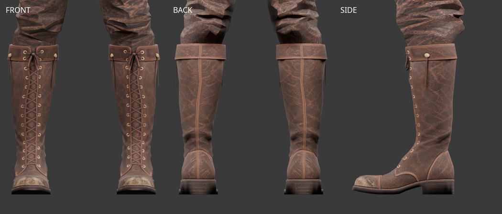

# 순찰자 Tripo 부츠 — 피팅 후보 v1

2026-10-07. 사용자가 전달한 `Y:\public\web_downloads\leather+boot+3d+model.glb`의
한쪽 부츠를 현행 남성 몸체에 피팅하고 반대쪽을 대칭 제작했다. 개발용 캐릭터 미리보기에 연결했다.

## 원본과 출력

| 파일 | 용도 | 삼각형 |
| --- | --- | ---: |
| `assets/modular_human_male_01/ranger/tripo_boots_v1/source.glb` | 전달 파일과 바이트가 같은 원본 한쪽 | 1,823 |
| `assets/modular_human_male_01/ranger/tripo_boots_v1/boots_ranger.glb` | 좌우 두 짝, 공통 리그 | 3,646 |
| `assets/modular_human_male_01/ranger/tripo_boots_v1/pants_ranger_boots-review.glb` | 런타임 바짓단을 그대로 저장한 Blender 검토용 | 2,814 |
| `assets/modular_human_male_01/ranger/tripo_boots_v1/ranger-boots-fitting.blend` | 몸체·복장·연결 곡선·숨긴 원본·내장 텍스처 | — |

제안했던 생성 목표는 한쪽 1,000쿼드, 약 2,000삼각형이다. 실제 제출 설정과 원래 쿼드 수는
확인되지 않았다. 생성일·작업 ID는 미상이며 전달일은 2026-10-07이다.
Tripo Studio 출처로, 기존에 사용자가 월 약 USD 20 구독을 알렸으나 이번 파일의 등급은 별도 확인되지 않았다.
Tripo 생성 출력물 이용 조건과 기존 프로젝트 원화의 출처·이용 조건을 따른다.
원화는 OpenAI Codex built-in ImageGen, **ChatGPT Pro 20x**, 2026-10-07이다.
정확한 해시·텍스처·원화 참조는 [출처 기록](modular-ranger-tripo-boots-sources.json)에 있다.

원본은 UV 분할 포함 1,988정점과 2048×2048 JPEG 텍스처를 갖는다. UV와 텍스처 바이트를 보존했고
토폴로지 축소·세분화는 하지 않았다. 끈 등 분리 조각과 열린 경계가 있으므로 닫힌 단일 메시로 판정하지 않는다.
[원본 형상 검사](modular-ranger-tripo-boots-source-review-v1.json)를 별도 보관한다.

## 피팅과 가림

`fitted/base.glb`, `interfaces/v1`, `human_male_01_mixamo_candidate_v2`를 기준으로
실제 왼쪽 종아리 단면과 방사선 교점을 측정해 부츠 축과 둘레를 맞췄다.
발의 기본 형상은 보존하고 종아리 부분을 보정했다. X축 대칭 후 면 방향·법선을 보정했으며,
각 부츠는 해당 쪽 Leg/Foot/ToeBase에만 가중치를 갖는다. 65개 본의 계층·rest/bind 행렬은 기준 리그와 같다.
Y=0.18m 위는 Leg에 고정하고 발목과 앞코는 가죽처럼 변형된다.

부츠 입구를 실제 메시의 수직 단면 128방향에서 추출했다. 높이는 앞 중심 Y≈0.462m부터
뒤 Y≈0.482m까지 다르므로, 순찰자 바지는 이 입구 곡선을 따라 3mm 아래에서 절단한다.
각 교점은 이분법으로 구하고, 끝의 반지름을 입구 안쪽으로 3mm 넣어 밴드 밖으로 나오지 않게 한다.
입구 위 45mm 구간에서 원래 바지로 부드럽게 연결한다. 끝은 해당 쪽 Leg에 고정하고
윗부분은 원래 가중치로 보간해 부츠와 함께 움직이게 했다. UV와 원본 GLB는 보존한다.

이전 Y=0.43m와 Y=0.46m 수평 절단은 사용자 검수에서 밴드를 덮는 문제가 남았다.
Y=0.47m 수평 후보는 뒤쪽 틈이 커졌다. 높이만 조절하는 방식 대신 입구 곡선과 바짓단 폭·가중치를 함께 맞췄다.
측정 결과와 원본 해시는 `client/src/lib/data/rangerBootCuff.json`에 보관하며
`tools/measure-ranger-boot-cuff.py`로 재현한다.
부츠를 입으면 가려지는 발·발목 피부를 숨기고, 노출된 다리는 Y=0.43m 위만 남긴다.
순찰자 바지 전용 입구 곡선을 분리해 피부와 다른 바지의 절단 높이는 유지한다.
순찰자 바지는 부츠 착용 시에만 밑단을 자르며 벗기거나 로딩에 실패하면 원본을 복원한다.
판금 상의와 함께 입을 때는 기존 앞뒤 허리 절단을 먼저 수행한 뒤 부츠 밑단을 절단한다.
두 절단을 단일 거리 함수로 합치면 긴 삼각형의 양 끝이 모두 바깥에 있을 때 내부가 사라질 수 있어
순차 절단하고, 중간 임시 형상은 폐기한다.

네 높이에서 각 48방향을 측정한 부츠 외면과 피부의 최소 간격은 3.16–14.38mm다.
이 수치는 기준 자세 외면 간격이며 벽 두께나 모든 동작의 관통을 보증하지 않는다.
[피팅·리깅](modular-ranger-tripo-boots-fitting-v1.json), [단면·예산 실측](modular-ranger-tripo-boots-sections-v1.json)을 참고한다.

입구 보정 후 실제 부츠 안쪽 벽과 바짓단 75개 정점 사이의 최소 방사선 간격은 **4.44mm**다.
7개 실제 동작×25시점에서 바짓단의 Leg 기준 이동 오차는 최대 1.94×10⁻¹³m였다.
양쪽 입구가 해당 Leg에 고정되어 이 여유가 유지된다. 전체 바지 삼각형과 모든 혼합 장비를 보증하는 검사는 아니다.
[실제 벽 교점·입구 동작 검사](modular-ranger-tripo-boots-hem-v2.json)에 기록했다.
Blender 검토본은 같은 런타임 형상을 저장해 사용하며 별도 수평 절단을 하지 않는다.



## 검증 범위

- 실제 `idle1`, `walk`, `run`, `jump`, `combat_idle`, `slash1`, `sit_idle`을 각 25시점 검사했다.
  좌표·가중치가 정상이며 반대 다리 본의 영향은 없다. 종아리 모서리 길이 상대 오차는 최대 2.04×10⁻⁷이다.
  발목·앞코는 변형되며 모든 모서리 중 최대 늘어남은 공격에서 약 79.3%다.
  [동작 수치 기록](modular-ranger-tripo-boots-animation-v1.json).
- 브라우저에서 순찰자 세트, 판금 상의+순찰자 바지+부츠, 하의 재장착, 부츠 제거에 따른 복원을 확인했다.
  달리기·공격·앉기 발목 확대와 앞뒤옆 기준 자세를 시각 확인했다.
  [브라우저 검사 기록](modular-ranger-tripo-boots-browser-v1.json).
- 관련 단위 테스트 37개, `npm run check`, `npm run lint` 통과.

기본 얼굴·crop 머리·순찰자 상의/바지/부츠 조합의 원본 GLB 합계는 숨김 포함 **27,080삼각형**이다.
런타임 절단 후 숨김 포함 **25,713**, 표시 **17,901**, 얼굴 **1,505**다. 무기·망토는 없다.
원본 합계는 15,000–20,000 목표보다 크지만 숫자를 맞추기 위한 감축은 하지 않았다.
그 외 혼합 장비와 실제 게임 배포 경로는 미검증이며 출시 완료로 취급하지 않는다.

### 로그 바지 + 순찰자 부츠

2026-10-07. 사용자 검수에서 로그 바지가 순찰자 부츠를 덮는 문제를 확인했다.
로그 바지에는 부츠용 절단이 적용되지 않았으므로, 같은 입구 곡선 절단·안쪽 테이퍼·Leg 가중치 보정을 적용했다.
상의가 덮는 허리 절단 Y=1.105m를 먼저 수행하고 부츠 입구를 절단한다.
상의 또는 부츠 변경, 로딩 실패에 따라 각각 독립적으로 원래 형상을 복원한다.
로그 바지의 원본 GLB와 순찰자 바지의 보정은 유지한다.

로그 바짓단 79개 정점과 실제 부츠 안쪽 벽의 최소 간격은 **6.55mm**다.
7개 동작×25시점의 Leg 기준 최대 이동 오차는 1.31×10⁻¹²m다.
[동작·벽 교점 검사](modular-ranger-tripo-boots-rogue-hem-v1.json)와
[앞뒤양옆·동작 확대·착탈 검사](modular-ranger-tripo-boots-rogue-browser-v1.json)를 보관했다.
순찰자 상의+로그 바지+순찰자 부츠+crop 머리 조합은 원본 GLB 합계 25,388삼각형,
런타임 절단 후 숨김 포함 24,283, 표시 16,471, 얼굴 1,505다. 무기·망토는 없다.
판금 상의 조합에서도 허리 절단 유지와 부츠 재착용을 확인했다.

**[미사용]** `pants_rogue_ranger_boots-review.glb`는 원본 로그 바지에서 런타임 형상만 저장한 검토용 파생본으로, 2026-10-09 정리했다.
텍스처 바이트와 기준 리그는 원본과 같으며, Tripo 출처와 이용 조건은
[원본 기록](modular-rogue-tripo-pants.md)을 따른다. 추가 생성은 없다.

원본 로그 바지와 `tools/export-ranger-boot-pants.py`는 보존한다. 현재 부츠·장갑 Blender 검수에서 읽는 `pants_ranger_boots-review.glb`도 유지한다.
`node tools/validate-ranger-boot-hem.mjs --rogue`로 검사와 검토용 GLB를 재현한다.

## 재현

```bash
.venv/bin/python tools/fit-tripo-ranger-boots.py
.venv/bin/python tools/measure-ranger-boot-cuff.py
.venv/bin/python tools/validate-tripo-ranger-boots-sections.py
node tools/validate-tripo-caveman-boots.mjs --part ranger
node tools/validate-ranger-boot-hem.mjs
blender -b --python-exit-code 1 --python tools/blender-scripts/review_tripo_ranger_boots.py
```

원본 렌더는 마지막 명령 뒤에 `-- --raw`를 추가한다.
바이너리는 `/assets/` 보관 정책을 따르며 커밋 요청 시 업로드와 `assets.lock` 갱신을 수행한다.
