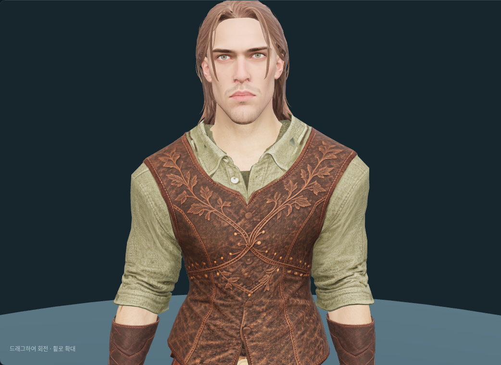
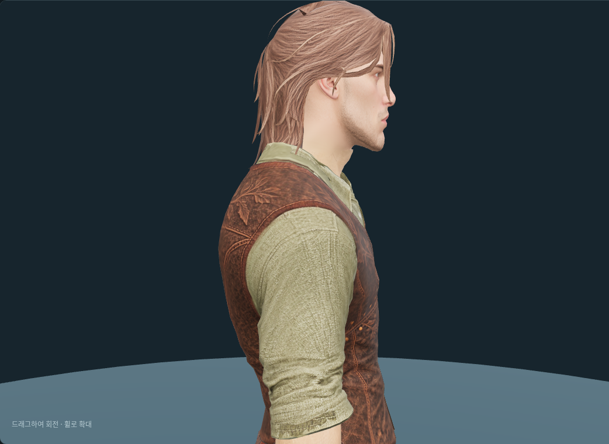

# 순찰자 Tripo 얼굴 피팅

2026-10-08. 사용자가 `Y:\public\web_downloads\bald+male+head+3d+model.glb`로 전달한
새 머리를 기존 남성 몸체와 순찰자 헤어에 맞췄다. `/mnt/y`가 Windows의 `Y:\public`이다.
원본은 `assets/modular_human_male_01/parts/face_tripo_ranger_v1/source.glb`에 보존했다.
SHA-256은 `6a2558b17963363726f4a798b6b0bd2fabd6c8f242597487100fda0a8223d4d8`이다.

## 원본과 연결

원본은 **4,026 triangles**, 정점 3,338개, 메시·재질 각 1개, 2048² JPEG 색상맵을 포함한다.
리그는 없다. 제안한 2,000 quads≈4,000 triangles 생성 목표에 가깝다.
실제 Tripo 입력 원화·설정은 확인하지 않았다. [원본 진단](modular-ranger-tripo-face-source-review-v1.json).

가로·깊이 배율 0.30·0.29와 깊이 이동 +7mm를 적용하고,
턱·눈·정수리 높이를 각각 1.663·1.7825·1.900m 기준으로 맞췄다.
기존 65본 계층과 bind 행렬을 유지했다. 얼굴 윗부분은 `Head`에 고정하고,
목은 기존 몸체 표면의 가중치를 보간했다. 얼굴 표정용 본이나 블렌드셰이프는 추가하지 않았다.

기존 각진 얼굴용 절단 높이 1.666m를 그대로 쓰면 새 얼굴의 턱 아래가 잘려
목에 뾰족한 어두운 면이 생겼다. 앞쪽 절단선을 **1.646m**로 낮춰 원래 턱과 짧은 목을 보존했다.
뒤쪽은 1.706m 기준이다. 원본 목 하단을 잘라낸 피팅 두상은 **3,781 triangles**다.
목 연결면 1,743개와 기존 목 경계 보존면 113개를 합한 얼굴 파츠는 **5,637 triangles**다.

목 이음새의 위치·가중치·노멀을 공유하고, 512px 연결 텍스처로 몸체와 새 얼굴 피부색을 섞었다.
원본 얼굴 JPEG 바이트·UV를 유지했다. 기존 몸체는 목 상단 노멀 외의 위치·UV·가중치·삼각형을 보존했다.
기존 순찰자 헤어의 피팅 파일도 유지했다. [피팅·해시·몸체 보존 기록](modular-ranger-tripo-face-fitting-v1.json).

### 공통 헤어에 맞춘 두상 보정

짧은 크롭 착용 시 뒤통수 두피가 헤어 밖으로 노출되는 것을 확인했다.
새 머리의 정수리·뒤통수에서 공통 두상 표면보다 최대 약 8.3mm 큰 부분이 원인이었다.
순찰자 머리의 두피만 공통 두상 안쪽으로 보정했다. 목표 여유는 1mm이며,
정점과 삼각형 중심에서 보정 범위를 검사한다. 이마·귀 주변에는 부드럽게 영향이 줄어들고,
분리된 귀와 귀 접합부·두피 마스크 밖 얼굴 위치는 보존한다. 원본 GLB·UV·텍스처·삼각형 수는 유지했다.
이 두상 보정 당시 짧은 크롭의 피팅·게임용 GLB와 기본·각진 두상, 순찰자 장발 GLB는
SHA-256 불변을 확인했다.
보정량과 표면 표본 수는 [피팅 기록](modular-ranger-tripo-face-fitting-v1.json)의 `scalp_fitting`에 있다.
크롭 착용의 앞·뒤·좌·우와 동작, 기존 순찰자 장발과 압축 모델을 다시 확인했다.
[크롭 호환 검수](modular-ranger-tripo-face-crop-v1.json).

후속 검수에서 기본·각진 얼굴에도 같은 왼쪽 관자놀이 삼각형 틈이 나타나는 것을 확인했다.
공통 크롭 헤어에 기존 정점으로 삼각형 한 면을 추가했다. 이 후속 보수에서는 얼굴을 추가
변경하지 않았다. [공통 헤어 보수](modular-human-male-01.md#짧은-크롭-왼쪽-관자놀이-틈-보수--2026-10-08).

## 출력과 검수

편집·재생성 파일은 `assets/modular_human_male_01/parts/face_tripo_ranger_v1/`에 있다.

| 파일 | 용도 |
| --- | --- |
| `source.glb` | 전달 원본 |
| `face_ranger.glb` | 머리와 목 연결 파츠 |
| `base_ranger.glb` | 새 얼굴을 조립한 몸체 |
| `neck-transition.png` | 목 연결 텍스처 |
| `neck-seam-validation.json` | 동작 검사용 경계 좌표 |
| `ranger-face-fitting.blend` | 텍스처를 내장한 편집본과 숨긴 원본 참조 |

제작실 얼굴 선택에 **순찰자 얼굴**을 추가했다.
`/modular-character-preview.html?outfit=ranger&hair=hair_ranger&face=ranger`에서 착용 모습을 확인한다.
기본 얼굴·각진 얼굴과 교체해도 선택한 헤어가 유지된다. 새 얼굴은 원본 눈 텍스처를 사용하므로 눈색 제어를 비활성화했다.
게임 외모 카탈로그와 신규 캐릭터 기본 얼굴 등록은 별도 작업이다.

- 8종 실제 게임 동작·25개 표본씩 총 200개 자세에서 가중치 합, 유한한 정점, 얼굴·헤어의 머리 본 추종과 목 이음새 검사 통과.
  경계 최대 오차는 약 0.000157mm다. [동작 검사](modular-ranger-tripo-face-animation-v1.json).
- 제작실 앞·좌·뒤·우 시점과 대기·걷기·달리기·점프·공격·앉기의 정규화 시간 0.4 표본을 확인했다.
  투구에 따른 헤어 숨김·복원, 얼굴 교체, 상의 없는 목 연결을 확인했고 브라우저 오류는 없었다.
  최종 정면·측면과 세 얼굴의 크롭 관자놀이 확대를 보관하고 중복·중간 캡처는 정리했다. [브라우저 기록](modular-ranger-tripo-face-browser-v1.json).
- 게임용 압축 후보는 `client/public/models/characters/modular_male/base_ranger.glb`, **7,203,940바이트**다.
  Meshopt 디코딩 후 몸체 16,953 triangles·65본과 얼굴 **2048² WebP** 유지 확인.
  디코딩한 압축 모델을 제작실에 임시 공급해 얼굴 확대도 확인했다.
  [압축 검사](modular-ranger-tripo-face-compressed-v1.json). 제작실은 원본 피팅 GLB를 표시하며 압축본의 전체 동작·장비 호환 검사는 별도다.
- 관련 프런트엔드 테스트 50개, 타입 검사·린트 통과. 기존 각진 얼굴의 200개 자세 검사도 통과했다.
- 새 얼굴·순찰자 네 장비·순찰자 헤어 조합은 숨김 포함 **33,461 triangles**, 표시 **25,649**, 두상 배분 **3,781**이다.
  무기·망토 없는 제작실 기준이다. 전체 15,000–20,000 목표를 초과하며 숫자만 맞추는 데시메이션은 하지 않았다.
- 긴 헤어는 머리 본에 고정되어 옷깃과의 접촉이 자세에 따라 달라진다. 모든 프레임·혼합 장비의 비관통과 얼굴 표정은 검수 범위 밖이다.

```bash
.venv/bin/python tools/fit-tripo-ranger-face.py
node tools/validate-tripo-rugged-face.mjs --ranger
blender -b -t 4 --python-exit-code 1 --python tools/blender-scripts/review_tripo_ranger_face.py
node tools/prepare-modular-character.mjs --part base_ranger
```




## 출처와 이용 조건

사용자가 Tripo로 제작해 전달한 출력물이다. 수령일은 2026-10-08이며 정확한 생성일·작업 ID·
모델 버전·입력 이미지·프롬프트·리메시 설정·이 파일의 구독 등급은 미확인이다.
원본 Tripo 출력물 이용 조건과 [캐릭터 자산 기록](characters.md)을 따른다.
제작용 [얼굴·헤어 원화](modular-ranger-head-hair.md)는 OpenAI Codex built-in ImageGen,
**ChatGPT Pro 20x**, 2026-10-07 생성이다. 이번 피팅에는 새 AI 생성이나 유료 API 호출이 없다.
