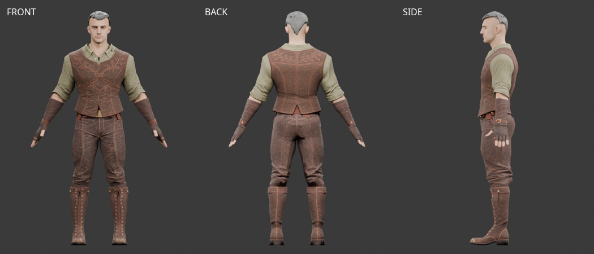
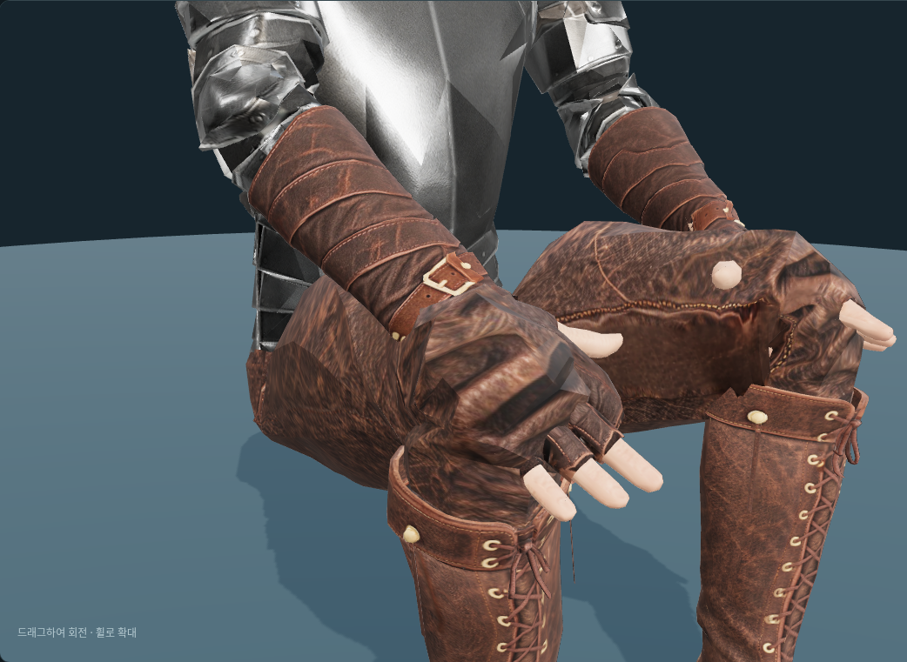

# 순찰자 Tripo 장갑 — 피팅 후보 v1

2026-10-07. 사용자가 전달한 `Y:\public\web_downloads\leather+gauntlet+3d+model.glb`를
`/mnt/y/web_downloads/`에서 가져왔다. 오른쪽 장갑과 팔 보호대를 현재 남성 몸체에 맞추고
반대쪽을 대칭 제작해 개발용 캐릭터 미리보기에 연결했다.

## 원본과 피팅

원본은 **2,140삼각형**, UV 분할 포함 2,275정점, 1개 메시·재질과 내장 2048×2048 JPEG를 갖는다.
리그는 없다. 제안했던 한쪽 1,000쿼드 설정의 실제 적용 여부와 원래 쿼드 수는 미확인이다.
원본은 전달 파일과 바이트가 같은 `ranger/tripo_gloves_v1/source.glb`로 보관한다.
[원본 형상 검사](modular-ranger-tripo-gloves-source-review-v1.json)에 연결 성분과 열린 경계를 기록했다.

몸체 `fitted/base.glb`, `interfaces/v1`, 리그 `human_male_01_mixamo_candidate_v2`를 사용했다.
65본의 계층·기준 자세·inverse bind를 보존했고 몸체와 손 자세를 바꾸지 않았다.

전체 원본 손을 단면 기준점으로 변형한 첫 후보는 손바닥 피부가 뚫리고 손가락 안감이 접혔다.
그 후보는 **[미사용]**이며 실패 원인을 피팅 기록에 남겼다. 중간 이미지는 사용자 요청으로 정리했다.
손과 짧은 손가락 부분은 실제 몸체 표면에서 3mm 띄운 반장갑으로 교체하고 손목과 다섯 손가락 입구를 열었다.
엄지·검지 사이에는 기존 로그 장갑에서 검증한 입구 연장 방식을 재사용했다.

팔 보호대와 버클은 원본 형상을 살려, 48개 길이 단면과 96개 방사 방향에서 실제 피부 단면에 맞췄다.
원본 외곽 반지름은 피부 반지름+7mm에 대응하며 원본의 벽·띠 돌출 차이는 25mm 기준으로 옮긴다.
원본의 안쪽 면을 최소 반지름으로 삼으면 커프 내부 구조 때문에 돌출이 과장되어 외곽 단면을 기준으로 바꿨다.
팔 보호대 상단은 손목에서 약 225mm 위에 있고, 윗부분은 해당 ForeArm 본에 고정했다.
손목은 실제 피부 가중치를 따라 변형된다.

손등·손바닥의 가죽은 원본 텍스처에서 투영·베이크했다. 손가락 폭은 이 원본에 맞게 설정하고,
1024² 원본 영역과 1024² 손등·손바닥 영역을 2048² JPEG 아틀라스에 배치했다.
원본 JPEG 바이트도 GLB와 원본 파일에 보존했다. 새로운 AI 텍스처는 생성하지 않았다.

좌우 대칭 후 삼각형 방향·법선과 손·손가락·팔뚝 본을 대응했다.
기존 왼손의 손가락 기준 자세는 오른손의 단순 대칭과 달라, 왼손 부분만 실제 왼손 표면과 가중치로 다시 맞췄다.
오른손 2,088, 왼손 2,120, 양손 합계 **4,208삼각형**이다.
각 팔 보호대는 1,225삼각형, 손 부분은 오른쪽 863·왼쪽 895삼각형이다.
예산 수치만 맞추기 위한 데시메이션은 하지 않았다.
[피팅·리깅 기록](modular-ranger-tripo-gloves-fitting-v1.json)을 참고한다.



## 개발 미리보기와 검증

순찰자 복장 버튼과 장갑 선택에 연결했다. 장갑이 정상 로드된 경우에만 덮이는 팔 피부를 잘라내고,
장갑 제거·다른 장갑 교체·로드 실패 시 원래 형상을 복원한다. 손끝과 노출된 엄지 피부는 유지한다.
판금·리넨 상의의 긴 소매에는 같은 장갑 입구 절단을 적용한다.
오른손과 왼손을 각각 확대할 수 있다. 실제 게임 아이템 등록이나 프로덕션 배포는 하지 않았다.

사용자 검토에서 장갑 입구와 팔 피부 사이의 틈이 확인됐다. 비스듬한 커프의 짧은 쪽보다
기존 피부 절단면이 약 8mm 먼저 끝났다. 피부 절단 위치를 팔꿈치→손목 길이의 25%에서
40%로 옮겨 약 43mm 더 남겼다. 첫 보정에서는 소매의 25% 절단을 유지했다.
장갑 GLB는 바꾸지 않았다.
7개 동작·175자세에서 16개 겹치는 각도 구간으로 커프 끝을 표본화하고 피부 절단 경계를
움직이는 ForeArm 좌표계에서 비교했다. 표본의 최소 겹침은 오른팔 16.2mm·왼팔 27.9mm다.
이 수치는 전체 표면의 연속 충돌 검사를 의미하지 않는다.
상의 8개 선택과 양쪽 확대를 앉은 자세에서 검토했다.
중간 캡처와 이전 브라우저 기록은 사용자 검토 후 정리했다.

이후 판금 상의 조합에서 덮인 팔 피부가 다시 표시되는 문제가 확인됐다.
실제 소매가 로드된 판금·리넨·가죽 긴 소매 조합은 팔뚝 피부를 숨긴다.
순찰자·로그·짧은 소매·맨몸 조합은 기존 노출 피부와 커프 안쪽 겹침을 유지한다.
긴 소매 끝은 길이의 40%까지 남기고, 20% 위치에 단면을 추가해 큰 삼각형이
장갑 입구를 가로질러 튀어나오지 않도록 했다. 장갑 GLB에서 추출한 8개 단면·64개
방사 방향의 안쪽 반지름에 4mm 여유를 두어 소매를 좁히고, 겹치는 부분은
장갑과 같은 ForeArm 본을 따른다. 교체·제거 시 원래 소매 형상을 복원한다.
판금 장갑의 소매 처리와 원본 GLB는 유지했다.

양팔의 실제 판금·리넨·가죽 소매에서 정점과 각 삼각형의 세 내부점을 표본화했다.
7개 동작의 저장된 175자세에서 장갑 외곽과 비교한 표본의 최소 여유는 약 3.95mm다.
[소매 덮임 검사](modular-ranger-tripo-gloves-sleeve-coverage-v3.json),
[혼합 상의 브라우저 검토](modular-ranger-tripo-gloves-sleeve-browser-v3.json).
이는 전체 표면·전체 프레임의 연속 충돌 검사는 아니다.



- 실제 `idle1`, `walk`, `run`, `jump`, `combat_idle`, `slash1`, `sit_idle`을 각각 25시점 검사했다.
  양손 본과 손가락 본 분리, 정규화된 가중치, 유한 좌표, UV 경계의 연결과 팔 보호대 길이를 확인했다.
  손 부분의 짧은 모서리는 최대 약 5.65배 늘어나므로 수치 검사만으로 모든 변형을 보증하지 않는다.
  [동작 수치 검사](modular-ranger-tripo-gloves-animation-v1.json).
- 오른손 14개·왼손 13개 엄지/검지 사이 피부 삼각형에서 세 내부점을 175자세에 걸쳐 검사했다.
  단순 대칭 후보는 왼손에서 258개 미덮임 검사점이 나왔고, 왼손 재피팅 후 양손 모두 0개다.
  [피부 덮임 검사](modular-ranger-tripo-gloves-coverage-v1.json)는 해당 부위와 표본 자세에 한정된다.
- Chromium에서 오른손 네 시점·왼손 확대, 7개 동작, 장갑 착탈·재장착을 확인했다.
  판금·리넨·로그·순찰자 상의와 맨몸 조합의 표시도 확인했다. 모든 소매와 모든 동작의 관통 검사는 아니다.
  최종 [브라우저 기록](modular-ranger-tripo-gloves-sleeve-browser-v3.json)과
  [Blender 검토·편집본 기록](modular-ranger-tripo-gloves-review-v1.json)을 보관했다.
- 관련 단위 테스트 72개, `npm run check`, `npm run lint` 통과.

기본 몸체·crop 머리·순찰자 상의/바지/부츠/장갑의 원본 GLB 합계는 숨김 포함 **31,288삼각형**이다.
개발 미리보기 절단 후 숨김 포함 **29,884**, 표시 **22,072**, 얼굴 **1,505**다. 무기·망토는 없다.
표시 수는 드로우되는 메시의 삼각형 수이며 가려지는 내부 면도 포함한다.
현재 조합은 15,000–20,000 목표보다 크다. 추가 혼합 장비와 실제 게임 경로 검토는 남아 있다.

## 파일과 재현

`assets/modular_human_male_01/ranger/tripo_gloves_v1/`에 원본, `gloves_ranger.glb`,
`ranger-gloves-fitting.blend`, 표본 자세와 본 행렬을 보관했다.
Blender 파일은 몸체·복장·내장 텍스처·연결 곡선과 숨긴 원본을 포함한다.
타임라인의 실제 동작 표본은 연속 애니메이션이 아닌 정지 자세다.

```bash
.venv/bin/python tools/fit-tripo-ranger-gloves.py
node tools/validate-tripo-ranger-gloves.mjs
.venv/bin/python tools/validate-tripo-ranger-gloves-coverage.py
.venv/bin/python tools/measure-ranger-glove-cuff.py
node tools/validate-ranger-glove-sleeves.mjs
blender -b -t 4 --python-exit-code 1 --python tools/blender-scripts/review_tripo_ranger_gloves.py
```

원본 검토는 마지막 명령 뒤에 `-- --raw`를 붙인다.
Tripo Studio 생성 출력물 이용 조건과 기존 프로젝트 원화의 출처·이용 조건을 따른다.
구독은 이전 사용자 보고 기준 월 약 USD 20이며 이번 파일의 등급·생성일·작업 ID는 별도 미확인이다.
원화 도구는 OpenAI Codex built-in ImageGen, **ChatGPT Pro 20x**, 2026-10-07이다.
[출처·라이선스·해시](modular-ranger-tripo-gloves-sources.json), [원화 프롬프트](modular-ranger-glove-sources.json)를 보관했다.
사용자 승인 후 원본·최종 장갑·편집본·재현용 자세 데이터를 에셋 저장소에 보관하고
`assets.lock`에 고정한다. 실패·중복 캡처와 이전 브라우저 기록은 정리했으며 실패 원인은 문서에 남겼다.
