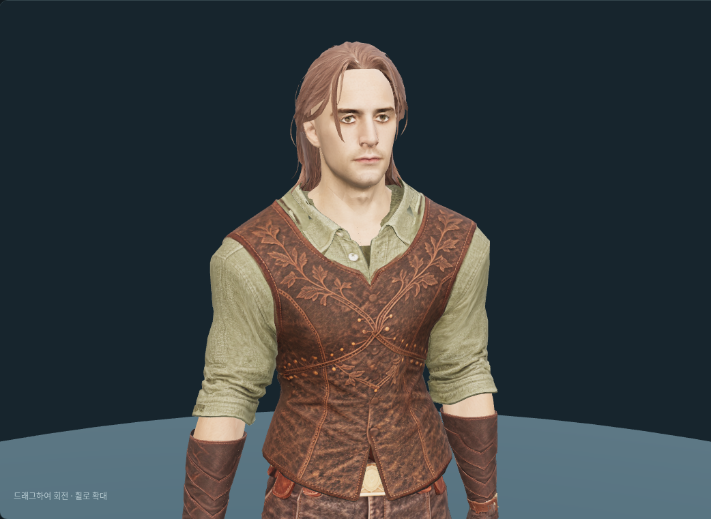
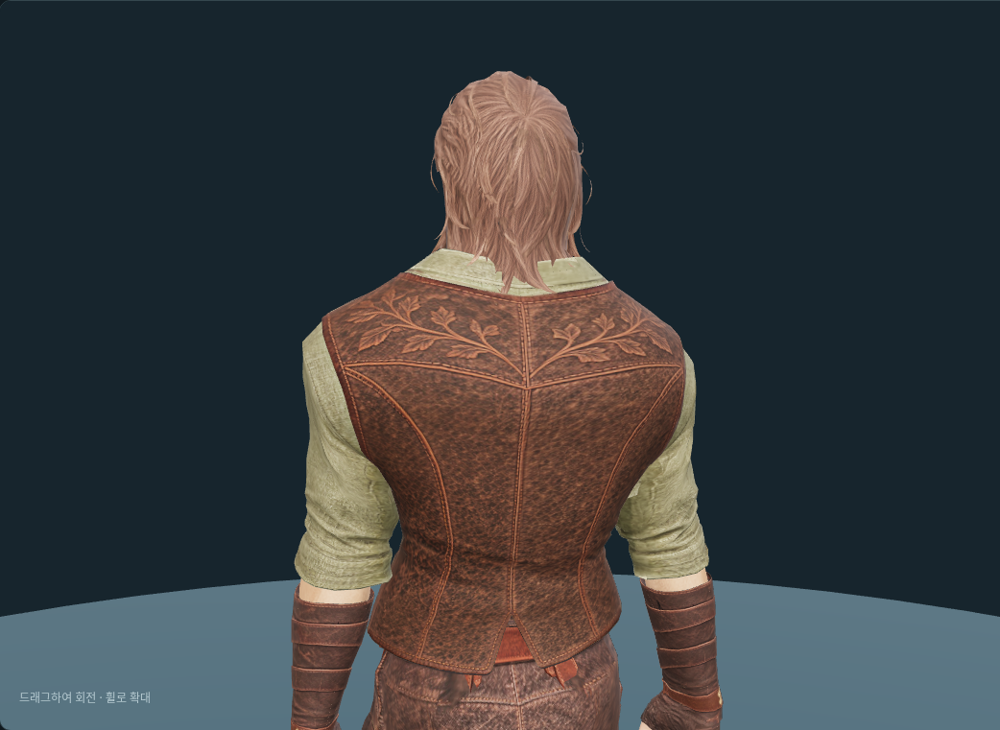

# 순찰자 Tripo 헤어 — 피팅·리깅 후보

2026-10-08. 사용자 전달 `Y:\public\web_downloads\hair+wig+3d+model.glb`를
`/mnt/y/web_downloads/hair+wig+3d+model.glb`에서 읽었다. `/mnt/y`는 `public` 공유 루트다.
원본을 변경하지 않고 `assets/modular_human_male_01/hair/tripo_ranger_v1/source.glb`에 보관했다.
원본 SHA-256은 `399e2fee54b1fb3c3f002d95c4faae20f7be56795a309025bb30c40e02f4d9de`다.

원본은 **1,373 triangles**, 메시·재질 각 1개, 2048² JPEG 색상맵, 리그 없음이다.
제안한 1,000 quads는 약 2,000 triangles의 생성 목표였으며 실제 전달 모델은 더 적은 삼각형을 사용한다.
진단용 용접 후 연결 성분 1개, 열린 모서리 707개, 비다양체 모서리 729개,
퇴화 면·축소 UV 면 0개다. 열린 헤어 면과 가닥 경계도 포함하므로 모두 손상이라고 해석하지 않는다.
[원본 검수 기록](modular-ranger-tripo-hair-source-review-v1.json).

## 피팅과 제작 미리보기

현재 공통 남성 몸체 `fitted/base.glb`의 실제 머리 표면에 크기·높이·앞뒤 위치를 맞췄다.
정점과 삼각형 중심에서 두피 여유를 보정하고, 같은 65본 계층·bind 행렬에 `Head` 가중치 1로 연결했다.
삼각형 연결·원본 UV·내장 JPEG·재질은 유지했다. 물리 기반 머리카락 흔들림은 없다.

초기 두상 피팅에서는 긴 목덜미 가닥 일부가 순찰자 옷깃 안으로 들어갔다.
목덜미 Y<1.67m의 뒤쪽을 실제 순찰자 상의 바깥으로 방사 투영해 기준 자세에서 4mm 여유를 목표로 보정했다.
219개 정점에 최대 93.3mm 변위가 있어 아래쪽 머리 다발의 형태가 원본보다 벌어진다.
삼각형 중심의 잔여 보정량은 약 0.001mm다. 이는 표본 기반 기준 자세 검사이며 모든 자세의 비관통을 보장하지 않는다.
이전 피팅 사본은 따로 보관하지 않았다. [피팅·보정·해시](modular-ranger-tripo-hair-fitting-v1.json).
중간 원본·두상 검수 캡처와 재생성 가능한 동작 행렬은 정리하고, 최종 착용 앞뒤 화면과 수치 기록만 보관했다.

개발 제작실의 헤어 선택에 **순찰자 장발**을 추가했다.
`/modular-character-preview.html?outfit=ranger&hair=hair_ranger`로 순찰자 복장과 함께 확인한다.
기본·없음·다른 헤어로 교체할 수 있고, 투구 착용 시 숨겨지며 해제 시 복원된다.
원본 텍스처를 사용하는 후보이므로 제작실 머리색 제어는 비활성화했다.
이 헤어 검수 당시에는 기존 남성 얼굴을 사용했다.
2026-10-08 새 머리를 받아 [순찰자 얼굴 피팅](modular-ranger-tripo-face.md)과 `face=ranger` 선택을 추가했다.
2026-10-08 게임 외모 카탈로그와 캐릭터 생성 화면에 선택값 `ranger`를 등록했다.
기본 헤어는 유지하며, 게임에서는 새 장발의 머리색도 선택할 수 있다.
원본 텍스처의 명암을 보존하며 선택한 색을 적용한다. 제작실은 원본 텍스처를 표시한다.
선택 버튼 `client/src/assets/character-appearance/hair-ranger.png`는 공통 기본 몸체에
위 피팅 `hair_ranger.glb`를 조립해 Blender 5.2 Cycles로 렌더한 128×128 투명 PNG다.
새 AI 생성 없이 기존 모델에서 파생했으며 두 모델의 기존 출처·이용 조건을 따른다.

```bash
.venv/bin/python tools/fit-tripo-ranger-hair.py
node tools/validate-tripo-wavy-hair.mjs --ranger
blender -b -t 6 --python-exit-code 1 --python tools/blender-scripts/review_tripo_ranger_hair.py -- --raw
blender -b -t 6 --python-exit-code 1 --python tools/blender-scripts/review_tripo_ranger_hair.py
node tools/prepare-modular-character.mjs --part hair_ranger
```

피팅 GLB·텍스처 내장 Blender 편집본은 `hair/tripo_ranger_v1/`에 있다.
512px 텍스처·Meshopt 압축을 적용한 게임용 후보는
`client/public/models/characters/modular_male/hair_ranger.glb`이며 **151,584바이트**다.
원본 텍스처를 쓰는 피팅 GLB는 1,673,344바이트다. 압축본 해시는 게임 manifest와
[브라우저 기록](modular-ranger-tripo-hair-browser-v1.json)에 있다.

## 검수 범위

- 8종 실제 게임 동작·200개 자세에서 머리 본 추종, 정점 유한성, 가중치 합, 간선 길이 유지 통과.
- 제작실 4시점과 대기·걷기·달리기·점프·공격·앉기의 정규화 시간 0.4 표본 확인.
- 헤어 교체·투구 숨김과 복원·URL 선택 확인. 관련 프런트엔드 테스트 50개와 타입 검사·린트 통과.
- 원화는 짙은 밤색이지만 전달 모델은 조명 아래에서 밝은 갈색으로 보인다.
  현재 텍스처 색을 유지했으며 색 보정은 적용하지 않았다.
- 긴 가닥은 머리에 고정되어 목 회전 시 옷깃과의 접촉이 달라진다. 모든 프레임·혼합 장비 호환은 미확정이다.
- 기존 몸체·순찰자 네 장비·새 헤어 합계는 숨김 포함 **31,728 triangles**, 얼굴 배분 **1,505**다.
  무기·망토 미착용 기준이며 기존 조합부터 전체 15,000–20,000 목표를 초과한다. 숫자만 맞추는 데시메이션은 하지 않았다.

[동작 수치](modular-ranger-tripo-hair-animation-v1.json), [브라우저·출력 기록](modular-ranger-tripo-hair-browser-v1.json).




## 출처와 이용 조건

사용자가 Tripo에서 만든 모델로 전달했다. 정확한 생성일·작업 ID·모델 버전·실제 입력 시점·
프롬프트·리메시 설정·이 파일의 구독 등급은 미확인이다. 과거 다른 파일의 구독 정보를 새 파일에 확정 적용하지 않았다.
원본 Tripo 출력물 이용 조건과 [캐릭터 자산 기록](characters.md)을 따른다.
[제작 원화](modular-ranger-head-hair.md)는 OpenAI Codex built-in ImageGen, **ChatGPT Pro 20x**, 2026-10-07 생성이다.
이번 모델 검수·피팅에는 새 AI 생성이나 유료 API 호출이 없다.
