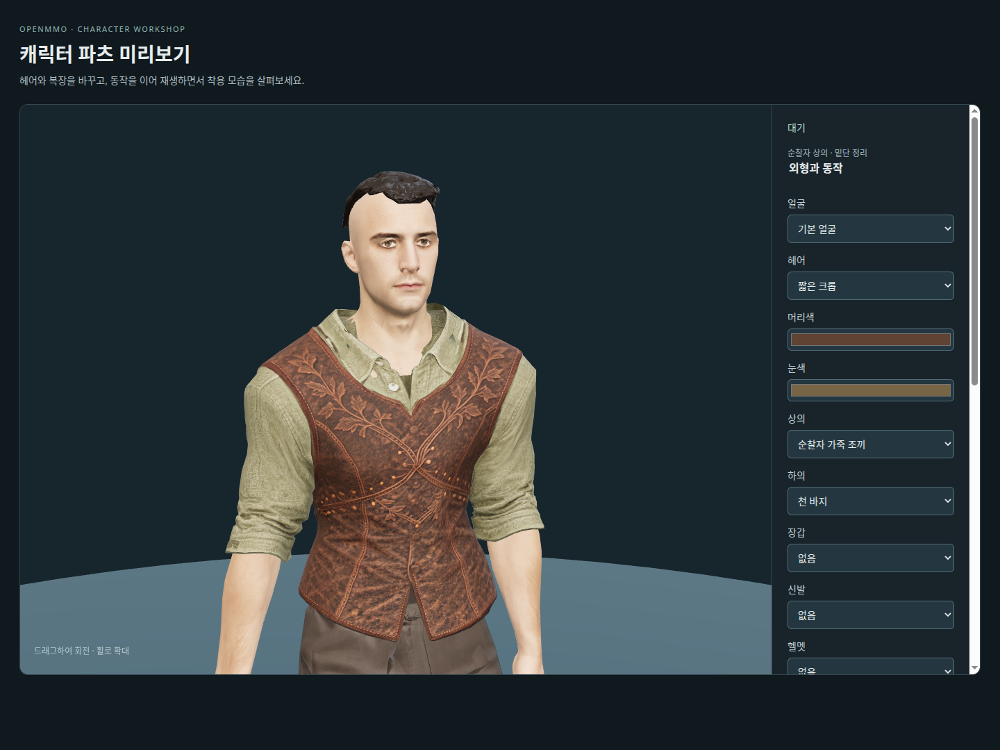
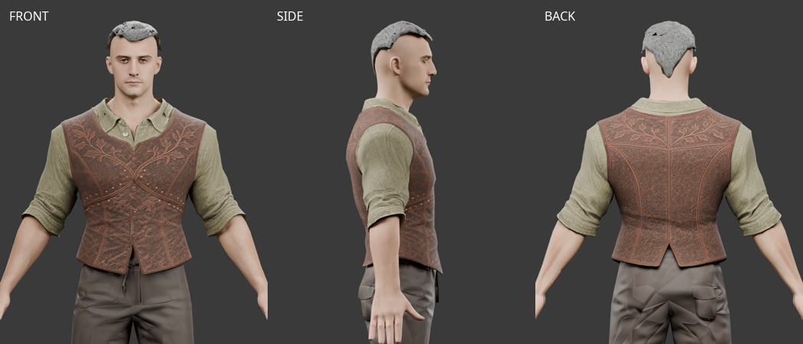
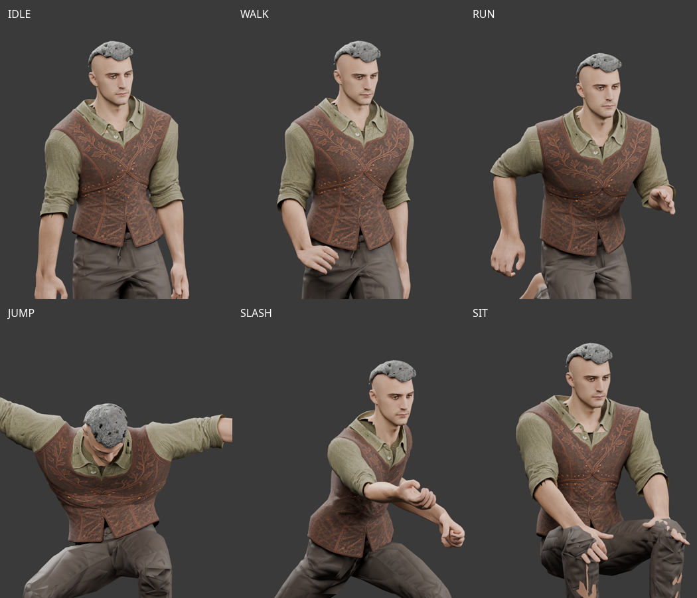
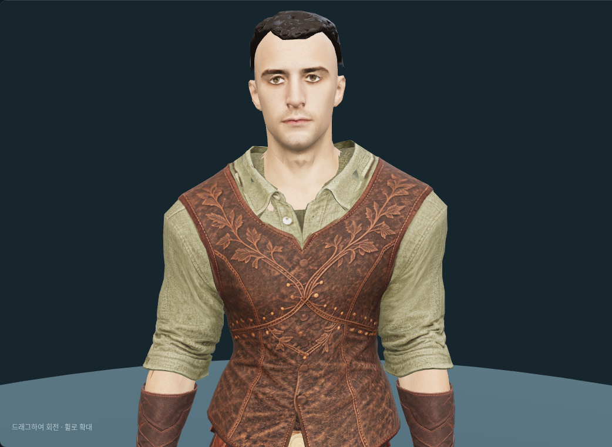

# Ranger 상의 — Tripo 원본과 최종 피팅 v4

2026-10-05. 올리브 셔츠와 나뭇가지 문양의 가죽 조끼를 하나의 상의로 제작했다.
현재 개발 제작실은 **v4**를 사용한다. 기존 천 바지는 착용 맥락을 위한 것이며 순찰자 하의는 아직 제작하지 않았다.



## 보관 파일과 재현

- [최종 상의 GLB](../../assets/modular_human_male_01/parts/ranger_tripo_top_v4/top_ranger.glb).
- [편집용 Blender](../../assets/modular_human_male_01/parts/ranger_tripo_top_v4/ranger-top-fitting.blend).
- [사용자 전달 원본](../../assets/modular_human_male_01/parts/ranger_tripo_top_v4/source.glb).
- [앞뒤 제작 원화와 입력 기록](modular-ranger-parts.md).

중간 v1–v3 모델·Blender·검수 그림과 시험용 모델은 커밋 전 정리했다.
실패 원인·수정 내용·당시 해시는 [피팅 이력](modular-ranger-tripo-top-fitting-history.json)에 남겼다.
최종 동작 행렬과 표본 자세는 v4 폴더에 보관하며, 아래 검사 명령으로 다시 생성할 수 있다.
바이너리와 원본은 Hugging Face에 보관하고 `assets.lock`으로 버전·SHA-256을 고정한다.

```sh
.venv/bin/python tools/build-ranger-top.py
node tools/validate-tripo-rogue.mjs --directory assets/modular_human_male_01/parts/ranger_tripo_top_v4 --part top_ranger --report doc/assets/modular-ranger-tripo-top-animation-v4.json
.venv/bin/python tools/review-ranger-waist.py
blender -b --python-exit-code 1 --python tools/blender-scripts/review_tripo_ranger_top.py
```

제작 스크립트는 원본 정렬·피팅, 허리 여유와 가중치 보정, 안쪽 천 제거를 차례로 실행한다.
중간 모델은 임시 폴더에서 생성하고 자동 삭제한다. 최종 GLB의 바이트 일치를 검증했다.
Blender 타임라인은 연속 애니메이션이 아닌 표본 자세다. 원본 검수는 렌더 명령에 `-- --raw`를 추가한다.

## 피팅과 가림

기준 몸체는 `parts/fitted/base.glb`, 리그는 `human_male_01_mixamo_candidate_v2`의 65본이다.
본 계층·기준 자세·inverse bind 행렬이 일치하고 가중치 합계 오차는 0.000001 미만이다.
`interfaces/v1`과 현재 몸체는 피부 색상 수정으로 해시만 다르며,
[몸체 색상 수정 기록](modular-caveman-skin-match.json)에 따라 형상과 본 정보는 유지됐다.

초기 피팅 뒤 사용자 요청으로 몸통과 소매를 좁혔다. 바지 허리가 드러나 허리·밑단에 최대 9mm 여유를 추가했다.
밑단은 바지 허리와 같은 골반을 따르고 y=1.16–1.26m에서 기존 가중치로 전환한다.
몸통 폭 안으로 보정을 제한하여 소매는 유지했다. 이후 가죽 아래 겹친 천 면 137개를 제거했다.
노출되는 옷깃과 소매, 가죽 외형과 살아남은 정점의 위치·노멀·UV·스킨 속성, 내장 2K JPEG는 유지했다.

제작실은 상의 로딩 성공 시 몸통·상완을 숨긴다. 목은 y ≥ 1.54m, |x| ≤ 0.09m를 남기고,
아래쪽 양옆은 옷깃을 따라 경사지게 가린다. 팔뚝과 손은 유지한다.
상의 해제·재장착·로딩 실패 시 피부를 복원한다. 기준 몸체 원본의 피부를 삭제하지 않는다.
Blender 동작 검수는 별도의 검수용 가림 사본을 사용한다.
일반 게임·캐릭터 생성 등록과 다른 하의·장갑·부츠·투구 조합의 최종 관통 검수는 아직 완료하지 않았다.





## 검증과 예산

- 상의 **4,896 triangles**, 원본 5,033에서 가려진 천 면 137개만 제거했다.
- 몸체·crop 헤어·상의 합계: 숨김 포함 **19,720 triangles**. 얼굴 할당 **1,505**.
- 제작실의 기존 천 바지 포함 선택 조합: 숨김 포함 **21,940**, 표시 **14,779 triangles**.
- 7종 동작·91개 자세에서 유한 정점·본 연결·UV 이음 검사를 통과했다.
- 골반 기준 허리 단면 5곳의 공통 광선은 최소 **8.3mm** 여유와 음수 0개다.
  두 표면을 모두 만나는 광선만 비교하며 의도된 밑단 틈이나 모든 장비 조합의 합격을 뜻하지 않는다.
- 실제 제작실의 대기·달리기·공격에서 초록색 밑단 조각이 사라지는 것을 확인했다.
  단위 검사 20개, `npm run format`, `npm run lint`, `npm run check`를 통과했다.

[피팅·삭제 면 기록](modular-ranger-tripo-top-fitting-v4.json),
[동작 검사](modular-ranger-tripo-top-animation-v4.json),
[허리 검사](modular-ranger-tripo-top-waist-review-v4.json),
[제작실 검사](modular-ranger-tripo-top-workshop-v4.json),
[Blender 검수](modular-ranger-tripo-top-fitted-review-v4.json).

## 목 피부 가림 보정 — 2026-10-07

기존 도적용 목 가림을 재사용하면서 순찰자 목 양옆까지 잘려 옷깃 안에 톱니 모양 경계가 보였다.
순찰자 전용 `ranger_collar`로 좌우 폭을 각각 15mm 늘리고, 아래쪽 경계는
`y ≥ max(1.54, 1.54 + 0.8 × (|x| − 0.04))`로 옷깃 아래에 숨긴다.
높이·양쪽 경사·양쪽 폭을 독립 평면으로 순차 절단해 모서리의 교점을 정확하게 유지한다.
게임과 제작실은 같은 규칙을 사용하며, 상의 해제·누락 시 원본 피부를 복원한다.

가림 전체 해제는 가슴 관통, 높이만 유지한 후보와 넓은 포물선 후보는 공격 시 어깨 피부 노출로 제외했다.
최종안은 앞·뒤·양옆과 대기·걷기·달리기·점프·공격·앉기의 대표 자세에서 확인했다.
관련 테스트 66개와 `npm run check`, `npm run lint`가 통과했다.
검수는 정규화 시간 0.4의 표본이며 모든 프레임·혼합 장비의 합격을 선언하지 않는다.
상의 GLB·Blender·텍스처·원본 몸체는 변경하지 않았고 새 AI 생성·유료 호출은 없다.
화면은 기존 Tripo 자산을 사용한 로컬 브라우저 캡처다.
[수치·시도·검수 기록](modular-ranger-neck-review.json).




## 출처와 이용 조건

사용자가 2026-10-05 Tripo Studio 출력물
`Y:\public\web_downloads\leather+embroidered+vest+3d+model.glb`를 전달했다.
이 환경에서는 `/mnt/y/web_downloads/leather+embroidered+vest+3d+model.glb`로 접근했다.
보관 원본은 전달 파일과 바이트가 같고, SHA-256은
`f4988d1e5d44ffbd5a8af3ec9cb9f1f601de416611ebb37a928b61a940a74ce5`다.
원본은 1개 메시·재질, 내장 2K JPEG, 스킨·애니메이션 없는 5,033 triangles 모델이다.
[원본 진단](modular-ranger-tripo-top-source-review-v1.json)과 [출처·현재 해시](modular-ranger-tripo-top-sources.json)를 보관했다.

정확한 생성일·작업 ID·모델 버전·입력 시점·프롬프트·구독 티어·설정은 미확인이다.
이전 프로젝트 기록의 사용자 보고 구독은 약 월 20달러지만 이 파일의 계정 티어를 별도로 확인한 것은 아니다.
원래 Tripo 출력물의 이용 조건과 계정 출처를 따른다.
GLB의 `asset.version=2.0`은 파일 형식이며 생성 모델 버전이 아니다.

비교 원화는 OpenAI Codex ImageGen, **ChatGPT Pro 20x**, 2026-10-05 생성물이다.
실제 Tripo 입력으로 제출한 시점은 확인하지 않았다. 피팅·검수는 프로젝트 Python과 Blender 5.2.0 LTS의
로컬 처리이며 추가 AI 생성·유료 호출은 없다. 검수 그림은 Blender 렌더와 실제 제작실 캡처다.
