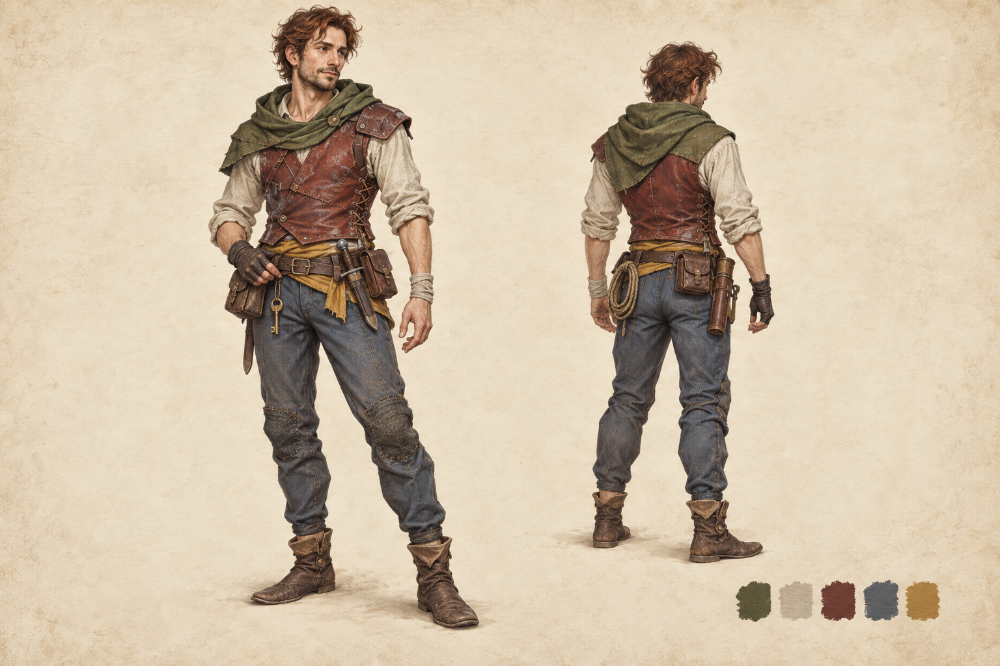

# Modular Rogue Leather — 도적 복장 원화

2026-10-01 제작. **[미사용]** 모델링 전 사용자 검토용 v3 원화이며 게임에는 적용하지 않았다.
사용자 요청으로 이전 원화를 참조하지 않고 D&D·NetHack풍 던전 탐험가를 새롭게 디자인했다.

- 이끼색 짧은 후드 숄, 빛바랜 리넨 셔츠, 적갈색 가죽 베스트를 조합했다.
- 황토색 허리 천과 청회색 바지, 낮은 가죽 부츠로 색상과 재질을 구분했다.
- 한쪽 반장갑, 손목 천, 수선 자국과 허리 주머니·단검·열쇠·로프로 탐험가의 생활감을 표현했다.
- 앞·뒤 사선 전신과 색상 견본을 한 장에 배치했다. 기존 원화의 형태·인물·배치를 재사용하지 않았다.
- 짧은 상의와 부츠로 모듈형 제작을 고려했다. 장식의 파츠 배치와 실제 경계·겹침·리그 검증은 모델링 단계에서 진행한다.

2026-10-01 후속: 현재 몸체를 직접 렌더해 참고한 [부위별 원화 5종과 조립 설계](modular-rogue-parts.md)를 제작했다.
상의·하의·손·신발 4슬롯으로 구성하며, 실제 모델링은 아직 진행하지 않았다.

**[미사용]** 검은 가죽 v1과 갈색 가죽 v2 이미지는 사용자 요청으로 2026-10-01 정리했다.
미채택 파일의 이름·해시와 최종 v3의 생성 프롬프트는 출처 JSON에 남겼다.

## 출처와 라이선스

- 생성: OpenAI Codex built-in ImageGen, **ChatGPT Pro 20x**, 2026-10-01.
- 라이선스: OpenAI 생성 출력물 이용 조건 적용. v3는 참조 이미지 없이 텍스트로 생성한 독자 디자인이다.
- [실제 생성 프롬프트와 파일 기록](modular-rogue-leather-sources.json).

3D 생성·리깅·게임 연결은 아직 진행하지 않았다.
