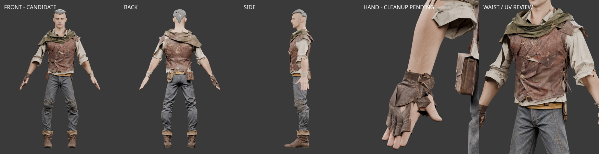
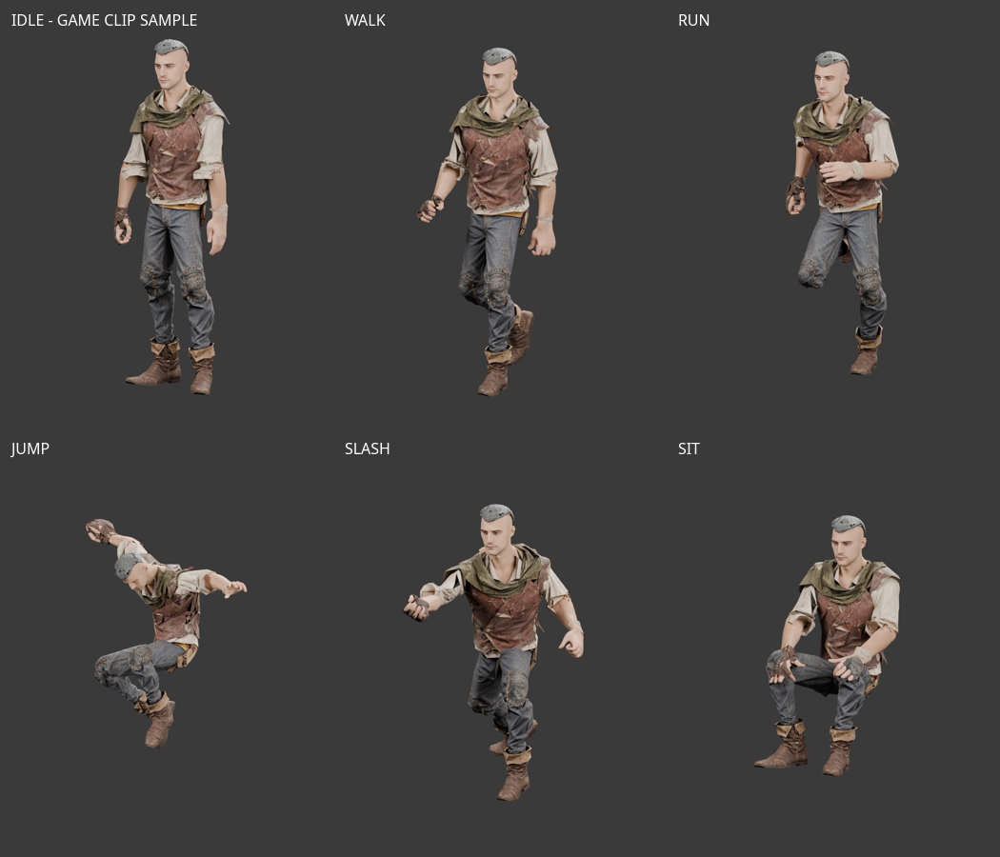

# Modular Rogue — 부위별 제작 원화

2026-10-01. 승인된 [던전 탐험가 v3](modular-rogue-leather.md)를 바탕으로,
현재 남성 모듈형 몸체를 참고한 원화 5종을 제작했다. 게임 장착 단위는 상의·하의·손·신발 4개다.
머리는 기존 헤어를 사용하고, 내려 쓴 후드 숄은 상의에 포함한다.

현재 단계는 **공통 몸체의 종아리 보정을 반영한 피팅 후보 v3 검수**다.
[작업 결과와 남은 보정](#1차-피팅리깅--2026-10-01)을 참고한다. 런타임 등록·호환 합격 전이다.
원화는 정확한 치수 도면이나 3D 피팅 결과가 아니다.
아래 수치는 모델링 시작 기준이며 실제 메시·애니메이션에서 조정하고 검증해야 한다.
[반복 제작 워크플로우](modular-outfit-workflow.md)의 첫 적용 예제로, 생성·검수·연결 테두리
추출 도구와 실패 기록을 함께 보존한다. 게임 장착용 피팅·리깅 합격을 뜻하지 않는다.

## 파츠 구성

| 예정 출력 | 원화 | 포함 범위 | 조립 방식 |
| --- | --- | --- | --- |
| `top_rogue.glb` | [상의 앞·뒤](../images/characters/modular_human_male_01/parts/rogue/top_rogue-v1.png) | 리넨 셔츠, 적갈색 베스트, 왼쪽 작은 견갑, 이끼색 후드 숄 | 한 장비로 교체. 제작 원본에서는 소재와 가림 처리를 위해 층별 메시를 구분한다. |
| `pants_rogue.glb` | [하의 앞·뒤](../images/characters/modular_human_male_01/parts/rogue/pants_rogue-v2.png) | 청회색 바지, 황토색 허리 천, 벨트, 주머니, 짧은 로프 고리 | 허리 장식은 모두 하의 소속으로 두고 골반을 따른다. |
| `gloves_rogue.glb` | [오른손 반장갑](../images/characters/modular_human_male_01/parts/rogue/glove_rogue_right-v2.png), [왼쪽 손목 천](../images/characters/modular_human_male_01/parts/rogue/wrap_rogue_left-v1.png) | 오른손 가죽 반장갑과 왼쪽 손목 천 | 두 제작 입력을 하나의 hands 슬롯으로 내보낸다. 왼손 전체와 오른손 끝마디를 노출한다. |
| `boots_rogue.glb` | [왼쪽 부츠 두 시점](../images/characters/modular_human_male_01/parts/rogue/boot_rogue_left-v1.png) | 낮은 가죽 부츠와 접힌 커프 | 왼쪽 형상을 기준으로 오른쪽을 대칭 제작하고 각각 발·발가락 가중치를 맞춘다. |

허리 천의 늘어진 끝은 벨트 안으로 넣었다. 로프는 작은 납작한 고리로 줄이고 두 곳에서 고정한다.
주머니는 고관절 접힘선 위에서 몸에 가깝게 붙인다. 단검·칼집·늘어진 열쇠는 이번 하의에
고정하지 않는다. 무기는 기존 장착 체계를 따른다.

장갑 v2는 손바닥 쪽 엄지 방향을 수정해 같은 오른손 장갑의 두 시점으로 정리했다.
앞뒤 시점의 봉제선·버클 세부는 모델링 때 하나의 메시 구조로 확정한다.

## 기준 몸체와 연결부

공통 제작 원칙은 [모듈형 복장 절단선과 연결 기준](modular-outfit-connections.md)을 따른다.
아래 수치는 도적 복장의 모델링 시작값이며, 공통 규격의 확정 치수는 아니다.

`assets/modular_human_male_01/parts/fitted/base.glb`의 현재 형상을 직접 렌더해
[정면](../images/characters/modular_human_male_01/parts/rogue/rig-front.png)과
[측면](../images/characters/modular_human_male_01/parts/rogue/rig-side.png)을 생성 입력에 함께 제공했다.
회색 재질은 체형 확인용 렌더에서만 사용했으며 기존 몸체 파일은 수정하지 않았다.

- 리그: `human_male_01_mixamo_candidate_v2`, 65본. 기존 본 계층·기준 행렬·inverse bind matrix를 유지한다.
- 좌표: 미터, Y 위, +Z 전방, 발밑 원점. 현재 몸체 높이는 1.90m다.
- 기준 A 자세: 상완이 수직에서 약 27° 벌어진 현재 자세. 손바닥을 정면으로 돌리지 않는다.
- 왼쪽 팔꿈치 `(0.3113, 1.2480, -0.0560)`, 손목 `(0.4457, 0.9936, -0.0457)`.
- 골반 본 `(0, 1.0712, -0.0141)`, 왼쪽 발목 본 `(0.1664, 0.1110, -0.0359)`.

| 연결부 | 모델링 시작 기준 |
| --- | --- |
| 목·숄 | 목 본 높이 약 1.583m. 숄은 쇄골·등 위쪽에 가깝게 두고 상완을 가로질러 잇지 않는다. 몸통·어깨를 따라 움직이며 머리 회전에 끌려가지 않게 한다. |
| 허리 | 베스트 밑단 약 Y=1.12m, 허리띠·천 밴드 약 Y=1.08–1.15m. 셔츠는 밑단을 더 내려 허리밴드 안쪽에 25–35mm 겹친다. 같은 겹침 구간은 일관된 골반/척추 가중치를 쓴다. |
| 소매 | 팔꿈치→손목 축의 약 25–30%에서 말아 올린 소매가 끝난다. 소매 아래 맨팔을 보존하고 손목 장식까지 연결하지 않는다. |
| 손목 | 오른쪽 장갑 커프는 손목 위 약 40mm, 왼쪽 천은 약 60–70mm. ForeArm–Hand 축에 맞추고 손가락은 현재 리그의 각 본을 따른다. |
| 발목 | 부츠 입구는 Y≈0.22–0.24m. 바지 끝이 30–40mm 안쪽으로 들어가도록 겹친다. 종아리 굵기를 유지하고 끝단만 조정한다. 겹치는 구간은 Leg/Foot 가중치를 맞춘다. |

위 높이는 참조 원화의 픽셀에서 얻은 치수가 아니다. 기존 몸체의 기준점에 맞춘 제작 제안이다.
좌우 구분은 항상 착용자 기준이며, 정면 그림에서는 착용자 왼쪽이 화면 오른쪽이다.

## 모델링과 런타임 적용 시 처리

- 상의는 셔츠 몸통·소매, 베스트, 숄·견갑을 편집 가능한 메시로 남기되 같은 리그와 장비 슬롯을 사용한다.
  생성 원화에서 가려진 안쪽 표면을 중복으로 모두 만들 필요는 없으며, 옷을 벗었을 때의 몸체는 원본을 유지한다.
- 현재 `ModularOutfit`에는 `rogue`가 없다. 모델 제작 후 해당 스타일과 파츠 목록을 등록한다.
  이는 현재 코드에 이미 연결됐다는 뜻이 아니다.
- 현재 긴 소매·일반 가죽 장갑의 가림 규칙을 그대로 쓰면 맨팔과 손가락이 사라진다.
  말아 올린 소매용 팔 가림, 오른손 반장갑의 덮인 부분, 왼손 전체 노출을 별도로 처리한다.
- 바지는 부츠 착용용 밑단과 맨발용 밑단을 구분할 수 있게 제작한다.
  신발만 착용한 조합에서는 기존 `boot_ankles`와 부츠 입구의 연결도 확인한다.
- 다중 시점 원화를 한 개체 생성 입력으로 그대로 넣지 않는다. 주 시점과 보조 시점을 분리하고,
  장갑은 오른손 하나, 부츠는 왼발 하나를 생성한 뒤 기존 몸체에 맞춘다.
- 옷을 개별 해제하거나 기존 판금·천 장비와 섞었을 때도 허리·목·손목·발목이 유지되어야 한다.
  대기·걷기·달리기·점프·공격·앉기의 실제 스킨 변형에서 확인한다.

## 폴리곤 계획

장비별 제작 목표는 상의 2,200, 하의 1,300, 오른손 장갑 400, 왼쪽 손목 천 200,
양쪽 부츠 합계 700으로 **총 4,800 triangles**다. 개별 파츠마다 일반 아이템 4,000 목표를 적용하지 않는다.

현재 몸체 13,891 + 크롭 헤어 933 + 기존 철검 302에 위 장비 목표를 더하면
숨김 영역 포함 **약 19,926 triangles**다. 얼굴 지정 영역 **1,505 triangles**를 유지한다.
이는 최초 계획 예산이며 실제 총합과 표시 폴리곤 수는 모델링·가림 적용 후 측정한다.
후드 숄은 상의 예산에 포함하며 별도 절차형 망토는 이 조합에 포함하지 않는다.

## 출처와 파일 기록

- 부위 원화: OpenAI Codex built-in ImageGen, **ChatGPT Pro 20x**, 2026-10-01.
  OpenAI 생성 출력물 이용 조건 적용. 입력은 승인된 v3 원화와 기존 몸체 렌더 2종이다.
- 몸체 렌더: Blender 5.2.0 LTS, 기존 자산의 로컬 렌더. 기존 [몸체·리그 출처](modular-human-male-01.md)를 따른다.
- [실제 프롬프트·수정 프롬프트·입력·SHA-256·예산](modular-rogue-parts-sources.json).
- **[미사용]** `pants_rogue-v1.png`는 늘어진 허리 천·큰 로프 고리를 수정한 v2로 대체하고 삭제했다.
- **[미사용]** `glove_rogue_right-v1.png`는 손바닥 뷰의 엄지 방향을 수정한 v2로 대체하고 삭제했다.
  두 중간 이미지는 사용자 요청으로 2026-10-01 정리했으며, 프롬프트·해시는 출처 JSON에 보존한다.

## 연결 원칙에 따른 원화 재검토 — 2026-10-01

원화 5종의 디자인은 유지하고 다음 조건으로 Meshy 제작을 진행했다.
공통 테두리는 `assets/modular_human_male_01/parts/interfaces/v1`의 최신 몸체 단면을 사용한다.
의상 내부 여유 공간과 최종 겹침 깊이는 아직 확정하지 않았다.

| 파츠 | 연결 규격·안팎 순서 | 피팅·가림에서 해결할 항목 |
| --- | --- | --- |
| 상의 | `neck_base`, `waist`; 셔츠 밑단은 하의 허리밴드 안쪽 | 그림에서 노출된 셔츠 끝은 착용 시 안으로 넣는다. 베스트 하단은 벨트·주머니와 충돌하지 않게 정리한다. 목을 덮는 투구 조합은 미검증이다. |
| 바지 | `waist`, `shoe_ankle`; 부츠가 바지 끝을 덮음 | 허리 장식은 모두 하의 소속. 30–40mm 넣는 밑단과 맨발용 밑단을 구분하고, 부츠 안쪽 의상과 피부를 각각 가린다. |
| 오른손 반장갑 | `glove_short`; 소매와 연결하지 않음 | 짧은 소매 아래 맨팔·드러난 손가락을 남긴다. 손가락 구멍과 손바닥/손등의 같은 오른손 구조를 검사한다. |
| 왼쪽 손목 천 | `glove_short` 주변의 별도 커프 길이 | 왼손 전체 노출. 손목 천 아래 피부만 가린다. 소매까지 피부를 지우지 않는다. |
| 부츠 | `shoe_ankle`; 바지보다 바깥 | 원화의 외관 높이를 그대로 치수로 쓰지 않고 실제 입구를 Y≈0.22–0.24m로 피팅한다. 발·발가락 가중치와 대칭 제작을 검증한다. |

그림의 앞뒤 세부가 완전히 같지는 않다. 부츠는 앞/바깥 주 시점만 생성 입력으로 사용하고,
상의·바지·장갑은 시트를 분리해 각각 같은 물체의 두 시점으로 제출했다.
허리 25–35mm, 발목 30–40mm는 계속 시작값이며, 그림만으로 호환 합격을 선언하지 않는다.

## Meshy 제작·검수 기록

- 2026-10-01, **Meshy Premium**, `meshy-7.1`, PBR 2K, 파츠별 triangle 예산.
- [1차 입력·설정](modular-rogue-build.json), [실제 작업 ID·비용·파일 해시](modular-rogue-meshy-sources.json).
- 1차 GLB 실측은 작업 기록의 `geometry_review`에 보존했다.
  현재 보관하는 GLB 경로는 [선택 명세](modular-rogue-source-selection.json)를 따른다.
- 라이선스: [Meshy 유료 생성물 이용 조건](https://help.meshy.ai/en/articles/10137554-what-is-the-ownership-of-the-generated-models).
- 아래 검수 이미지는 Blender 5.2.0 LTS의 원본 GLB 렌더다. 각 파츠를 별도 정규화했으며
  착용 조립 화면이 아니다. AI 원화나 완성된 게임 모델로 표기하지 않는다.

| 파츠 | 1차 실측 triangles | 판정 |
| --- | ---: | --- |
| 상의 | 1,658 | **[미사용] 재생성 대상.** 원화의 가죽·천 표면 디테일이 크게 손실됐다. |
| 바지 | 1,274 | 피팅 후보. 허리 장식·무릎 패치는 유지됐지만 허리/발목 개구부·관절 변형은 미검증. |
| 오른손 반장갑 | 397 | **[미사용] 재생성 대상.** 손가락 뿌리·끝단 형상이 거칠다. |
| 왼쪽 손목 천 | 156 | 피팅 후보. 단순 커프 형상이며 입구·천 끝·두께 정리가 필요하다. |
| 왼쪽 부츠 | 352 | 피팅 후보. 외형은 유지됐으나 아직 방향·좌우·입구를 기준 발에 맞추지 않았다. |

1차 5건 모두 회수 완료, 실제 **150크레딧**. 상의와 반장갑은
[2차 명세](modular-rogue-build-v2.json)로 `geometry_resolution=2k` 재생성을 완료했다.
반장갑 목표는 손가락 연결부 보존을 위해 400→700 triangles로 조정한다.
[2차 작업 기록](modular-rogue-meshy-v2-sources.json)에 비용과 결과를 별도로 남겼다.
2차 상의 1,701 triangles는 색 띠 텍스처 문제가 반복되어 **[미사용]**으로 분류했다.
반장갑 645 triangles는 1차보다 손가락·버클이 뚜렷해 피팅 후보로 선택했다.
2차 2건 실제 비용은 **70크레딧**이다.

피팅·리깅·가림·동작·혼합 조합은 아직 합격 전이다. 현재 게임 코드는 변경하지 않았다.


### 피팅 후보 선택

상의는 [3차 명세](modular-rogue-build-v3.json)에서 다른 설정을 유지하고 **정면 입력만**
사용했다. [3차 작업 기록](modular-rogue-meshy-v3-sources.json), 실제 **35크레딧**.
가죽·리넨·숄의 텍스처가 복원됐다. 다만 앞 베스트의 큰 삼각형 아티팩트, 개구부와
상의 뒷면의 원화 일치는 정리·검증이 남았다. 원인이 앞뒤 입력 때문이라고 확정하지 않고,
이번 시도에서 단일 시점 입력으로 결과가 개선됐다는 사실만 기록한다.


| 후보 | 선택 버전 | 실측 triangles | 다음 보정 |
| --- | --- | ---: | --- |
| 상의 | Meshy v3 | 1,799 | 베스트 삼각형 아티팩트, 안쪽 셔츠 밑단, 숄·소매·목 입구 |
| 바지 | Meshy v1 | 1,274 | 허리·발목 겹침, 개구부, 주머니와 고관절 |
| 오른손 반장갑 | Meshy v2 | 645 | 얕은 손바닥 부피, 손가락 5개 구멍, 개별 본 가중치 |
| 왼쪽 손목 천 | Meshy v1 | 156 | 천 끝·양끝 개구부·두께 |
| 왼쪽 부츠 | Meshy v1 | 352 | 좌우·방향 피팅, 오른발 대칭, 입구 여유와 발가락 가중치 |

[선택 명세·남은 작업](modular-rogue-source-selection.json),
[선택 원본의 실제 측정](modular-rogue-mesh-review-selected.json).
선택 원본은 현재 `rogue_fitted_v3/rogue-fitting.blend`의 숨김 참조 컬렉션에도 보관한다.
**[미사용]** 별도 원본 검수용 `rogue-source-review.blend`는 중복되어 최종 정리 때 삭제했다.
원본 GLB의 텍스처를 포함하고 각 파츠의 앞뒤를 독립 전시한다. 몸체에 피팅한 파일이 아니다.

오른쪽 부츠를 동일 triangle 수로 대칭 제작한다고 가정하면 원본 장비는 **4,578 triangles**,
현재 몸체 13,891 + 크롭 헤어 933 + 철검 302와 합쳐 **19,704 triangles 예상**이다.
아직 실제로 조립·피팅한 GLB의 실측 합계가 아니며, 개구부·겹침·가중치 수정으로 변할 수 있다.
얼굴 원본 1,505 triangles는 유지했다. 표시 triangle 수는 가림 구현 후 측정한다.
총 8건의 Meshy 생성에 실제 **255크레딧**을 사용했다. 모든 작업은 완료되어 원본·PBR·해시를 회수했다.


### 중간 저장 전 파일 정리 — 2026-10-01

사용자 요청에 따라 미사용 상의 v1/v2·반장갑 v1의 GLB와 텍스처,
Meshy 자동 프리뷰, 분할 입력 이미지, 이전 검수 화면·독립 측정 JSON을 삭제했다.
총 68개 중간 파일, 약 48.1 MiB를 정리했다. 실패 결과의 실측은 각 생성 기록의
`geometry_review`로 옮겼으며, 삭제된 출력은 `retained: false`로 표시했다.
작업 ID·설정·비용·해시는 보존한다.

선택한 5종의 GLB·원본 PBR 맵, `rogue-source-review.blend`,
`interfaces/v0/outfit-reference.blend`와 `interfaces.json`, 선택 원본 검수 이미지·측정 결과,
연결 기준 이미지는 남겼다. 분할 입력은 원화와 제작 명세로 `prepare`에서 재현할 수 있다.
선택 원본의 열람·검수에는 `modular-rogue-source-selection.json`을 사용한다.

## 피팅·리깅 현재 후보 v3 — 2026-10-01

선택한 Meshy 원본 5종으로 장착 슬롯 4종을 제작했다. 공통 몸체의 종아리 수정과
발목 연결 단면을 적용한 현재 후보는 `assets/modular_human_male_01/parts/rogue_fitted_v3/`다.
원본 GLB·PBR의 기존 Meshy Premium 출처·이용 조건을 따르며 추가 생성 요청은 없다.
변형·스킨 전사·렌더는 로컬 NumPy/SciPy·Blender 5.2.0 LTS로 수행했다.

| 출력 | triangles | 적용 내용 |
| --- | ---: | --- |
| `top_rogue.glb` | 1,799 | 어깨·팔·허리 피팅, 몸통/팔 가중치 전사, 손상 UV 일부 보정 |
| `pants_rogue.glb` | 1,402 | 허리·다리·종아리 피팅, 공통 발목 단면과 안쪽 밑단 |
| `gloves_rogue.glb` | 801 | 오른손 반장갑과 왼쪽 손목 천, 손가락별 스킨 영향 제한 |
| `boots_rogue.glb` | 896 | 좌우 개별 몸체 단면에 피팅, 공통 발목 가중치와 내부 안감 |

장비 합계는 **4,898 triangles**다. 몸체 13,891 + 크롭 헤어 933 + 철검 302를 포함한
숨김 포함 조립 수는 **20,024**, 미리보기 표시 수는 **12,081**, 얼굴은 **1,505**다.
근사 예산 20,000보다 24개 많으며 감면하지 않았다. 표시 수치는 미리보기의 임시 가림 기준이다.

### 공통 몸체와 연결부

[몸체 원본의 종아리 보정](modular-human-male-01.md#공통-몸체-종아리-실루엣--2026-10-01)을
로그 바지에도 반영했다. 앞으로 만드는 바지는 수정된 공통 몸체를 기준으로 피팅한다.
좌우 `shoe_ankle` 중심·축·둘레는 현재 `interfaces/v1`에서 읽으며 바지는 안쪽,
부츠는 바깥쪽에 배치한다. 단면 아래 30mm를 겹치고 Leg/Foot 가중치를 함께 맞췄다.
원본 끝단 사이에 바지 밑단과 열린 입구·내부 바닥을 갖춘 부츠 안감 320 triangles를 추가했다.

### 검증과 편집본

- [피팅 기록](modular-rogue-fitting-v3.json): 입력/출력 SHA-256, UV 수정 면, 65본 계층과
  rest/inverse bind 일치, 정상 본 인덱스, 유한 좌표와 가중치 합계를 검사했다.
- [동작 검사](modular-rogue-animation-review-v3.json): 실제 `bindModularPart`와
  `modularAnimationClips`를 사용했다. 기준 자세와 7개 게임 클립의 91개 자세에서 발목별
  7개 단면 × 둘레 144방향을 검사했다. 총 185,472회 측정에서 누락 0,
  공통 가중치 좌표계의 최소 여유 3.69mm다. 접힌 무릎은 발목 검사에서 제외한다.
- [Blender·렌더 기록](modular-rogue-fitting-review-v3.json): 후보 폴더의 `rogue-fitting.blend`에
  기준 몸체·원본 참조·연결 곡선 36개·내장 텍스처·검사 자세가 있다. 프레임 1은 기준 자세,
  10/20/30/40/50/60은 대기/걷기/달리기/점프/공격/앉기다. 보간을 끈 스냅샷이며 전체 클립은 아니다.
- GLB 바지·부츠 검증 오류/경고 0. 브라우저의 착탈·재장착·기존 세트 전환·파일 누락 복원을
  확인했다. 프런트엔드 검사·린트와 미리보기 테스트 3개도 통과했다.





렌더는 후보를 실제 몸체에 장착한 화면이다. 몸통·상완·다리·발은 영역 단위로 가리고
전완과 손은 남겼다. 최종 게임의 피부 가림·혼합 호환 합격 판정은 아니다.

### 남은 작업

1. 상의의 가죽 표면 UV 패치 자국과 노멀맵 정리, 합쳐진 셔츠·베스트·숄의 편집용 층 분리.
2. 반장갑의 접힌 면·손가락 개구부·피부 관통, 왼쪽 손목 천의 거친 끝단 정리.
3. 상의/허리 안팎 순서, 맨발용 바지 밑단과 다른 신발 세트의 연결 검증.
4. 짧은 소매·반장갑·비대칭 노출 피부의 최종 가림과 게임 플레이·혼합 장비 검증.

현재는 제작용 후보이며 게임의 `ModularOutfit`에는 등록하지 않았다.

### 제작용 미리보기와 재현

개발 서버의 `/modular-character-preview.html?outfit=rogue` 또는 **로그 세트 입기**로 선택한다.
발목 연결부 확대·종아리 측면 확대에서 하의를 벗겨 몸체와 비교할 수 있다.
파일이 누락된 부위는 선택을 비활성화한다. 활성 후보 경로는
`modular-rogue-source-selection.json` 한 곳에서 피팅·검증·렌더·미리보기가 함께 읽는다.

```bash
.venv/bin/python tools/fit-modular-rogue.py
node tools/validate-rogue-outfit.mjs
blender -b -t 6 --python-exit-code 1 --python tools/blender-scripts/review_rogue_fitting.py -- --animations
```

피팅은 입력 해시를 확인하고 후보를 재생성한다. 직접 편집한 결과는 별도 버전으로 보관한다.
자세 행렬은 후보의 `animation-snapshots.json`에 남기며 개별 렌더는 임시 폴더에서 조합 후 정리한다.
필요하면 렌더의 `--images <폴더>` 옵션으로 개별 이미지를 보관한다.

### 수정 이력과 중간 파일 정리

[이전 피팅 이력](modular-rogue-fitting-history.json)에 v1/v2 출력 해시·삼각형 수·검사 결과를 보존했다.
**[미사용] v1**은 독립 크기·위치 보정만 적용해 공통 발목 단면이 빠져 있었다.
**[미사용] v2**에서 발목 단면·가중치·안감을 수정했고, v3에서 공통 종아리 보정을 반영했다.
곡선이 편집본에 존재하거나 좌표가 유한하다는 이유만으로 연결부 합격을 판정하지 않는다.

사용자 요청으로 구버전 v1/v2의 GLB·편집본·이미지·자세 데이터와 상세 검사 중복본,
수정 전 Blender 백업 3개, 이전 연결 기준 Blender 파일, 현재 후보의 개별 렌더와 중복된 원본 검수용 Blender 파일을 삭제했다.
총 **61개 파일, 약 732.3 MiB**를 정리했다. [정리 기록](modular-rogue-cleanup.json)을 참고한다.
현재 v3·선택 원본 GLB/PBR·최신 공통 몸체/편집본·v1 연결 기준·최종 검수 이미지는 유지했다.
재현에 필요한 수정 전 몸체 GLB와 v0 단면 JSON도 보존한다.
