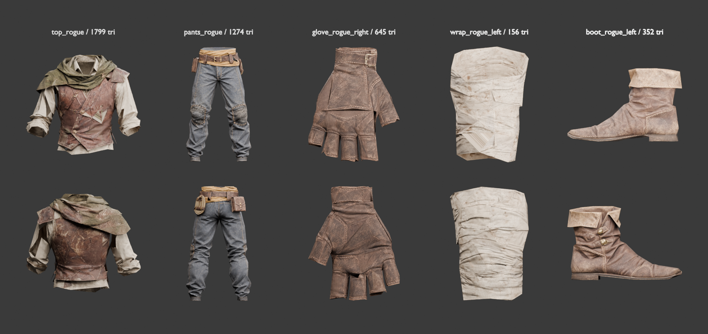
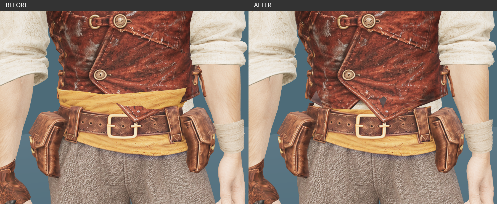

# Modular Rogue — 부위별 제작 원화

2026-10-01. 승인된 [던전 탐험가 v3](modular-rogue-leather.md)를 바탕으로,
현재 남성 모듈형 몸체를 참고한 원화 5종을 제작했다. 게임 장착 단위는 상의·하의·손·신발 4개다.
머리는 기존 헤어를 사용하고, 내려 쓴 후드 숄은 상의에 포함한다.

현재 기본 로그 상의는 사용자가 승인한 [Tripo 피팅 상의](modular-rogue-tripo.md)다.
하의도 사용자가 승인한 [Tripo Smart Mesh 바지](modular-rogue-tripo-pants.md)를 기본으로 사용하며,
작업실 장갑은 [승인된 Smart Mesh 오른손 장갑](modular-rogue-tripo-glove.md)과 [새 Tripo 왼손목 천](modular-rogue-tripo-wrap.md)을 사용하고,
부츠는 v8을 유지한다. **[미사용] 이전 v7/v8 상의 GLB는 삭제했다.**
현재 혼합 세트의 편집본은 `rogue/tripo_wrap_v1/tripo-wrap-fitting.blend`다. **[미사용]** 기존 왼손 천과 합친 중간 GLB·중복 장갑 편집본은 삭제했다.
중간 백업과 이전 v7 파일은 정리하고 검수 이력을 보존했다.
일반 로그 상의 선택과 `?outfit=rogue`, `?outfit=tripo`가 같은 승인 상의를 사용한다.
아래 v8 상의 제작 내용은 과거 기록이며 런타임 등록·혼합 호환 검수는 별도다.
원화는 정확한 치수 도면이나 3D 피팅 결과가 아니다.
아래 수치는 모델링 시작 기준이며 실제 메시·애니메이션에서 조정하고 검증해야 한다.
[반복 제작 워크플로우](modular-outfit-workflow.md)의 첫 적용 예제로, 생성·검수·연결 테두리
추출 도구와 실패 기록을 함께 보존한다. 게임 장착용 피팅·리깅 합격을 뜻하지 않는다.

## 파츠 구성

| 예정 출력 | 원화 | 포함 범위 | 조립 방식 |
| --- | --- | --- | --- |
| `top_rogue.glb` | [상의 앞·뒤](../images/characters/modular_human_male_01/parts/rogue/top_rogue-v1.png) | 리넨 셔츠, 적갈색 베스트, 왼쪽 작은 견갑, 이끼색 후드 숄 | 한 장비로 교체. 제작 원본에서는 소재와 가림 처리를 위해 층별 메시를 구분한다. |
| `pants_rogue.glb` | [하의 앞·뒤](../images/characters/modular_human_male_01/parts/rogue/pants_rogue-v3.png) | 회갈색 울 바지, 황토색 리넨 허리 천, 가죽 벨트·주머니·무릎 덧댐, 짧은 로프 고리 | 허리 장식은 모두 하의 소속으로 두고 골반을 따른다. |
| `gloves_rogue.glb` | [오른손 반장갑](../images/characters/modular_human_male_01/parts/rogue/glove_rogue_right-v2.png), [왼쪽 손목 천](../images/characters/modular_human_male_01/parts/rogue/wrap_rogue_left-v1.png) | 오른손 가죽 반장갑과 왼쪽 손목 천 | 두 제작 입력을 하나의 hands 슬롯으로 내보낸다. 왼손 전체와 오른손 끝마디를 노출한다. |
| `boots_rogue.glb` | [왼쪽 부츠 두 시점](../images/characters/modular_human_male_01/parts/rogue/boot_rogue_left-v1.png) | 낮은 가죽 부츠와 접힌 커프 | 왼쪽 형상을 기준으로 오른쪽을 대칭 제작하고 각각 발·발가락 가중치를 맞춘다. |

허리 천의 늘어진 끝은 벨트 안으로 넣었다. 로프는 작은 납작한 고리로 줄이고 두 곳에서 고정한다.
주머니는 고관절 접힘선 위에서 몸에 가깝게 붙인다. 단검·칼집·늘어진 열쇠는 이번 하의에
고정하지 않는다. 무기는 기존 장착 체계를 따른다.

장갑 v2는 손바닥 쪽 엄지 방향을 수정해 같은 오른손 장갑의 두 시점으로 정리했다.
앞뒤 시점의 봉제선·버클 세부는 모델링 때 하나의 메시 구조로 확정한다.

## 하의 울 원화 v3 제안 — 2026-10-01

사용자가 v2의 청바지 같은 외관을 지적해 [하의 v3](../images/characters/modular_human_male_01/parts/rogue/pants_rogue-v3.png)를 제작했다.
회갈색 무광 울, 단순한 중앙 이음선과 넉넉한 주름으로 바꾸고 현대적인 앞여밈·대비 봉제선을 없앴다.
황토색 리넨 허리 천, 가죽 벨트·주머니·무릎 덧댐과 짧은 로프 고리는 유지했다.
**[미사용]** 기존 v2는 수정 입력의 출처로 보존한다.
후속 [Tripo 바지](modular-rogue-tripo-pants.md)는 2026-10-02 기본 하의로 사용자 승인을 받았다.
실제 게임 등록·혼합 장비 호환 검수는 별도다.

- 생성: OpenAI Codex built-in ImageGen, **ChatGPT Pro 20x**, 2026-10-01.
- 이용 조건: OpenAI 생성 출력물 이용 조건과 기존 입력 원화의 출처를 따른다.
- [실제 수정 프롬프트·입력·검수 이력·SHA-256](modular-rogue-pants-v3-sources.json).

Tripo 업로드용으로 v3 앞뒤 시점을 분리했다. 각 파일은 768×1024 PNG이며,
FFmpeg로 원본을 무손실 크롭했다. 재생성·크기 변경 없이 기존 원화와 이용 조건을 유지한다.

- [앞면](../images/characters/modular_human_male_01/parts/rogue/pants_rogue-front-v3.png): 원본 `(0, 0, 768, 1024)` 영역.
- [뒷면](../images/characters/modular_human_male_01/parts/rogue/pants_rogue-back-v3.png): 원본 `(768, 0, 768, 1024)` 영역.

## Tripo 업로드용 상의 시점 분리 — 2026-10-01

- [앞면](../images/characters/modular_human_male_01/parts/rogue/top_rogue-front-v1.png): 원본 `(0, 0, 784, 1024)` 영역.
- [뒷면](../images/characters/modular_human_male_01/parts/rogue/top_rogue-back-v1.png): 원본 `(784, 0, 752, 1024)` 영역.
- 출처: `top_rogue-v1.png`를 FFmpeg로 무손실 크롭했다. 좌표는 `(x, y, 너비, 높이)`이며 원본과 디자인은 유지했다.
- 원본은 2026-10-01 OpenAI Codex ImageGen, **ChatGPT Pro 20x** 생성물이며 기존 OpenAI 출력물 이용 조건을 따른다. 시점 분리에 새 AI 생성이나 유료 호출은 없다.

사용자가 전달한 Tripo 상의를 피팅한 뒤 기본 로그 상의로 승인했다.
원본의 4,877 triangles와 2K 텍스처를 사용한다.

## Tripo 업로드용 오른손 장갑 시점 분리 — 2026-10-02

이 원화를 바탕으로 사용자가 전달한 Smart Mesh 장갑은
[오른손 피팅 후보](modular-rogue-tripo-glove.md)로 작업실에 적용했다.
손바닥은 간단히 처리하고 손등·커프·버클과 손가락 동작을 우선한다.

오른손 반장갑 v2의 두 시점을 각각 768×1024 PNG로 무손실 크롭했다.

- [손등](../images/characters/modular_human_male_01/parts/rogue/glove_rogue_right-dorsal-v2.png): 원본 `(0, 0, 768, 1024)` 영역.
- [손바닥](../images/characters/modular_human_male_01/parts/rogue/glove_rogue_right-palmar-v2.png): 원본 `(768, 0, 768, 1024)` 영역.
- 원본은 2026-10-01 OpenAI Codex ImageGen, **ChatGPT Pro 20x** 생성물이다.
  로컬 FFmpeg로 분리했으며 기존 디자인과 OpenAI 출력물 이용 조건을 유지한다.
- [입력·출력 해시와 분리 기록](modular-rogue-parts-sources.json).

같은 날 사용자의 요청으로 주변 그라디언트를 제거한 투명 PNG를 제작했다.
Tripo 입력에는 [손등 투명본](../images/characters/modular_human_male_01/parts/rogue/glove_rogue_right-dorsal-transparent-v2.png)과
[손바닥 투명본](../images/characters/modular_human_male_01/parts/rogue/glove_rogue_right-palmar-transparent-v2.png)을 사용한다.
두 파일은 1086×1448 RGBA이며 원본 분리 이미지는 수정 입력으로 보존한다.
OpenAI Codex ImageGen, **ChatGPT Pro 20x**, 2026-10-02 편집물이며 기존 OpenAI 출력물 이용 조건을 따른다.
AI 배경 제거 편집으로 무손실 크롭과는 구분한다.
[실제 편집 프롬프트·출처·해시](modular-rogue-glove-cutouts-sources.json).

## 기준 몸체와 연결부

공통 제작 원칙은 [모듈형 복장 절단선과 연결 기준](modular-outfit-connections.md)을 따른다.
아래 수치는 도적 복장의 모델링 시작값이며, 공통 규격의 확정 치수는 아니다.

`assets/modular_human_male_01/fitted/base.glb`의 현재 형상을 직접 렌더해
[정면](../images/characters/modular_human_male_01/parts/rogue/rig-front.png)과
[측면](../images/characters/modular_human_male_01/parts/rogue/rig-side.png)을 생성 입력에 함께 제공했다.
회색 재질은 체형 확인용 렌더에서만 사용했으며 기존 몸체 파일은 수정하지 않았다.

- 리그: `human_male_01_mixamo_candidate_v2`, 65본. 기존 본 계층·기준 행렬·inverse bind matrix를 유지한다.
- 좌표: 미터, Y 위, +Z 전방, 발밑 원점. 현재 몸체 높이는 1.90m다.
- 기준 A 자세: 상완이 수직에서 약 27° 벌어진 현재 자세. 손바닥을 정면으로 돌리지 않는다.
- 왼쪽 팔꿈치 `(0.3113, 1.2480, -0.0560)`, 손목 `(0.4457, 0.9936, -0.0457)`.
- 골반 본 `(0, 1.0712, -0.0141)`, 왼쪽 발목 본 `(0.1664, 0.1110, -0.0359)`.

| 연결부 | 모델링 시작 기준 |
| --- | --- |
| 목·숄 | 목 본 높이 약 1.583m. 숄은 쇄골·등 위쪽에 가깝게 두고 상완을 가로질러 잇지 않는다. 몸통·어깨를 따라 움직이며 머리 회전에 끌려가지 않게 한다. |
| 허리 | 베스트 밑단 약 Y=1.12m, 허리띠·천 밴드 약 Y=1.08–1.15m. 셔츠는 밑단을 더 내려 허리밴드 안쪽에 25–35mm 겹친다. 같은 겹침 구간은 일관된 골반/척추 가중치를 쓴다. |
| 소매 | v4부터 `interfaces/v1`의 `glove_long_Left/Right`를 사용한다. 소매 끝을 빨간 기준선보다 손목 방향으로 17.5mm 연장한다. 반장갑·손목 천 조합에서는 아래 맨팔을 보존한다. |
| 손목 | 오른쪽 장갑 커프는 손목 위 약 40mm, 왼쪽 천은 약 60–70mm. ForeArm–Hand 축에 맞추고 손가락은 현재 리그의 각 본을 따른다. |
| 발목 | 부츠 입구는 Y≈0.22–0.24m. 바지 끝이 30–40mm 안쪽으로 들어가도록 겹친다. 종아리 굵기를 유지하고 끝단만 조정한다. 겹치는 구간은 Leg/Foot 가중치를 맞춘다. |

위 높이는 참조 원화의 픽셀에서 얻은 치수가 아니다. 기존 몸체의 기준점에 맞춘 제작 제안이다.
좌우 구분은 항상 착용자 기준이며, 정면 그림에서는 착용자 왼쪽이 화면 오른쪽이다.

## 모델링과 런타임 적용 시 처리

- 상의는 셔츠 몸통·소매, 베스트, 숄·견갑을 편집 가능한 메시로 남기되 같은 리그와 장비 슬롯을 사용한다.
  생성 원화에서 가려진 안쪽 표면을 중복으로 모두 만들 필요는 없으며, 옷을 벗었을 때의 몸체는 원본을 유지한다.
- `ModularOutfit`의 `rogue` 스타일과 네 파츠를 게임 런타임에 등록했다. 새 로그는 상의·바지·장갑·부츠를 착용하고 시작하며 헬멧은 지급하지 않는다.
  이는 현재 코드에 이미 연결됐다는 뜻이 아니다.
- 현재 긴 소매·일반 가죽 장갑의 가림 규칙을 그대로 쓰면 맨팔과 손가락이 사라진다.
  말아 올린 소매용 팔 가림, 오른손 반장갑의 덮인 부분, 왼손 전체 노출을 별도로 처리한다.
- 바지는 부츠 착용용 밑단과 맨발용 밑단을 구분할 수 있게 제작한다.
  신발만 착용한 조합에서는 기존 `boot_ankles`와 부츠 입구의 연결도 확인한다.
- 다중 시점 원화를 한 개체 생성 입력으로 그대로 넣지 않는다. 주 시점과 보조 시점을 분리하고,
  장갑은 오른손 하나, 부츠는 왼발 하나를 생성한 뒤 기존 몸체에 맞춘다.
- 옷을 개별 해제하거나 기존 판금·천 장비와 섞었을 때도 허리·목·손목·발목이 유지되어야 한다.
  대기·걷기·달리기·점프·공격·앉기의 실제 스킨 변형에서 확인한다.

## 폴리곤 계획

장비별 제작 목표는 상의 2,200, 하의 1,300, 오른손 장갑 400, 왼쪽 손목 천 200,
양쪽 부츠 합계 700으로 **총 4,800 triangles**다. 개별 파츠마다 일반 아이템 4,000 목표를 적용하지 않는다.

현재 몸체 13,891 + 크롭 헤어 933 + 기존 철검 302에 위 장비 목표를 더하면
숨김 영역 포함 **약 19,926 triangles**다. 얼굴 지정 영역 **1,505 triangles**를 유지한다.
이는 최초 계획 예산이며 실제 총합과 표시 폴리곤 수는 모델링·가림 적용 후 측정한다.
후드 숄은 상의 예산에 포함하며 별도 절차형 망토는 이 조합에 포함하지 않는다.

## 출처와 파일 기록

- 부위 원화: OpenAI Codex built-in ImageGen, **ChatGPT Pro 20x**, 2026-10-01.
  OpenAI 생성 출력물 이용 조건 적용. 입력은 승인된 v3 원화와 기존 몸체 렌더 2종이다.
- 몸체 렌더: Blender 5.2.0 LTS, 기존 자산의 로컬 렌더. 기존 [몸체·리그 출처](modular-human-male-01.md)를 따른다.
- [실제 프롬프트·수정 프롬프트·입력·SHA-256·예산](modular-rogue-parts-sources.json).
- **[미사용]** `pants_rogue-v1.png`는 늘어진 허리 천·큰 로프 고리를 수정한 v2로 대체하고 삭제했다.
- **[미사용]** `glove_rogue_right-v1.png`는 손바닥 뷰의 엄지 방향을 수정한 v2로 대체하고 삭제했다.
  두 중간 이미지는 사용자 요청으로 2026-10-01 정리했으며, 프롬프트·해시는 출처 JSON에 보존한다.

## 연결 원칙에 따른 원화 재검토 — 2026-10-01

원화 5종의 디자인은 유지하고 다음 조건으로 Meshy 제작을 진행했다.
공통 테두리는 `assets/modular_human_male_01/interfaces/v1`의 최신 몸체 단면을 사용한다.
의상 내부 여유 공간과 최종 겹침 깊이는 아직 확정하지 않았다.

| 파츠 | 연결 규격·안팎 순서 | 피팅·가림에서 해결할 항목 |
| --- | --- | --- |
| 상의 | `neck_base`, `waist`; 셔츠 밑단은 하의 허리밴드 안쪽 | 그림에서 노출된 셔츠 끝은 착용 시 안으로 넣는다. 베스트 하단은 벨트·주머니와 충돌하지 않게 정리한다. 목을 덮는 투구 조합은 미검증이다. |
| 바지 | `waist`, `shoe_ankle`; 부츠가 바지 끝을 덮음 | 허리 장식은 모두 하의 소속. 30–40mm 넣는 밑단과 맨발용 밑단을 구분하고, 부츠 안쪽 의상과 피부를 각각 가린다. |
| 오른손 반장갑 | `glove_short`; 소매와 연결하지 않음 | 짧은 소매 아래 맨팔·드러난 손가락을 남긴다. 손가락 구멍과 손바닥/손등의 같은 오른손 구조를 검사한다. |
| 왼쪽 손목 천 | `glove_short` 주변의 별도 커프 길이 | 왼손 전체 노출. 손목 천 아래 피부만 가린다. 소매까지 피부를 지우지 않는다. |
| 부츠 | `shoe_ankle`; 바지보다 바깥 | 원화의 외관 높이를 그대로 치수로 쓰지 않고 실제 입구를 Y≈0.22–0.24m로 피팅한다. 발·발가락 가중치와 대칭 제작을 검증한다. |

그림의 앞뒤 세부가 완전히 같지는 않다. 부츠는 앞/바깥 주 시점만 생성 입력으로 사용하고,
상의·바지·장갑은 시트를 분리해 각각 같은 물체의 두 시점으로 제출했다.
허리 25–35mm, 발목 30–40mm는 계속 시작값이며, 그림만으로 호환 합격을 선언하지 않는다.

## Meshy 제작·검수 기록

- 2026-10-01, **Meshy Premium**, `meshy-7.1`, PBR 2K, 파츠별 triangle 예산.
- [1차 입력·설정](modular-rogue-build.json), [실제 작업 ID·비용·파일 해시](modular-rogue-meshy-sources.json).
- 1차 GLB 실측은 작업 기록의 `geometry_review`에 보존했다.
  현재 보관하는 GLB 경로는 [선택 명세](modular-rogue-source-selection.json)를 따른다.
- 라이선스: [Meshy 유료 생성물 이용 조건](https://help.meshy.ai/en/articles/10137554-what-is-the-ownership-of-the-generated-models).
- 아래 검수 이미지는 Blender 5.2.0 LTS의 원본 GLB 렌더다. 각 파츠를 별도 정규화했으며
  착용 조립 화면이 아니다. AI 원화나 완성된 게임 모델로 표기하지 않는다.

| 파츠 | 1차 실측 triangles | 판정 |
| --- | ---: | --- |
| 상의 | 1,658 | **[미사용] 재생성 대상.** 원화의 가죽·천 표면 디테일이 크게 손실됐다. |
| 바지 | 1,274 | 피팅 후보. 허리 장식·무릎 패치는 유지됐지만 허리/발목 개구부·관절 변형은 미검증. |
| 오른손 반장갑 | 397 | **[미사용] 재생성 대상.** 손가락 뿌리·끝단 형상이 거칠다. |
| 왼쪽 손목 천 | 156 | 피팅 후보. 단순 커프 형상이며 입구·천 끝·두께 정리가 필요하다. |
| 왼쪽 부츠 | 352 | 피팅 후보. 외형은 유지됐으나 아직 방향·좌우·입구를 기준 발에 맞추지 않았다. |

1차 5건 모두 회수 완료, 실제 **150크레딧**. 상의와 반장갑은
[2차 명세](modular-rogue-build-v2.json)로 `geometry_resolution=2k` 재생성을 완료했다.
반장갑 목표는 손가락 연결부 보존을 위해 400→700 triangles로 조정한다.
[2차 작업 기록](modular-rogue-meshy-v2-sources.json)에 비용과 결과를 별도로 남겼다.
2차 상의 1,701 triangles는 색 띠 텍스처 문제가 반복되어 **[미사용]**으로 분류했다.
반장갑 645 triangles는 1차보다 손가락·버클이 뚜렷해 피팅 후보로 선택했다.
2차 2건 실제 비용은 **70크레딧**이다.

피팅·리깅·가림·동작·혼합 조합은 아직 합격 전이다. 현재 게임 코드는 변경하지 않았다.


### 피팅 후보 선택

상의는 [3차 명세](modular-rogue-build-v3.json)에서 다른 설정을 유지하고 **정면 입력만**
사용했다. [3차 작업 기록](modular-rogue-meshy-v3-sources.json), 실제 **35크레딧**.
가죽·리넨·숄의 텍스처가 복원됐다. 다만 앞 베스트의 큰 삼각형 아티팩트, 개구부와
상의 뒷면의 원화 일치는 정리·검증이 남았다. 원인이 앞뒤 입력 때문이라고 확정하지 않고,
이번 시도에서 단일 시점 입력으로 결과가 개선됐다는 사실만 기록한다.



| 후보 | 선택 버전 | 실측 triangles | 다음 보정 |
| --- | --- | ---: | --- |
| 상의 | Meshy v3 | 1,799 | 베스트 삼각형 아티팩트, 안쪽 셔츠 밑단, 숄·소매·목 입구 |
| 바지 | Meshy v1 | 1,274 | 허리·발목 겹침, 개구부, 주머니와 고관절 |
| 오른손 반장갑 | Meshy v2 | 645 | 얕은 손바닥 부피, 손가락 5개 구멍, 개별 본 가중치 |
| 왼쪽 손목 천 | Meshy v1 | 156 | 천 끝·양끝 개구부·두께 |
| 왼쪽 부츠 | Meshy v1 | 352 | 좌우·방향 피팅, 오른발 대칭, 입구 여유와 발가락 가중치 |

[선택 명세·남은 작업](modular-rogue-source-selection.json),
[선택 원본의 실제 측정](modular-rogue-mesh-review-selected.json).
선택 원본 GLB는 출처 기록과 함께 보관한다.
**[미사용]** 별도 원본 검수용 `rogue-source-review.blend`는 중복되어 최종 정리 때 삭제했다.
원본 GLB의 텍스처를 포함하고 각 파츠의 앞뒤를 독립 전시한다. 몸체에 피팅한 파일이 아니다.

오른쪽 부츠를 동일 triangle 수로 대칭 제작한다고 가정하면 원본 장비는 **4,578 triangles**,
현재 몸체 13,891 + 크롭 헤어 933 + 철검 302와 합쳐 **19,704 triangles 예상**이다.
아직 실제로 조립·피팅한 GLB의 실측 합계가 아니며, 개구부·겹침·가중치 수정으로 변할 수 있다.
얼굴 원본 1,505 triangles는 유지했다. 표시 triangle 수는 가림 구현 후 측정한다.
총 8건의 Meshy 생성에 실제 **255크레딧**을 사용했다. 모든 작업은 완료되어 원본·PBR·해시를 회수했다.


### 중간 저장 전 파일 정리 — 2026-10-01

사용자 요청에 따라 미사용 상의 v1/v2·반장갑 v1의 GLB와 텍스처,
Meshy 자동 프리뷰, 분할 입력 이미지, 이전 검수 화면·독립 측정 JSON을 삭제했다.
총 68개 중간 파일, 약 48.1 MiB를 정리했다. 실패 결과의 실측은 각 생성 기록의
`geometry_review`로 옮겼으며, 삭제된 출력은 `retained: false`로 표시했다.
작업 ID·설정·비용·해시는 보존한다.

선택한 5종의 GLB·원본 PBR 맵, `rogue-source-review.blend`,
`interfaces/v0/outfit-reference.blend`와 `interfaces.json`, 선택 원본 검수 이미지·측정 결과,
연결 기준 이미지는 남겼다. 분할 입력은 원화와 제작 명세로 `prepare`에서 재현할 수 있다.
선택 원본의 열람·검수에는 `modular-rogue-source-selection.json`을 사용한다.

2026-10-10 후속 정리: 당시 보존했던 **[미사용]** `interfaces/v0/interfaces.json`도 삭제했다. 현재 제작 기준은 `interfaces/v1`이며, 이전 제작 기록의 v0 참조는 이력으로 남긴다. [삭제 기록](modular-interfaces-cleanup-2026-10-10.json).

## 이전 피팅과 정리 이력 — 2026-10-01

[피팅 이력](modular-rogue-fitting-history.json)에 v1–v6의 출력 해시·삼각형 수·실패 원인과
수정 내용을 보존한다. 구버전은 모두 **[미사용]**이며 현재 후보는 v7이다.

| 버전 | 수정 내용과 대체 이유 |
| --- | --- |
| v1 | 독립 크기·위치 보정만 적용해 공통 발목 단면이 빠졌다. |
| v2 | 공통 발목 단면·가중치·안감을 적용했고, 몸체 종아리 수정으로 v3가 대체했다. |
| v3 | 공통 종아리를 반영했다. 소매 구멍과 긴 장갑 절단선 밖의 고르지 않은 끝단이 발견됐다. |
| v4 | 양쪽 소매를 연속 메시로 재구성하고 `glove_long` 아래 17.5mm 끝단과 겨드랑이 안감을 만들었다. 점프의 과도한 소매 늘어남도 보정했다. 베스트·숄 구멍, 레이어 관통, 밑단·손목·접힌 커프 문제가 남아 v5가 대체했다. |

v3는 장비 4,898, 숨김 포함 조립 20,024 triangles였고 v4는 각각 6,361, 21,487이었다.
얼굴 1,505 triangles는 유지했다. 발목 검사는 기준 자세와 7개 게임 클립의 91개 자세에서
발목별 7개 단면 × 둘레 144방향을 검사했다. 연결 곡선이 존재하거나 좌표가 유한하다는
이유만으로 연결부·혼합 장비 호환을 승인하지 않는다.

첫 정리에서 v1/v2·이전 Blender 백업·개별 렌더 등 61개 파일, 약 732.3 MiB를 삭제했다.
이번 커밋 전 정리에서는 v3/v4의 GLB·편집본·자세 데이터·검수 이미지·상세 JSON 중복본
**23개 파일, 약 364.5 MiB**를 삭제했다. 출력 해시·검사 요약·렌더 해시는 이력에 남겼다.
[정리 기록](modular-rogue-cleanup.json)에 삭제 경로·해시·크기를 보존한다.
최신 v7, 선택 원본 GLB/PBR, 공통 몸체·편집본, `interfaces/v1` 기준,
재현용 수정 전 몸체 GLB와 v0 단면 JSON은 유지한다.

후속 정리에서 v5/v6의 중복 GLB·편집본·자세 데이터·검수 이미지·상세 JSON
**29개 파일, 약 316.2 MiB**를 삭제했다. 실루엣·연결부 비교 이미지와 v5 재질 원본은 유지했다.
삭제된 파일의 해시·크기는 정리 기록에, 검사 요약과 실패·수정 내용은 피팅 이력에 남겼다.

## 상의 레이어·마감 보정 v5 — 2026-10-01

**[미사용]** v7으로 대체했다. 중간 모델·편집본·검수 파일은 삭제하고 이력에 요약했다.

사용자가 앉은 자세의 등·겨드랑이·목 뒤·상의 밑단·손목에서 발견한 문제를 반영했다.
**[미사용] v4**의 손상된 생성 베스트·숄과 덧댄 셔츠를 그대로 보수하지 않고,
상의 레이어와 왼쪽 손목 천을 새 메시로 교체했다. 이전 출력은 정리하고 실패·수정 기록을 남겼다.

| 지적 사항 | v5 처리 |
| --- | --- |
| 어깨·등에서 셔츠 관통 | 셔츠와 베스트를 분리하고, 숄 아래에 가려지는 내부 면을 12mm 겹침 안쪽에서 정확히 잘랐다. 어깨 주변 레이어는 같은 몸통/어깨 가중치 규칙을 쓴다. |
| 베스트 겨드랑이 구멍 | 목·허리·양팔 입구만 가진 연속 베스트로 재구성했다. 의도된 팔 입구에는 안쪽 셔츠가 이어진다. |
| 목 뒤 숄 구멍·피부 노출 | 목둘레에서 등까지 이어지는 연속 숄을 만들고, 이 상의가 덮는 `neck` 피부 구역을 함께 가린다. 상의 해제·로딩 실패 시 피부를 복원한다. |
| 톱니 모양 베스트 밑단 | Y=1.105m의 연속 밑단과 4mm 안쪽 마감 면을 만든다. |
| 손목 천 사이로 피부 관통 | 실제 왼쪽 손목 단면을 32방향으로 따라 닫힌 둘레를 구성하고, 몸체의 해당 부위 가중치를 전사했다. |
| 소매의 접힌 자국 누락 | 소매 바깥으로 접힌 폭 31mm, 돌출 10mm 커프를 추가했다. `glove_long` 기준선 아래 17.5mm 끝단은 유지한다. |

몸체의 손목 피부에는 팔뚝·손 본 외에 엄지 뿌리 영향도 있다. 팔뚝·손 본만 쓰면 일부 자세에서
피부가 천을 통과하므로 이 국소 영향까지 일치시켰다. 손목의 접힌 피부에서는 최근접 삼각형의
법선 부호만으로 내부/외부를 판정할 수 없어, 세 방향 광선의 교차 횟수와 표면 거리도 검사한다.
기준 자세와 7개 동작의 총 **92개 자세**에서 천이 피부 안으로 들어간 정점은 0개,
최소 표면 간격은 **1.71mm**다. 덮인 피부 정점도 천 안쪽에 있는지 별도로 검사했다.
[검사 요약](modular-rogue-fitting-history.json).

새 재질은 기존의 적갈색 가죽·이끼색 천·아이보리 리넨을 기준으로 만든 ImageGen 아틀라스다.
도구는 **OpenAI Codex built-in ImageGen**, 등급 **ChatGPT Pro 20x**, 생성일 2026-10-01이며
OpenAI 생성 출력물 이용 조건을 따른다. 실제 출력 1254×1254에서 FFmpeg로 627×627 사분면
4개를 추출해 UV 반복에 사용했다. 추가 Meshy 생성은 없다. 베스트 여밈·숄·주름은 새 토폴로지에
맞게 다시 구성했으며 원본 생성 메시의 장식과 실루엣을 그대로 복제한 결과는 아니다.
[최종 프롬프트·파일·해시·출처](modular-rogue-rebuild-v5-sources.json).
몸체와 기존 하의·오른쪽 반장갑·부츠는 기존 출처와 라이선스를 유지한다.

상의 3,277 triangles, 장비 합계 **6,732**, 숨김 포함 조립 합계 **21,858**, 얼굴 1,505다.
일반 목표 15,000–20,000보다 높으며, 연결부와 접힌 마감을 유지하고 수치만 맞추기 위한
데시메이션은 하지 않았다. 최종 게임의 모든 가림·조합에 대한 표시 triangle 수는 미확정이다.

[출력·편집본·렌더 해시와 동작 검사 요약](modular-rogue-fitting-history.json).

재현은 기존 생성·검수 명령에 더해 `.venv/bin/python tools/outfits/validate_rogue_wrap.py`로
손목 관통을 검사한다. 현재 후보의 편집본과 상세 검수 기록은 아래 v7 항목에 있다.
프리뷰 착탈·로딩 실패 테스트, `npm run check`, `npm run lint`도 통과했다.
오른쪽 반장갑 끝단과 다른 세트의 긴 장갑·부츠를 섞는 조합은 별도 검증 범위다.

## 상의 실루엣 보정 v6 — 2026-10-01

**[미사용]** v7으로 대체했다. 실루엣 비교 이미지와 검사 요약을 남기고 중복 파일은 삭제했다.

판금 상의처럼 몸의 곡선을 따르도록 베스트를 다시 피팅했다. 가슴의 폭은 유지하고
허리 반폭을 168mm로 좁혀 가슴 대비 71.5%로 만들었다. 복부의 앞뒤 부피를 줄이고,
단면을 더 둥글게 다듬었다. 밑단은 앞 중앙을 10mm 내려 벨트로 연결하고 옆선을 6mm 올렸다.
앞 여밈과 단추도 같은 몸통 단면을 따라 배치한다. 후드 숄·소매·텍스처와 나머지 장비의
형상은 당시 v5를 유지했다.

- [같은 전투 대기 자세의 수정 전후](../images/characters/modular_human_male_01/parts/rogue/fitting-v6-silhouette.png)
- [출력·편집본·렌더 해시와 동작 검사 요약](modular-rogue-fitting-history.json)

기존 65본·rest/bind 행렬과 정점 가중치 검사를 통과했다. 대기·걷기·달리기·점프·공격·
전투 대기·앉기 7개 동작을 각각 13개 자세로 검사했고, 기존 발목·소매 검사도 통과했다.
실제 Three.js 미리보기에서 v6 파일 해시, 7개 동작 선택과 판금/로그 교체를 확인했다.
베스트는 16 triangles 늘어 상의 3,293, 장비 합계 6,748, 숨김 포함 조립 21,874다.
로그 세트·crop 헤어·검을 켠 미리보기의 표시 수는 13,349이며 얼굴은 1,505다.
이 표시 수는 해당 조합의 값이다. 다른 장비와의 전체 호환 검수는 이전 후보와 같이 남아 있다.

출처·라이선스는 v5와 원본의 기존 기록을 따른다. 2026-10-01 Codex에서 기존 절차식
메시를 편집하고 Blender 5.2.0 LTS와 Three.js로 검수했다. 새 AI 생성이나 유료 호출은 없다.
비교 이미지는 실제 미리보기의 동일한 카메라·동작 시점으로 렌더한 v5/v6 화면을
FFmpeg로 배치했다. 당시 편집본의 해시는 피팅 이력에 보존한다.

## 소매·스카프 연결 보정 v7 — 2026-10-01

양쪽 소매의 독립된 어깨 캡을 없애고, 셔츠 몸통의 암홀 테두리와 각각 24개 정점을
같은 위치·가중치로 이어 붙였다. 연결 근처의 가중치를 메시 표면을 따라 부드럽게 보간하고,
접힌 커프는 기존 단면과 가중치를 고정했다. 겨드랑이와 어깨의 바깥 마감도 셔츠까지 연결했다.

초록색 스카프는 베스트의 윗부분을 따르는 연속 숄로 바꿨다. 녹색·가죽 경계의 정점과
가중치를 공유해 벌어지지 않게 했다. 기존에 숄 아래 숨겨졌던 목 테두리의 역접힘을 없애고,
목 둘레와 어깨까지 연속으로 연결했다. v6의 허리·복부 실루엣과 기존 소재를 유지한다.
v6의 상세 산출물은 정리하고 수정 전후 비교 화면과 피팅 이력을 보존한다.

초기 연결 후보의 단순 행별 보간과 근접 면 가중치 전사는 팔 올림에서 과도한 늘어남을
일으켰다. 연결 테두리의 공통 Shoulder/Arm 가중치와 표면 거리 기반 스무딩으로 보정했다.
7개 동작 × 13개 자세에서 소매 모서리의 최대 늘어남은 1.962배이며 기존 2.5배 기준을
통과했다. 몸통·양쪽 소매와 베스트·숄의 공유 정점 102개를 검사했고 최대 틈은 0m다.
실제 미리보기의 v7 파일 해시, 7개 동작 선택과 판금/로그 교체도 확인했다.

- [어깨 확대 수정 전후](../images/characters/modular_human_male_01/parts/rogue/fitting-v7-connections.png)
- [착용 렌더](../images/characters/modular_human_male_01/parts/rogue/fitting-v7-rest.png), [동작 렌더](../images/characters/modular_human_male_01/parts/rogue/fitting-v7-motion.png)
- [피팅 기록](modular-rogue-fitting-v7.json), [동작·연결선 검사](modular-rogue-animation-review-v7.json), [편집본·검수 기록](modular-rogue-fitting-review-v7.json), [손목 검사](modular-rogue-wrap-review-v7.json)

상의 3,270, 장비 합계 6,725, 숨김 포함 조립 21,851 triangles다. 로그 세트·crop 헤어·검을
켠 미리보기의 표시 수는 13,326이며 얼굴은 1,505다. 다른 장비와의 전체 호환 검수는 남아 있다.
출처·라이선스는 v6/v5와 기존 원본 기록을 따른다. 2026-10-01 Codex의 기존 메시 편집이며
새 AI 생성이나 유료 호출은 없다. 비교 화면은 실제 Three.js 미리보기의 같은 전투 대기
시점·카메라에서 렌더하고 FFmpeg로 배치했다. 편집본은
`assets/modular_human_male_01/rogue/fitted_v7/rogue-fitting.blend`였으며,
기본 상의 교체 후 삭제했다.

## 베이스 몸체 윤곽에 정렬 v8 — 2026-10-01

사용자 검수에서 v7의 측면 실루엣은 등이 과하게 튀어나오고 윗가슴은 들어가 보였으며,
목과 옷깃 사이로 빈틈이 보였다. 단면 수치를 개별 조정하는 대신 기존 베이스 메시를
제작 기준으로 삼아 상의를 다시 피팅했다. 베이스 몸체와 리그는 수정하지 않았다.

임의의 앞·뒤 반지름과 단면 곡선을 제거했다. 척추 본을 중심으로 실제 몸체의 수평 단면을
추출하고, 어깨 연결부를 정리한 뒤 몸체 표면에 투영해 법선 방향으로 12mm 여유를 줬다.
안쪽 셔츠는 바깥 표면보다 4mm 안쪽에 둔다. 옷깃도 목 피부의 닫힌 단면과 기존 연결
규격의 20mm 밴드에서 만들며, 목·머리의 실제 가중치를 따른다. 어깨 연결 가중치는
목 테두리로 갈수록 해제해 옷깃이 팔 움직임에 끌리지 않게 했다.

미리보기는 목 피부 전체를 숨기던 처리를 바꿔 옷깃 안의 노출 피부를 보존한다.
덮인 아래쪽 피부는 잘라 표시하고, 상의 교체·해제·파일 누락 시 원래 몸체를 복원한다.
Blender 검수본에도 같은 가림 범위를 적용했다. 소매 연결의 공유 정점은 유지한다.

베스트·숄의 정점과 삼각형 중심을 베이스 표면에 대조한 기준 자세 검사에서 관통은 없었다.
7개 동작 × 13개 자세의 연결 정점 102개는 최대 틈 0m이며, 소매 최대 늘어남은
약 1.89배로 기존 2.5배 기준을 통과했다. 목 회전이 포함된 전투 대기·대기·공격·앉기
확대와 같은 시점의 수정 전후를 실제 Three.js 제작 미리보기에서 확인했다.
단면 기반의 새 연결에 가까운 면의 가중치만 적용한 중간 시도는 소매 늘어남 검사를
통과하지 못해 채택하지 않았다. 기준 몸체에서 전사한 가중치와 기존 어깨 연결 제약을
함께 적용한 최종 결과를 보존했다.

제작·검사 수치는 [피팅 이력](modular-rogue-fitting-history.json)의 v8 항목에
통합했다. 이전 상의와 중간 렌더·보고서는 승인된 Tripo 상의로 교체한 후 정리했다.

상의 3,270, 장비 합계 6,725, 원본 숨김 영역을 포함한 조립 합계 21,851 triangles다.
목 가림을 적용한 제작 미리보기의 조립 수는 21,422, 표시 수는 13,479이며 얼굴은 1,505다.
출처·라이선스는 기존 v7/v5와 몸체의 기록을 따른다. 2026-10-01 Codex의 기존 메시 편집이며
새 AI 생성이나 유료 호출은 없다. 기존 v7/v8 상의와 비교용 편집본은 삭제했다.
**[미사용]** v8 하의와 `rogue/fitted_v8/rogue-fitting.blend`는 Tripo 하의 승인 후 삭제했다.
현재 전체 조합은 `rogue/tripo_pants_v1/tripo-pants-fitting.blend`에서 편집한다.
전체 게임 및 다른 장비와의 호환 합격은 별도 검수 범위로 남아 있다.

### 제작용 미리보기와 재현

개발 서버의 `/modular-character-preview.html?outfit=rogue` 또는 **로그 세트 입기**로 선택한다.
파일이 누락된 부위는 선택을 비활성화한다. 활성 후보 경로는
`modular-rogue-source-selection.json`에서 피팅·검증·렌더·미리보기가 함께 읽는다.

```bash
.venv/bin/python tools/fit-modular-rogue.py
node tools/validate-rogue-outfit.mjs
.venv/bin/python tools/outfits/validate_rogue_wrap.py
blender -b -t 6 --python-exit-code 1 --python tools/blender-scripts/review_rogue_fitting.py -- --animations
```

피팅은 입력 해시를 확인하고 후보를 재생성한다. 직접 편집한 결과는 별도 버전으로 보관한다.
검사 자세는 `animation-snapshots.json`, 손목 검사에 필요한 전체 자세는 `validation-poses.json`에 남긴다.
개별 렌더는 임시 폴더에서 조합한 뒤 정리한다. `--images <폴더>`로 개별 이미지를 보관할 수 있다.
편집본에는 기준 몸체·원본 참조·연결 곡선·내장 텍스처·검사 자세가 있다.
프레임 1은 기준 자세, 10/20/30/40/50/60은 대기/걷기/달리기/점프/공격/앉기 스냅샷이다.


## Tripo 왼손목 천과 허리 겹침 보정 — 2026-10-02

사용자가 전달한 Smart Mesh 천 튜브를 왼손목 띠와 교체했다.
기존 승인 오른손 장갑의 형상·UV·가중치·재질·이미지 바이트는 그대로 보존했다.
원본 2,011삼각형에서 막힌 내부 끝을 열고 양끝을 정리한 천은 1,904삼각형이며,
통합 장갑은 3,495삼각형이다. [출처·피팅·검수·재현](modular-rogue-tripo-wrap.md).

전체를 덮는 상의가 있으면 바지 상단과 안쪽 몸통 피부를 기준 자세 Y=1.105m까지
조건부로 잘라 황토색 천이 베스트를 뚫지 않게 한다. 상의를 벗거나 바바리안 상의로
바꾸면 원본 허리 형상을 복원한다. 원본 몸체·바지 GLB는 수정하지 않았다.
[허리 검사 기록](modular-rogue-tripo-waist-v1.json).



현재 크롭 헤어·검 조합은 원본 숨김 포함 26,416삼각형, 작업실 절단 후 24,527삼각형,
실제 표시 18,397삼각형이며 얼굴은 1,505삼각형이다.
검수 이미지는 실제 Tripo 메시를 Blender/Chromium에서 렌더한 결과이며 기존 출력물 이용 조건을 따른다.

## 게임용 로그 부츠 전송량 최적화 — 2026-10-03

`boots_rogue.7d06217e.glb`의 색상 2048px·법선 1024px·금속성/거칠기 1024px
텍스처 3장을 512×512 JPEG q90·4:4:4로 축소하고, 메시에는 정점 속성의
양자화·재배치 없이 `EXT_meshopt_compression`을 적용했다. 현재 로그 하의를
함께 착용한 앞·뒤 확대 렌더에서 가죽 주름·버클·접힌 커프·발뒤꿈치를 비교했다.
형상과 이음은 유지되며, 확대에서는 가죽의 미세한 질감이 조금 부드러워진다.
메시 2개·896 triangles, 재질 2개, 정점 속성 10개, UV·스킨 가중치·65본 순서·
역바인드 행렬·장비 메타데이터를 유지한다. 안쪽 커프의 어두운 무텍스처 재질도
보존한다. 삼각형 인덱스는 시작 꼭짓점만 순환하며 형상과 방향은 같다.
제작용 `assets/modular_human_male_01/rogue/fitted_v8/boots_rogue.glb`와
기존 출처·라이선스·이미지 원본을 보존하며, 추가 AI 생성이나 유료 호출은 없다.

파일은 **3,958,724 → 401,644바이트(89.9% 감소)**, gzip level 6 전송량은
**3,866,236 → 371,309바이트(90.4% 감소)**다. 빌드 시 생성되는 새 파일명은
`boots_rogue.c6665d2f.glb`다. 게임 manifest에 출력 SHA-256을 갱신했다.

Khronos glTF Validator 오류·경고 0이며, meshopt 미지원 안내 1개가 있다.
별도 디코딩 비교로 정점 속성·면 방향·스킨 데이터·재질 설정을 확인했다.
게임 로더의 브라우저 이미지 디코딩·렌더링·페이지 오류 0,
51동작·255자세에서 정점 위치 차이 0을 확인했다. 모듈형 캐릭터 관련
테스트 29개가 통과했고, 제작용 원본 재생성 출력의 SHA-256도 일치했다.

```sh
node tools/prepare-modular-character.mjs --part boots_rogue
```

## 로그 속셔츠 앞 밑단 보정 — 2026-10-09

사제 사슬 하의와 함께 입었을 때 조끼 아래의 삼각형 얼룩이 흰 속셔츠를 가리는 문제를 수정했다.
몸체 숨김만으로는 사라지지 않아 상의 내부 가죽 면 15개를 제거하고 리넨 정점 22개를 최대 12mm 안으로 이동했다.
앞쪽 UV 정점 15개를 같은 아틀라스의 깨끗한 리넨 영역에 연결했다. 텍스처 바이트·리그·가중치는 유지했다.
상의는 4,877→4,862 triangles이며 원본 Tripo 출력 조건과 기존 사용자 보고 약 USD 20/월 구독 기록을 따른다.
새 AI 생성·유료 호출은 없다.

현재 제작 파일은 `rogue/tripo_v1/rogue-undershirt-fitting-v1.blend`, 출력은 같은 폴더의 `top_rogue.glb`다.
`top_rogue-undershirt-before-v1.glb`는 재현 도구 입력으로 보존한다. [미사용] 이전 `tripo-fitting.blend`는 사용자 요청으로 2026-10-09 삭제했다.
재현 도구는 `tools/fix-rogue-undershirt.py`이며 [수정 기록](modular-rogue-undershirt-fitting-v1.json),
[동작 검사](modular-rogue-undershirt-animation-v1.json), [게임용 압축 검사](modular-rogue-undershirt-game-validation-v1.json),
[착용 화면](modular-priest-rogue-waist-review-v2.json)에 해시와 검사 범위를 기록했다.
게임용 출력은 326,160 bytes이며 리그 결합·압축 해제·7종 동작 91시점 검사를 통과했다.
원본 포함 예산은 사제 조합 기록에 별도로 정리했으며 전체 게임플레이 충돌 승인을 의미하지 않는다.
