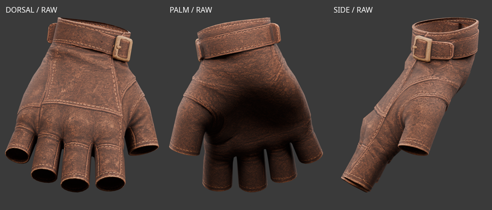
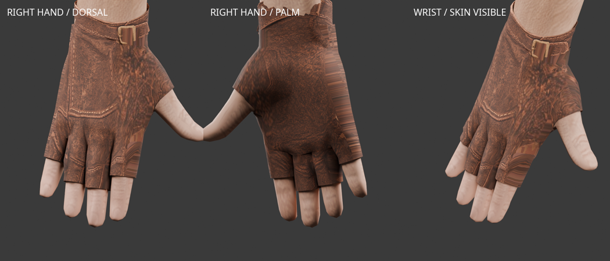
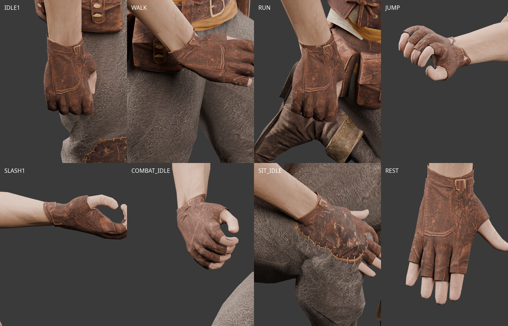
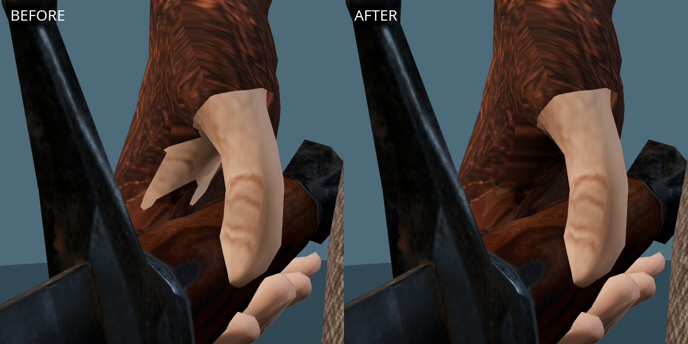

# 로그 오른손 장갑 — Tripo Smart Mesh

2026-10-02. 사용자가 다운로드한 `leather+glove+3d+model.glb`를 현재 남성 몸체에
피팅한 작업실 후보다. 생성 옵션은 사용자가 확인한 **Smart Mesh**다.
손등의 가죽·박음질, 손목 커프와 버클을 우선하고 손바닥은 간단히 처리했다.

- [생성 출처와 원본 해시](modular-rogue-tripo-glove-sources.json)
- [원본 검수](modular-rogue-tripo-glove-source-review.json)
- [피팅·리깅 결과](modular-rogue-tripo-glove-fitting-v1.json)
- [게임 동작 수치 검사](modular-rogue-tripo-glove-animation-v1.json)
- [검지·엄지 사이 피부 덮임 검사](modular-rogue-tripo-glove-coverage-v1.json)
- [작업실 브라우저 검사](modular-rogue-tripo-glove-browser-v1.json)
- [Blender 검수·편집본](modular-rogue-tripo-glove-review-v1.json)



## 형상과 리깅

원본은 2,043삼각형이며 리그가 없다. 현재 공통 몸체 `fitted/base.glb`와
`interfaces/v1`을 기준으로 기존 65본의 계층·기준 자세·inverse bind를 그대로 사용한다.
몸체나 손 자세를 바꾸지 않았다.

원본의 손가락 안쪽 면을 그대로 변형하면 손가락 사이에서 접히고 늘어지는 문제가 있었다.
손과 짧은 손가락 부분은 실제 몸체 표면에서 3mm 띄운 형상으로 교체하고,
손목과 다섯 손가락의 입구를 잘랐다. 손가락 끝과 피부는 노출된다.
커프와 버클은 Tripo의 형상을 보존해 몸체의 손목 단면에 맞췄다.
원본 가죽 텍스처를 손등·손바닥의 별도 투영 영역으로 베이크하고,
엄지 주변의 작은 디테일은 같은 가죽 질감으로 단순하게 처리했다.
새로운 AI 텍스처를 생성하지 않았다.

오른손은 1,591삼각형(손 부분 863 + 원본 커프 728)이다.
왼쪽 손목 천은 v8의 512삼각형, 정점·UV·인덱스·가중치·재질·텍스처를 그대로 복사했다.
합친 장갑 파츠는 2,103삼각형이다. 예산 수치에 맞추기 위한 데시메이션은 하지 않았다.

원본 JPEG는 보존하고, 사용되는 텍스처는 원본 커프 영역과 1,024² 손등·손바닥 영역을
합친 4,096×2,048 PNG다. 파생 텍스처의 출처·라이선스는 원본 Tripo 출력을 따른다.



## 파일과 재현

`assets/modular_human_male_01/rogue/tripo_glove_v1/`에 보관한다.

- `source.glb`: 다운로드한 무수정 원본.
- `glove_rogue_right.glb`: 오른손만 분리한 리깅 검사 파일.
- **[미사용]** `gloves_rogue.glb`: 기존 왼손 천과 합친 중간 파일은 새 Tripo 천으로 교체 후 삭제했다.
- **[미사용]** `tripo-glove-fitting.blend`: 중복 편집본은 삭제하고 `rogue/tripo_wrap_v1/tripo-wrap-fitting.blend`에 현재 조합을 통합했다.
- `animation-snapshots.json`: Blender 검수에 사용하는 게임 동작 표본.
- `validation-poses.json`: 수치 검사에 사용한 7동작 × 13자세.

```bash
.venv/bin/python tools/fit-tripo-glove.py
node tools/validate-tripo-rogue.mjs --directory assets/modular_human_male_01/rogue/tripo_glove_v1 --part glove_rogue_right --fitting doc/assets/modular-rogue-tripo-glove-fitting-v1.json --report doc/assets/modular-rogue-tripo-glove-animation-v1.json
.venv/bin/python tools/validate-tripo-glove-coverage.py
blender -b -t 4 --python-exit-code 1 --python tools/blender-scripts/review_tripo_glove.py
```

작업실의 로그 장갑 경로는 [선택 명세](modular-rogue-source-selection.json)의 override로 지정한다.
상의·바지는 기존 승인본, 부츠는 v8을 사용한다. 사용자는 검지·엄지 사이 보정을 포함한 장갑 외형을 승인했다.
현재 왼손 천과의 조합은 [새 천 피팅 기록](modular-rogue-tripo-wrap.md)을 따른다. 실제 게임·다른 장비 조합의 검토는 남아 있다.

7개 게임 동작을 각각 13자세에서 검사했다. 런타임 본 연결, 유한한 정점 좌표,
가중치 합과 손가락 본 분리를 확인했다. 중복 경계 정점의 최대 간격은 1.87×10⁻⁹m다.
일부 짧은 손 부위 삼각형의 최대 변 길이 비율은 약 3.19배로, 모든 동작의 외형이나
파츠 간 관통을 수치 검사만으로 보장하지 않는다. Blender 표본과 실제 작업실 화면을 함께 검수했다.
Chromium에서 7개 동작 전환과 장갑 탈착·세트 교체를 확인했고 페이지 오류는 없었다.

왼손 천 교체 전 크롭 헤어·검을 포함한 당시 조합은 숨긴 영역 포함 원본 합계 25,024삼각형,
작업실 피부 절단 후 23,322삼각형, 실제 표시 17,192삼각형이다. 얼굴은 1,505삼각형이다.



## 검지 뿌리 옆의 피부 노출 보정 — 2026-10-02

사용자는 나머지 외형을 승인하고, 검을 쥔 손의 검지·엄지 사이 삼각형 피부 노출만
수정하도록 요청했다. 엄지 입구 절단면이 엄지 가중치를 가진 손바닥 옆면까지
잘라내던 문제였다. 엄지 입구에서 검지 쪽으로 향하는 부분만 최대 20mm 연장했다.
기존 텍스처 이미지 바이트와 왼손 천의 정점·UV·인덱스·가중치는 동일하다.
손등, 커프, 버클, 몸체와 다른 착용 파츠의 형상을 바꾸지 않았다.

검지·엄지 사이 피부 14삼각형에서 삼각형마다 내부 3점을 선택해 91자세에서 검사했다.
피부 표면 바깥으로 쏜 광선이 장갑에 닿지 않는 점은 수정 전 2,808개에서 수정 후 0개가 됐다
(총 3,822검사점). 이 결과는 표시된 손가락 사이 영역에 한정된다.
실제 작업실의 같은 대기 자세·시점에서도 아래처럼 노출이 가려지는 것을 확인했다.
검수 이미지는 기존 작업실 씬을 Chromium에서 렌더한 결과이며 원본 Tripo 에셋의 출처를 따른다.


