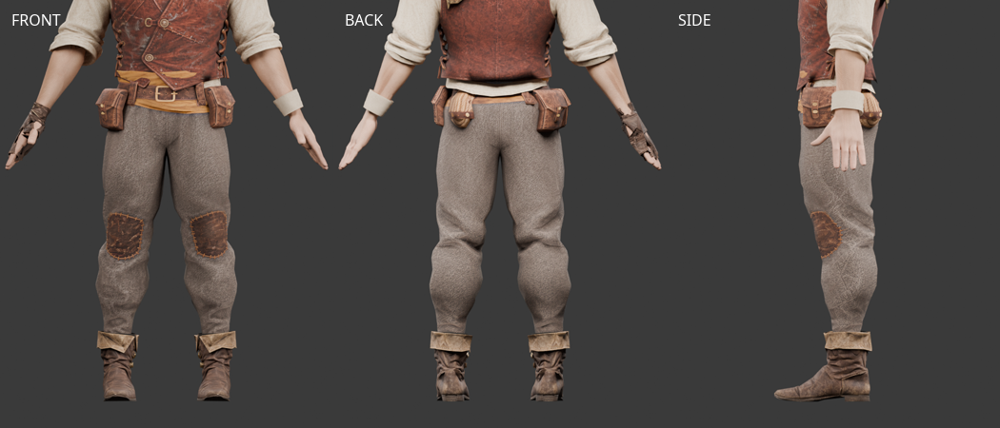
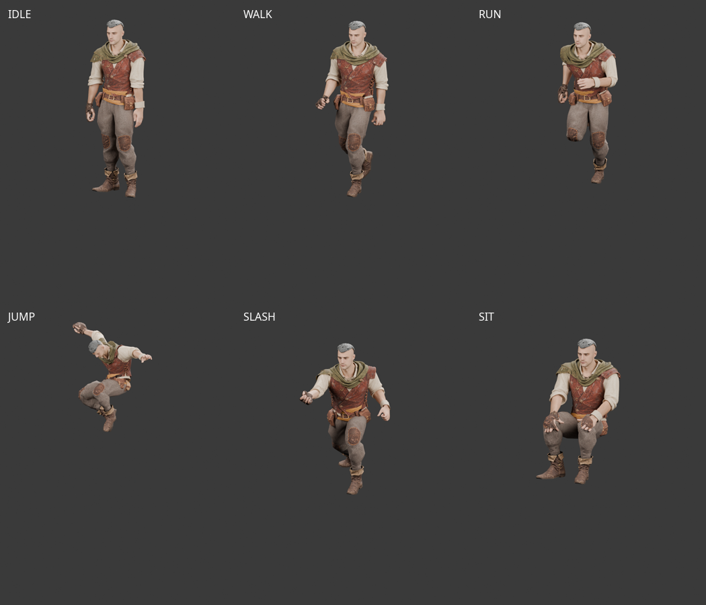

# 로그 울 바지 — Tripo Smart Mesh 피팅 v1

2026-10-01 사용자가 Tripo Studio **Smart Mesh**로 생성해 전달한 바지를 현재 남성
모듈형 몸체에 피팅하고 기존 65본에 연결했다. 2026-10-02 제작용 미리보기의
`?outfit=rogue`에 연결했고 사용자가 같은 날 외형을 승인했다.
기본 로그 하의로 사용하며 기존 Tripo 상의와 v8 장갑·부츠를 함께 사용한다.
실제 게임·혼합 장비 호환 검수는 남아 있다.



## 파일과 재현

- 원본: `assets/modular_human_male_01/parts/rogue_tripo_pants_v1/source.glb`.
- 피팅·리깅: `assets/modular_human_male_01/parts/rogue_tripo_pants_v1/pants_rogue.glb`.
- 편집본: `assets/modular_human_male_01/parts/rogue_tripo_pants_v1/tripo-pants-fitting.blend`.
- 기준 몸체: `assets/modular_human_male_01/parts/fitted/base.glb`, `human_male_01_mixamo_candidate_v2`.
- 연결부: 현재 몸체에서 추출한 `interfaces/v1`; 이전 종아리 축소를 중복 적용하지 않았다.
- [생성 출처·원화·원본·기준 몸체 해시](modular-rogue-tripo-pants-sources.json).
- [원본 메시 검사](modular-rogue-tripo-pants-source-review.json), [피팅·리깅 검사](modular-rogue-tripo-pants-fitting-v1.json).
- [게임 클립 동작·발목 검사](modular-rogue-tripo-pants-animation-v1.json), [편집본·검수 이미지 해시](modular-rogue-tripo-pants-review-v1.json).
- [브라우저 표시·착탈·삼각형 측정](modular-rogue-tripo-pants-preview-v1.json).

```bash
.venv/bin/python tools/fit-tripo-pants.py
node tools/validate-tripo-rogue.mjs --directory assets/modular_human_male_01/parts/rogue_tripo_pants_v1 --part pants_rogue --report doc/assets/modular-rogue-tripo-pants-animation-v1.json --boots assets/modular_human_male_01/parts/rogue_fitted_v8/boots_rogue.glb --fitting doc/assets/modular-rogue-tripo-pants-fitting-v1.json
blender -b -t 6 --python-exit-code 1 --python tools/blender-scripts/review_tripo_pants.py
```

몸체·원본·연결부 해시가 달라지면 피팅을 중단한다. 원본은 보존하고 이 후보 폴더에만 출력한다.
편집본에는 현재 조합, 수정하지 않은 몸체·바지 원본과 연결 곡선을 보관한다.
**[미사용]** 교체된 v8 하의 GLB와 이전 전체 조합 편집본은 삭제했다.
**[미사용]** 이전 Meshy 하의 원본은 출처와 비교 참조로만 보존한다.
원본 출처와 이전 측정 이력은 유지하며 v2 원화는 수정 입력의 출처로 보존한다.
전체 검사 행렬 `validation-poses.json`은 위 동작 검사 명령으로 재생성할 수 있어 정리했다.
편집본에 필요한 `animation-snapshots.json`과 최종 검수 이미지는 보존한다.
프레임 1은 기준 자세, 10–70은 실제 게임 클립에서 추출한 7가지 자세다.
연속 애니메이션이 아니라 검수용 정지 자세다.

## 보정과 검사

- 원본은 2,066 triangles, 정점 2,351개와 내장 2048×2048 JPEG 텍스처다. 자동 리깅은 없다.
- 허리 20면과 발목 24면이 막힌 마개로 생성돼 그 면만 제거했다. 최종 바지는 **2,022 triangles**다.
  데시메이션은 하지 않았다. 남은 정점의 UV와 내장 텍스처 바이트는 원본과 동일하다.
- 무릎 높이를 현재 몸체에 맞추고 실제 허리 단면과 발목 윤곽으로 피팅했다.
  주머니·벨트 고리·로프는 골반을 따라 움직이며 몸체의 본 계층·기준 변환·inverse bind matrix를 유지한다.
- 처음 사타구니의 최근접 피부 전사는 중앙에서 좌우 가중치가 급격히 바뀌었다.
  중앙의 연속 골반·양쪽 허벅지 가중치를 적용해 공격의 최대 모서리 늘어남을 약 5.0배에서 2.8배로 줄였다.
  일부 짧은 모서리와 무릎 주변은 큰 동작에서 여전히 변형되며 최신 수치를 동작 JSON에 기록한다.
- 정점만 검사한 첫 피팅에서 넓은 면의 피부 관통이 보였다. 삼각형 중심·모서리 중점도 검사해 추가 보정했다.
  발목은 기존 부츠 안쪽을 따라야 하므로 Y≤0.30m 연결부를 고정하고 Y≥0.36m의 면 여유를 별도로 검사한다.
  정점·일부 면 표본의 거리 검사는 모든 면의 무관통 판정이 아니다.
- 실제 `bindModularPart`로 기존 골격에 연결하고 대기·걷기·달리기·점프·공격·전투 대기·앉기
  각 13개, 총 91개 자세를 검사했다. 좌표는 유한하며 같은 위치의 UV 이음 정점은 벌어지지 않았다.
- 현재 부츠와의 발목 겹침은 각 발목 7개 단면 × 144방향에서 기준 자세와 91자세를 검사한다.
  검증기는 빠진 방향이 없고 바지 바깥과 부츠 안쪽 사이에 최소 2mm가 있는지 확인한다.
  이 단면 범위의 합격이며 부츠 전체 또는 다른 부츠의 호환을 뜻하지 않는다.



## 가림·범위·예산

제작 미리보기는 기존 로그 하의의 `legs`, `ankles`, `boot_ankles` 가림을 사용한다.
원본 몸체를 자르거나 수정하지 않는다. 브라우저에서 바지를 해제하면 피부가 복원되고 다시 장착하면 새 바지가 표시된다.
피부를 켠 [별도 검수 화면](../images/characters/modular_human_male_01/parts/rogue/tripo-pants-v1-skin.png)도 보관한다.
면 여유 보정 후 앞쪽 관통은 사라졌지만 부츠 바로 위 뒤쪽의 좁은 전환 구간에는 피부 관통이 일부 남는다.
현재 미리보기에서는 하의 피부를 가린다. 이 구간의 추가 보정과 다른 신발 조합 검수는 남은 작업이다.
가림 적용과 피팅 표본 검사를 전체 피부·의상 충돌 합격으로 대신하지 않는다.

현재 몸체 13,891 + crop 헤어 933 + Tripo 상의 4,877 + 바지 2,022 + 장갑 1,157 + 부츠 896
+ 검 302 = 숨김 포함 **24,078 triangles**다. `showPreviewOutfit`의 피부 절단 후에는
조합 **22,376**, 실제 표시 **16,246 triangles**이며 얼굴 **1,505 triangles**를 유지한다.
15,000–20,000 전체 조합 목표보다 숨김 포함 수가 높다. 수치를 맞추기 위한 데시메이션은 하지 않았다.

현재 상의·부츠 조합의 기준 자세와 7종 동작을 시각 검사했으며 Chrome 제작용 미리보기에서
대기·앉기와 바지 착탈을 확인했다. 다른 상의·신발, 맨발용 밑단, 실제 게임 등록·플레이 검수는 별도다.
현재 조합의 외형은 사용자 승인을 받았다. 다른 장비와의 허리 겹침은 별도 검수 범위다.

## 출처

Tripo Studio 구독은 사용자가 보고한 약 월 20달러다. 원본의 Tripo 출력물 이용 조건을 따른다.
사용자가 **Smart Mesh** 생성을 확인했으며 작업 ID·세부 모델 버전·실제 제출 프롬프트·제출 이미지는 미확정이다.
v3 앞뒤 원화는 제작 참조로 기록했으며 OpenAI Codex ImageGen, **ChatGPT Pro 20x**, 2026-10-01 생성물이다.
피팅·검사는 로컬 프로젝트 Python, Three.js, Blender 5.2.0 LTS와 Chrome을 사용했다.
새 AI 생성이나 유료 호출 없이 원본을 피팅했다. 검수 이미지는 로컬 렌더·브라우저 캡처이며 기존 자산의 이용 조건을 따른다.

## 게임용 로그 바지 전송량 최적화 — 2026-10-03

`pants_rogue.b7502d74.glb`의 색상 2048×2048 JPEG를 512×512 JPEG q90·4:4:4로
축소하고, 메시에는 정점 속성의 양자화·재배치 없이 `EXT_meshopt_compression`을
적용했다. 현재 로그 부츠와 착용한 앞·뒤 렌더에서 허리 벨트·주머니·무릎 패치·
옷 주름·발목 이음을 비교했다. 형상과 장식은 유지되며, 확대에서는 옷감의
미세한 질감이 조금 부드러워진다.
2,022 triangles, 재질 1개, 정점 속성 5개, UV·스킨 가중치·65본 순서·역바인드
행렬·장비 메타데이터를 유지한다. 삼각형 인덱스는 시작 꼭짓점만 순환하며
형상과 방향은 같다. 선택 명세의 제작용 GLB와 Blender·이미지 원본 및 위
Tripo 출처·라이선스를 보존하며, 추가 AI 생성이나 유료 호출은 없다.

파일은 **2,169,748 → 193,816바이트(91.1% 감소)**, gzip level 6 전송량은
**2,063,036 → 174,589바이트(91.5% 감소)**다. 빌드 시 생성되는 새 파일명은
`pants_rogue.216c57ce.glb`다. 게임 manifest에 출력 SHA-256을 갱신했다.

Khronos glTF Validator 오류·경고 0이며, meshopt 미지원 안내 1개가 있다.
별도 디코딩 비교로 정점 속성·면 방향·스킨 데이터·재질 설정을 확인했다.
게임 로더의 브라우저 이미지 디코딩·렌더링·페이지 오류 0,
51동작·255자세에서 정점 위치 차이 0을 확인했다. 모듈형 캐릭터 관련
테스트 29개가 통과했고, 제작용 원본 재생성 출력의 SHA-256도 일치했다.

```sh
node tools/prepare-modular-character.mjs --part pants_rogue
```

## 순찰자 부츠 조합 — 2026-10-07

순찰자 부츠와 함께 입을 때만 실제 입구 곡선에 맞춰 바짓단을 절단하고 안쪽으로 넣는다.
기존 상의에 따른 허리 절단과 함께 적용하며, 부츠 제거·로딩 실패 시 바지 아래쪽은 원본으로 복원한다.
원본 에셋은 유지한다. [혼합 조합 검사·출처·파생 검토본](modular-ranger-tripo-boots.md#로그-바지--순찰자-부츠)을 참고한다.
