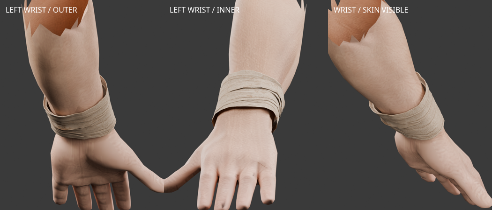
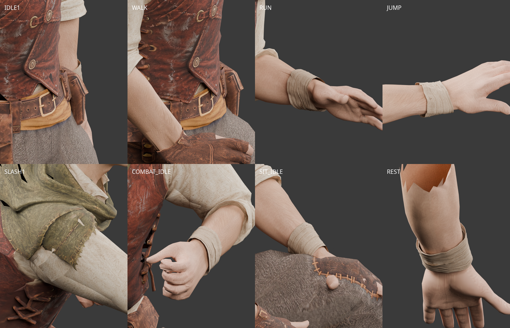

# 로그 왼손목 천 — Tripo Smart Mesh

2026-10-02. 사용자가 전달한 `cloth+wrapped+tube+3d+model.glb`를 기존 왼손목 띠와 교체했다.
Smart Mesh 옵션은 사용자가 확인했다. 구독은 기존 사용자 기록의 약 USD 20/월이며,
출처·라이선스는 원본 Tripo Studio 출력 조건을 따른다. 실제 생성 시각·작업 ID·제출 입력은 미확정이다.

- [출처와 원본 해시](modular-rogue-tripo-wrap-sources.json)
- [원본 검수](modular-rogue-tripo-wrap-source-review.json)
- [피팅·리깅](modular-rogue-tripo-wrap-fitting-v1.json)
- [동작 검사](modular-rogue-tripo-wrap-animation-v1.json), [피부 덮임 검사](modular-rogue-tripo-wrap-coverage-v1.json)
- [브라우저 검사](modular-rogue-tripo-wrap-browser-v1.json), [편집본·렌더](modular-rogue-tripo-wrap-review-v1.json)



원본은 2,011삼각형, 리그 없는 메시와 2,048² JPEG다. 막힌 내부 끝을 열고 불규칙한
아래 테두리를 정리해 손목이 통과하는 두 입구를 만들었다. 실제 공통 몸체의 왼손목·팔뚝
32단면에 맞추고 원본 천의 겹침·UV·텍스처를 보존했다. 팔뚝·손·엄지 뿌리의 실제 가중치를
전사하며 공통 65본 계층·기준 자세·inverse bind를 그대로 사용한다. 몸체는 수정하지 않았다.

엄지 뿌리의 영향을 제외한 초기 전사는 걷기·달리기에서 25개 피부 검사점을 노출시켰다.
해당 가중치를 포함한 보정 후, 천 아래 피부 13삼각형의 내부 3점씩을 91자세에서 검사해
3,549개 점 모두 천에 덮이는 것을 확인했다. 이 검사는 손목 천 내부 영역에 한정된다.
7동작 × 13자세에서 정점과 UV 경계가 정상이며, 최대 짧은 변 늘어남은 약 2.69배다.
전체 게임과 다른 장비 조합의 호환 검수는 별도다.

왼손목 천은 1,904삼각형이다. 승인된 오른손 장갑 1,591삼각형의 정점·인덱스·UV·가중치·재질·
텍스처 바이트를 그대로 복사해 통합 손 파츠 3,495삼각형으로 내보냈다. 수를 맞추기 위한 데시메이션은 없다.
작업실은 [선택 명세](modular-rogue-source-selection.json)의 새 통합 GLB를 읽는다.

`assets/modular_human_male_01/parts/rogue_tripo_wrap_v1/`에 무수정 `source.glb`,
왼손 단독 `wrap_rogue_left.glb`, 최종 통합 `gloves_rogue.glb`, 표본 자세 파일과
원본·현재 몸체·착용 파츠·검사 자세를 포함한 `tripo-wrap-fitting.blend`를 보관한다.
**[미사용]** 이전 v8 왼손 천과 합친 중간 GLB와 중복 장갑 편집본은 삭제했다.
기존 v8 파일은 부츠와 재현 입력의 출처로 보존한다.

```bash
.venv/bin/python tools/fit-tripo-wrap.py
node tools/validate-tripo-rogue.mjs --directory assets/modular_human_male_01/parts/rogue_tripo_wrap_v1 --part wrap_rogue_left --report doc/assets/modular-rogue-tripo-wrap-animation-v1.json
.venv/bin/python tools/validate-tripo-glove-coverage.py --part wrap
blender -b --python-exit-code 1 --python tools/blender-scripts/review_tripo_glove.py -- --part wrap
```



이미지는 실제 메시를 Blender 5.2.0 LTS에서 렌더했다. 새 AI 생성이나 유료 생성 호출은 없다.
브라우저에서 7동작 전환·탈착·세트 교체·재연결을 확인했고 페이지 오류는 없었다.
