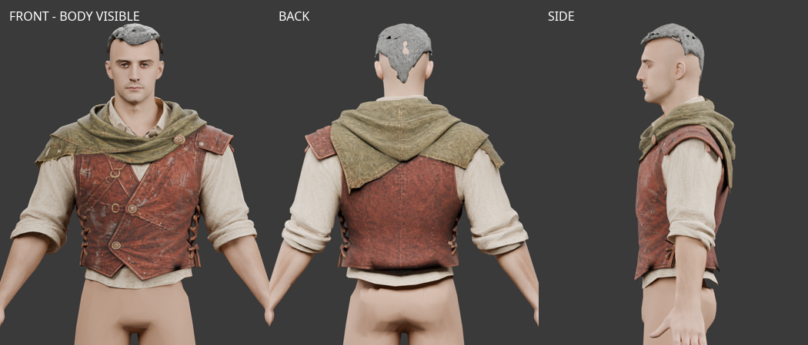
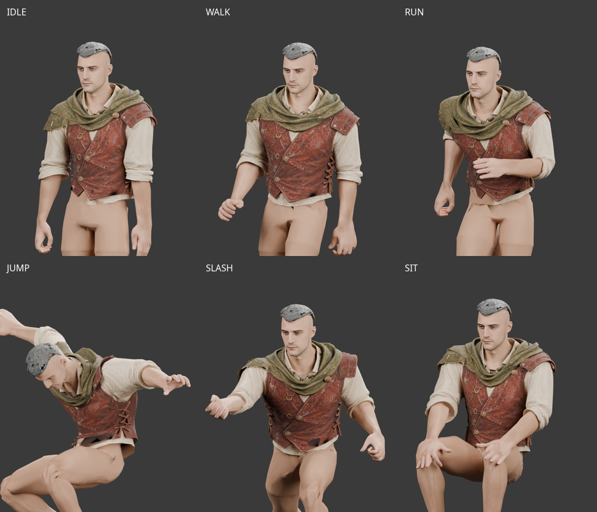

# 기본 Rogue 상의 — Tripo 피팅·리깅 v1

2026-10-01. 사용자가 Tripo Studio에서 생성해 전달한 상의를 현재 남성 모듈형
몸체에 피팅하고 기존 65본에 연결했다. 후속 사용자 검수 후 기본 로그 상의로 승인했다.
`modular-rogue-source-selection.json`이 이 파일을 기본 상의로 선택하며 이전 v7/v8
상의 GLB는 삭제했다. 원화·생성 출처와 과거 검수 기록은 이력으로 남긴다.



## 파일과 재현

개발 서버의 `/modular-character-preview.html?outfit=tripo`에서 남성 베이스에 상의만
입힌 상태로 시작한다. 일반 로그 장비 선택과 `?outfit=rogue`에서도 같은 상의를 사용한다.
바지·장갑·부츠는 기존 v8 파츠를 유지한다.
2026-10-01 허리 가림 보정: 웹 미리보기에서는 몸통 전체를 숨기지 않고 Y≤1.14m의
기존 하단 몸통 피부를 표시해 앉을 때 밑단 안쪽이 비는 부분을 메웠다.
이 가림 보정은 기준 몸체 GLB를 변경하지 않는다. 최신 Blender 검수본에도 같은
허리 피부 범위를 적용했다.

같은 날 판금 상의 `fitted/top_plate.glb`의 수평 단면을 참조해 로그 상의의
하단 몸통을 좁혔다. 판금 윤곽과 몸체의 여유를 함께 사용하고 가슴으로 갈수록
보정을 없애 주름을 유지했다. Y=1.10m의 몸통 폭은 약 39.1→34.6cm,
Y=1.14m에서는 약 37.0→34.3cm다. 기준 자세의 몸통 단면 기준이며 소매는 제외한다.
Y≥1.36m의 가슴·어깨와 바깥 소매 정점은 그대로이며 모든 정점의 높이,
UV·텍스처·본·가중치를 유지했다. 웹 미리보기의 앉은 자세 앞·뒤에서도 확인했다.
수정 전 후보·개별 렌더는 기본 상의 승인 후 정리했다. 최종본과 비교 수치는 보존한다.

후속 가죽 강성 보정에서는 형상·UV·텍스처를 고정하고 몸통 가중치를 수정했다.
기존 몸통은 피부처럼 여러 척추 본을 따라 휘고 팔 영향도 섞여 있었다.
가죽 중앙은 공통 Spine1 가중치를 중심으로 움직이게 하고, 천 소매·겨드랑이·
밑단으로 갈수록 기존 가중치를 유지한다. 연결부는 메시 모서리 길이를 고려해
가중치를 보간했다. 바깥 소매, 옷깃과 Y≤1.12m 밑단의
가중치는 동일하다. 강성 수정 전 후보는 승인 후 삭제하고 비교 측정값을 남겼다.
[가죽 중앙 모서리 길이 변화 검사](modular-rogue-tripo-stiffness-v1.json)에서
13자세 전체의 절대 변형률 95백분위가 대기 21.3→5.2%, 걷기 12.7→3.0%,
전투 대기 34.2→6.9%로 줄었다. 이는 중앙 가죽만의 수치이며 전체 의상의
관통·충돌 검사를 대신하지 않는다.

오른쪽 암홀의 원본 비대칭은 앞쪽 가죽 경계 주변 메시만 바깥으로 최대 5mm
이동해 완화했다. 높이·깊이·UV·텍스처·본 가중치와 나머지 정점은 유지한다.
특정 애니메이션을 바꾸지 않고 이 상의의 기본 형상만 국소 보정했다.
7종 동작의 91자세에서도 수정 전후 정점 이동이 5mm 이내인지 검사했다.
수정 전 후보는 승인 후 삭제했다. 강성 비교 보고서의 과거 입력 해시는 이력이다.

전투 대기에서 옆 가죽 끈이 몸통에서 떨어져 보이는 현상은 끈에 남아 있던
팔 가중치 차이 때문에 발생했다. 가죽 끈과 부착부에 가까운 베스트 면의
가중치를 전사하고 연결부를 보간했다. 메시 위치·노멀·UV·텍스처는 수정 전과 같다.
[끈 변형 비교](modular-rogue-tripo-laces-v1.json)에서 중앙 끈과 베스트 참조점 사이의
기준 자세 대비 추가 간격 95백분위는 전투 대기 29.4→5.5mm로 감소했다.
걷기·달리기·점프·공격·앉기에서도 감소했으며, 일반 대기는 0.21mm 증가했다.
이는 선택한 끈 정점의 상대 변위 검사이며 전체 의상의 무관통 판정은 아니다.
수정 전 후보는 승인 후 삭제하고 끈 변형 비교 수치를 보존했다.

- 원본: `assets/modular_human_male_01/parts/rogue_tripo_v1/source.glb`.
- 피팅·리깅 상의: `assets/modular_human_male_01/parts/rogue_tripo_v1/top_rogue.glb`.
- 편집본: `assets/modular_human_male_01/parts/rogue_tripo_v1/tripo-fitting.blend`.
- 기준 몸체: `assets/modular_human_male_01/parts/fitted/base.glb`, `human_male_01_mixamo_candidate_v2`.
- [원본·기준 몸체·원화 해시와 출처](modular-rogue-tripo-sources.json).
- [피팅·리깅 검사](modular-rogue-tripo-fitting-v1.json), [동작 검사](modular-rogue-tripo-animation-v1.json), [편집본·이미지 해시](modular-rogue-tripo-review-v1.json).

```bash
.venv/bin/python tools/fit-tripo-rogue.py
node tools/validate-tripo-rogue.mjs
blender -b -t 6 --python-exit-code 1 --python tools/blender-scripts/review_tripo_rogue.py
```

원본과 기준 몸체의 해시가 달라지면 재생성을 중단한다. 출력은 이 후보 폴더만 사용한다.
Blender 편집본에는 피팅 상의, 검수용 몸체·헤어, 원본 상의와 수정하지 않은 기준 몸체,
연결 테두리가 들어 있다. 원본 참조와 테두리 컬렉션은 숨겨져 있다.
프레임 1은 기준 자세이고 10/20/30/40/50/60/70은 대기/걷기/달리기/점프/공격/전투 대기/앉기다.
이 프레임들은 실제 게임 클립에서 추출한 정지 자세이며 연속 애니메이션은 아니다.

## 피팅과 검증

- 어깨·목·허리·소매를 기준 체형에 정렬한 뒤, 실제 몸체 표면으로부터의 여유를
  메시 연결 관계를 따라 부드럽게 보정했다. 전체 바운딩 박스 스케일만으로 마감하지 않았다.
- Tripo 원본의 4,877 triangles, UV, 내장 2048×2048 JPEG 텍스처를 유지했다.
  출력의 UV와 텍스처 바이트가 원본과 같은지 재생성 시 확인한다.
- 팔의 피부 가중치를 표면에서 전사하고, 소매 끝의 팔 가중치를 유지하며 모서리 길이를
  고려해 보간했다. 몸통은 인접 척추 본 전사를 출발점으로 가죽 공통 가중치를 적용한다.
  정점당 최대 4본이며 반대 팔의 영향은 중심선에서 연속적으로 없앤다.
- 본 계층·기준 변환·inverse bind matrix가 기준 몸체와 일치한다.
  게임의 `bindModularPart`와 실제 동작 클립으로 7종 × 13자세를 검사했다.
  좌표는 유한하며 같은 위치의 UV 분할 정점은 동작 중에도 벌어지지 않았다.
- 기준 자세 이미지는 가려진 몸통과 팔 피부도 켠 상태로 렌더했다.
  동작 이미지와 편집본은 몸통의 Y≤1.14m 피부만 남기고 상완을 숨긴다. 목 피부는 Y≥1.54m,
  |X|≤0.075m로 제한한다. 이는 검수 장면의 가림이며 기준 몸체 GLB는 바꾸지 않았다.



첫 가중치 전사는 겨드랑이의 짧은 모서리에 급격한 본 영향 차이를 만들어 점프에서
최대 약 18.3배 늘어났다. 거리 기반 보간, 소매 끝 가중치 유지, 연속 척추 본 선택과
중심선 보정을 적용했다. 최종 실측값은 동작 검사 JSON에 보존한다.

## 범위와 남은 검수

기본 로그 상의로 사용자 승인을 받았으며 전체 게임 및 다른 장비와의 호환 검수는 별도다.
큰 팔 동작에서 겨드랑이와 가중치 전환부 일부 모서리는 여전히 늘어난다.
최대값과 99백분위는 최신 동작 검사 JSON에 기록한다. 원본에는 옷깃·소매의
안쪽 면과 작은 개방 경계가 남아 있으므로 닫힌 의상 메시 또는 관통 없는 메시로 판정하지 않는다.
몸체와의 부호 있는 거리 검사는 이 내부 면도 포함하며 전체 관통 검사의 대체물이 아니다.
기존 로그 바지와의 허리 겹침, 긴 장갑·투구 조합, 실시간 게임의 가림은 후속 검수 범위다.

현재 몸체 13,891 + crop 헤어 933 + 상의 4,877 = **19,701 triangles**다.
기존 로그 나머지 장비와 검까지 함께 계산하면 숨김 포함 **23,458 triangles**이며,
얼굴은 기존 **1,505 triangles**를 유지한다. 숨김 적용 후 표시 수는 장비 조합에 따라 달라진다.
기본 로그 세트·crop 헤어·검의 웹 미리보기에서는 피부 절단 후 조합 **21,756**,
표시 **15,626 triangles**를 확인했다. 바지 허리띠와 상의의 겹침을 포함한 혼합 조합 검수는 남아 있다.
숫자만 맞추는 데시메이션은 하지 않았다.

## 출처

사용자가 약 월 20달러의 Tripo Studio 구독으로 생성해 2026-10-01 전달했다.
원본에 적용되는 Tripo Studio 출력물 이용 조건을 따르며 작업 ID·모델 버전·생성 프롬프트와
실제 제출 이미지는 확인되지 않았다. 앞·뒤 원화는 비교 참조로만 기록했다.
피팅과 검수는 로컬 Python, Three.js, Blender 5.2.0 LTS 작업이며 새 AI 생성·유료 호출은 없다.
기준 몸체와 원화의 출처·이용 조건은 기존 제작 기록을 따른다.
