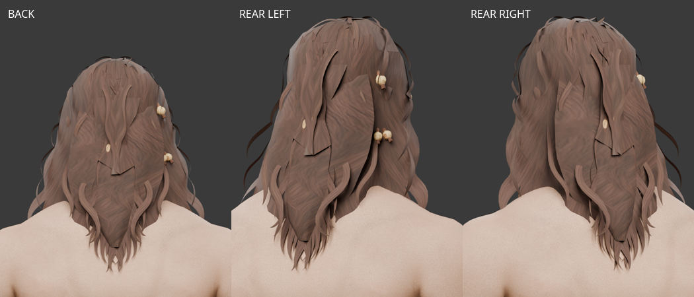
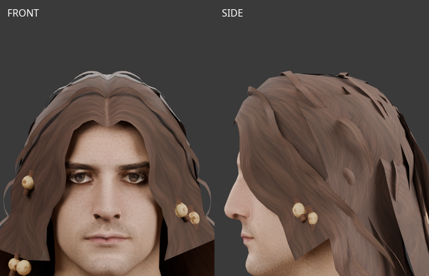
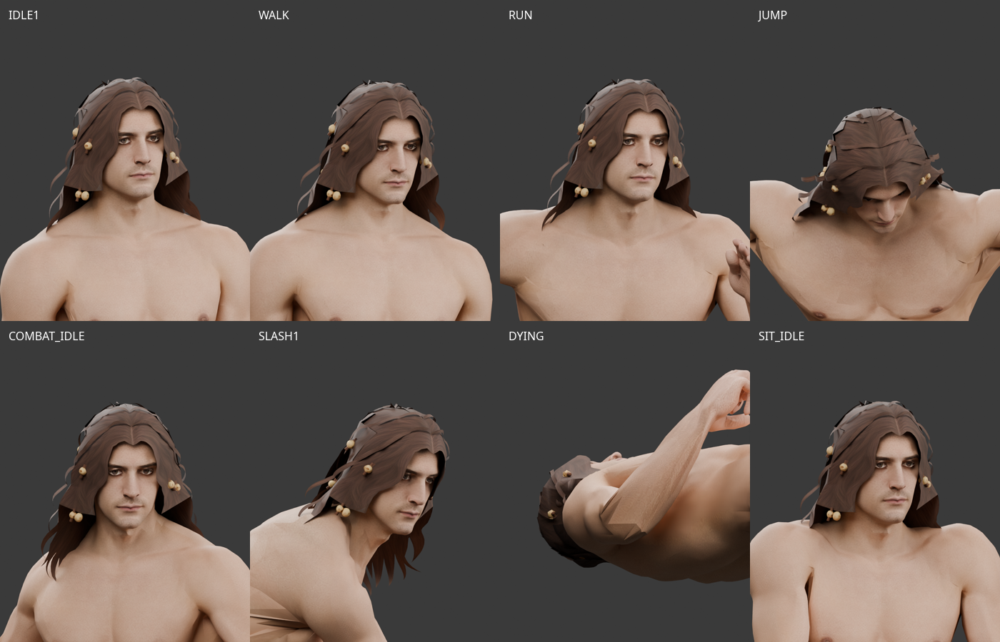
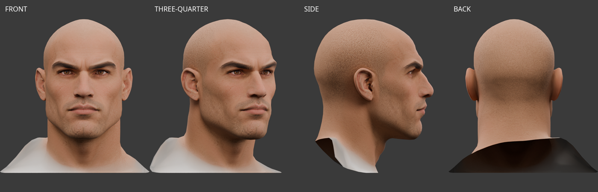
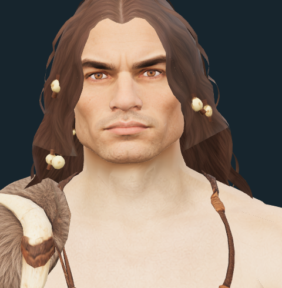
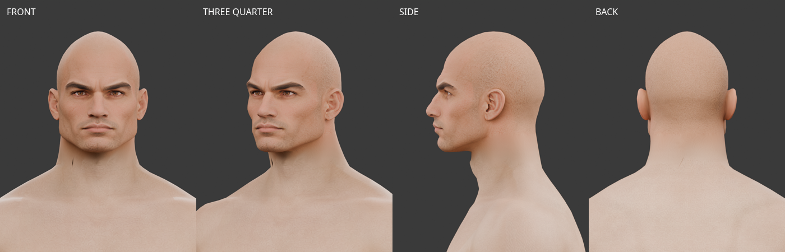
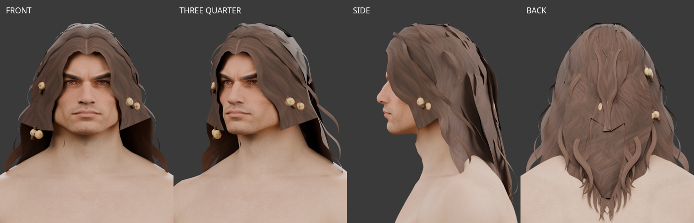
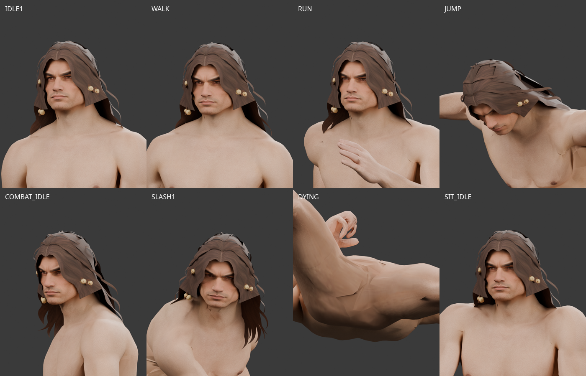

# 원시전사 원화 기반 공용 얼굴·헤어

2026-10-04 제작. 남성 캐릭터의 독립 얼굴·헤어 제작용 원화와 헤어 피팅 후보다.
[원시전사 전체 원화 v2](modular-caveman-concept.md)의 얼굴과 웨이브 장발을 참고했다.
클래스 전용 장비와 분리해 다른 남성 캐릭터에서도 조합할 수 있도록 설계한다.
세 번째 Tripo 헤어를 공통 남성 몸체에 피팅·리깅해 제작 미리보기에 연결했다.
새 얼굴도 공통 몸체에 피팅·리깅한 제작 후보로 연결했다. 얼굴·헤어의 게임 외모 카탈로그 등록은 후속 작업이다.

## 제작용 이미지

| 파트 | 기준 시점 | 보조 시점 |
| --- | --- | --- |
| 웨이브 장발·뼈 장식 v2 | [정면](../images/characters/modular_human_male_01/customization/hair_wavy_bone-front-v2.png) | [후면](../images/characters/modular_human_male_01/customization/hair_wavy_bone-back-v2.png) |
| 각진 남성 얼굴 | [정면](../images/characters/modular_human_male_01/customization/face_rugged-front-v1.png) | [측면 v2](../images/characters/modular_human_male_01/customization/face_rugged-side-v2.png) |

각 파일은 한 파트의 한 시점만 담는다. 헤어 v2는 투명 배경, 얼굴은 기존 흰 배경이다.
**[미사용 — 헤어 v2로 대체]** 이전 헤어 앞뒤 v1과 중복 이미지 ZIP은 사용자 요청으로 삭제했다.
원화의 프롬프트·참조·해시는 출처 기록에 보존했다.

- 헤어: 원화의 어깨 길이 웨이브·가르마·작은 뼈 장식을 유지했다. 얼굴·피부·수염·몸체는 제외했다.
  정면의 얼굴 공간은 비어 있고 후면은 머리카락으로 덮인다.
- 얼굴: 두상·귀·짧은 목을 포함하며 머리카락·긴 수염·붉은 얼굴 문양·장비를 제외했다.
  눈썹·눈·각진 턱선·광대·코를 유지했다. 피부에는 옅은 면도 흔적이 남아 있다.
- 수염 없는 얼굴은 별도 답변이 없는 상태에서 채택한 초기 제작안이며 사용자 최종 승인은 아니다.
- 측면 v1은 약한 사선 시점이어서 측면 v2로 보정했다. 미채택 이미지는 프로젝트 묶음에 포함하지 않는다.

## 3D 제작과 적용

### 헤어 재생성 원화 v2

2026-10-04 사용자 전달 `Y:\public\web_downloads\hair+with+beads+3d+model.glb`를 검토했다.
현재 환경의 `/mnt/y/web_downloads/`에서 확인했으며 원본은 변경하지 않았다.
2,191 triangles, 메시·재질 각 1개, 2048² JPEG 색상맵, 리그 없음이다.
렌더에서 머리카락의 회백색 영역과 옆·끝부분의 얇고 들뜬 형상을 확인했다.
진단용 용접 후 열린 모서리 953개·연결 성분 19개가 있으나,
헤어의 열린 면과 장식도 포함하므로 모두 손상이라고 해석하지 않는다.
흰 배경 혼입은 가능한 원인이며 생성 과정의 원인으로 확정하지 않았다.

사용자 요청으로 ImageGen에서 정면·후면을 다시 그렸다.
실제 alpha 투명 배경을 사용하고 잔머리를 줄여 굵고 이어지는 웨이브로 정리했다.
큰 얼굴 입구는 유지하며, 작은 틈과 끝의 가는 갈래는 줄였다.
장식은 정면 기준 5개이며 후면의 좌우 위치를 뒤집었다. 후면 v1의 추가 장식 1개는 제외했다.
재생성 목표는 1,500 quads(약 3,000 triangles)다. 단위와 실제 출력 합계를 다시 확인한다.
투명화·원화 보정은 다음 생성 입력 개선이며, 원화만으로 3D 형상·텍스처 품질을 보장하지 않는다.
[v2 실제 프롬프트·참조·해시·alpha 검증](modular-wavy-hair-v2-sources.json).

같은 날 두 번째 사용자 파일 `Y:\public\web_downloads\hair with beads 3d model.glb`를 확인했다.
2,191 triangles와 열린 모서리·연결 성분은 첫 파일과 같았다.
UV 이음 정점 수는 2,857에서 2,865로 바뀌었으나 정점 위치 최대 차이는 약 9.54e-8이고,
위치 대응 후 삼각형 연결도 같아 1e-6 허용오차 내에서 동일한 형상이다.
텍스처·재질·내보내기 변경은 있으나 원화 v2로 새 형상을 생성한 결과로 확인되지는 않는다.
Studio에서 수행한 작업과 실제 입력 이미지는 미확인이다. 새 모델 피팅은 진행하지 않았다.

세 번째 사용자 파일 `Y:\public\web_downloads\brown wavy hair 3d model.glb`는 새 형상이다.
2,054 triangles, 정점 2,479개, 2048² JPEG 색상맵과 재질 각 1개, 리그 없음이다.
조명을 제외한 색상 렌더에서는 회백색 혼입이 크게 줄었다. 조명 렌더의 강한 흰빛에는
roughness 0.5와 specular 재질 효과도 포함되므로 모두 텍스처 오염으로 해석하지 않는다.
다만 후면 중앙 하단에 큰 빈 영역이 남아 제공한 후면 원화의 연속 머리카락과 다르며,
옆의 얇은 갈래와 들뜬 층도 남는다. 피부가 드러날 가능성은 실제 두상 피팅에서 확인해야 한다.
진단용 용접 후 열린 모서리 1,016개·연결 성분 15개이며 모두 손상이라는 뜻은 아니다.
이 검수 이후 사용자 요청으로 아래 피팅·보완·리깅 후보를 제작했다.

### 웨이브 장발 피팅·리깅 v1

사용자의 세 번째 파일은 수정하지 않고 `parts/hair_tripo_wavy_v1/source.glb`에 그대로 보관했다.
공통 몸체 `parts/fitted/base.glb`의 실제 머리 표면을 기준으로 크기·가르마·얼굴 입구를 맞췄다.
가닥 정점과 삼각형 중심의 두피 관통을 보정하고 작은 뼈 장식은 형태를 유지하며 배치했다.
원본의 각진 가닥 끝과 일부 들뜬 층은 남아 있다.

원본은 **2,054 triangles**이며, 후면 빈 영역에 원본 옆머리 표면을 재사용한 **573 triangles**를
덧댔다. 정수리·뒤통수에는 공통 두피에서 3mm 띄운 **562 triangles**의 갈색 안쪽 면을 추가해
작은 틈으로 피부가 드러나는 것을 줄였다. 앞이마에 안쪽 면의 경계가 보이는 초기 후보는
앞쪽 면을 줄여 보정했다. 이때 헤어는 3,189 triangles였으나 아래 후면 보완으로 대체했다.
새로 만든 뒤머리의 겹치는 경계는 가까이서 일부 각져 보인다. 평평한 UV 패치와 가는 후면 띠는
가닥 방향이 어색해 채택하지 않았으며, 현재 후보는 원본 옆머리 표면을 사용한다.

사용자가 뒷머리의 가닥 사이로 피부가 보이는 틈을 지적해 **후면 보완 v2**를 적용했다.
기존 가닥 안쪽에 폭이 변하는 연속 곡면 **432 triangles**를 추가했다. 목덜미에서 뒤통수까지
이어지며 끝을 좁히고 얕은 웨이브 굴곡을 넣었다. 원본 갈색 가닥 텍스처의 장식 없는 영역을
사용했고 새 이미지나 유료 생성은 없다. 최종 헤어는 **3,621 triangles**다.
정후면과 좌우 사선 후면에서 피부가 비치던 안쪽 틈이 가려지는 것을 확인했다.
실제 브라우저의 후면 확대와 8개 동작·200개 자세에서도 확인했다.
이전 3,189 triangles 후보는 **[미사용]**이며 사용자 요청으로 삭제했다. 해시는 피팅 기록에 남겼다.

사용자가 측면에서 앞머리와 이마의 큰 간격을 지적해 **앞머리 피팅 v3**를 적용했다.
이마 앞쪽의 205개 UV 분리 정점에 위치별 완만한 감쇠를 적용해 두상 쪽으로 당겼다.
조정 정점의 두상 표면까지 거리 중앙값은 약 30.3mm에서 20.3mm로 줄었으며,
최대 이동은 18mm다. 가르마와 정수리로 갈수록 이동을 줄여 웨이브 볼륨을 유지했다.
9mm의 목표 여유를 기준으로 이동량을 제한했으며 실제 모든 정점이 9mm에 놓인다는 뜻은 아니다.
앞머리 변경 후 얼굴 확대·측면과 실제 8개 동작·200개 자세를 다시 확인했다.
변경 영역 233개 삼각형 중심의 두상 밖 간격은 최소 약 6.9mm였고 브라우저 예외는 없었다.
후면 보완의 정점과 삼각형 수는 같으며 총 **3,621 triangles**다.
이전 후면 보완 후보의 느슨한 앞머리는 **[미사용]**이며 사용자 요청으로 삭제했다.

원본 정점의 UV와 2048² JPEG 바이트를 그대로 유지했다. 새 뒤머리는 공여 가닥의 UV를 쓰고,
안쪽 면은 원본 색상맵의 작은 갈색 영역을 사용한다. 재질은 양면 표시·roughness 0.85로 바꾸고
specular 확장을 제거해 강한 흰 반사를 줄였다. 뼈 장식도 같은 재질이므로 새 헤어 선택 시
미리보기의 머리색 변경 입력을 비활성화했다.

공통 리그 `human_male_01_mixamo_candidate_v2`의 65개 본 계층·rest 변환·inverse bind를
그대로 복사했다. 모든 정점은 **Head 100%**이며 머리를 따라 움직인다. 별도 머리카락 흔들림은 없다.
실제 대기·걷기·달리기·점프·전투 대기·공격·사망·앉기 클립을 각각 25회, **200개 자세**로 검사했다.
Head 연결 오차는 최대 약 1.2e-15m, 모서리 길이 상대 오차는 약 5.4e-8 이하이며 가중치 합은 1이다.
이 수치 검사는 본 연결과 메시 변형 검사다. 모든 장비 조합의 충돌 검사는 포함하지 않는다.

- 최종 메시: `assets/modular_human_male_01/parts/hair_tripo_wavy_v1/hair_wavy_bone.glb`
- 편집본: `assets/modular_human_male_01/parts/hair_tripo_wavy_v1/wavy-hair-fitting.blend`
  — 공통 몸체·리그·피팅 헤어·숨긴 원본·8개 동작 자세와 텍스처를 포함한다.
- [앞머리 피팅 후 정면·측면](../images/characters/modular_human_male_01/customization/hair-wavy-bone-fitted-v1-front-fit.png)
- [앞머리 피팅 후 실제 미리보기](../images/characters/modular_human_male_01/customization/hair-wavy-bone-fitted-v1-front-workshop.png)
- [피팅 치수·해시·리그 검사](modular-wavy-hair-fitting-v1.json)
- [실제 애니메이션 검사](modular-wavy-hair-animation-v1.json)
- 재현: `.venv/bin/python tools/fit-tripo-wavy-hair.py`,
  `node tools/validate-tripo-wavy-hair.mjs`, Blender의 `tools/blender-scripts/review_tripo_wavy_hair.py`.
- [제작 미리보기](https://localhost:10004/modular-character-preview.html?outfit=caveman&hair=hair_wavy_bone)
  — 헤어 선택에 `웨이브 장발·뼈 장식`을 추가했다. 투구 착용 시 기존 규칙대로 헤어를 가린다.
  현재는 제작 후보이며 서버·캐릭터 생성 외모 목록에는 추가하지 않았다.

몸체+헤어 제작 합계는 숨김 전 **17,512 triangles**, 얼굴은 **1,505**다.
의상·무기·망토는 이 합계에 포함하지 않으며 전체 착용 조합의 합계와 표시는 별도로 기록한다.
수치를 맞추기 위한 데시메이션이나 기존 얼굴 변경은 하지 않았다.

원시전사 의상을 함께 착용한 제작 미리보기에서는 피부 절단 후 숨김 포함 **33,382 triangles**,
실제 표시 **31,376**, 얼굴 **1,505**다. 무기와 망토는 제외했다. 전체 목표 15,000–20,000보다
크며, 이 후보에서 기존 의상을 줄이지 않았다. 브라우저에서 새 헤어가 선택되어 로딩되는 것을
확인했다. 달리기 선택과 투구 착용 시 가림·벗은 뒤 복원도 확인했고 브라우저 예외는 없었다.
관련 착탈 테스트 **39개**, `npm run check`, `npm run lint`가 통과했다.

출처는 사용자 Tripo Studio 생성물이며 기존 출력물 이용 조건을 따른다. 생성일·작업 ID·현재
구독 등급·실제 제출 이미지는 별도 확인되지 않았다. 원본 수령·로컬 피팅일은 2026-10-04다.
이전 약 USD 20/월 구독 기록은 현재 파일의 등급 확인과 구분하며 추가 유료 생성은 없다.

사용자 요청으로 이전 메시 후보·흰 배경 헤어 원화·중복 ZIP·중간 검수 이미지를 정리했다.
최종 메시·텍스처를 포함한 Blender 편집본·Tripo 원본·선택 원화·최종 검수 이미지·재현 스크립트는
보존한다. [삭제·보존 기록](modular-wavy-hair-cleanup.json)을 참고한다.
`assets/`의 원본·메시·편집본과 동작 자세 데이터는 Hugging Face에 게시하고 `assets.lock`으로 고정한다.

### Tripo 얼굴 원본 검수 — 2026-10-04

사용자가 전달한 `Y:\public\web_downloads\human+head+3d+model.glb`를 원본 그대로
`assets/modular_human_male_01/parts/face_tripo_rugged_v1/source.glb`에 보관했다.
**4,046 triangles**, UV 분리 정점 **3,597개**, 메시·재질 각 1개, 내장 **2048² JPEG**다.
리그·애니메이션은 없다. 이 수치는 쿼드 수가 아닌 실제 내보낸 삼각형 수다.

대머리 두상·귀·눈·짧은 목을 포함한다. 목 아래에 흰색의 앞·옆 어깨 판과 어두운 후면 판이
함께 생성되어 있었으며 아래 피팅 후보에서는 잘라냈다. 색상 원인은 입력 배경 혼입으로 확정하지 않는다.
진단용 용접 후 연결 성분은 3개이며 큰 두상과 작은 48정점 성분 2개로 나뉜다.
열린 모서리는 86개이고 퇴화 면·붕괴 UV 삼각형은 없다. 원본 검수이며 피팅·리깅 합격을 뜻하지 않는다.
기존 몸체의 목 경계·피부색과 새 헤어의 두피 간격은 얼굴 교체 단계에서 검토한다.

생성일·작업 ID·현재 구독 등급·실제 제출 이미지는 확인되지 않았다. 사용자 Tripo 출력물의 기존
이용 조건을 따르며 추가 유료 생성은 없다. [원본 출처·해시·구조 검사](modular-rugged-face-tripo-source-v1.json).

### 얼굴 피팅·리깅 v1

기존 몸체의 눈높이 1.7825m와 정수리 1.90m에 새 두상을 맞췄다.
좌우 중심을 보정하고 아래턱·눈·귀의 디테일과 원본 2048² JPEG 바이트를 보존했다.
목 아래 생성 판을 비스듬한 절단면으로 제거한 두상은 **3,664 triangles**다.
초기 연결부 827 triangles는 기존 목과의 불규칙한 경계를 덮었으나, 사용자가 톱니 모양
경계와 피부색 차이를 지적했다. 초기 얼굴 후보 4,491 triangles는 **[미사용 — 목 연결 보정 v2로 대체]**다.

**[미사용 — 목 연결 보정 v2]**는 기존 머리의 하부 목 313 triangles와
1,128 triangles의 연결 구간을 사용했다. 아래쪽 경계의 톱니 모양은 줄었지만,
게임 조명과 아래에서 보는 시점에서 기존 턱 밑 면이 밝은 띠로 남았다.
재질의 노멀맵·거칠기 보정만으로는 해결되지 않았다.

**목 연결 보정 v3**는 기존 턱 밑 면을 제거하고, 실제 몸체 경계에서
4mm 높이의 연결 띠 **113 triangles**만 남겼다. 몸체와 맞닿는 실제 경계
45정점의 원래 위치·UV·법선·가중치는 유지한다. 새 턱까지 **1,834 triangles**의
8개 링으로 연결하며, 중간 링을 바깥으로 밀던 3mm 보정도 제거했다.
두 경계 주변의 법선을 함께 계산해 음영을 이어준다. 변형한 목에는 기존 노멀맵을
적용하지 않고 새 얼굴과 같은 roughness 0.9를 사용한다.
연결부의 512² 색상맵은 각 텍셀의 실제 표면 위치에서 기존 피부와 새 얼굴을 투영하고
색 공간을 맞춰 베이크했다. 정점 색을 늘려 쓰던 초기 방식에서 피부 질감도 보존하는 방식으로 바꿨다.
얼굴 원본 JPEG는 그대로 유지한다. 조명 없는 렌더와 게임의 부위별 가림 검사를
비교해 남은 턱 밑 형상에서 밝은 띠가 생기는 것을 확인했다. 같은 게임 조명·아래쪽
시점의 수정 전후 비교에서 밝은 띠가 사라졌고, 사선 측면도 확인했다.
후면과 연결부의 일부 질감 늘어짐은 남는다.

**목 연결 보정 v4**는 측면에서 목 앞쪽에 남은 뾰족한 돌출을 줄였다.
하부 연결 띠의 일부 정점이 몸체 경계보다 최대 **4.47mm** 앞으로 나와 있었고,
이를 잇는 연결부에도 같은 돌출이 이어졌다. 앞쪽 정점이 실제 경계의 바깥으로
자라지 않도록 제한하고 연결부 형상·법선·투영 텍스처를 다시 계산했다.
몸체 경계 45정점, 얼굴 원본 JPEG, 공통 몸체의 다른 부위와 기존 헤어는 유지한다.
측면 렌더·게임 조명과 8개 동작 200개 자세에서 확인했으며, 새 퇴화 삼각형은 없다.
삼각형 수는 v3와 같다. 목의 일부 각진 면과 질감 늘어짐은 남는다.

**현재 목 연결 보정 v5**는 목의 세로 질감 늘어짐과 삼각형 모양의 음영을 보정했다.
두상 아래의 최근접 투영이 턱 경계의 텍스처를 연결부 전체에 길게 늘리고 있었다.
512² 연결부 베이크는 피부색의 큰 변화를 필터링하고, 목 아래 55mm 구간에서 투영한
피부의 잔질감을 다시 더한다. 양 끝 12% 구간은 원래 경계색으로 부드럽게 이어진다.
원본 얼굴 JPEG와 얼굴 UV는 그대로 유지한다.

텍스처를 끈 단색 검사에서도 날카로운 음영이 남아 법선 불일치를 함께 보정했다.
몸체 목·하부 띠·연결부·두상의 접촉 면에서 면적과 거리에 따라 법선을 보간한다.
새 얼굴용 `base_rugged.glb`의 기존 목은 높이 1.59–1.62m에서 새 법선으로 이어지고,
재질도 연결부와 같은 roughness 0.9로 맞춰 기존 노멀맵의 경계 차이를 제거했다.
몸체 원본 `parts/fitted/base.glb`, 목의 위치·UV·스킨 가중치, 다른 몸체 부위는 보존한다.
독립 얼굴을 사용할 때는 이 목 음영 보정이 포함된 새 얼굴용 몸체와 조합한다.
정면·사선·측면 게임 조명과 200개 동작 자세를 확인했다. 삼각형 수는 v4와 같다.
일부 목 피부의 색 변화와 생성 원본의 작은 각진 면은 남는다.

공통 65본의 계층·rest 변환·inverse bind는 그대로 복사했다.
눈·입·코·턱의 앞쪽과 두상 위쪽은 **Head 100%**, 목과 뒤쪽 하부는 기존 몸체의 가중치를 전달했다.
몸체→하부 목, 하부 목→연결부, 연결부→두상 경계를 각각 검사한다.
별도 얼굴 표정 본·입 모양 애니메이션은 추가하지 않았다.
기존 몸체의 머리 이외 형상·UV·가중치와 원본 `parts/fitted/base.glb`는 보존했다.
v5의 새 얼굴용 몸체에서 목 위쪽 법선·재질만 함께 보정했으며 다른 부위의 법선은 유지한다.

기존 웨이브 헤어는 새 두상에서만 사용하는 변형본으로 만들었다.
최대 이동 약 **14.3mm**, **3,621 triangles**, **Head 100%**이며 기존 얼굴용 헤어는 유지한다.
헤어 원본의 가닥 끝·층 경계의 각진 모습은 남아 있다.

실제 대기·걷기·달리기·점프·전투 대기·공격·사망·앉기를 각각 25회, **200개 자세**로 검사했다.
세 목 경계의 최대 위치 오차는 **0.002mm 미만**, 얼굴 앞쪽·헤어의 Head 연결 오차는
약 1.2e-15m 이하이며 모든 검사 정점은 유한한 좌표와 정규화된 가중치를 유지했다.
전체 장비·다른 체형의 충돌 검사는 별도 범위다.

- 독립 얼굴·목 연결부: `assets/modular_human_male_01/parts/face_tripo_rugged_v1/face_rugged.glb`.
- 조립 몸체: 같은 폴더의 `base_rugged.glb`; 기존 `body_head`만 교체한 제작 후보.
- **[미사용]** 이전 새 두상용 헤어 `hair_wavy_bone_rugged.glb`는 표준 두상 보정 후 삭제했고 공용 헤어로 교체했다.
- 편집본 재생성: `review_tripo_rugged_face.py`로 원본·리그·몸체·공용 헤어·8개 동작 자세·텍스처를 포함한 `rugged-face-fitting.blend`를 만들 수 있다.
- [피팅·파일 해시](modular-rugged-face-fitting-v1.json), [동작·목 경계 검사](modular-rugged-face-animation-v1.json).
- 재현: `.venv/bin/python tools/fit-tripo-rugged-face.py`, `.venv/bin/python tools/standardize-rugged-scalp.py`,
  `node tools/validate-tripo-rugged-face.mjs`,
  `blender -b --python tools/blender-scripts/review_tripo_rugged_face.py`.
- [새 얼굴 제작 미리보기](https://localhost:10004/modular-character-preview.html?outfit=caveman&hair=hair_wavy_bone&face=rugged).
  얼굴 선택에서 기본 얼굴과 비교할 수 있다. 새 얼굴은 원본 눈색을 사용한다.
  달리기 선택·투구 착용 시 헤어 가림·벗은 뒤 복원과 브라우저 예외 없음도 확인했다.
  `npm run check`, `npm run lint`가 통과했다.

조립 몸체 **16,927** + 헤어 **3,621** = 숨김 전 **20,548 triangles**다.
독립 얼굴 파일은 두상·하부 목·연결부를 합쳐 **5,611 triangles**다.
두상 할당 **3,664**는 귀·눈·뒤통수를 포함한 전체 두상 수치이며 기존 전면 얼굴 **1,505**와 범위가 다르다.
원시전사 복장까지 함께 착용하면 제작 미리보기의 합계는 숨김 포함 **36,418**, 실제 표시 **34,412**다.
무기·망토는 제외했다. 복장 전체 조합은 목표 15,000–20,000보다 크며 이번 얼굴 피팅에서
기존 의상을 데시메이션하지 않았다. 얼굴 파일은 제작 후보로 보관하며 카탈로그에 등록하지 않았다.

### 얼굴 중간 파일 정리 — 2026-10-04

사용자 요청으로 v3·v4 중간 화면과 중복 제작 미리보기 화면을 삭제했다.
Tripo 원본, 최종 두상·몸체·헤어, 연결부 텍스처, Blender 편집본,
재현용 경계·동작 데이터와 최종 검수 이미지는 보존한다.
이전 실패와 보정 이력·해시는 문서에 남겼다. [삭제·보존 기록](modular-rugged-face-cleanup.json).
원본·최종 에셋 8개는 Hugging Face에 게시하고 `assets.lock`으로 고정한다.

### 얼굴·헤어의 공통 연결 기준

얼굴과 헤어를 별도로 생성한 뒤 공통 남성 몸체의 실제 두상 크기에 맞춘다.
헤어 앞뒤 장식 배치와 두피 안쪽 공간은 하나의 3D 형상에서 확정한다.
생성 원화만으로 정확한 앞뒤 대응이나 피팅을 보장하지 않는다.

얼굴 교체는 기존 몸체에 포함된 머리 영역을 분리하는 작업이 필요하다.
목 경계 위치·피부색·UV와 공통 리그의 Head/Neck 가중치를 검토하고,
기존 얼굴과 헤어 조합에서도 경계·두피 관통·투구 가림을 확인한다.
장발은 어깨·상의·망토와의 겹침 및 기존 게임 동작을 확인한다.
머리색 변경 시 뼈 장식 색이 함께 변하지 않도록 재질을 분리한다.
여성·다른 체형 지원은 별도 피팅과 검증이 필요하다.

[에셋 제작 지침](creation-guidelines.md)과 [커스터마이제이션 설계](../CHARACTER_CUSTOMIZATION.md)를 따른다.
전체 조립 목표 15,000–20,000 triangles에서 얼굴 디테일을 우선 배분하며,
실제 모델 생성 이후 숨김 포함·표시 합계와 얼굴 할당을 기록한다.

## 출처와 라이선스

- 생성·수정: OpenAI Codex built-in ImageGen, **ChatGPT Pro 20x**, 2026-10-04.
- OpenAI 생성 출력물 이용 조건 적용. 참고 원화 출처는
  [원시전사 원화 기록](modular-caveman-concept-sources.json)을 따른다.
- [실제 프롬프트·참조·선택/미채택 기록·SHA-256](modular-rugged-face-wavy-hair-sources.json).

## 캐릭터 생성 메뉴 연결 (2026-10-05)

기존 확정 소스를 게임용으로 압축해 다음 파일을 추가했다. 새 유료 생성은 없다.
출처·라이선스·생성 구독 등급은 이 문서의 기존 원화와 사용자 제공 Tripo 기록을 따른다.

- `client/public/models/characters/modular_male/base_rugged.glb`: 새 얼굴을 결합한 몸체.
- `client/public/models/characters/modular_male/hair_wavy_bone.glb`: 두 얼굴이 공유하는 웨이브 장발.
- 기존 `hair_crop.glb`도 두 얼굴이 동일한 파일을 공유한다.

재생성: `node tools/prepare-modular-character.mjs --appearance-only`.
입력·출력 SHA-256은 같은 게임용 폴더의 `manifest.json`에 기록한다.
Meshopt로 형상을 압축하고, 얼굴 색상 텍스처는 아래 2026-10-08 최적화부터 최대 1024²를 사용한다.
알파 채널이 있는 목 연결 텍스처는 무손실 WebP로 보존한다.
생성창에서 선택한 외형은 DB에 저장해 캐릭터 선택·게임·감정표현 미리보기에 반영한다.

## 공용 헤어를 위한 표준 두상 보정 (2026-10-05)

사용자 확인에 따라 공용 크롭 헤어는 수정하지 않고 각진 얼굴의 뒤통수·정수리를
표준 남성 두상으로 보정했다. 상부 이마와 하부 뒤통수는 부드럽게 연결하며
귀·턱·얼굴 특징·목 경계·UV·텍스처·본·스킨 가중치·삼각형 수를 유지했다.
정점 678개를 최대 7.85mm 이동했으며 뒤집힌 삼각형은 없다.
기본 얼굴과 각진 얼굴은 크롭·웨이브 헤어를 모두 공유하며 얼굴별 헤어 분기는 제거했다.

기존 사용자 제공 Tripo 얼굴과 표준 모듈 두상의 로컬 형상 편집이다.
출처·라이선스·구독 등급은 위 원본 기록을 따르며 추가 생성은 없다.
보정 전 얼굴은 `assets/modular_human_male_01/parts/face_tripo_rugged_v1/face-rugged-before-standard-scalp.glb`에 보존했다.
이전 전용 웨이브 헤어와 낡은 Blender 편집본은 **[미사용]** 이전 피팅 자료로 삭제했다.
현재 GLB와 공용 헤어로 편집본을 다시 생성할 수 있다. 피팅 스크립트에서도 전용 헤어 생성을 제거했다.

재현: `.venv/bin/python tools/standardize-rugged-scalp.py`,
`node tools/prepare-modular-character.mjs --appearance-only`,
`node tools/validate-tripo-rugged-face.mjs`.
[보정 범위·원본·출력 해시](modular-rugged-standard-scalp.json),
[8개 동작·200개 자세의 목 경계·리깅 검사](modular-rugged-face-animation-v1.json).
압축된 게임용 모델의 공용 크롭 헤어와 뒤통수 표면 간격을 회귀 검사한다.
브라우저에서 실제 게임 로더로 정면·측면·뒤통수를 렌더링해 빈틈 제거를 확인했다.

## 게임용 텍스처 최적화 (2026-10-08)

`base_rugged.glb`를 확정 원본에서 다시 압축해 **7,146,752 → 1,547,448바이트(78.35% 감소)**로 줄였다.
gzip level 6 기준은 **7,012,949 → 1,412,783바이트**다.
중복된 몸체 색상맵을 하나로 공유하고, 몸체 4096²·얼굴 2048² 색상맵을
최대 **1024² WebP quality 90**으로 줄였다. 노멀맵은 1024² JPEG quality 92,
기타 불투명 맵은 JPEG quality 90이며 채널 보존을 위해 4:4:4를 사용한다.
512² 목 연결 맵은 무손실 WebP를 유지한다. 내장 이미지 합계는 **6,494,553 → 895,447바이트**다.

최적화 스크립트에 텍스처 중복 제거와 몸체 색상맵 해상도 제한을 반영했다.
이번에 재생성한 게임 파일은 `base_rugged.glb` 하나이며, 제작 원본·출처·라이선스는 위 기록을 따른다.
새 생성이나 유료 서비스 사용은 없다. 게임용 바이너리는 Hugging Face에 게시하고 `assets.lock`으로 고정한다.

이전 게임 파일과 비교해 메시 인덱스·전체 정점 속성·UV·노드 변환·본 계층·inverse bind가 동일하다.
실제 게임 로더로 압축 전후 GLB를 불러와 얼굴 확대·전신과 대기·달리기·점프·공격·앉기 동작을 확인했다.
얼굴 특징은 유지되며 확대 시 피부·목의 미세 질감은 부드러워진다. 브라우저 예외는 없었다.
관련 테스트 **62개**, `npm run check`, `npm run lint`가 통과했다.

재현: `node tools/prepare-modular-character.mjs --part base_rugged`.
[해상도·용량·해시·검사 기록](modular-rugged-runtime-textures-1024.json).

검수용 비교 이미지·임시 스크린샷·이전 게임 파일 사본은 사용자 요청으로 삭제했다.
제작 원본과 최적화된 게임 파일, 재현 스크립트와 검사 기록은 유지한다.
