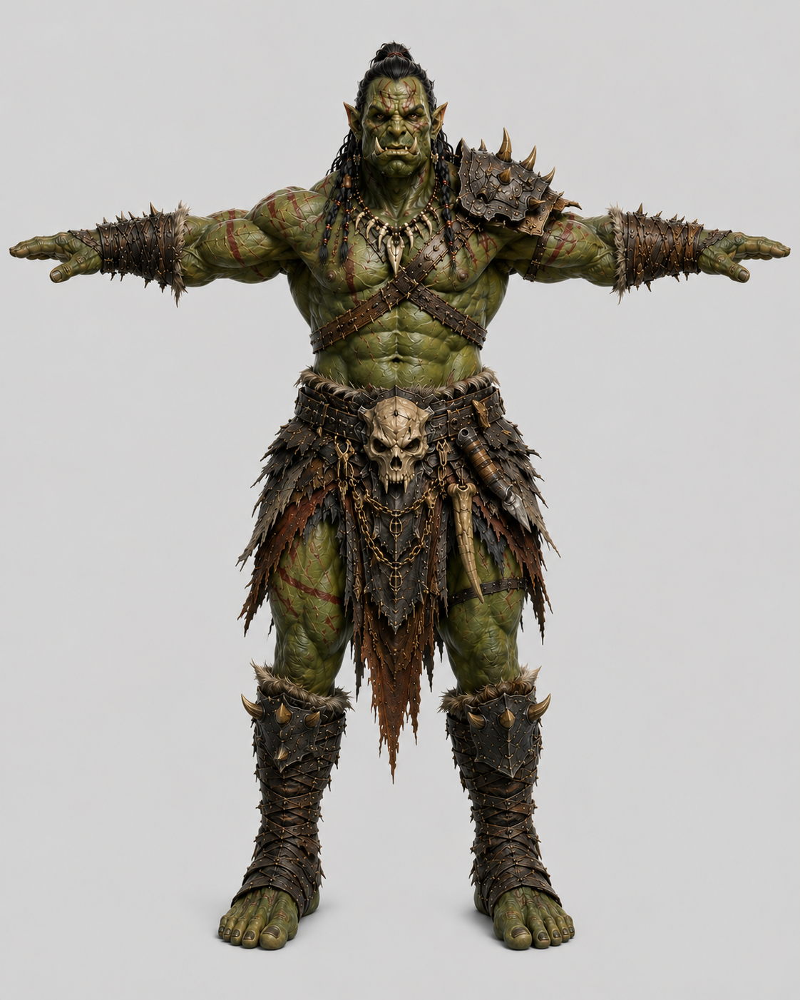
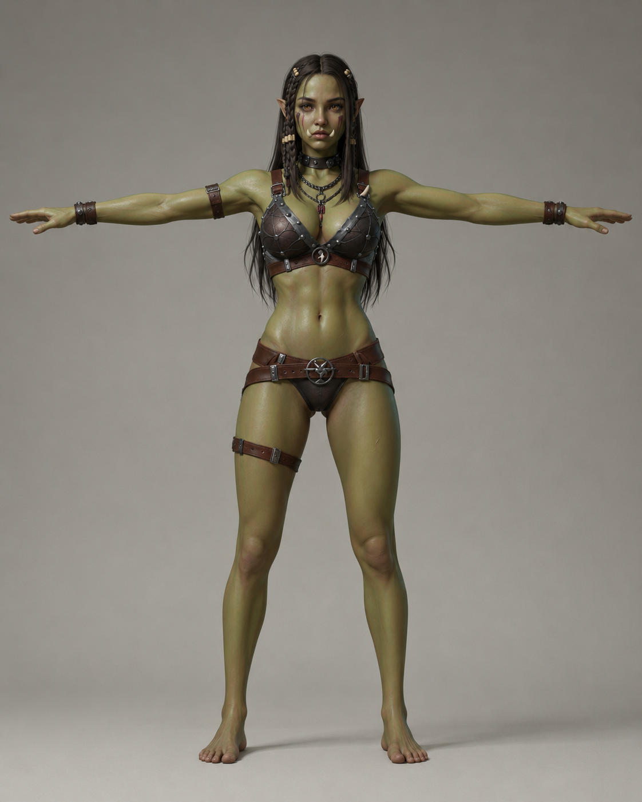
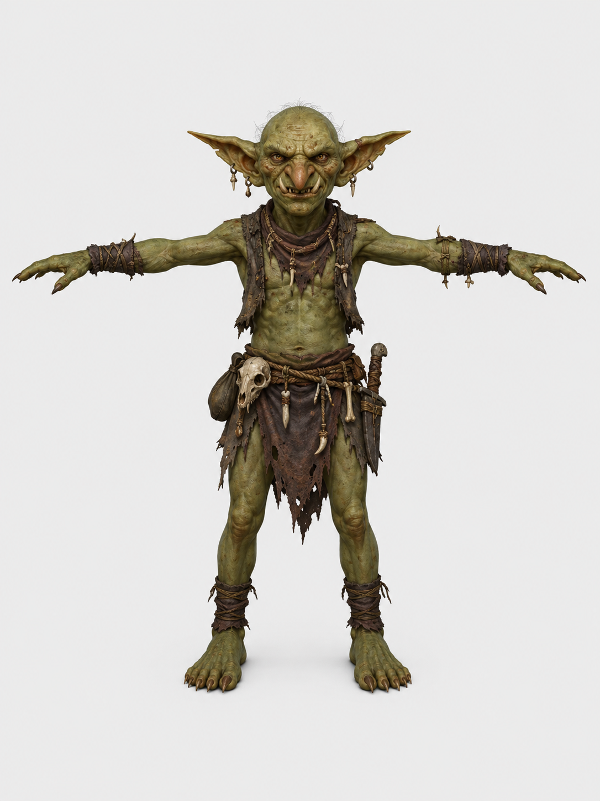
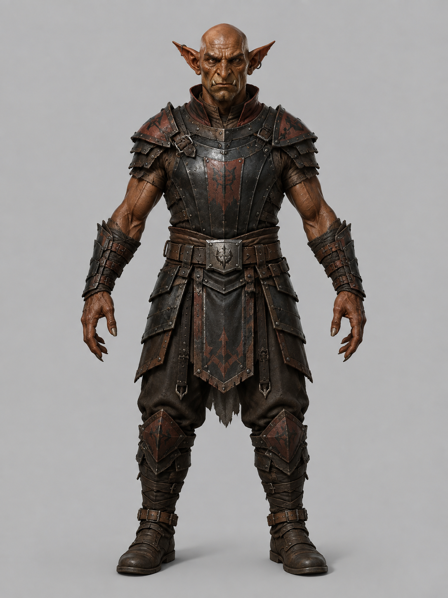
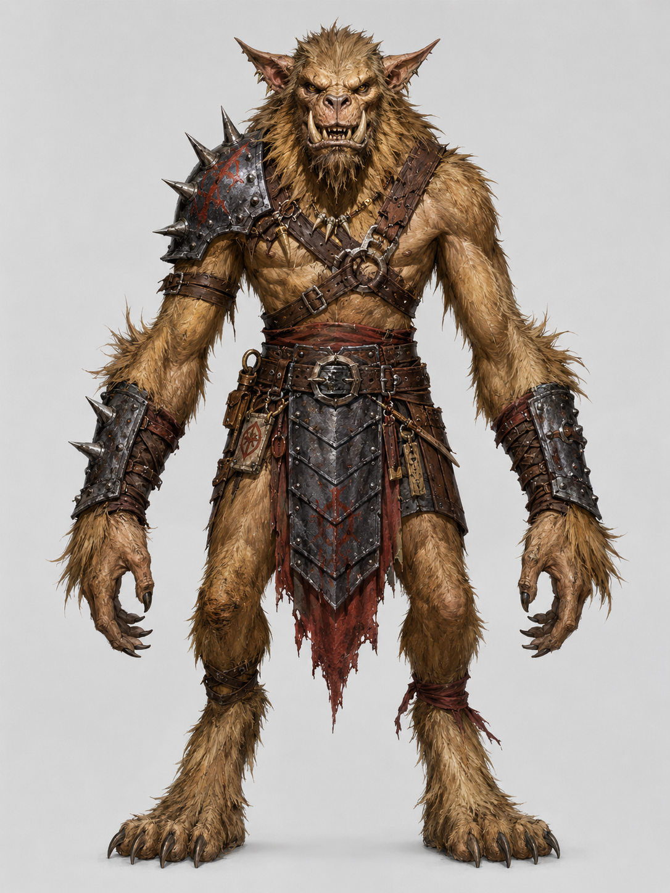
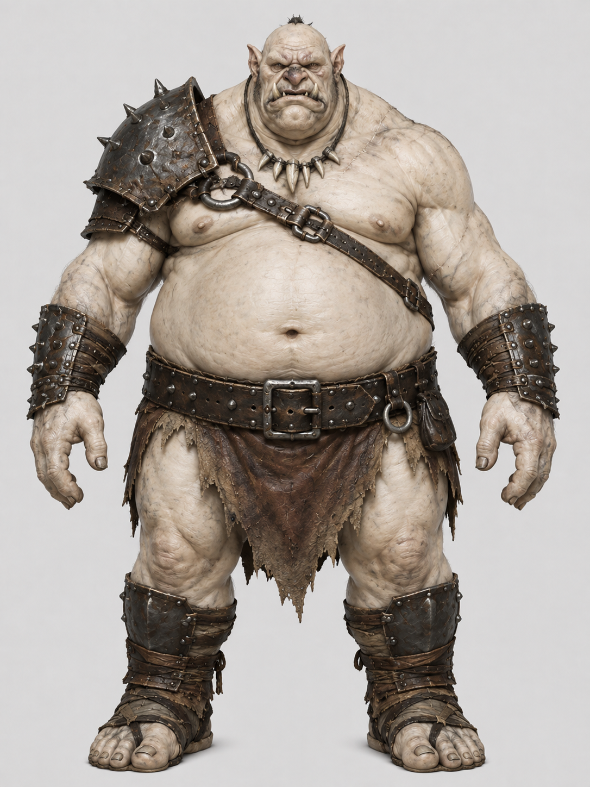
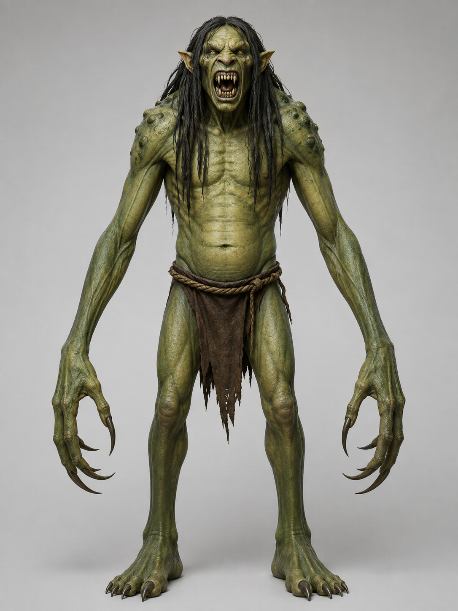
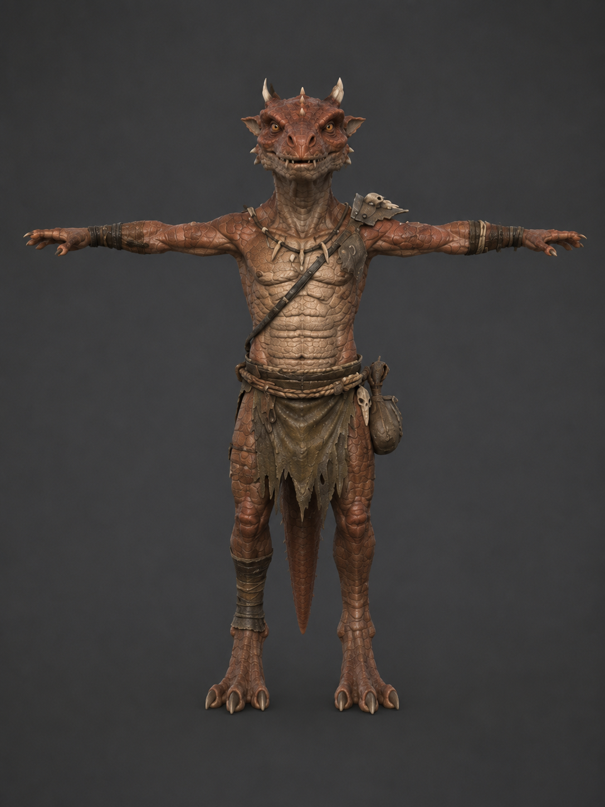

# Monster Assets

## Monster

- skeleton_warrior — Tripo 모델, 2026-09-12 수령. 사용자는 앞선 스켈레톤 작업에서 Pro 요금제를 확인했다.
  이번 모델의 정확한 생성일은 미확인(로컬 다운로드 파일 생성 시각: 2026-09-12).
  - 사용자 제공 `skeleton+armor+3d+model.glb`; 원본은 `assets/skeleton_warrior/source.glb`에 보관.
    라이선스는 Tripo 유료 생성물 서비스 이용 조건을 따른다. 10,000 triangles, Tripo 41본 리그와
    1024² base color·normal·metallic/roughness 텍스처를 유지하며 높이 1.9m로 맞췄다.
  - 원화 `doc/images/monsters/skeleton_warrior_concept.png`는 이 작업의 ChatGPT 이미지 생성 도구로 만든
    낡고 부서진 갑옷의 스켈레톤 전사 T-pose 시안(플랜 미확인, 2026-09-12).
  - `tools/blender-scripts/build_skeleton_warrior.py`로 원본에서 재생성한다. 편집본은
    `assets/skeleton_warrior/skeleton_warrior.blend`, 게임 모델은
    `client/public/models/monsters/skeleton_warrior.glb`.
  - Idle·Walk·Run·Death는 기존 스켈레톤에 사용한 사용자 제공 Mixamo 65본 FBX와 동일한 파일을 재사용한다.
    Attack은 사용자 제공 `Sword And Shield Slash.fbx`(Mixamo, 2026-09-12 수령)로 교체했다. Mixamo 서비스
    이용 조건 적용. 원본은 `assets/skeleton_warrior/fbx/`에 보관하고 Tripo 리그로 리타게팅했다.
  - 게임 GLB에는 `Idle`, `Walk`, `Run`, `Attack`, `Death` 5개 클립만 포함한다. 걷기·달리기는 제자리 이동,
    Attack은 1.5초이고 오른손의 수평 도달 거리가 최대인 625ms를 타격 시점으로 사용한다. 쿨다운은 1800ms.
  - 기존 `morningstar` 아이템 모델을 `R_Hand`에 장착하고 손 가중치 정점의 중심에 맞춰 본 로컬 오프셋을
    Y 0.103m·X 0.02m·Z -0.004m로 지정했다. 무기 자체의 출처와 라이선스는
    [items.md의 morningstar](items.md) 기록을 따른다.
  - 무기 접지 보정 (2026-09-12): Attack·Death에서 모닝스타의 실제 정점을 기준으로 오른손 손목 회전을 보정해
    지면 관통을 방지한다. 보정은 주변 6프레임에 완만하게 이어지며 .blend와 게임 GLB에 베이크한다.
    검증기는 무기를 부착한 상태로 모든 클립을 120fps로 검사한다.
  - 사망음은 기존 `skeleton-death.ogg`를 재사용하고, 갑옷 피격은 `metal-hit.ogg`를 사용한다
    ([효과음 출처](sfx.md)).
  - 정예 일반 몬스터 능력치는 레벨 22, 체력 260, guard 30, 피해 5d12. 던전 출현 설정은 비워 두며
    관리자가 추후 배치한다. `material=metal`, `corpseAutoGround=false`.
- skeleton — Tripo Pro (유료), 사용자 생성일 2026-09-11.
  - 사용자 제공 `skeleton+3d+model.glb`; 원본은 `assets/skeleton/source.glb`에 보관.
  - 이용권: 사용자 확인 Tripo Pro 유료 생성물. 별도 CC 라이선스 표시는 없으며 Tripo 서비스 이용 조건 적용.
  - 원화 `doc/images/monsters/skelleton_concept.png`는 이 작업의 ChatGPT 이미지 생성 도구로 제작한 스켈레톤 T-pose 시안 (2026-09-11, 이용 플랜 미확인).
  - 8,375 triangles, Tripo 41본 리그와 2048² 텍스처를 유지. 키 1.8m, 스케일은 메시·리그·이동 키에 베이크.
  - `tools/blender-scripts/build_skeleton_monster.py`로 원본에서 재생성. 편집본은 `assets/skeleton/skeleton.blend`, 게임 모델은 `client/public/models/monsters/skeleton.glb`.
  - 애니메이션: 사용자 제공 Mixamo 65본 FBX `Idle`, `Walk`, `Run`, `Attack`, `Death` (2026-09-11 수령). Mixamo 서비스 이용 조건 적용; 원본은 `assets/skeleton/fbx/`에 보관하고 Tripo 리그로 리타게팅.
  - 게임 GLB에는 새 FBX에서 변환한 5개 클립만 포함. 걷기·달리기는 제자리 이동으로 변환. 공격 2.625초, 타격 시점 1042ms, 쿨다운 3000ms.
  - **[미사용]** 원본 Tripo 클립과 기존 idle / walk / pursuit / combat_idle / attack_swipe / death 클립은 게임 모델에서 제거.
  - 공용 캐릭터 애니메이션을 사용하지 않음. 무기·출혈 효과·전용 사망 음성 없음. `material=bone`은 기본 타격음으로 폴백.
  - 최상위 일반 몬스터 능력치: 레벨 20, 체력 200, guard 25, 피해 4d12. 던전 출현 설정은 비워 두며 관리자가 추후 배치한다. `corpseAutoGround=false`로 베이크한 죽음 접지를 유지.

- SCP939 https://sketchfab.com/3d-models/scp939-79a749a5073b453d9d85875797bf45d7
  - `939_DieProne` (2026-08-24): 원본 클립 중 죽음이 `939_Die`(상체를 들었다 웅크림)·`939_Dead`뿐이고 모두 살아
    있어 보여서 새로 구웠다: `939_Attack1` 45~63프레임(뒷다리로 크게 일어서는 구간)을 앞에 깔고, 그 정점 포즈를
    고정한 채 18~34프레임에 걸쳐 루트를 엉덩이 기준으로 넘어뜨려 척추가 수평이 되는 각도에 40°를 더 돌리면서(살짝 뒤로
    누운 자세) 12~34프레임에 목·머리를 앞으로 뻗고 팔다리 마디를 좌우 바깥으로 편다. 높이는 엉덩이·척추 정점이
    지면에 닿게 맞춘다 (총 44프레임·1.83 s). 손발은 루트 자식인 IK 컨트롤 본이라 같은 회전을 따로 먹이고 끝에서 팔다리 끝에 고정
    (`tools/blender-scripts/bake_prone_death.py` → `tools/graft-glb-clip.py`로 기존 클립은 그대로 둔 채 추가).
    `939_Die` 기반 버전과 등을 대고 뒤집히는 변형도 시험했지만 버림. animDie/animDead 모두 이 클립,
    `corpseAutoGround=false` (켜 두면 가장 낮은 정점 기준으로 다시 들어 올린다)
- Orc https://create.verse8.io/ 에서 2d -> 3d 생성함
  - 원화는 chatgpt.com에서 다음 프롬프트로 생성함

    > T-pose, fantasy concept art of an orc warrior, muscular humanoid with greyish-green leathery skin, protruding lower tusks, heavy brow ridge, pointed ears, battle-scarred face, crude iron and bone armor, tribal war paint, dramatic rim lighting, dark earthy color palette, detailed character design sheet, painterly digital art, D&D fantasy aesthetic, highly detailed, 4k

    > change it to simple background, character only, no texts

    > make the background light grey

    > make his skin more green

    
  - `Death01_Rig`은 2026-08-24에 힙을 -18.1cm 내렸다 (넘어진 뒤 몸이 지면 위 19.1cm에 떠 있어 코드가
    클립 끝에 내리던 것을 클립에 구움). 20~36프레임 사이에 서서히 적용
    (`tools/shift-glb-clip-hips.py ... --ramp 20 36`), `corpseAutoGround=false`
- female orc https://create.verse8.io/ 에서 2d -> 3d 생성함; 원화는 chatgpt.com에서 생성 
  - `Death01_Rig`은 2026-08-24에 힙을 -15.8cm 내렸다 (넘어진 뒤 몸이 지면 위 16.8cm에 떠 있어 코드가
    클립 끝에 내리던 것을 클립에 구움). 20~30프레임 사이에 서서히 적용
    (`tools/shift-glb-clip-hips.py ... --ramp 20 30`), `corpseAutoGround=false`
- goblin https://create.verse8.io/ 에서 2d -> 3d 생성함; 원화는 chatgpt.com에서 생성 
  - `Death01_Rig`은 2026-08-24에 힙을 +5.65cm 올렸다 (넘어진 뒤 몸이 지면 아래 9.7cm까지 파묻혀
    클라이언트가 죽음 클립 끝에 시체를 +10.65cm 들어 올리던 것을 클립에 굽되, 그보다 5cm 낮게 눕힌다). 쓰러지는 18~23프레임 사이에
    서서히 적용해 서 있는 시작 포즈는 그대로다 (`tools/shift-glb-clip-hips.py ... --ramp 18 23`).
    goblin/goblin_boss는 `corpseAutoGround=false` — 같은 GLB라 1.4배 보스도 함께 맞는다
- hobgoblin Meshy.ai (유료 생성, 2026-08-14, "Ironclad Warlord") 에서 2d -> 3d 생성 후
  mixamo.com에서 auto-rig (65본). 원화는 chatgpt.com에서 생성 
  - Blender: Mixamo FBX가 metallic=1 / specular 2배로 들어와 검은 크롬처럼 보이므로 되돌리고,
    텍스처는 Mixamo FBX에 임베드된 PNG(2048², 1024²·JPEG q88로 export)로 재연결. 본 이름의 `mixamorig:` 접두사를 떼어
    캐릭터 리그(knight.glb) 규약에 맞춤. 높이 1.90m(사람 크기)로 스케일 적용, 원점=바닥 중심,
    `export_yup=True`로 GLB export. 작업 blend는 `assets/hobgoblin.blend`(HF 동기화)
  - 소스는 `assets/`의 Mixamo FBX 하나만 보관한다. Meshy obj zip은 리깅 없는 메시 + 동일한 PNG라 삭제 (2026-08-15)
  - Meshy가 베이스 컬러만 주므로 metallic-roughness 맵은 albedo의 채도·명도에서 유도해 만들었다
    (어둡고 무채색인 판금 → metallic 0.85 / roughness 0.54, 피부는 metallic 0 / roughness 0.92). 정확한 PBR이
    필요하면 Meshy에서 PBR 맵 세트를 다시 받아 교체할 것
  - 애니메이션 클립 미탑재 — 캐릭터 공용 팩(locomotion/combat_melee)을 런타임에 리타게팅해서 쓴다
    (`monsters.csv`의 `sharedAnims` → `loadSharedPackClipsForModel`, 모델당 1회 캐시).
    팩의 리그(Medea, 힙 1.0m)와 몬스터 리그의 비율이 달라 그대로 재생하면 팔다리가 늘어난다.
    리타게팅은 힙을 소스 리그 기준으로 잡아 몸이 지면에 파묻히므로(dying이 12cm) 클립마다
    가장 깊이 잠기는 프레임만큼 힙 트랙을 올려 접지시킨다 (`groundRetargetedClips`).
    공용 팩에는 hit 리액션이 없어 `animHit`은 비워 둠
- gnoll Meshy.ai (유료 생성, 2026-08-15, "Hyena Warlord") 에서 2d -> 3d 생성 후
  mixamo.com에서 auto-rig (57본, 새끼손가락 없음). 원화는 chatgpt.com에서 생성 
  - hobgoblin과 같은 Blender 파이프라인(Mixamo 재질 되돌리기, `mixamorig:` 접두사 제거, albedo에서 유도한
    metallic-roughness 맵, 1024²·JPEG q88, `export_yup=True`). 높이 2.15m — D&D 놀은 7~7.5ft로 사람보다 크다.
    Meshy 원본이 1cm 크기로 들어와 mesh/armature data를 직접 스케일했다. 작업 blend는 `assets/gnoll.blend`(HF 동기화)
  - 소스는 `assets/`의 Mixamo FBX 하나만 보관한다
- bugbear Meshy.ai (유료 생성, 2026-08-16, "Fanghide Warlord") 에서 2d -> 3d 생성 후
  mixamo.com에서 auto-rig (65본). 원화는 chatgpt.com에서 생성 
  - gnoll과 같은 Blender 파이프라인. 높이 2.20m — D&D 버그베어는 7ft 이상으로 놀(2.15m)보다 조금 크게.
    Meshy 원본이 1cm 크기로 들어와 mesh/armature data를 직접 스케일했다(`Mesh.transform`/`Armature.transform`).
    작업 blend는 `assets/bugbear.blend`(HF 동기화). 소스는 `assets/bugbear.fbx` 하나만 보관
  - 무기는 기존 iron_sword를 들려줬다(D&D 버그베어의 모닝스타 모델이 없음)
- ogre Meshy.ai (유료 생성, 2026-08-16, "Ironhide Brute") 에서 2d -> 3d 생성 후
  mixamo.com에서 auto-rig. 원화는 chatgpt.com에서 생성 
  - bugbear와 같은 Blender 파이프라인(Mixamo 재질 되돌리기, `mixamorig:` 접두사 제거, albedo에서 유도한
    metallic-roughness 맵, 1024²·JPEG q88, 원점=바닥 중심, `export_yup=True`). 높이 2.4m.
    Meshy 원본이 1cm 크기로 들어와 mesh/armature data를 직접 스케일했다.
    작업 blend는 `assets/ogre.blend`(HF 동기화). 소스는 `assets/ogre.fbx` 하나만 보관
  - 리그가 33본뿐이라(손가락은 검지 체인만) 공용 팩을 리타게팅해도 나머지 손가락은 움직이지 않는다.
    무기는 `RightHand`에 greatclub(1.5m, 오거 키에 맞춰 sword 1.20m보다 길게).
    손 본이 손목에 있어 `weaponOffset`(본 로컬 +Y)으로 손가락 밑동까지 0.24m 밀어야 쥔 모양이 된다.
    값은 `RightHand` 가중치 정점이 본 축으로 뻗은 길이의 80% — 같은 규칙으로 벅베어 0.20, 홉고블린 0.12
  - 공용 팩을 쓰는 몬스터의 `walkSpeed`는 **Hips 본의 지면 위 높이**에 비례한다 — 리타게팅은 회전만
    옮기므로 보폭이 다리를 편 길이(엉덩이→접지점)로 정해지기 때문. 발목 높이로 재면 안 된다:
    벅베어처럼 발목이 높은 디지티그레이드 리그에서 크게 빗나간다(발목 기준으로는 1.4가 맞다고 나오는데
    실제로는 미끄러졌다). 팩 리그(Hips 1.165m)의 walk 클립은 사이클당 1.72m/0.958s = 1.8m/s이고,
    여기에 Hips 높이 비율을 곱한 값이 미끄러지지 않는 속도다:
    홉고블린 0.98→1.52(설정 1.5), 오거 1.17→1.81(1.8), 놀 1.14→1.76(설정 1.5, 아직 안 맞춤),
    벅베어 1.25→1.93(1.9). 벅베어·오거를 이 값으로 올려 미끄러짐이 사라진 걸 확인했다
  - run 클립은 체공 구간 때문에 같은 방식으로 못 잰다. 기존 값에서 역산한 팩 기준 5.3~5.5에
    Hips 비율을 곱해 잡는다 (오거 5.1, 벅베어 4.8→5.4)
- troll Meshy.ai (유료 생성, 2026-08-16, "Grimclaw Goblin") 에서 2d -> 3d 생성 후
  mixamo.com에서 auto-rig (65본). 원화는 chatgpt.com에서 생성 
  - ogre와 같은 Blender 파이프라인(Mixamo 재질 되돌리기, `mixamorig:` 접두사 제거, 1024²·JPEG q88,
    원점=바닥 중심, `export_yup=True`). 높이 2.7m — D&D 트롤은 9ft. Meshy 원본이 1cm 크기로 들어와
    mesh/armature data를 직접 스케일했다. 작업 blend는 `assets/troll.blend`(HF 동기화),
    소스는 `assets/troll.fbx` 하나만 보관
  - 금속 부위가 없는 모델(맨살·천 요포·머리카락·발톱)이라 metallic-roughness 맵을 만들지 않고
    metallic 0 / roughness 0.9 상수로 뒀다. albedo에서 유도하는 기존 공식은 어두운 머리카락과
    발톱을 금속으로 오인한다
  - 무기 없이 손톱으로 때린다 — 놀과 같은 `claw1|claw2` + `bleed`. Hips 높이가 1.51m로 커서
    walkSpeed 2.3(팩 1.8 × 1.51/1.165), runSpeed 6.5(팩 기준 5.05 × 같은 비율)

- kobold https://create.verse8.io/ 에서 2d -> 3d 생성함
  - 원화는 chatgpt.com에서 다음 프롬프트로 생성함
    > d&d 혹은 nethack에 나오는 kobold를 3d로 제작할 수 있게 T자형 포즈로 그려줘

    
  - `Death01_Rig`은 2026-08-24에 힙을 -18.8cm 내렸다 (코드가 죽음 클립 끝에 적용하던 접지 -0.8cm +
    `corpseGroundOffset` -0.17에 2cm 더 내려 클립에 구움; 최저 정점은 꼬리 끝이라 몸통 기준으로 눕힌 값). 쓰러지는
    22~36프레임 사이에 서서히 적용 (`tools/shift-glb-clip-hips.py ... --ramp 22 36`), `corpseAutoGround=false`

- stone_golem Meshy.ai (유료 생성, 2026-08-20, "Stone Golem") 에서 2d -> 3d 생성 후
  mixamo.com에서 auto-rig (24본). 소스는 `assets/stone_golem.fbx` 하나만 보관
  - troll과 같은 Blender 파이프라인(Mixamo 재질 되돌리기, `mixamorig:` 접두사 제거,
    원점=바닥 중심, `export_yup=True`). 높이 2.5m — 오거(2.4m)와 트롤(2.7m) 사이.
    금속 부위가 없어 metallic 0 / roughness 상수로 뒀다
  - 리그가 24본뿐이라(손가락/눈 본 없음) 공용 팩 대신 Meshy가 준 자체 클립 5개를
    T-pose 리그로 리타게팅해 GLB에 bake한다 — idle/walk/run/slap/dead.
    소스는 `assets/Meshy_AI_Stone_Golem/`의 Mixamo FBX 5개
  - 리타게팅이 루트 변위를 두 리그의 Hips 높이 비로 스케일하는 탓에 몸이 떠서
    idle 26cm, slap 42cm가 공중에 뜬다. 홉고블린과 같이 T-pose base의 발바닥
    높이로 프레임마다 Hips를 내려 접지시킨다. run(체공)·dead(넘어짐)는 프레임별로
    끌어내리면 몸이 땅에 박히므로 상수 오프셋만 준다
  - GLB export 직전에 armature를 `pose_position = "REST"`로 두면 안 된다 —
    glTF 익스포터가 매 프레임을 rest 포즈로 샘플링해 클립이 키 2개짜리 정지
    애니메이션으로 나간다
  - 무기 없이 주먹으로 때린다 — `slap` 하나만 쓴다 (bleed 없음: 석재 골렘은
    출혈하지 않음). material `stone`은 타격음 규칙에 없어 기본 hit sound로 폴백
  - `attackRange`는 2.0 — 타격 순간(0.6s) 오른손이 원점에서 1.3m 앞(+Z)에 있어,
    트롤과 같은 2.8로 두면 손이 닿지 않는 거리에서 헛손질한다. `attackImpactDelay`도
    같은 0.6s에 맞춘 600ms이고, `attackCooldown`은 slap 길이(1567ms)보다 긴 1900
  - 2026-08-22 리워크: 원본 GLB가 Armature 노드에 0.0132 스케일을 남겨 바인드
    박스가 3cm로 잡혔다(호버/클릭 판정 붕괴). Blender에서 스케일을 armature
    데이터·메시·location 커브에 베이크해 스케일 1로 재익스포트(겉보기 동일,
    클립 타이밍 보존). dead 클립은 최저점 -0.50m로 끝나 코드 접지 보정이 팝을
    만들던 것을, Hips 램프로 -0.35에 끝나게 수정하고 `corpseAutoGround=false`로
    코드 보정을 껐다. 바인드 포즈가 팔 벌린 자세라 `hoverRadius=0.9`로 클램프
- cyclop (Cyclop) 2026-08-24 임포트 후 mixamo.com에서 auto-rig (24본)
  - 외부 리그 임포터(기여자 로컬 도구, 리포에 없음)로 임포트. 높이 3.00m, 원점=바닥 중심, 본 이름 표준화(23/24본 매핑), 텍스처 1024²·JPEG q88 1장, 10,270 tri
  - 모델에 포함된 클립을 그대로 쓴다 (`sharedAnims` 미사용)
  - 무기는 `RightHand`에 greatclub. 손 본이 손목에 있어 `weaponOffset` 0.315로 손가락 밑동까지 밀었다 (RightHand 가중치 정점이 본 축으로 뻗은 길이의 80%). 손바닥에 맞추려고 X 0.13, Z 0.005, 회전 -75|24|74(도) 추가 조정
- lizardfolk (Lizardfolk) 2026-08-24 임포트 후 mixamo.com에서 auto-rig (24본)
  - 외부 리그 임포터(기여자 로컬 도구, 리포에 없음)로 임포트. 높이 2.30m, 원점=바닥 중심, 본 이름 표준화(23/24본 매핑), 텍스처 1024²·JPEG q88 1장, 10,160 tri
  - 소스는 `assets/lizardfolk.glb` 하나만 보관 (HF 동기화) (원본 파일명 `Meshy_AI_Meshy_Merged_Animations.glb`)
  - 모델에 포함된 클립을 그대로 쓴다 (`sharedAnims` 미사용)
  - 무기는 `RightHand`에 steel_longsword. 손 본이 손목에 있어 `weaponOffset` 0.23로 손가락 밑동까지 밀었다 (RightHand 가중치 정점이 본 축으로 뻗은 길이의 80%). 손바닥에 맞추려고 X 0.063, Z -0.042, 회전 36|83|-28(도) 추가 조정
