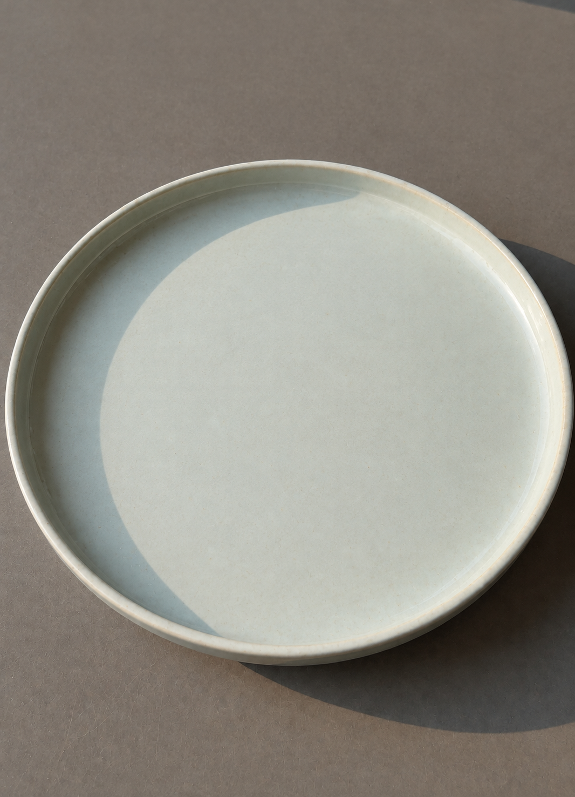
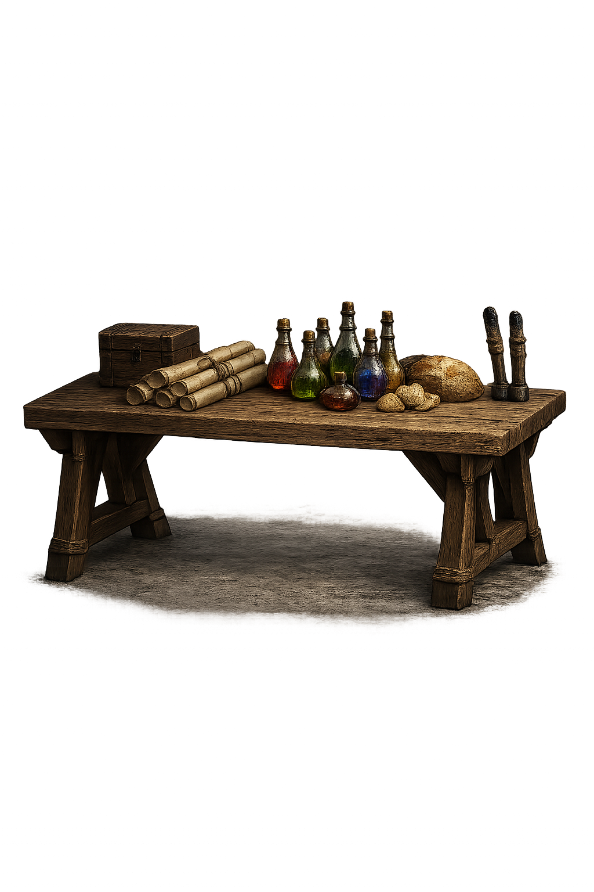
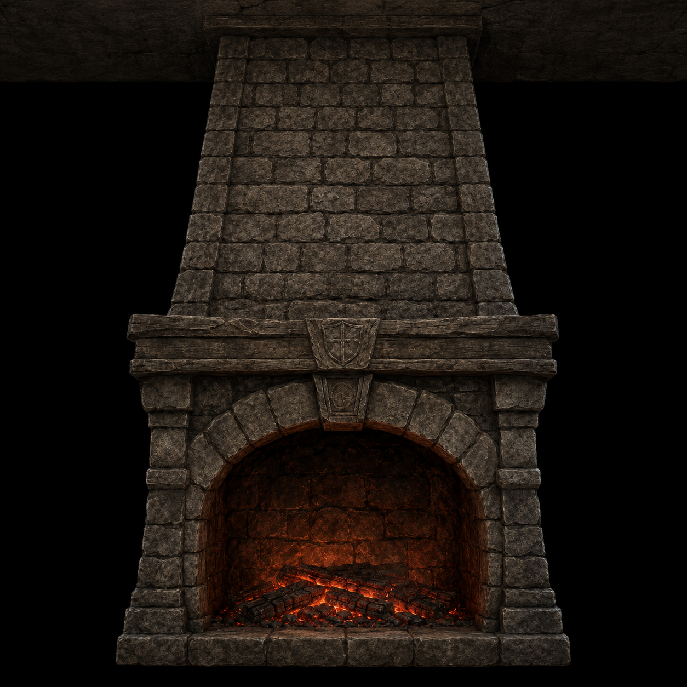
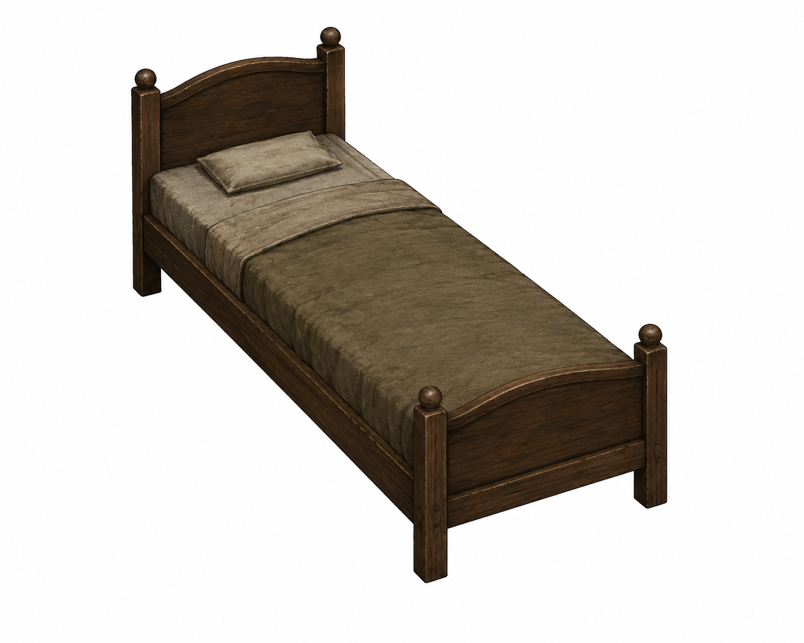

# Props and Building Assets

## Furniture

- bed.glb https://sketchfab.com/3d-models/old-wooden-bed-frame-and-dirty-sheets-79c856755e6a44a3bcf19671e5c70d2d
  - `client/public/items/objects/bed.png` — 기존 `bed.glb`를 Blender 5.2.0 LTS로 렌더한 ORKEA 기본 침대 아이콘 (2026-09-19). 원본: effiebop의 Old wooden bed frame and dirty sheets, [CC BY 4.0](https://creativecommons.org/licenses/by/4.0/). `blender -b -P tools/blender-scripts/render_furniture_icon.py -- bed`로 투명 배경·직교 사선 구도 512²→128² 렌더.

## Objects

- Shop Sign 변형 (`shop_sign_plank`, `shop_sign_oval`, `shop_sign_weathered`) — `client/src/lib/utils/shop-sign.ts`에서 생성하는 각진 판형·타원형·완만한 아치형 메시 (2026-09-06). 메시 출처: 프로젝트 자체 코드, 프로젝트와 동일 라이선스. 텍스처는 기존 Poly Haven `wood_planks`, `dark_wooden_planks`, `weathered_planks` 재사용 (CC0, 아래 House 항목). 간판 문구는 맵에디터에서 수정하며 형태에 맞춰 렌더링한다.
  - `client/public/items/objects/shop_sign.png`, `shop_sign_plank.png`, `shop_sign_oval.png`, `shop_sign_weathered.png` — ORKEA 간판 4종 아이콘 (2026-09-19). 게임의 `buildShopSignBoard`가 만든 메시·UV와 각 스타일의 기존 Poly Haven 나무 텍스처를 그대로 사용해 Blender 5.2.0 LTS에서 투명 128² PNG로 렌더. 메시·렌더 스크립트는 프로젝트와 동일 라이선스, `wood_shutter`, `wood_planks`, `dark_wooden_planks`, `weathered_planks` 텍스처는 CC0. `node tools/export-shop-sign-icons.mjs` 실행 후 `blender -b -P tools/blender-scripts/render_furniture_icon.py -- MODEL --geometry assets/shop-sign-icons/MODEL.json --yaw -10 --tilt -80`으로 재생성한다. 간판 문구는 포함하지 않는다.
- empty_plate.glb — Meshy AI "Sunlit Ceramic Plate" (Pro 요금제, 2026-09-02 생성, 소스 `assets/Meshy_AI_Sunlit_Ceramic_Plate_0902163541_texture.glb`). 완전 소유권·상업 OK (characters.md License 참조). 여관 테이블에서 손님이 다 먹은 접시 — `Meal.eaten`이면 클라이언트가 요리 모델 대신 이걸 그린다 (HUNGER.md "여관 식사"). Blender에서 chicken_rice.glb와 같은 지름 0.35m로 스케일 적용(0.35×0.03×0.35 W×H×D), 원점=바닥 중심, 텍스처 2048→512 축소, 검은 emissive 제거 (2026-09-03). 아이콘 없음(월드 전용)
    - 원화는 ChatGPT 이미지 생성 (ChatGPT Pro 20x, 2026-09-03) 
- stone bridge https://sketchfab.com/3d-models/stone-bridge-a5d380cd08654b508b4b643056038605
- bridge wood https://sketchfab.com/3d-models/bridge-wood-20c090db0a7345898e20e2621fc2ba4c
- big bridge https://sketchfab.com/3d-models/bridge-9328bbfc04a84202a6a97bd59408473a
- bridge_wood_long.glb — Alex Gimson의 [Wooden Bridge Deep](https://sketchfab.com/3d-models/wooden-bridge-deep-27b22af7020c4755b5cb788d75db8ee7), [CC BY 4.0](https://creativecommons.org/licenses/by/4.0/).
  - 2026-09-17: `tools/repack-glb-textures.py`로 base color·normal PNG를 JPEG q92 4:4:4로 변환. 1024² 해상도, 메시·UV·재질 설정·투명 충돌면은 유지. 6,519,420 → 3,651,048 bytes (44.0% 감소), 로컬 Nginx gzip level 6 전송 실측 1,795,527 bytes (원본 무압축 대비 72.5% 감소). Three.js 전체·근접 렌더 비교 및 메시 버퍼 일치 확인. 원본은 최적화 전 `assets.lock`의 SHA-256 `9a4f9a3104d22cc1d0b5eb17f4f8ef54f8aef324339577a876bc5505e7eef189`로 식별.
  - 2026-09-20: `tools/compress-glb-meshes.mjs`로 중복 정리·정점 양자화·`EXT_meshopt_compression` 적용. 삼각형 53,666개, JPEG 2장, 투명 충돌면을 보존했다. 3,651,048 → 1,938,312 bytes; 운영과 같은 Node gzip level 6 기준 1,836,596 → 1,302,813 bytes (29.1% 감소). 게임·GLB 편집기의 Three.js 로더에 내장 MeshoptDecoder를 연결했다. 전체·근접 렌더 비교와 실제 다리 바닥 7,105점 비교에서 통행 가능 영역 변화 없음, 높이 차이 최대 0.574mm.
  - 재생성: `npm install --prefix tools --no-save --package-lock=false @gltf-transform/core@4.4.2 @gltf-transform/extensions@4.4.2 @gltf-transform/functions@4.4.2 meshoptimizer@1.2.0` 후 `node tools/compress-glb-meshes.mjs SOURCE.glb client/public/models/objects/bridge_wood_long.glb`. 압축 전 원본 SHA-256은 `48c36af6d1a1f9eb99205f03a98a4e9bc1e2f98d4d2f641e93c718c7c6b6efb4` (`assets.lock` revision `675ce6a06ddd0742d346c66af18f0a9ca3a6aa97`). 이미 meshopt 압축된 입력은 재양자화를 피하도록 거부한다.
- signpost.glb https://sketchfab.com/3d-models/road-sign-blacksmiths-workshop-assets-3a230f0520034890931c32539955223a
  - `client/public/items/objects/signpost.png`, `signpost_mirrored.png` — 기존 표지판 모델과 좌우 반전 모델의 ORKEA 아이콘 (2026-09-19). 원본: Kyan0s의 Road sign - Blacksmith's workshop assets, [CC BY 4.0](https://creativecommons.org/licenses/by/4.0/). Blender 5.2.0 LTS, 투명 배경·직교 사선 구도 512²→128². `blender -b -P tools/blender-scripts/render_furniture_icon.py -- MODEL`로 재생성한다.
- dungeon objects https://sketchfab.com/3d-models/fps-dungeon-extras-87425249dded42aa891516c31a5b94cf
  - `storage_chest.png` — 기존 `chest_animated.glb`의 닫힌 기본 포즈를 투명 배경의 직교 사선 구도로 렌더한 128×128 영지 보관함 아이콘 (2026-09-07). 기존 게임 모델을 그대로 사용했으며 새 외부 자산 없음
  - `client/public/items/objects/chair.png` — 기존 `chair.glb`를 Blender 5.2.0 LTS로 렌더한 ORKEA 의자 아이콘 (2026-09-19). 원본: DJMaesen의 FPS Dungeon Extras, [CC BY 4.0](https://creativecommons.org/licenses/by/4.0/). `tools/blender-scripts/render_furniture_icon.py -- chair`와 공용 `icon_render.py`로 투명 배경·직교 사선 구도 512²→128² 렌더. 의자에 임시로 연결했던 상자 아이콘을 대체한다.
  - `client/public/items/objects/crate.png` — 기존 `crate.glb`를 Blender 5.2.0 LTS로 렌더한 ORKEA 나무 상자 아이콘 (2026-09-19). 원본: DJMaesen의 FPS Dungeon Extras, [CC BY 4.0](https://creativecommons.org/licenses/by/4.0/). `blender -b -P tools/blender-scripts/render_furniture_icon.py -- crate`로 투명 배경·직교 사선 구도 512²→128² 렌더. Crate에 임시로 연결했던 보관함 아이콘을 대체한다.
  - `client/public/items/objects/barrel.png` — 기존 `barrel.glb`를 Blender 5.2.0 LTS로 렌더한 ORKEA 나무통 아이콘 (2026-09-19). 원본: DJMaesen의 FPS Dungeon Extras, [CC BY 4.0](https://creativecommons.org/licenses/by/4.0/). `blender -b -P tools/blender-scripts/render_furniture_icon.py -- barrel`로 투명 배경·직교 사선 구도 512²→128² 렌더. Barrel에 임시로 연결했던 보관함 아이콘을 대체한다.
- coin_pile_spill.glb https://sketchfab.com/3d-models/coins-7367feabcd4c4b30a7ba64b95b76bee0 (Blender에서 수정 + 쏟아짐 애니메이션 추가; 던전 체스트가 떨어뜨리는 줍기 코인). 아이콘 `client/public/items/objects/coin_pile.png`는 이 GLB를 Blender 헤드리스로 임포트해 스필 마지막 프레임(35)에서 흩어진 코인 28개를 중앙 더미로 다시 모은 뒤 Cycles 직교 측면·위 각도 렌더 512²→128² (2026-08-13). coin_pile은 주우면 지갑으로 바로 들어가 인벤토리를 거치지 않으므로 이 아이콘이 실제로 표시되는 경로는 없음 — 완결성용
- torch_wall.glb https://sketchfab.com/3d-models/torch-238cd6056e2940debb4f67fc24c6df35 (던전 벽에 붙이는 토치)
  - `client/public/items/objects/torch_wall.png` — 기존 `torch_wall.glb`를 Blender 5.2.0 LTS로 렌더한 ORKEA 벽 횃불 아이콘 (2026-09-19). 원본: DJMaesen의 Torch, [CC BY 4.0](https://creativecommons.org/licenses/by/4.0/). `blender -b -P tools/blender-scripts/render_furniture_icon.py -- torch_wall`로 투명 배경·직교 사선 구도 512²→128² 렌더.
- healing potion https://sketchfab.com/3d-models/low-poly-health-potion-dca8a2144a1446fe8391f54cc5f6959e
- scroll https://sketchfab.com/3d-models/scroll-7450e494eb654e9b937bb52724220e77 (scroll_enchant.glb는 같은 모델의 파란 봉인 변형. 소스는 ~/assets_original/scroll.blend (레포 밖 보관) — 두 머티리얼 모두 알파에 Math/ROUND 노드가 들어 있어 glTF 익스포트 시 alphaMode=MASK가 됨. 이 노드를 지우면 BLEND로 나가 봉인이 떠 보이는 문제가 재발하니 유지할 것. scroll_enchant_armor.glb는 scroll_enchant.glb의 알베도만 hue-rotation(파란 봉인 → 초록, -0.27 회전 + 명도 0.8배)해 GLB 바이너리에 되박은 초록 봉인 변형 — 메시·노멀·러프니스와 alphaMode=MASK는 그대로다, 스크립트, 2026-08-15)
- river rock https://sketchfab.com/3d-models/river-rocks-model-2dc354c1f84a43f493343f54e05eaed9
- campfire.glb — Meshy AI "Crimson Ember Stack" (Pro 요금제, 2026-08-02 생성). Meshy 유닛큐브를 지름 0.6m로 스케일 적용, 원점을 바닥 중앙으로 이동. 텍스처 2048→512 축소, metallic 맵은 전부 0이라 제거하고 metallicFactor=0. emissive는 잔불 발광이라 유지
    - 원화는 ChatGPT 이미지 생성 (ChatGPT Pro 20x, 2026-08-03) 
- black_market_table.glb — Meshy AI "Bottles and Scrolls" (Pro 요금제, 2026-08-09 생성, 소스 `assets/Meshy_AI_Bottles_and_Scrolls_o_0809151940_texture.glb`). 완전 소유권·상업 OK (characters.md License 참조). 암시장 상인이 앞에 펼쳐 놓는 매대 — 병·두루마리·빵·상자가 놓인 좌판형 테이블. Blender에서 기존 table.glb(W 1.6m) 기준 너비 1.6m로 스케일 적용(1.60×0.96×0.89 W×H×D), 원점=바닥 중심, 텍스처 2048→512 축소, 검은 emissive 제거 (2026-08-10). 상인 `/lay_stall` 좌판으로 사용 (GameSceneStallsLayer)
    - 원화는 ChatGPT 이미지 생성 (ChatGPT Pro 20x, 2026-08-09) 
- stone_hearth.glb — Meshy AI "Ancient Stone Hearth" (Pro 요금제, 2026-08-27 생성, 소스 `assets/Meshy_AI_Ancient_Stone_Hearth_0827182508_texture.glb`). 완전 소유권·상업 OK (characters.md License 참조). 집 안에 놓는 돌 벽난로 가구 — 아치 화구·방패 문장 목재 선반·굴뚝. Blender에서 층 높이(DEFAULT_WALL_HEIGHT 3m) 기준 높이 2.9m로 스케일 적용(1.93×2.90×0.70 W×H×D, 벽 붙이는 얕은 형태), 원점=바닥 중심, 텍스처는 베이스 컬러 2048 유지·metallic/roughness·normal 1024, JPEG q85로 export(3.2MB; 층 높이 프롭이라 512는 흐림), emissive 없음 확인. 아이콘은 Cycles 직교 측면·위 각도 렌더 512²→128² `client/public/items/objects/stone_hearth.png` (2026-08-28). items.csv `stone_hearth` furniture, catalog.json solid
    - 원화는 ChatGPT 이미지 생성 (ChatGPT Pro 20x, 2026-08-28) 
- rustic_bed.glb — Meshy AI "Rustic Wooden Bed" (Pro 요금제, 2026-08-30 생성, 소스 `assets/Meshy_AI_Rustic_Wooden_Bed_0830120934_texture.glb`). 완전 소유권·상업 OK (characters.md License 참조). 집 안에 놓는 소박한 나무 침대 — 둥근 손잡이 기둥 4개·아치 헤드보드·베개·갈색 담요. Blender에서 긴 쪽(길이) 2.2m로 스케일 적용(0.91×0.98×2.20 W×H×D, 기존 bed.glb 2.58m보다 작게), 원점=바닥·발끝(bed.glb처럼 눕는 위치가 원점이라 머리판이 -Z 끝, 발끝이 z 0), 텍스처 2048→1024(2m 가구라 512는 흐림), JPEG q85로 export(0.37MB), 검은 emissive 제거. 아이콘은 Cycles 직교 측면·위 각도 렌더 512²→128² `client/public/items/objects/rustic_bed.png` (2026-08-30). items.csv `rustic_bed` furniture, catalog.json sleep(offset y 0.56)·solid
    - 원화는 ChatGPT 이미지 생성 (ChatGPT Pro 20x, 2026-08-30) 

## Mounts

- rowboat.glb — `tools/blender-scripts/build_rowboat.py`가 절차적으로 생성하는 노 젓는 배 (2026-09-14,
  Blender 5.2.1 LTS). 메시의 라이선스는 저장소를 따르며, 나무 텍스처 출처와 이용 조건은 아래에 기록한다.
  스크립트와 `assets/rowboat/wood_albedo.png`로 재생성한다 (`blender -b -P tools/blender-scripts/build_rowboat.py`).
  선체는 단면 19점 × 길이 37 스테이션을 5cm 판재 두께로 안팎 두 겹 로프팅한 닫힌 셸이다.
  선미는 선체와 이어진 5cm 두께의 평판으로 막고, 안쪽 끝단을 그만큼 앞당겼다.
  선수 끝은 양쪽 꼭짓점을 중심선에서 용접해 틈 없이 만나며, 안쪽 선수는 5cm 뒤에서 닫힌다
  (2026-09-17, Blender 5.2.0 LTS로 모델·원본·아이콘 재생성).
  가로보 3개(`ThwartBow`/`ThwartMid`/`ThwartStern`)와 노 2개(`OarPort`/`OarStarboard`)는 클라이언트가
  따로 돌릴 수 있게 별도 노드다. 정지 자세의 노는 손잡이를 축으로 날 쪽을 9° 들어 올려
  뱃전 위에 걸친다. 노의 기울기는 노드 회전으로 보존한다 (2026-09-17).
  삼각형 3,140개, 머티리얼 2개(`BoatOak`, `BoatTrim`)가
  1024² WebP q90 나무 텍스처 하나를 공유한다. 선체·바닥은 길이 방향, 가로보는 폭 방향,
  노는 자루·날의 길이 방향으로 UV를 배치했다 (2026-09-17). 거칠기는 선체 0.82, 나머지 0.7.
  크기 1.37×3.40m(폭×길이), 용골 -0.15m ~ 뱃전 0.53m.
  **원점은 용골이 아니라 흘수선**(draft 0.15m)이라 샘플링한 수면 높이에 그대로 올리면 된다.
  뱃머리는 Blender -Y = **glTF +Z**. 탑승점은 말과 같은 이름의 빈 오브젝트 `RideSeat`
  (가운데 가로보 위, glTF 기준 `[0, 0.17, 0]`, 선미인 -Z를 향하도록 180° 회전, 2026-09-17).
  아이콘 `client/public/items/objects/rowboat.png`는
  같은 스크립트가 `icon_render` 공용 레시피로 렌더한다.
  말 출처는 [animals.md](animals.md), 게임 규칙은 [MOUNTS.md](../MOUNTS.md).
- `assets/rowboat/wood_albedo.png` — 나룻배용 따뜻한 갈색 오크 판재 텍스처 원본, 1254² PNG.
  - 출처: OpenAI 내장 `image_gen`으로 생성, 2026-09-17 (KST).
  - 생성 도구/티어: Codex 내장 이미지 생성; 계정 요금제와 서비스 티어는 도구에서 미노출.
  - 라이선스: OpenAI 생성 출력물에 적용되는 서비스 약관. 별도 제3자 stock/CC 에셋을 사용하지 않음.
  - 프롬프트: [rowboat-wood-prompt.txt](rowboat-wood-prompt.txt). 수평 나뭇결·판재 5줄, 균일한 조명,
    무광의 가벼운 풍화, 좁은 이음새를 요청했다. 생성 원본은 보존하고 빌드에서 1024²로 축소해
    GLB에 내장하며, `assets/rowboat/rowboat.blend`에도 텍스처를 포함한다.

## House

Poly Haven에서 받은 .gltf를 Blender에서 .glb로 다시 export

- wood_planks_1k.glb -> https://polyhaven.com/a/wood_planks
- planks_brown_10_1k.glb -> https://polyhaven.com/a/planks_brown_10
- dark_wooden_planks_1k.glb -> https://polyhaven.com/a/dark_wooden_planks
- marble_01_1k.glb -> https://polyhaven.com/a/marble_01
- weathered_planks_1k.glb -> https://polyhaven.com/a/weathered_planks
- wood_trunk_wall_1k.glb -> https://polyhaven.com/a/wood_trunk_wall
- wood_shutter_1k.glb -> https://polyhaven.com/a/wood_shutter
- wood_plank_wall_1k.glb -> https://polyhaven.com/a/wood_plank_wall
- clay_roof_tiles_02_1k.glb -> https://polyhaven.com/a/clay_roof_tiles_02
- clay_roof_tiles_03_1k.glb -> https://polyhaven.com/a/clay_roof_tiles_03
- grey_roof_tiles_02_1k.glb -> https://polyhaven.com/a/grey_roof_tiles_02
- medieval_blocks_03_1k.glb -> https://polyhaven.com/a/medieval_blocks_03
- red_brick_1k.glb -> https://polyhaven.com/a/red_brick
- reed_roof_03_1k.glb -> https://polyhaven.com/a/reed_roof_03
- sandstone_blocks_04_1k.glb -> https://polyhaven.com/a/sandstone_blocks_04
- worn_mossy_plasterwall_1k.glb -> https://polyhaven.com/a/worn_mossy_plasterwall
- beige_wall_001.glb -> https://polyhaven.com/a/beige_wall_001
- rough_linen.glb -> https://polyhaven.com/a/rough_linen
- wooden_garage_door_1k.glb -> https://polyhaven.com/a/wooden_garage_door (던전 입구 문)
- rusty_metal_grid_1k.glb -> https://polyhaven.com/a/rusty_metal_grid (CC0, 2026-08-30) — 열쇠가 있어야 열리는 잠긴 층 문(doc/DUNGEON_REWARD.md). Poly Haven glTF zip을 Blender로 임포트해 GLB로 export(원본 zip은 assets/rusty_metal_grid_1k.gltf.zip)
- grey_stone_path_1k.glb -> https://polyhaven.com/a/grey_stone_path (던전 바닥/계단)

## Dungeon Textures

하우징·던전 GLB 텍스처도 `tools/repack-material-glbs.py`로 만든 배포본이다(원본 `assets/textures-src/`, 규칙은 environment.md Terrain Textures 참조).

기존 Poly Haven 복도 벽 텍스처. 자연 동굴 세트로 교체(2026-09-17).

- **[미사용]** rock_wall_10 https://polyhaven.com/a/rock_wall_10 — 기존 던전 복도 벽, CC0. 저장된 하우징 텍스처 인덱스 보존을 위해 카탈로그 슬롯 유지.
- damaged_plaster — **[미사용]**
- old_stone_wall — **[미사용]**
- plaster_stone_wall_02 — **[미사용]**
- rabdentse_ruins_wall — **[미사용]**
- rock_wall_05 — **[미사용]**
- rock_wall_08 — **[미사용]**
- rock_wall_13 — **[미사용]**
- rustic_stone_wall — **[미사용]**

### 던전 통로 세트 (2026-09-18)

출처: OpenAI Codex built-in ImageGen. 요금제: workspace-provided tier(정확한 등급은 도구에서 공개되지 않음). 최초 생성일: 2026-09-17, 현재 사용본 편집·생성일: 2026-09-18. 라이선스: 프로젝트용 생성 출력물, OpenAI 출력물 이용 조건 적용, 별도 CC 라이선스 지정 없음. [풍화 텍스처 편집 프롬프트](dungeon-weathering-prompts.json) · [현재 석재 블록 벽 생성 프롬프트](dungeon-stone-blocks-prompt.json).

경로: `client/public/textures/dungeon/`. 생성 PNG를 ffmpeg로 1024² WebP q88로 축소·인코딩했다.

| 세트 | 벽 | 바닥 |
| --- | --- | --- |
| 회색 석회암 | `cave-limestone-wall.webp` | `cave-limestone-floor.webp` |
| 이끼 암반 | `cave-moss-wall.webp` | `cave-moss-floor.webp` |
| 회색 석재 블록·어두운 타일 | `cave-masonry-wall.webp` | `cave-masonry-floor.webp` |
| **[미사용]** 갈색 셰일 | `cave-shale-wall.webp` | `cave-shale-floor.webp` |

2026-09-18 석재 블록 벽 뒷면: 기존 `cave-limestone-wall.webp`를 뒷면과 위·옆 단면에 재사용한다. 앞면의 블록·줄눈과 재질을 분리하고 실제 벽 크기에 맞춰 반복해 자연 암반 무늬를 표시한다. 출처·요금제·생성일·라이선스는 위 석회암 텍스처와 동일하며 추가 이미지 생성은 없다. 벽 하단은 바닥까지 수직으로 이어진다.

2026-09-18 공통 벽 데칼: `wall-weathering-decals.webp` — OpenAI Codex built-in ImageGen, workspace-provided tier(정확한 등급 미공개), 생성일 2026-09-18. 프로젝트용 생성 출력물이며 OpenAI 출력물 이용 조건 적용, 별도 CC 라이선스 지정 없음. [생성 프롬프트](dungeon-wall-decals-prompt.json). 배경이 투명한 1536×1024 RGBA 이미지에 이끼·균열·물자국을 각각 2종씩 담았다. 원본 PNG의 알파를 보존해 WebP q90으로 인코딩했으며 기존 벽 텍스처는 수정하지 않았다.

세 통로 세트와 던전 방 벽의 앞·뒷면에 독립적인 데칼 메시로 투영한다. 던전·층·벽 위치로 배치를 고정하고 종류·위치·크기·좌우 반전·농도를 달리한다. 이끼·균열에는 회전도 주고, 물자국은 위에서 아래로 내려오며 일부 끝에 이끼를 덧붙인다. 벽의 실제 요철을 따라 잘라 붙이고 벽별로 한 메시로 합친다. 캐릭터를 가리는 벽에서는 데칼을 숨기며 이동 충돌·바닥 클릭에 관여하지 않는다. 메시 배치 코드는 프로젝트 자체 제작, 프로젝트와 동일 라이선스.

2026-09-18 방 벽·균열·거미줄 확장: `wall-cracks-cobwebs.webp` — OpenAI Codex built-in ImageGen, workspace-provided tier(정확한 등급 미공개), 생성일 2026-09-18. 프로젝트용 생성 출력물이며 OpenAI 출력물 이용 조건 적용, 별도 CC 라이선스 지정 없음. [편집·생성 프롬프트](dungeon-wall-details-prompts.json). 기존 데칼 이미지를 참조해 선이 굵고 짙은 균열 2종과 낡은 거미줄 2종을 생성하고, 알파를 보존해 1024×1024 WebP q90으로 인코딩했다. 기존 이끼·물자국 이미지는 그대로 재사용한다. **[미사용]** `wall-weathering-decals.webp` 가운데 열의 가는 균열 2종은 새 균열로 교체했다. 균열은 크기·농도를 높이고, 거미줄은 벽 위쪽 끝에 확률적으로 배치한다. 방 벽의 높이 오프셋과 문 입구를 포함한 실제 벽 범위에 맞춰 투영한다. 기존 얼룩과 새 균열·거미줄은 한 메시의 두 재질 그룹으로 합친다.

균열은 통로·방 모두 벽의 위쪽 또는 아래쪽 접점에서 안쪽으로 뻗도록 배치한다. 데칼 중심을 가장자리 가까이 옮기고 벽 바깥 부분을 잘라 중앙에 떠 있는 모양을 줄였다. 기존 이미지와 다른 데칼의 배치는 유지한다.

[통로 세 세트와 방 벽의 균열·거미줄](../devlog/images/dungeon-room-decals-v12.webp) — 2026-09-18 자체 캡처, 프로젝트 소유 문서 이미지. 위·아래 접점으로 균열을 옮긴 실제 벽 메시와 재질을 같은 카메라·조명으로 비교한 별도 Three.js 렌더이며 게임 플레이 스크린샷은 아니다.

**[미사용·11차 시안]** [세 세트의 데칼 적용 전후](../devlog/images/dungeon-wall-decals-v11.webp) — 2026-09-18 자체 캡처, 프로젝트 소유 문서 이미지. 균열을 강화하고 거미줄·방 벽 적용을 추가하기 전의 별도 Three.js 렌더이며 게임 플레이 스크린샷은 아니다.

2026-09-18 석재 블록 벽 재생성: `cave-masonry-wall.webp`는 큰 돌 면과 짙은 줄눈이 먼저 보이도록 새로 생성했다. 블록 중심부의 얼룩·잔무늬·세로 물자국을 줄이고, 넓게 닳은 모서리와 틈새의 때·소량의 이끼를 남겼다. 새 이미지의 4개 가로줄에서 온전한 블록 8개를 골라 매핑하며, 블록별 좌우 반전과 색조 변화로 반복감을 줄인다. 기존 44×22cm 블록 메시와 22% 불투명도의 평면 가림 처리를 유지한다. **[미사용]** 직전의 얼룩이 많은 회색 벽 텍스처는 같은 경로에서 교체했으며 `dungeon-weathering-prompts.json`의 해당 벽 항목을 미사용으로 표시했다.

[새 석재 블록 벽 비교](../devlog/images/dungeon-stone-blocks-v10.webp) — 2026-09-18 자체 캡처, 프로젝트 소유 문서 이미지. 왼쪽과 가운데는 같은 메시 크기·카메라·조명에서 이전 텍스처와 새 텍스처를 비교하며, 오른쪽은 새 텍스처의 22% 평면 가림 상태다. 자체 캐릭터 마커를 사용한 별도 Three.js 렌더이며 게임 플레이 스크린샷은 아니다.

갈색 셰일은 이끼 암반과 분위기가 비슷하다는 사용자 피드백에 따라 벽돌·타일 세트로 교체했다. 기존 셰일 이미지는 시안으로 보관한다.

2026-09-18: 세 세트의 벽·바닥 6장을 기존 이미지 참조 편집으로 교체했다. 석회암에는 검게 밴 습기와 세로 물자국, 틈새의 흙·소량의 이끼를 추가했고, 이끼 암반에는 짙은 올리브색 이끼와 불규칙한 젖은 얼룩을 늘렸다. 벽돌 세트는 붉은 점토색을 회색 석재 블록으로, 밝은 베이지 타일을 어두운 회색 타일로 바꿨다. 벽의 블록 배열과 바닥의 4×4 격자는 유지하며, 때·광물 침전·물자국은 색상 텍스처에 표현한다. 기존 물웅덩이·물방울 효과와 함께 사용한다.

**[미사용]** 2026-09-17의 깨끗한 석회암·이끼 암반 및 붉은 벽돌·밝은 타일 텍스처: 같은 경로의 현재 사용본으로 교체. [최초 자연 암반 생성 프롬프트](dungeon-cave-prompts.json) · [최초 벽돌·타일 생성 프롬프트](dungeon-masonry-prompts.json)는 이력으로 보관한다.

[풍화 텍스처 적용 미리보기](../devlog/images/dungeon-weathered-corridors.webp) — 2026-09-18 자체 캡처, 프로젝트 소유 문서 이미지. 실제 통로 메시와 재질을 별도 Three.js 장면에서 같은 카메라·조명으로 렌더했다. 게임 플레이 스크린샷은 아니다.

던전 ID와 층 깊이로 세트를 고정 선택한다. 통로 벽·바닥에만 적용하며 방·계단은 기존 재질을 쓴다. 벽 상단은 약 10cm 두께로 시야를 확보한다. 자연 암반 두 세트는 바닥과 만나는 하부 약 16cm를 둥글게 처리하고, 벽돌 세트는 바닥과 직각으로 만난다. 자연 암반 벽은 중간 면이 완만하게 돌출·함몰되며 끝과 상단에서 굴곡이 줄어든다. 벽돌 세트는 대부분 평평하게 엇갈려 쌓고, 내부 벽돌의 약 4%만 1.5–4cm 돌출시키며 약 2%는 1.2cm 후퇴시킨다. 연결부와 맨 위·아래 줄은 평평하다. 벽돌 크기는 기존 텍스처 2배 반복에 맞춘 약 44×22cm이며 원본 이미지의 벽돌 면을 골라 매핑한다. 평평한 벽돌의 내부 옆면과 벽면 뒤의 중복 면을 없애 반투명 상태에서 진하게 겹쳐 보이는 현상을 줄였다.

바닥에는 자체 코드로 만든 낮은 돌판(약 2–4cm)과 작은 자갈(최대 10cm)을 벽 주변 위주로 배치한다. 벽돌 세트는 3.5cm 이하의 타일 파편을 쓴다. 한 메시로 합치고 이동 충돌·바닥 클릭을 방해하지 않으며 문·계단·기물 주변은 비워 둔다. 물웅덩이는 벽까지 이어지는 모양을 바닥 경계에서 잘라 표시한다.

2026-09-18 벽돌 매핑 보정: 벽돌 내부에 옆 줄눈이 세로 띠처럼 반복되던 잘라 쓰기 좌표를 바로잡고, 각 블록의 깨진 가장자리를 포함하도록 UV를 맞췄다. 블록별 좌우 반전으로 물자국 반복을 줄였으며 줄눈 너비는 7mm에서 16mm로 넓혔다. 벽돌 벽의 색상 텍스처 범프 강도는 0.09에서 0.012로 낮춰 물자국 명암이 깊은 홈처럼 보이지 않게 했다. 짧게 잘린 끝 블록은 줄눈 여백을 제한해 면이 뒤집히지 않도록 한다. 메시·재질 수정 출처: 프로젝트 자체 코드, 프로젝트와 동일 라이선스. 추가 AI 이미지 생성 없음.

[벽돌 매핑 수정 비교](../devlog/images/dungeon-masonry-mapping-v8.webp) — 2026-09-18 자체 캡처, 프로젝트 소유 문서 이미지. 실제 벽 메시를 같은 텍스처·카메라·조명으로 렌더해 변경 전, 요철만 완화, 매핑·줄눈까지 수정한 결과를 비교한다. 파란 캐릭터 마커는 자체 코드로 만든 도형이며 게임 플레이 스크린샷은 아니다. 위 풍화 텍스처 적용 미리보기도 현재 매핑으로 갱신했다.

2026-09-18 반투명 시야 보정: 캐릭터를 가리는 석재 블록 벽은 입체 메시를 숨기고 옆면·윗면·뒷면 두께가 없는 평면으로 교체한다. 양쪽에서 보이지만 어느 쪽에서도 한 겹만 그리며 불투명도는 50%에서 22%로 낮췄다. 가림이 해제되면 원래 입체 벽으로 돌아간다. 일반 벽은 블록별로 고정된 작은 밝기·색조 차이를 주어 같은 무늬의 반복감을 줄였다. 모두 프로젝트 자체 코드, 프로젝트와 동일 라이선스이며 추가 이미지 생성은 없다.

[반투명 시야 보정 비교](../devlog/images/dungeon-masonry-ghost-v9.webp) — 2026-09-18 자체 캡처, 프로젝트 소유 문서 이미지. 왼쪽은 기존 입체 벽의 50% 반투명 상태, 가운데는 평면의 22% 반투명 상태이며 두 장면은 같은 카메라·조명을 쓴다. 오른쪽은 안쪽에서 본 일반 벽의 블록별 색조 차이다. 자체 캐릭터 마커를 사용한 별도 Three.js 장면이며 게임 플레이 스크린샷은 아니다.

벽돌 세트의 바닥은 하나로 합친 연속된 평면이며, 온전한 타일과 줄눈은 텍스처로 표현한다. 바닥 범프와 타일별 내부 옆면을 없애 횃불 움직임에 따른 줄눈 음영 변화를 줄였다. 텍스처 줄눈에 맞춘 50cm 타일 단위로 일부가 빠지거나 모서리가 깨지고 갈라진 모습은 바닥 위 6mm의 평평한 흙 패치와 약 1–3cm의 파편으로 덧그린다. 파손 장식은 별도 메시로 합치고 그림자를 드리우거나 바닥 클릭에 관여하지 않는다. 문·계단·기물 주변은 온전하게 유지한다. 흙 재질은 기존 [Poly Haven red_laterite_soil_stones](https://polyhaven.com/a/red_laterite_soil_stones) (CC0, [environment.md](environment.md))을 재사용한다. 각진 벽과 파손 타일 메시 출처: 프로젝트 자체 코드, 프로젝트와 동일 라이선스 (2026-09-18). 추가 이미지 생성 없음.

**[미사용·6차 시안]** [벽돌 돌출 밀도·반투명 가림 비교](../devlog/images/dungeon-masonry-fade-v6.webp) — 2026-09-18 자체 캡처, 프로젝트 소유 문서 이미지. 이전·수정 메시를 같은 카메라와 실제 반투명도 50%로 별도 Three.js 장면에서 비교했다. 캐릭터 대신 코드로 만든 마커를 두었으며 게임 플레이 스크린샷은 아니다. 입체 벽을 그대로 반투명하게 그렸던 이전 방식이다.

**[미사용·5차 시안]** [각진 벽돌·파손 타일 미리보기](../devlog/images/dungeon-masonry-damage-v5.webp) — 2026-09-18 자체 캡처, 프로젝트 소유 문서 이미지. 돌출 벽돌이 많고 반투명 상태에서 내부 면이 겹쳤던 이전 모습.

**[미사용·4차 시안]** [벽 돌출·함몰 미리보기](../devlog/images/dungeon-wall-relief-v4.webp) — 2026-09-18 자체 캡처, 프로젝트 소유 문서 이미지. 벽돌 벽에도 완만한 굴곡을 썼던 이전 모습.

**[미사용·3차 시안]** [수직 벽·둥근 바닥 접점 미리보기](../devlog/images/dungeon-wall-base-v3.webp) — 2026-09-17 자체 캡처, 프로젝트 소유 문서 이미지. 벽 중간에 돌출·함몰을 넣기 전 모습.

**[미사용·2차 시안]** [바닥·물웅덩이 미리보기](../devlog/images/dungeon-floor-detail-v2.webp) — 2026-09-17 자체 캡처, 프로젝트 소유 문서 이미지. 벽 상부가 넓었던 이전 단면.

**[미사용·1차 시안]** [최초 자연 암반 3세트 미리보기](../devlog/images/dungeon-cave-sets.webp) — 2026-09-17 자체 캡처. 셰일 세트 교체와 바닥 장식·물웅덩이 변경 전 모습. 포함된 기존 방 재질은 위 Poly Haven CC0 출처를 따른다.

## Research

Not used right now, but for future reference.

- Procedural Northern European French Town in Geometry nodes Blender 5.0 — **[미사용]** 참고용, 아직 미도입
  https://github.com/IRCSS/Blender-Geometry-Node-French-Houses
