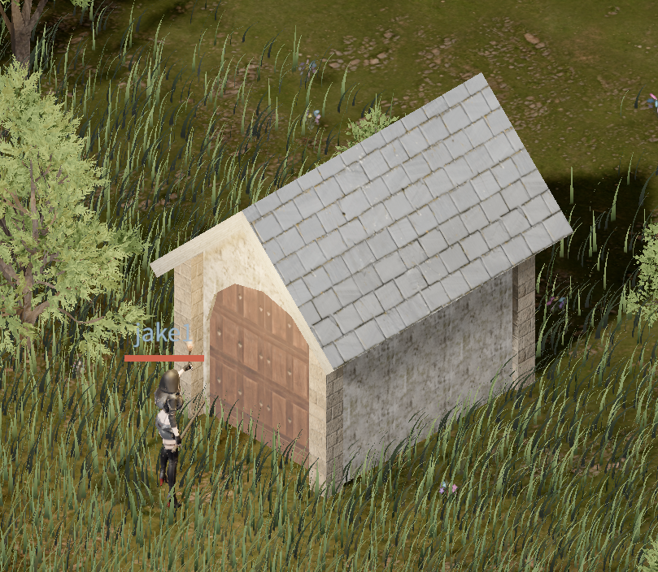
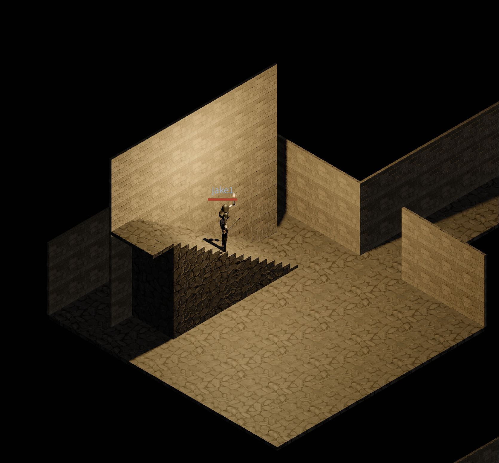

# Devlog - 2026-06-14

## Procedural Dungeon Generation

Added a dungeon system: entering one of the entrances scattered across the surface drops you into a seed-deterministic, NetHack-style maze. Each entrance has a fixed seed, so the same dungeon generates identically whether built on the client or the server, and it descends up to 20 floors (negative `floor_level` is the depth).

Rather than authoring a dedicated model, the surface entrance reuses the housing system's procedural geometry: a small stone building with a gabled roof, an arched doorway, and wooden pillars, dressed in dungeon-specific textures. The terrain and grass are holed out to expose the staircase below, and the entrance's double-door has collision and pathfinding wired up.

Floor geometry uses a grey stone path texture and links levels with walkable stairs. The final floor holds a boss with dedicated loot. Entrance definitions live in `data-src/dungeons.csv`; currently a single `old_crypt` is registered.

Remaining detail work: torches and props, a dedicated boss model, a chest-opening animation, floor water puddles, and placing more entrances.
