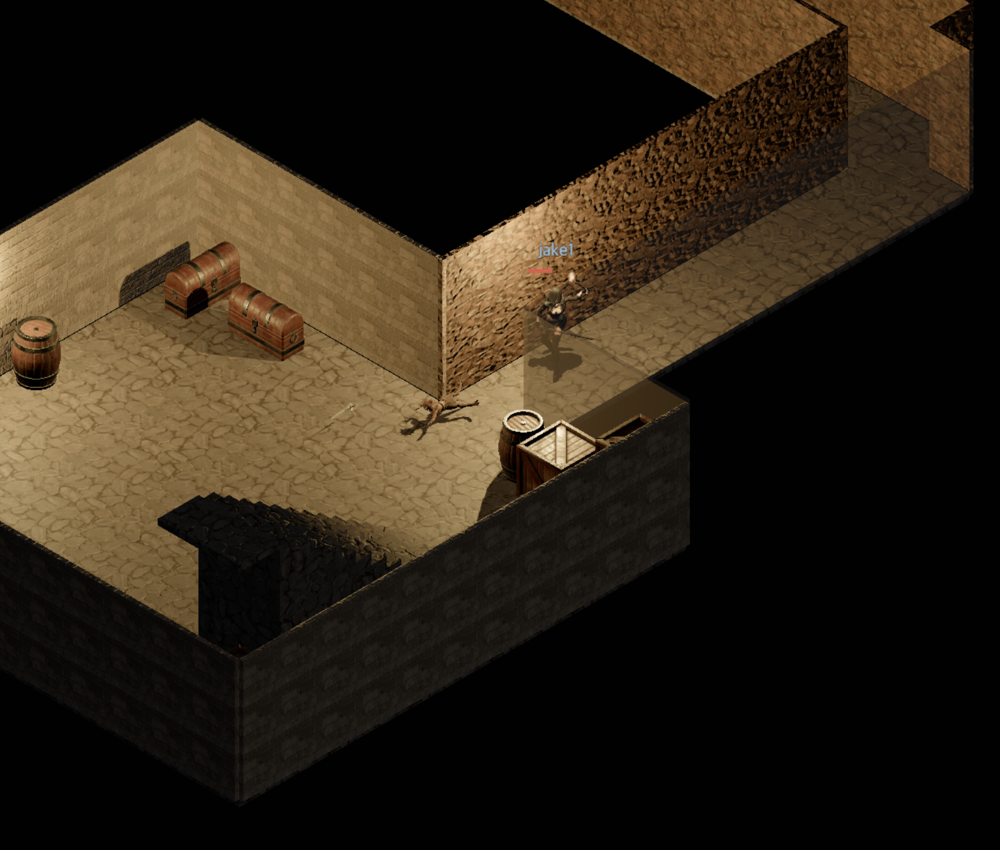

# Devlog - 2026-06-25

## Distinct Corridor Walls in the Dungeon

Dungeon rooms and corridors used to share one wall texture, so they looked
identical. Now the rooms keep the medieval stone blocks while the connecting
corridors get a rougher rock wall, making the passages read as tunnelled-out
rather than finished rooms.

A wall belongs to the cell it sits against, and a cell is a corridor when it is
carved floor in no room (and no shaft) — the same room test the Rust generator
uses. Wall runs already break at corners and doorways; I just added a break
wherever the room↔corridor texture flips.

The corridor texture is **Rock Wall 10** from Poly Haven
([polyhaven.com/a/rock_wall_10](https://polyhaven.com/a/rock_wall_10)), picked
after trialing a batch of stone/plaster walls in-engine (runner-ups kept under
`client/public/textures/dungeon/`), at UV scale `0.8` so the stones read larger.
It reuses the shared housing material pipeline and per-run ghost-fade, so no new
rendering machinery was needed.
