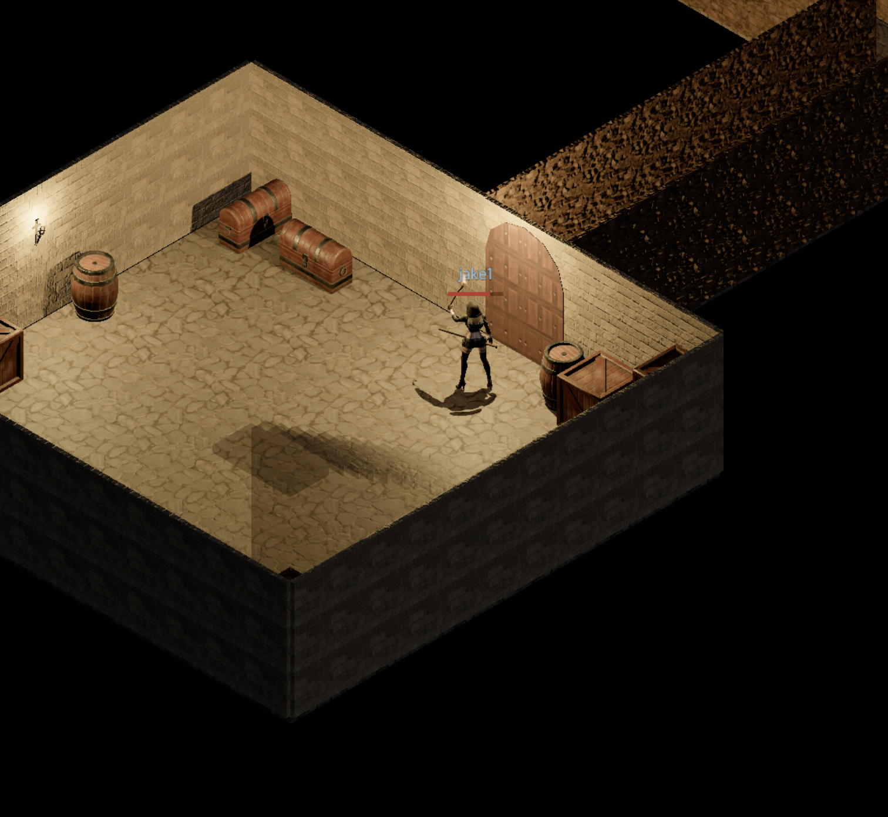

# Devlog - 2026-06-27

## Doors at Dungeon Corridor Mouths

Where a corridor opens into a room, the opening now gets a click-to-open wooden
double door (the same leaves and stone arch as the surface entrance) instead of
a bare gap, so a room can be sealed off from the passage.

The leaves and arch sit flush on the wall plane, and corridor wall runs are
trimmed where they meet a room wall so the corner stops z-fighting.
