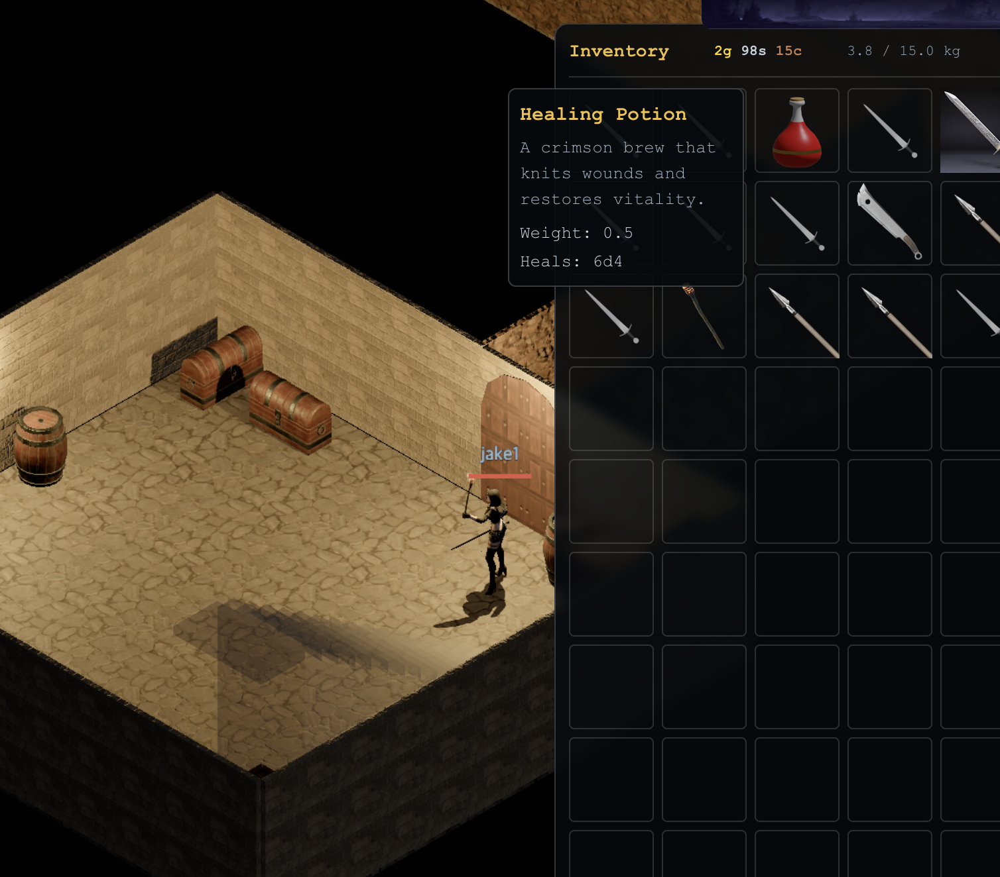

# Devlog - 2026-06-28

## Drinkable Healing Potion

Added the first consumable: double-click a Healing Potion in the bag to drink
it. The server rolls **6d4** HP (NetHack's healing-potion dice) up to your max,
removes one from the stack, and skips the drink if you're already full or downed.

Along the way I merged the `damageDice` and `healDice` item columns into one
`category` + `dice` pair, so `category` decides whether `dice` is damage or
healing.
