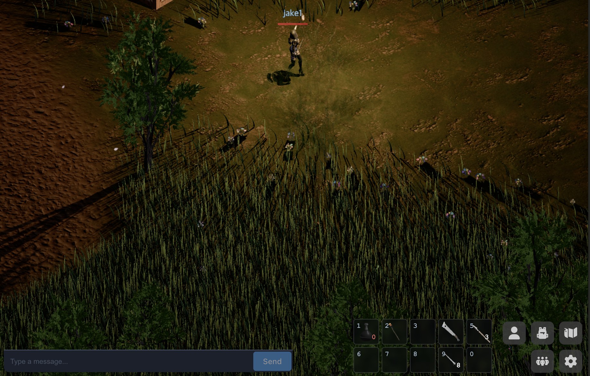

# Devlog - 2026-06-30

## Quickslot Bar

Added a 10-slot quickslot bar. Drag a bag item onto a slot to bind it, then
double-click or press its number key (**1–9**, **0**) to use it — equippables
equip, consumables drink. Bindings are keyed by item definition, so they survive
stacks being consumed and re-created, and persist per character.

I also folded chat, quickslots, and the menu buttons into a single flex row, so
they share the bottom of the screen cleanly instead of being positioned
independently.
